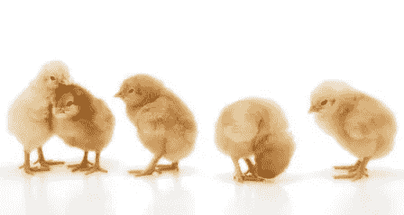

# 孵化器和加速器有什么区别？

> 原文：<https://medium.com/swlh/incubators-verse-accelerators-whats-the-difference-8af94bc2ea3d>

Startups are like newborn chicks— fragile little things

问任何人他们认为孵化器是什么，他们很可能会想象新孵化的，毛茸茸的黄色小鸡蜷缩在纸箱里温暖的聚光灯下。问他们什么是加速器，他们可能会想到一个踏板，当踩到底时，汽车会快速加速。