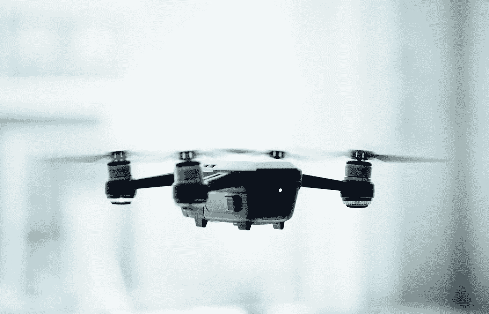
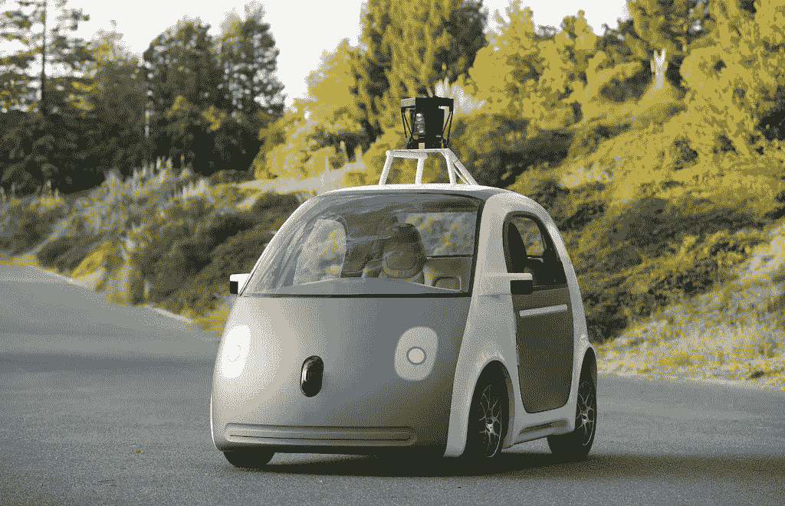

# 颠覆性产业的时机已经成熟

> 原文：<https://medium.com/swlh/industries-ripe-for-disruption-3e299c568fa1>

谁来定义未来？这里有 5 个行业是开放的颠覆季节。

我最近写了一篇关于公司的文章，这些公司不是发明他们行业的人，而是重新发明并最终拥有这个行业的人。他们的成功在很大程度上可以归功于对一个停滞不前的行业的重新构想，以及在这个关键时刻率先行动。

现在，我想重点介绍一些关键的有希望的行业，它们尚未真正拥有自己的“优步”来重新定义未来。

# **1。加密货币**

加密货币以其整体迅速崛起和短期过山车般的波动性而闻名，但它们不仅仅是在加密交易所赚快钱的资产。真正革命性的想法在于分散数据库的潜力。人们首先围绕加密货币的原因是因为其全球分布式账本或底层区块链技术有望颠覆中央银行系统。

这种影响超出了财务范畴，因为分布式数据库不一定是分类账。它可能分发和验证任何种类的信息。一些已经在试验的东西包括域名注册、文件存储和音乐分发。那些真正超越金融科技并推广跨部门应用的公司，将是这项技术成熟过程中真正的市场领导者。以太坊建立了新的“智能合同”,可以自动验证、触发和记录访问。谁能开发出区块链，兑现有可能改变几乎所有行业的承诺，还有待观察。

# **2。无人机**

无人机行业发展迅速。它们变得更小、更强大、更稳定、更安全。随着国防和情报工业的巨大进步以及录像技术的日益民主化。但老实说，对大多数人来说，它们充其量也只是昂贵的玩具。

总体而言，无人机受到价格、安全、应用和隐私问题的困扰。这些障碍是硬件、软件和合法性的问题，是让当前的行业领导者保持警觉的原因。亚马逊正在测试无人机送货服务，英特尔显然正在开发飞行协调算法(去年的超级碗和今年的 ces)，DJI 已经设法在紧凑性和稳定性方面几乎完全击败了竞争对手。

但是没有一个是绝对主导的。

在救援、安全、娱乐、物流、农业、气象以及无数其他激发我们想象力的领域，潜力是巨大的。无人机渴望有人加入进来，真正定义事情是如何完成的。

# **3。家用电器**

这些听起来都很酷，但当它发生在世俗中时，破坏往往是最普遍的。有什么比家更平凡？

冰箱、微波炉、吸尘器和空调永远改变了我们的日常生活。但是上一次有东西如此彻底地改变这个家是什么时候？当然，最大的趋势似乎是集成智能家电的网络。但是还没有一种电器像冰箱一样从根本上改变我们的日常生活。这些技术几十年来变化很小，但却在经济参与、健康、城市发展以及生活的无数其他方面带来了巨大变化。我们迫切需要新的东西，让我们获得大量的空间和时间。

# **4。能量**

能源是一个不性感的行业，有一段时间，没有什么值得兴奋的。毕竟，这个行业的大部分已经被几十年前的巨头所主导。但现在他们正在经历重大的人事变动，这可能会改变现状。当然，随着可再生能源变得越来越便宜，人们的注意力一直集中在可再生能源上。但是这个行业仍然缺乏一种可靠的能源来源，完全重新想象我们获取、运输和使用能源的方式。说到底，它们都只是推动电子通过一根电线。

管理系统、数据分析和自动化方法的改进已经开始让化石燃料变得更便宜，让能源网变得越来越高效。

可再生能源和重新设想的能源电网系统的交叉点上等待着颠覆。能源电网的发展正朝着越来越小的系统发展，如独立为军事基地供电的微电网，或为沃尔玛供电的纳米电网。随着更好的电池、燃料电池或太阳能电池板的出现，我们可能会看到企业和家庭使用更小的微微网。

# **5。运输**

交通领域已经出现了许多颠覆性创新，最显著的是来自共享经济。但仍有无数问题等待解决，技术和设计解决方案唾手可得。污染、安全、交通和停车的时间和空间，以及更快捷、更实惠的交通选择多年来都没有改变。

最新的舞台是自动驾驶汽车。没有明确的领导者，汽车制造和网络软件开发行业的公司都在拼命竞争，希望成为定义未来的人。在大约五年的时间里，世界已经接受了拥有汽车的时代正在接近尾声，未来的事情是成为一个“移动提供商”。开放一个由传感器和芯片制造商、数据压缩、系统跟踪服务、服务中心和无数外围业务组成的生态系统，直到它们出现，我们才知道它们会存在。

感谢阅读！:)如果你喜欢，请点击下面的心形按钮。对我来说意义重大，也有助于其他人了解这个故事。

**在**上打招呼

[**Quora**](https://www.quora.com/profile/Ron-Gibori-1)**|**[**insta gram**](https://www.instagram.com/rgibori/)**|**[**LinkedIn**](https://www.linkedin.com/in/rongibori/)**|**[**Twitter**](https://twitter.com/rongibori)**|**[**Inc 杂志**](https://www.inc.com/author/ron-gibori) **|** [**网站**](http://www.idea-booth.com)

如果你喜欢这个故事，请点击👏按钮并分享，帮助其他人找到它！欢迎在下方留言评论。

## 这篇文章发表在 [The Startup](https://medium.com/swlh) 上，这是 Medium 最大的创业刊物，拥有 303，461+人关注。

## 在这里订阅接收[我们的头条新闻](http://growthsupply.com/the-startup-newsletter/)。

