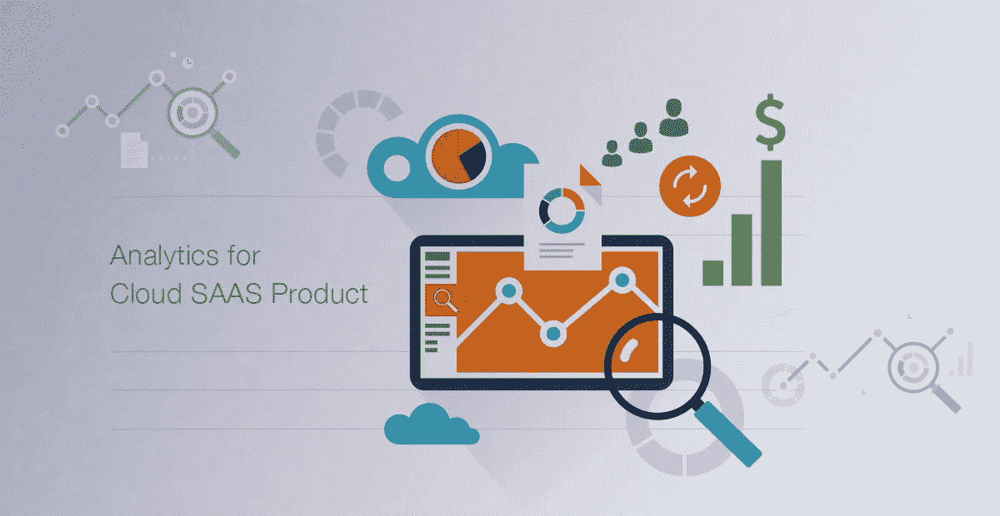

# 云 SaaS 产品的廉价分析

> 原文：<https://medium.com/swlh/inexpensive-analytics-for-cloud-saas-product-44172eb1a432>

Inexpensive Analytics for Cloud SaaS Product

所以你关心你的产品的成长和度量？本指南将引导您建立端到端的数据管道。它是为 AWS 服务的，但是，如果你用它们的等价物替换 AWS 服务，它应该在谷歌云平台(GCP)或 Azure 上工作。

# 数据收集

确保从所有用户和系统交互点收集数据非常重要。创建一个电子表格，记录所有互动、事件及其目的地。通常，它会分为以下三类

*   **监控数据进入日志文件** 这些是系统事件、警报、警告、执行时间日志。
*   **用户事件转到 Google Analytics (GA)** 所有用户交互的数据，来自 UI、电子邮件、服务、聊天机器人和其他集成。
*   **应用数据** **数据库**
    中的实际用户域数据，由应用使用。

# 收集日志文件

写入日志文件的数据被推送到 [LogStash](https://www.elastic.co/products/logstash) ，然后被推送到 [AWS ElasticSearch](https://aws.amazon.com/elasticsearch-service/) 服务。写日志时，确保我们使用一致的格式并有足够的细节。

*   **日志上下文**
    写日志时正在进行的活动用户、团队、请求和活动。使得追溯问题的根源变得容易。并且跟踪应用程序的某些部分会导致最多的问题。
*   **一致的格式**便于以后提取信息。虽然有些人使用 JSON，但我们发现使用键值对更容易。不理想，但书写速度快，体积小，易于阅读

userId = xxxxx team = xxxxx event = XXXXXX error = xxxxxxx 一些纯文本描述

*   **日志大小** 如果你在循环做某件事，也许你只需要记录摘要。对日志进行总结并保持在适当的水平将使以后的分析更容易，并记录数据收集成本。大多数情况下，如果您没有在一个循环中记录每个请求 100Kb，这并不是什么大问题。我们有！

# 用户事件

所有的用户互动都会被跟踪并发送到谷歌分析(Google Analytics)。这包括来自 UI 的用户事件，这很简单。但是，它也包括非 UI 事件，例如

*   **电子邮件打开
    你可以使用单个像素图像来跟踪电子邮件的打开。此图像 URL 有一个跟踪器密钥。获取图像后，向 GA 后端发送一个自定义事件。**
*   聊天机器人交互
    这是另一种用户交互。所采取的消息发送操作通常调用 webhook URL。处理 web-hook 的应用程序代码向 GA 后端发送一个自定义事件。
*   **集成** 你的 SAAS 产品会与其他产品集成。每当调用后端服务时，向 GA 后端发送一个定制事件来跟踪该活动。

使用 GA，您应该打开[自定义用户 ID 标记](https://developers.google.com/analytics/devguides/collection/analyticsjs/cookies-user-id)。这将是为您的应用程序中的每个用户生成的 uuid，并发送给 GA。这有多种好处[并且允许将来自多个会话的用户活动关联到单个注册用户。确保您为从后端跟踪的所有自定义事件发送了正确的用户 ID。](https://support.google.com/analytics/answer/3123663)

# 应用数据

这很简单。无论如何，你都在存储用户数据。只需为每个(几乎)表和数据实体存储这些额外的字段。这将有助于以后的分析。

*   实体是什么时候创建的
*   **由**谁创建的实体
*   **上次修改日期**实体上次修改是什么时候
*   **最后修改者**最后修改实体的人

这有助于出错时的分析和审计。对于关键实体，您可以添加更多字段，例如修改时间。另一个选择是跟踪每一次修改。在这种情况下， [CQRS 式的基于命令的修改](https://martinfowler.com/bliki/CQRS.html)将确保你在实体上有完整的变更历史。

# ETL 管道

您的所有数据现已收集完毕。然而，它是在多个地方。对于分析，我们希望在一个地方获得所有信息，以运行查询并从中获得洞察力。这是你能做的。

# 使用 Kibana & Elastalert 搜索弹性数据

您不应该在日志中记录用户事件。他们去 GA。如果您确保了这一点，就少了一项 ETL 活动。因此，使用 ElasticSearch 日志可以解决两类问题。

*   **监控仪表板** AWS 提供 [Kibana](https://aws.amazon.com/elasticsearch-service/kibana/) 开箱即用的弹性搜索服务。设置并创建仪表板，用于监控应用程序运行状况和指标，例如已处理的作业、响应时间等。
*   **涂改** 仅仅监控是不够的。你需要知道什么时候会出错或者将要出错。Yelp 有一个优秀的实用工具叫做 [Elastalert](https://github.com/Yelp/elastalert) 。您可以使用它来编写要监控的搜索查询，如果结果超过某个阈值，它可以向您的团队 slack 通道发送一条消息。只需在 t2.micro 机器上将其设置为守护进程即可。

# 用于导入应用程序数据的 DMS 管道

报告查询不能在生产数据库上。AWS 提供[数据库迁移服务(DMS)](https://aws.amazon.com/dms/) ，可以保持两个数据库同步。您可以使用 DMS 来设置复制任务和数据仓库，即 AWS RDS 实例。如果您选择 AWS Aurora 作为数据库，DMS 实例的前 6 个月是免费的。DMS 使用日志复制进行同步。由此给生产数据库带来的负载将是最小的。

在这一步，您应该[排除某些表和字段](https://docs.aws.amazon.com/dms/latest/userguide/CHAP_Tasks.CustomizingTasks.TableMapping.html)。

*   分析不需要的表，例如审计表、临时数据
*   分析不需要大型文本和二进制字段
*   个人身份信息，如姓名、电子邮件、地址

# 用于导入用户事件数据的 GA API

[谷歌分析 API](https://developers.google.com/analytics/devguides/reporting/core/v4/) 可以直接用来导入数据。然而，不同的方法也可以工作。 [Metabase](https://metabase.com/) 是一个创建漂亮仪表板的开源项目。它整合了 MySQL、Postgres、AWS Redshift 和 Google Analytics 等数据源。稍后您将使用 Metabase 来创建 dashboard，因此也可以将其用于 GA 集成。下面是你如何设置它

*   [设置元数据库](https://metabase.com/docs/latest/operations-guide/running-the-metabase-jar-file.html)和[将 GA 帐户](https://www.metabase.com/blog/Metabase-0.21/)集成到其中
*   在元数据库中为我们要导入的事件和数据创建报告
*   元数据库公开了一个 API，用于在以下 URL 下载 CSV
*   https://data.meetnotes.co/api/card/&lt；问题编号&gt；/query/csv
*   设置每小时一次的 python 脚本来下载 CSV 并上传到 Aurora DB
*   您将需要一个 API 键，它可以使用元数据库用户生成
*   curl-X POST-H " Content-Type:application/JSON " \-d ' { " username ":"<用户>、"密码":"<密码>" } ' \[https://data.meetnotes.co/api/session](https://data.meetnotes.co/api/session)
*   curl -X POST -H "内容类型:应用程序/json" \
*   -d '{ "用户名":"<用户>，"密码":"<密码> "}' \
*   [https://data.meetnotes.co/api/session](https://data.meetnotes.co/api/session)

您可能希望上传是重叠的和增量的。最简单的方法是每 6 小时运行一次脚本，让元数据库报告返回过去 24 小时的数据。Python 脚本随后会删除日期范围内的现有数据，并重新上传响应中的所有内容。这做了比必要的更多的工作，但是实现起来足够简单。

# 数据仓库

现在您已经在 Aurora 数据库中拥有了所有有用的数据。我们需要创建一个既简单又快速的报告模式。ETL 管道获取规范化的数据。接下来，我们将为报告创建一个星型模式。这是如何做到的。

# 创建模式

*   **确定尺寸**并为其创建表格。例如，如果“用户”、“日期”和“国家”是维度，那么您将拥有 dim_users、dim_dates 和 dim_country 作为维度表。考虑维度的方式是它们出现在 SQL 查询 where 子句中。
*   **确定维度的维度属性**，例如，是否为付费用户，他们的注册日期等。
*   **识别尺寸的生成属性**。有时，我们希望在查询中使用一个计算出来的属性，例如自注册以来的用户年龄。
*   **为维度组合创建事实表**，例如，用户在某一天登录多少次将成为 dim_user 和 dim_date 的事实。有许多可能的组合，正确的组合取决于您想要生成的域和报告。

# 数据总体

创建模式后，编写查询来填充数据。这很简单，只是查询会定期运行，所以您必须考虑增量更新。

# 增量更新

根据数据量的不同，有多种方法。最简单的方法是清除完整的数据集并重新填充它。这是最简单的方法，但是做了多余的工作，对于较大的数据来说是不可行的。这里有一个让事情递增的快速方法。

*   **尺寸表行**很容易增加。只根据主键插入不存在的行。
*   **维度表列**会分为两种情况。那些从不改变的，例如注册日期，可以是插入查询的一部分。以及那些变化的，例如总花费时间。你只需要更新那些改变的。
*   **事实数据表行**需要基于新插入维度的额外行。它是一个交叉连接，然后排除已经存在的行。
*   **事实表的列**将再次分为两种情况。那些具有时间质量的，即它们一旦被计算就不需要被更新。一个例子是 logins_per_day，它在过去的某个日期计算一次，不会改变。另一个是每次都必须计算的属性，例如 invitations_sent。

模式创建脚本只运行一次。然后使用每小时一次的 cron 作业运行增量更新。

# 持续维护

一旦设置好了，就不需要任何持续的维护来保持正常运行。但是，随着情况的变化，需要新的报告，您需要执行以下操作。

*   **性能&查询优化
    创建索引，遵循标准的查询优化技术来改进它们的运行时间。**
*   **报告模式变化** 简单的模式变化可以是附加的。但是有时，你需要一个更具破坏性的改变。如果是这样，只需进行更改，清除模式，用更改重新创建它，然后重新运行数据填充脚本。
*   **生产数据库模式更改** 修复查询并再次运行它们。如果变化很大，按照上一步重新创建仓库。
*   **AWS DMS 管理** DMS 任务不时失败。然而，这种情况很少见，一个月不到一次。如果发生这种情况，只需重新启动任务。

作为最佳实践，创建一个仪表板来监控管道。它会跟踪每个源的最新更新，如果更新太旧，就意味着有东西坏了。

这将为你提供一个简单且相对便宜的分析渠道。但这只是开始。现在，继续构建报告和仪表板，以了解用户行为并发展您的产品。

以上每个部分都需要一些配置和魔法才能工作。如果你正计划这样做，并面临设置问题，留下评论或信息。会很乐意帮忙。

*原载于 2018 年 7 月 17 日*[*hashedin.com*](https://hashedin.com/blog/inexpensive-analytics-for-cloud-saas-product/)*。\*

## 这个故事发表在 [The Startup](https://medium.com/swlh) 上，这是 Medium 最大的企业家出版物，拥有 351，974+人。

## 在这里订阅接收[我们的头条新闻](http://growthsupply.com/the-startup-newsletter/)。

