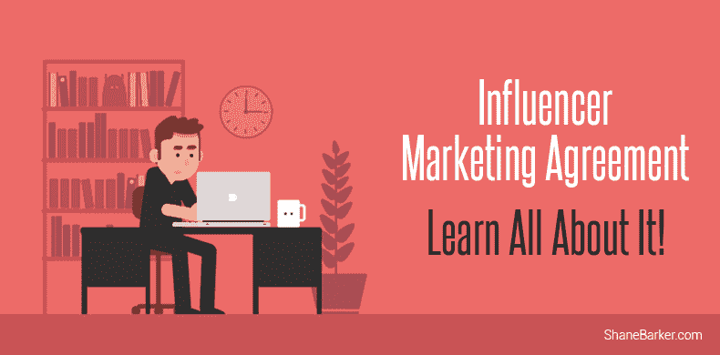
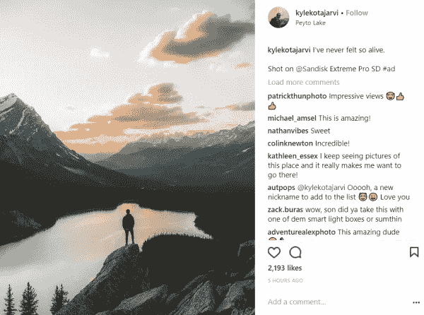
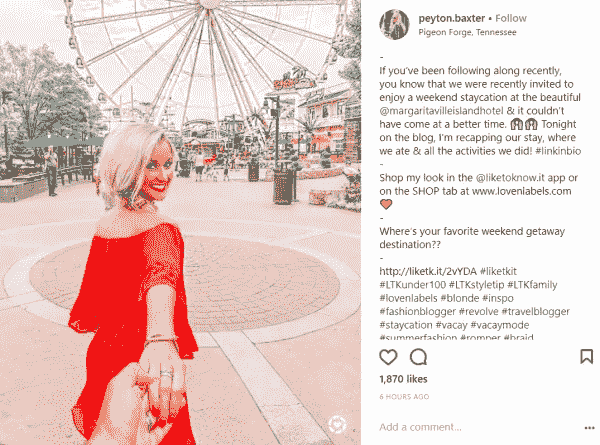
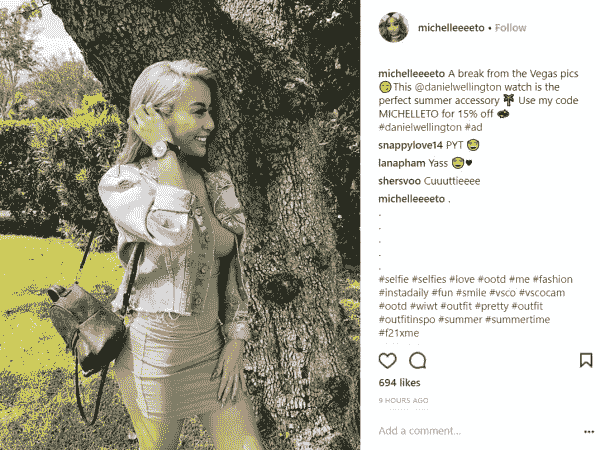
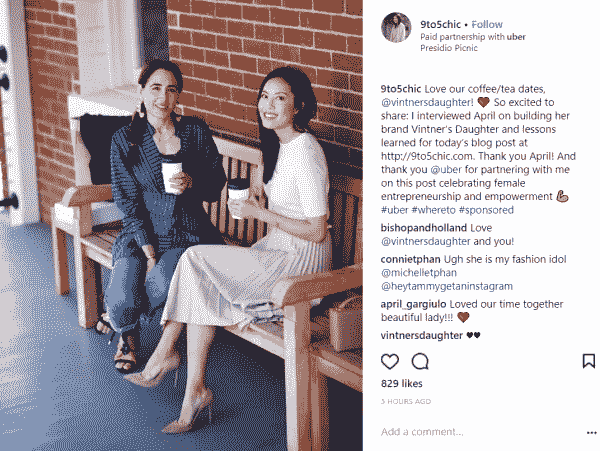

# 影响者营销协议—了解详情

> 原文：<https://medium.com/swlh/influencer-marketing-agreement-learn-all-about-it-d07d5100a974>

你和有影响力的人一起工作过吗？或者也许你计划很快与他们合作？不管怎样，你意识到与影响者合作时，影响者营销协议或合同的重要性了吗？

如果你的答案是否定的，这本小指南会告诉你你需要知道的一切。[如今，86%的营销人员](http://www.linqia.com/wp-content/uploads/2016/11/The-State-of-Influencer-Marketing-2017_Final-Report.pdf)将影响者营销作为一项重要的营销策略。和影响者营销协议可以决定你的活动的成功(或失败)。

此类协议有助于保护公司的利益以及影响者的权利。

精选的相关内容:

*   [你如何扩大影响者的内容？](https://shanebarker.com/blog/how-do-you-amplify-influencer-content/)
*   [你应该知道的影响者营销的 6 个重要 KPIs】](https://shanebarker.com/blog/important-kpis-of-influencer-marketing/)

白纸黑字的协议确保了合作的有效实施。它几乎没有留下任何机会，并确保期望和交付物被清楚地概述。

让我们仔细看看它必须包括什么，以及您应该如何着手创建一个。

# 什么是影响者营销协议？

这是一份标准协议，概述了您与影响者的合作关系细节。它包括基本信息，如所有相关方的名称、可交付成果、成本和截止日期。确保它既全面又易于理解。

# 为什么影响者营销协议至关重要？

两个原因。如果没有书面协议，你的影响者提供的内容可能会与你的想法大相径庭。这对你和你的影响者来说都是一种资源浪费和糟糕体验。此外，当双方都同意条款并签署合同时，双方都有法律义务履行自己的承诺。

迷茫？

考虑以下情况。

比方说，作为一个企业主，你希望向更多的人推广你的产品。您的营销团队为您的营销活动确定相关的影响因素。每个人都有一个令人印象深刻的投资组合，一个体面的追随者计数，足够的参与度，似乎理解你的运动目标。

在你与他们初步讨论之后，一切似乎都很完美。因此，您指示影响者继续创建内容。你也已经同意了付款条件。

但是，一旦内容发布了，你发现它并不符合你的要求。事实上，这与你的要求大相径庭，对你的竞选结果产生了负面影响。或者可能影响者未能按时交付，或者没有在预期的时间内展示内容。

这就导致了不满。即使内容不符合你的期望，你仍然有义务向影响者付费。如果你拒绝这样做，就会在你和影响者之间产生严重的冲突。

你与影响者的关系以及整体体验都会受到负面影响。你甚至可能会避免[在未来开展影响者营销活动](https://shanebarker.com/blog/influencer-marketing-strategy/)，并错过他们必须提供的好处。

精选的相关内容:

*   [2018 年让你惊喜的 75 个影响者营销统计](https://shanebarker.com/blog/influencer-marketing-stats/)

那么，你认为在这种情况下哪里出了问题？

期望和可交付成果没有写在纸上。许多开放式的主题没有被讨论或触及。这对双方都造成了巨大的混乱。

这就是为什么你需要一份书面合同——以避免在这种情况下着陆，并确保一切都在你的控制之下。

以下是你需要纳入影响者营销协议的 12 个要点。

# 1.基本要素

首先，把你的协议的基本要素搞清楚。提及您在活动中合作过的影响者的姓名。该协议还应提到您作为客户的品牌名称。它应该提到协议的生效日期和活动的简短描述。

# 2.协议的期限

影响力营销被证明是真正有效的，当它实施的时间更长。因此，提及你计划与影响者交往多长时间。是针对单个活动还是一定数量的活动？确保你的协议提到了这个期限。

精选的相关内容:

*   [如何利用有影响力的人产生大规模的 UGC](https://shanebarker.com/blog/leveraging-influencers-user-generated-content-scale/)

# 3.关于你期望的内容的细节

当然，你需要[为你的影响者提供创作自由](https://shanebarker.com/blog/influencer-relationship-management-brands-can-establish-real-connections-influencers/),以便他们可以交付最好的作品。

但是，您需要在合同中包含一些指导原则:

*   你希望他们创建什么类型的内容？视频，Instagram 帖子，还是博客帖子？
*   他们的博文或视频应该有多长？
*   他们的内容中应该提到哪些重要的点？
*   他们应该在何时(日期和时间)发布内容？
*   内容应该在他们的社交账户/博客上显示多长时间？
*   你需要你的影响者发多少这样的帖子？

*图片 via*[*insta gram*](https://www.instagram.com/p/BjdxIfUnIEa/)

# 4.发布内容的渠道

您对平台的选择将取决于您的目标受众以及您提供的产品或服务的类型。当然，无论你选择哪个平台，你都需要确保你的影响者在那里有一个体面的存在。

*图片 via*[*insta gram*](https://www.instagram.com/p/BjdtOzmlrpQ/)

您的影响者营销协议需要说明您希望在哪里发布内容。它还应提到:

*   同样的帖子是否会在其他平台上分享。
*   是否会为每个社交渠道创建单独的帖子。

精选的相关内容:

*   [脸书直播和 Instagram 故事的真正价值？您可以通过影响者营销解锁的数据！](https://shanebarker.com/blog/facebook-live-and-instagram-stories-unlock-influencer-marketing/)

# 5.内容使用权

您需要清楚地说明谁拥有作为活动一部分创建的任何内容。内容使用权必须在您和您的影响者之间保持透明。

如果您有任何重用创建内容的计划，请明确提出。此外，您将使用它的持续时间。

您的[影响者营销](https://shanebarker.com/blog/important-kpis-of-influencer-marketing/)协议的内容使用权条款还应强调:

*   任何许可的细节
*   版权
*   第三方用户的许可

# 6.联邦贸易委员会准则和披露

您可能知道，遵守 [FTC 关于影响者营销的指导方针](https://www.ftc.gov/news-events/press-releases/2017/04/ftc-staff-reminds-influencers-brands-clearly-disclose)不可掉以轻心，不遵守这些指导方针可能会使您和您的影响者面临法律诉讼。

根据这些准则，影响者需要在所有赞助内容上明确披露他们与品牌的合作关系。即使你用免费的产品或服务而不是金钱来补偿影响者，这些规则仍然适用。

因此，你必须在协议中明确提及影响者需要如何披露他们与你的合作关系。你甚至可以提到确切的措辞，比如使用#ad 或#sponsored 这样的标签。

*图片 via*[*insta gram*](https://www.instagram.com/p/Bjd8K-klTcy/)

精选的相关内容:

*   [82 位专家分享他们最喜欢的影响者营销技巧，以增加曝光率](https://shanebarker.com/blog/influencer-marketing-tips-expert-roundup/)

# 7.附属链接或代码

如果你打算与你的影响者分享任何独特的折扣代码或附属链接，你的协议必须提到它们。它还应该提到影响者可以获得的佣金占销售额的百分比(如果有)。

*图片经由*[*insta gram*](https://www.instagram.com/p/BjdZwUkAnaO/)

# 8.专用或非专用活动

专门赞助指的是在一篇赞助文章中只提到你的品牌。非专用赞助允许其他品牌出现在帖子中。

赞助的类型主要取决于你同意支付给影响者的报酬。很明显，专门的活动会让你花费更多。

*图片经由*[*insta gram*](https://www.instagram.com/p/Bjd4bUZhkmc/)

要清楚你报名参加的赞助类型。如果你选择专门的活动，你的协议必须声明内容不得提及任何其他品牌。

精选的相关内容:

*   [你现在需要知道的 21 个节省时间的影响者拓展工具](https://shanebarker.com/blog/influencer-outreach-tools/)

# 9.预览的截止日期

你应该在发布影响者的内容之前预览它。确保内容是按照你想要的语气和风格写的。

你需要清楚地提到每个帖子提交预览的截止日期。确保你的协议中提到了预览条款。

当你概述你的预览条款时，确保它突出了:

*   你为每项内容设定的截止日期。
*   您对每个帖子的审核和批准时间表。
*   两次连续发布帖子之间的时间间隔。
*   提到双方当地时间的截止日期。

在时间表和时间表方面，你的营销团队和你的影响者需要保持一致。与你的影响者清楚地讨论你的活动截止日期。

你必须记住，你的影响者也可能参与其他活动。所以，尊重他们的时间，尽量灵活一点，这样你就可以适应他们的时间表。

确保以书面形式提及所有这些内容。这将帮助您更好地控制您的活动时间表。

# 10.付款条件

你需要清楚地提到你提供给影响者的报酬形式。

*   你会用免费的产品样品或使用你的服务来补偿他们吗？
*   你会仅仅用附属合作关系来补偿他们吗？
*   你是要支付固定费用还是为每一个创建的内容付费？
*   你提供任何绩效奖励吗？

无论您选择哪种方式，请确保您在影响者营销协议中包含了详细信息。

精选的相关内容:

*   [影响者营销和千禧一代:如何让他们合作](https://shanebarker.com/blog/influencer-marketing-and-millennials/)

如果你计划分期付款，你也必须在协议中明确提及付款结构。例如，您可以选择在签署协议时支付总额的 50%。另外 25%一旦商定的内容被创造和出版。你可以在活动结束后支付剩余的金额。

您的协议应确保您同意的金额包括:

*   创作内容的创作
*   创作者的策略费
*   内容的使用或许可权

# 11.排他性或非竞争性

有影响力的人因其真实性和创造性而受到喜爱和尊重。他们的追随者真正重视他们的意见，甚至基于这些意见采取行动。当结合品牌的推文时，[知道影响者的推荐使购买意愿增加了一倍多](https://blog.twitter.com/marketing/en_us/topics/research.html)。

因此，当一个有影响力的人宣传两个来自同一个行业的竞争品牌时，他们的真实性就成问题了。这不仅会损害他们的声誉，还会损害你竞选的结果。

因此，你必须确保你的协议中提到影响者在一定时间内不应支持的竞争对手的名字。

# 12.其他标准条款

与任何其他协议一样，影响者营销协议中也需要包含一些标准条款。这些可能包括:

*   赔偿条款
*   非贬低条款
*   终止条款

精选的相关内容:

*   [如何接触影响者的终极指南](https://shanebarker.com/blog/ultimate-guide-reach-influencers/)
*   [如何成为 Instagram 的影响者并开始赚钱](https://shanebarker.com/blog/how-to-become-an-instagram-influencer-and-earn/)

# 最后的想法

影响者营销协议可作为安全标准，提供清晰性，并帮助您实现预期目标。它有助于防止不愉快的意外。因此，请务必遵循上述建议，并达成协议，以充分利用您的影响者营销。

您能想到影响者营销协议中应包含的任何其他要素吗？请在下面的评论中告诉我。

***最初发表于*******。****

***关于作者***

*[谢恩·巴克](https://shanebarker.com)是[内容解决方案](https://contentsolutions.io/)和 [Gifographics](http://gifographics.co/) 的创始人兼首席执行官。你可以在[推特](https://twitter.com/shane_barker)、[脸书](https://www.facebook.com/ShaneBarkerConsultant/)、 [LinkedIn](https://www.linkedin.com/in/shanebarker/) 、 [Instagram](https://www.instagram.com/shanebarker/) 上和他联系。*

**

## *这篇文章发表在 [The Startup](https://medium.com/swlh) 上，这是 Medium 最大的创业刊物，有 332，253+人关注。*

## *在这里订阅接收[我们的头条新闻](http://growthsupply.com/the-startup-newsletter/)。*

**