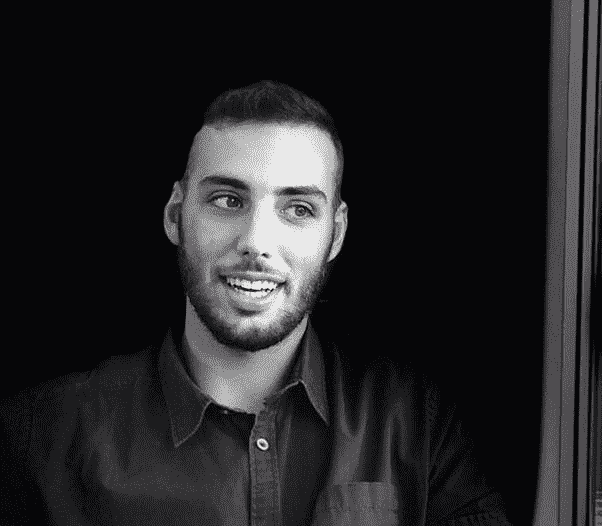

# 影响者营销正在消亡，而你杀死了它

> 原文：<https://medium.com/swlh/influencer-marketing-is-dying-and-you-killed-it-cda180832bc8>

“wake me up when i'm famous signage” by [Alice Donovan Rouse](https://unsplash.com/@alicekat?utm_source=medium&utm_medium=referral) on [Unsplash](https://unsplash.com?utm_source=medium&utm_medium=referral)

## 这就是为什么我们不能拥有美好的事物。

多年来，企业一直面临一个大问题:

## 人们不信任他们。

他们不应该。大多数营销人员在不了解消费者心理的情况下接近他们的受众。他们是推销员，爱出风头，他们一直试图把他们卖的东西硬塞给我们。

**进入影响者营销**——对客户怀疑和警惕的完美回应。

这听起来好得令人难以置信:有影响力的人有一群已经相信他们的固定观众。如果追随者信任他们的网络名人，他们会非常乐意购买他们推荐的任何东西。

对吗？

> 如果你遇到某人，他们说的第一句话是他们有多酷——你已经知道他们一点也不酷。但是如果你的朋友把你介绍给一个他们认为很酷的人，你会注意的。

**但如果商业世界有一个真理，那就是这个:**

> 营销人员毁了一切。

他们扼杀了影响者营销。它变成了一个正在爆炸的广告泡沫——它很快就会沉入 6 英尺深。

## 好吧，我在撒谎。

> 影响者营销没有死。**但坏影响者营销是。**

但是为了找出原因，我们首先需要问自己:

# 影响者从哪里获得力量？

影响者的关键区别和优势来自他们的纯粹真实性。他们被期望是值得信赖的，并且总是把观众的最大利益放在心上。

> 有影响力的人之所以被信任，是因为他们被视为真正的批评者。

他们是一种友好的声音——一种(据称)不受任何商业和广告压力的声音。它通过围绕特定专业领域提供原始的、未经过滤的价值来建立受众。

# 但是，营销人员是如何杀死影响者的呢？

> 营销人员就像哈利波特里的摄魂怪。他们穿着黑色的连帽斗篷在空中漂浮。他们能够感受到真实性，并以此为食，耗尽影响者的权力和相关性。

A Marketer, left, sucking the authenticity off lifestyle blogger Harry, right.

每个影响者活动都要求三个要素完美结合。让我用图表展示给你看:

From my Twitter @itsmartisanchez

理想情况下，品牌应该有足够的能力找到拥有正确受众的正确影响者。但是，大多数品牌的问题出在实际传达的信息上:

> 公司对他们的交流有占有欲。他们希望它遵循他们的实践，他们的标准，他们的市场研究…

> 但他们忘了这不是他们的事。

有了影响者营销，品牌需要足够谦虚，第一次认识到并接受…

## **…他们不是专家，影响者才是。**

他们没有建立相关的受众。影响者做到了。

他们没有获得他们的信任和关注。*影响者做到了。*

他们不知道他们的追随者喜欢什么和讨厌什么，也不知道哪些内容最有可能传播开来。你猜对了，有影响力的人会。

> **所以，品牌和营销人员:**如果你不想把辛苦赚来的钱浪费在影响者营销上，那么就把你的活动交给你的合作影响者，放开所有的创意控制。

“man sitting on concrete roadway” by [John Fornander](https://unsplash.com/@johnfo?utm_source=medium&utm_medium=referral) on [Unsplash](https://unsplash.com?utm_source=medium&utm_medium=referral)

# "但是，影响者应该对此负责吗？"

*是也不是*原因如下:

[61%的客户](http://www.splendidcomms.com/download-report/)没有关注某个影响者，因为他们“*与不合适的品牌*合作”或“*代言了太多产品*”[和 43%](http://www.splendidcomms.com/download-report/) 感觉有影响力的人"*通常是不真实的*"和他们实际上不相信的品牌一起工作"*。*

…这违背了影响者营销相对于其他广告方式的竞争优势，即品牌和消费者之间已有的信任。它只是破坏了影响者营销的整个目的。

## 有影响力的人永远不应该与不符合他们个人品牌的公司合作。但是他们为什么要这么做呢？

*以下是大多数人如何成为有影响力的人:*

他们对某个主题(小众)充满热情，他们决定围绕这个主题创作内容。他们从不认为他们能从中获利——他们这样做只是为了好玩。随着时间的推移，他们建立了一个同样对同一件事充满热情并喜欢消费他们内容的观众群。

***直到有一天*** ，一个穿着非常昂贵的西装的家伙走近他们，提出给他们钱，只是为了把他们的产品加入到组合中。在花费了数千小时的工作后，这位现在有影响力的人同意了。

> 大多数有影响力的人不是营销专家。他们不知道品牌，不知道渠道，不知道广告策略，也不知道消费者心理。他们只是玩得开心。

因此，他们会接受任何为他们的工作获得报酬的提议。谁不想呢。

> 所以，是的，有影响力的人应该更加谨慎地对待他们的合作对象，这样真实性效果才不会白白丧失。但是他们也没有义务去了解这些。

## 穿西装拿 MBA 的家伙应该更清楚。

感谢阅读！你可以在 Medium 上关注我[或者在 Twitter](/@martisanchezwork) 上关注我[来获取更多类似的信息。](https://twitter.com/itsmartisanchez)

## 这篇文章发表在 [The Startup](https://medium.com/swlh) 上，这是 Medium 最大的创业刊物，有+ 381，862 人关注。

## 在这里订阅接收[我们的头条新闻](http://growthsupply.com/the-startup-newsletter/)。

