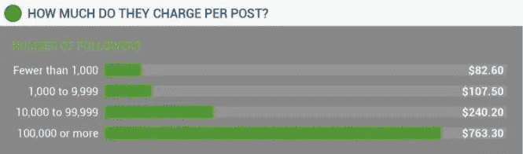

# 影响者关系管理——品牌如何与影响者建立真正的联系

> 原文：<https://medium.com/swlh/influencer-relationship-management-how-brands-can-establish-real-connections-with-influencers-4aeaf588485b>

# 这篇文章最初出现在谢恩·巴克的影响者营销博客上。

影响者关系管理或 IRM 指的是管理你与影响者的互动。该战略从客户关系管理(CRM)中汲取了大量灵感，CRM 是关于管理与客户的互动。

通过意识到影响者不是你的员工而是战略伙伴，品牌可以[有效地管理他们的影响者关系](https://shanebarker.com/blog/build-strong-influencer-relationships/)。事实上，你应该像关注你的客户一样关注管理这些关系。

影响者关系管理就是与影响者建立战略关系。这使你能够发展和保持对市场的控制地位。你可以通过与对你的目标受众有影响力的人合作来做到这一点。能够左右购买决策的影响力。

请记住，如果方法正确，有效的影响者关系管理可以建立客户信任。这将为你的品牌提供[的长期利益。然而，与影响者建立良好的关系可能是一项艰巨的任务。](https://shanebarker.com/blog/biggest-benefits-social-influencer-marketing/)

计划不周的 IRM 战略不仅会削弱与影响者的关系，还会导致无效的影响者活动。如果你的影响者没有在你的活动中投入足够的资金，他们在建立你的可信度方面会做得很差。

所以你需要加强你的影响者关系管理策略。一个强有力的 IRM 战略将帮助你利用影响者营销活动的真正潜力。这不仅会提高品牌知名度和客户信任度，还会增加你的投资回报(ROI)。

这里有 5 种方法可以让你的品牌与有影响力的人建立牢固的关系，帮助你获得客户信任和高投资回报率。

# 如何有效地进行影响者关系管理

# #1.仅接触相关的影响者

相关性是有效的影响者关系管理要考虑的关键因素之一。与拥有相关且顺从受众的有影响力的人合作，对你的品牌大有裨益。

一项研究分析了影响者与品牌合作的动机。研究发现，44%的影响者愿意与提供与其追随者相关的产品的品牌合作。事实上，相关性是影响者的头号动力。

*图片通过 Crowdtap*

该研究还发现，如果有相关机会，49%的影响者热衷于不止一次的合作。

因此，如果你对建立强大的影响者关系感兴趣，你肯定应该与相关的影响者合作。大多数有影响力的人从品牌那里获得了太多的推介。当他们回应这些问题时，相关性是他们考虑的关键因素之一。这就是为什么大多数美容和服装品牌与时尚和美容影响者联系在一起的确切原因。

## 例如:凯洛格公司

这里有一个例子。凯洛格的子品牌 Special K 发起了一场影响者营销活动，标签为#StrongFeedStrong，旨在提升女性的力量。

该活动的独特之处在于，凯洛格没有让任何食品或健康影响者参与品牌推广。相反，他们与有影响力的女性企业家、运动员和家庭主妇合作，以提高品牌知名度。该公司采用独特的讲故事风格，鼓励女性发挥最大潜力。

*图片 via*[*insta gram*](https://www.instagram.com/p/BRqkF1Nhc2S/)

优步和励志演说家莫莉·伯克也是凯洛格拉拢的有影响力的人之一。在这里，我们看到她用一个关于女性真正潜力的标题来宣传品牌。

这就是凯洛格如何与相关影响者合作，并使他们的活动取得成功。因为这样的影响者是相关的，这有助于品牌更有效地赢得顾客的信任。出于同样的原因，他们能够与这么多有影响力的人合作开展活动。

# #2.使用热情的推广策略

冷外联包括使用普通外联电子邮件联系影响者，要求他们与你合作。每个营销人员在接触影响者后都有一个共同的问题，那就是，“[他们会回应吗？](https://shanebarker.com/blog/conduct-influencer-outreach-stunning-results/)

嗯，答案是，没有办法确切知道。然而，你可以通过发送个性化信息来增加你得到回复的机会。如果你希望建立关系，你应该先作为一个人与他们互动，然后再作为一个品牌与他们互动。

你可以从关注他们以及他们在社交媒体和博客上的帖子开始。尽可能地参与到他们的岗位中。这意味着定期分享、喜欢和评论他们的帖子。一定要发表有见地的评论，让他们注意到你。这是为了确保你脱颖而出，让影响者记住你。

这将使你作为一个品牌更容易接近你的影响者。你的影响者会知道你是他们的粉丝。把你的影响者作为一个人而不是一个品牌来联系是最好的拓展策略。这是影响者关系管理的关键一步。

因此，你的影响者外联邮件需要是私人的，听起来真实。它应包括以下内容:

*   吸引人的主题
*   对他们工作的欣赏
*   你能为他们提供的价值
*   你以前合作的例子
*   明确的行动号召

## 影响者外联电子邮件示例

这是一封个性化影响者外联电子邮件的示例。

“尊敬的[影响者姓名]，

我是[您的名字]，[公司名称]的[职位]，也是您的超级粉丝。我是你博客的常客，我真的很喜欢你的内容。您最近在[主题]上的帖子信息量非常大，非常吸引人。

我们在之前的活动中与[其他影响者姓名]合作过[提及链接]，他们也很喜欢与我们合作。

我们目前正在完成我们的一个社交媒体活动，希望与您合作。如果你感兴趣，请回复，这样我们可以留出一些时间进行讨论。

期待收到你的来信。"

个性化的方法将帮助你赢得影响者的信任。如果他们感到被重视，那么他们会更加努力让你在他们的观众面前看起来更好。如果一个可信的影响者推荐你的品牌，你的目标受众会开始更加信任你。

# #3.提供合理的补偿

尊重和良好的待遇并不是帮助你建立强大的影响者关系的唯一因素。你的影响者也期望他们的工作有金钱回报。许多品牌没有理解这一点，只是用赠品来接近有影响力的人。

TapInfluence 和 Crowdtap 的研究都发现，品牌犯的主要错误是提供的补偿不够。

Crowdtap 的研究发现，68%的影响者愿意与提供有竞争力薪酬的品牌进行更多合作。TapInfluence 研究支持了这一观点，其中 72.2%的影响者报告说他们没有得到足够的补偿。

当你向影响者提供足够的报酬时，你向他们表明你重视并尊重他们的努力。这也表明你不期望他们免费推广你的品牌。

## 影响者营销的真实成本

influencers 进行了一项研究，以了解与有影响力的人合作的成本。研究发现，在建模领域有影响力的人收费最高，平均成本为 434 美元/岗位。紧随其后的是摄影影响者，价格为 385 英镑/帖，食品影响者排名第三，价格为 326 英镑/帖。

图片来自 Influencer.co

该研究还发现，合作成本的增加基于影响者的粉丝追随。例如，你可能会在拥有不到 1000 名追随者的影响者那里平均花费 86.20 美元。然而，拥有 100，000 多名关注者的影响者可能会花费你平均 763.30 美元/篇。

图片来自 Influencer.co

# #4.提供创作自由

创作自由对你和你的影响者都至关重要。想想看，谁更了解观众——你还是你的影响者？绝对是你的影响者。他们会更好地了解追随者的品味、偏好和观点。毕竟，你的目标是你的影响者的观众。

这意味着你的影响者知道什么样的内容会吸引他们的观众。他们的座右铭是发布不仅能吸引追随者，还能吸引他们的内容。

然而，一项关于影响力的研究发现，39.4%的有影响力的人没有获得必要的创作自由。他们被过于严格的内容指南所束缚，没有创造的空间。

图片通过 [TapInfluence](http://pages.tapinfluence.com/hubfs/Influencer_Marketing_Manifesto.pdf)

关于“影响者营销状态”的 Crowdtap 研究进一步支持了这一观点。该研究发现，77%的影响者可能会与一个品牌合作不止一次，如果他们提供创作自由的话。

通过 [Crowdtap](https://www.iab.com/wp-content/uploads/2015/12/Crowdtap_TheStateofInfluencerMarketing.pdf) 获取图像

TapInfluence 和 Crowdtap 研究都发现，当你为有影响力的人提供创作自由时，他们会建立更好的关系。当你为有影响力的人提供创作自由时，这表明你不仅尊重他们，也尊重他们的想法。

如果他们觉得与你合作愉快，他们会确保他们的内容让你看起来可信。这可以帮助你更有效地赢得客户的信任。因此，提供创作自由是有效影响者关系管理的一个重要方面。

# #5.提供充足的时间

如果你想让你的品牌发展并保持稳固的影响者关系，你应该尊重影响者的时间。你必须明白，有影响力的人需要足够的时间来创造真实的、吸引人的内容。

这对于兼职或全职工作的影响者来说非常重要。

TapInfluence 研究发现，32%的影响者不喜欢与没有给他们足够时间的品牌合作。同样，Crowdtap 调查发现，许多品牌都有一个误解，认为内容创作不会占用太多时间。也不需要太多努力。

图片通过 [TapInfluence](http://pages.tapinfluence.com/hubfs/Influencer_Marketing_Manifesto.pdf)

哈索夫创建了一份名为[的报告。在这里，该公司研究了个人在社交媒体和影响者营销上花费的时间。它发现 35。%接受调查的影响者有一份全职工作以及影响者营销。](http://www.hashoff.com/wp-content/uploads/2017/04/A-HASHOFF-State-of-the-Union-Report.pdf)

其中 25.3%是学生，22.2%做兼职。因此，品牌意识到影响者也有个人生活和职业生活是很重要的。不能指望他们把所有的时间都花在为你的品牌创造原创和吸引人的内容上。

你应该考虑的另一件事是赶上最后期限。您和您的影响者必须就内容交付的截止日期达成一致。与影响你的人坦诚地交流你的要求和期望。此外，向他们提供你的活动的时间表。

这将帮助您的影响者确定创建您的活动内容所需的时间。如果你觉得他们的交货估价不合理，你可以公平果断地和他们谈判。

如果你尊重影响者的时间，他们也会尊重你的时间。这样的关系将鼓励他们更多地参与到你的活动中来。结果呢？品牌可信度更高，销售可能性更大。因此，确保为影响者提供足够的时间，因为这对有效的影响者关系管理至关重要。

# 结论

一些营销人员认为，与许多影响者合作将有助于创造一个成功的影响者营销活动。他们将影响者客观化为他们花钱购买的商品。

不幸的是，这种心态往往会导致与合作伙伴的影响者发生冲突，并且不会产生最佳结果(品牌知名度、获得客户信任和高投资回报率)。

请记住，当你与有影响力的人建立牢固的关系时，往往会产生最好的结果。上述步骤可以真正帮助你创建一个伟大的影响者关系管理战略。

你知道其他帮助品牌建立有效的 IRM 战略的技巧吗？欢迎在下面的评论区分享它们。

# 这篇文章最初出现在谢恩·巴克的影响者营销博客上。

## 这篇文章发表在[《创业](https://medium.com/swlh)》上，这是 Medium 最大的创业刊物，有 299，352+人关注。

## 订阅接收[我们的头条新闻](http://growthsupply.com/the-startup-newsletter/)。

