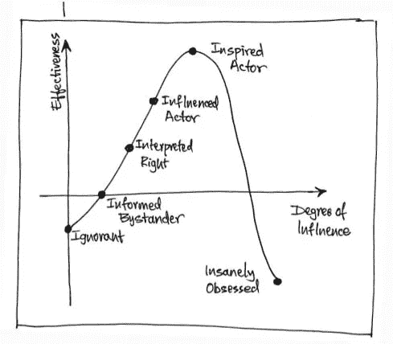

# 企业家:你可以利用我们所有人的影响力做一些积极的事情——13 个想法

> 原文：<https://medium.com/swlh/influnecers-heres-what-you-can-do-with-your-influence-13-ideas-a139d486af0f>

## 关于如何积极影响他人的实用建议

www.standout.es/en

我们都受到这种互联经济的影响？*提示 1* :所有字段都受到影响。*提示 2* :我们在某种程度上都有影响力。但是，你用这种影响力做什么呢？任何事吗？你有没有想过做一些不仅对你有益，而且对那些可能给你提供这种影响力的人有帮助的事情？

*Photo credit:* [***Stuart Foster***](http://www.flickr.com/photos/stuartfoster/)*.*

为了节省你绞尽脑汁的时间，这里有一些久经考验的想法，可以帮助你将一些影响力回报给那些创造了这种影响力并值得拥有这种影响力的人——你的观众、社区、粉丝、追随者、支持者，等等。**线索** : Lady Gaga、加尔文·哈里斯、Avicii、布兰妮·斯皮尔斯、阿什顿·库彻、皮特·凯什摩尔、小罗伯特·唐尼或塞尔吉奥·拉莫斯都不算是你社区的一部分。

# 企业家可以利用他们的影响力做的 13 件事

所以，这里有一些想法可以帮助你知道如何利用你的影响力，这样你就可以帮助那些让你变得有影响力的人。

1.  在你的个人或职业博客中专门开辟一个部分来谈论你身边工作出色的人怎么样？这可以是当地企业、你自己的团队成员、来自你不认识但激励你的人的故事，也可以是对你的社区和读者有帮助的故事。你可以在一周的某一天这样做(比如星期五？)或每隔一周。你可以给它起一个特别的名字来标识这一系列的帖子。
2.  创建一个本地活动，充分利用你的影响力和网络，让有好想法和最佳实践的人参与进来，那些在 Twitter 上没有 10，000 名粉丝或在脸书没有粉丝的人也可以参与进来。他们甚至可能没有博客，所以没有人需要惊慌失措，开始运行。你可能比任何人都更鼓励他们，更重要的是，让你网络中的人知道他们，他们会从与他们的会面中受益。有几种选择:研讨会、圆桌会议、讲习班甚至在线活动。
3.  准备一个月度视频推荐，介绍对你和你的员工贡献最大、帮助最大、影响最大、鼓励最大或影响最大的人。这不一定是指为你付出最多的人。有时候，有人会来到我们身边，做一些别人没有为我们做过的事情。它可能是某人在餐馆或酒店问候你或招待你的礼貌方式，或者是你去吃早餐时的一个早上好的微笑，或者是一个真正没有必要的真诚道歉。
4.  充分利用你的 YouTube 频道来采访那些知道自己想要什么的年轻企业家。让你的邻居/城镇/城市的商人讲述他们是如何开始一项业务的故事，这项业务现在是在线销售的领导者，领先于他们的竞争对手。
5.  与即将上大学的年轻人或即将完成学业的大学生进行会谈和会面。这两个群体往往迷失在这个体系中。你的影响可能会成为他们的指路明灯。
6.  在你的 Twitter 或 LinkedIn 账户上分享你所在地区或附近有趣的企业。我说的不是跨国公司，而是本土企业。
7.  使用 Yelp 留下关于这些企业的提示或评论，并与您的社区分享，以便人们了解它们。在 Twitter 上签到和分享也会有所帮助。小贴士:推荐他们或在 Instagram 上发布照片并不需要代表他们发出邀请。在从他们那里得到任何东西之前，你可以主动提出；这是一种很好的帮助方式。
8.  你可以在 Instagram 上使用标签来上传你喜欢的地方、人物或企业的照片，以及你认为其他人应该了解和访问的照片。
9.  **全力以赴，收集普通非凡人士的故事、经历、想法和实践，这些人希望通过这种个人和专业的叙述来激励和装备他人。**
10.  **(我知道这有点过时，但确实有效……)# FF 那些在一周内帮助过你的人，或者更多让你显著改变了互动方式的匿名人士，或者只是那些对你有特殊考虑的人，你团队中的某个人或者工作出色的专业人士。我很想看到更多的#FF 给“平凡/不平凡”的人，而不是那么多摇滚明星！**
11.  **当你想通过分享来帮忙的时候，不要只是 RT 或者‘分享’；这需要一个特殊的姿态。解释你为什么要分享，提供一个其他人应该关注它的个人理由。这是有趣的部分，如果你不阅读或关注你分享的内容，你就无法真实地做到这一点。这就是许多“有影响力的人”被排除在游戏之外的原因。**
12.  **使用 LinkedIn 推荐那些与你有过令人满意的职业交易或互动的服务提供商、工人、雇员或企业家。**
13.  **创作一本电子书，讲述那些在你的一天、一月、一年中帮助过你的人；把它作为博客发布，在 Twitter 或其他地方。请免费保存它；了解这些人应该是一种权利，而不是特权。**

# **自我吸收还是改变？**

**在我们结束之前，还有一件事:有很多想法可以让你充分利用自己的影响力，以积极的方式帮助他人。**

**所以，如你所见，有无数种方法可以做到这一点。我们有时缺乏的是意图和目的，将影响力作为一种改变的方式，而不是作为个人收益的资源，变得越来越自私。被那种 [**影响力**](http://isragarcia.es/no-soy-un-influencer) 明显高估了。**

**我希望你能与我们分享你想到的任何想法，来充分利用网络的影响力，帮助他人改变。谢谢你。**

# **只有当你觉得值得的时候，才让这个故事震撼吧！如果你发现任何有价值的东西，请鼓掌。**

> **Isra Garcia = 53 个客户，48 家企业，398 次演讲，3.454 篇帖子，24 个项目，6 本书，380 场讲座，6 家公司，16 次冒险，25 次实验，∞失败。到目前为止…**
> 
> **[营销人员](https://isragarcia.com/wp/marketer)。顾问。扬声器。作家。教育家。经理。 [IG](http://thisisig.com) 的负责人。博主。企业家。颠覆性创新。数字化转型。高绩效者和生活方式实验者。**

# **行动号召>>点击[这里](http://feeds.feedburner.com/isragarcia)订阅更多类似的文章！**

****

## **这个故事发表在 [The Startup](https://medium.com/swlh) 上，这是 Medium 最大的创业刊物，有 313，216+人关注。**

## **订阅接收[我们的头条新闻](http://growthsupply.com/the-startup-newsletter/)。**

****