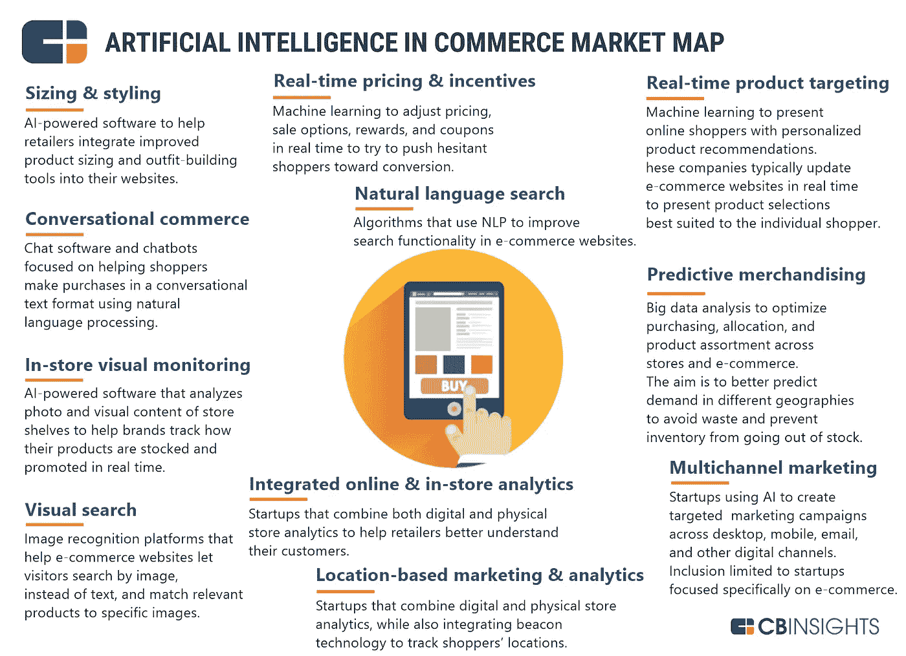

# 信息图:零售和电子商务领域的人工智能初创公司

> 原文：<https://medium.com/swlh/infographic-ai-startups-in-retail-and-e-commerce-d3a6c5226ff7>

人工智能已经在影响我们生活的更多领域，这是许多人没有意识到的。聊天机器人是最著名的用例。因此，有更多的选择:自然语言处理，图像识别和预测库存。

商业初创公司已经在使用人工智能来设计购物者的风格，调整定价和跟踪消费者的行为。

据统计，2017 年，人工智能初创公司吸引了约 152 亿美元的投资。谈到 2018 年，市场上最新的交易是于波资本对店内视觉监控初创公司 [Trax 图像识别](https://www.crunchbase.com/organization/traxretail#section-locked-charts)的 E 轮 1.25 亿美元投资。

 [## Trax 完成由于波资本|市场内幕领投的 1.25 亿美元投资

### 新加坡 2018 年 7 月 2 日电/美通社/--Trax，计算机视觉和分析解决方案的领先提供商，为…

markets.businessinsider.com](http://markets.businessinsider.com/news/stocks/trax-closes-us-125-million-investment-round-led-by-boyu-capital-1027333266) 

## 创业公司列表:

**尺寸&样式:** FindMine，Invertex，Bold Metrics

会话商务: Satisfi，Conversable，Mona，Deepomatic，Niki.ai，Kip

**店内视觉监控:** Eversight、Cosy(认知操作系统)、Trax 图像识别

**视觉搜索:** Staqu，ViSenze，Cortexica，Seez，GrokStyle，Heuritech

**实时定价&激励** : ZenClerk、Personali、Granify

**自然语言搜索:** Twiggle，AddStructure

**整合在线&店内分析:** Plexure，Manthan 软件服务

**基于位置的营销&分析:**数据浆果、无形媒体、灰色牛仔技术

**实时产品定位:**动态产量、蚂蚁语音、反射

**多渠道营销:** Unata、Thirdshelf、Emarsys、Jetlore、Tinyclues、Sidecar Interactive、SmarterHQ、Crobox、CrossCues、AgilOne

**预测销售:**蓝色那边，Celect

Natalia Kukushkina 写的

## 这个故事发表在 [The Startup](https://medium.com/swlh) 上，这是 Medium 最大的企业家出版物，拥有 343，876+人。

## 在这里订阅接收[我们的头条新闻](http://growthsupply.com/the-startup-newsletter/)。

