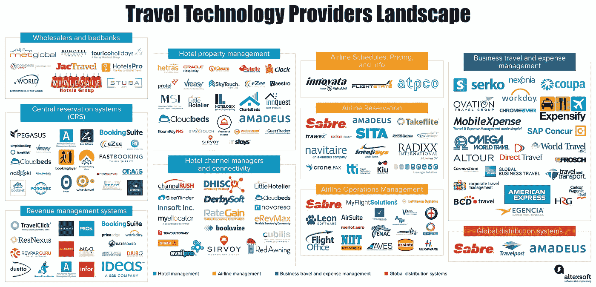

# 旅游技术提供商前景

> 原文：<https://medium.com/swlh/infographic-travel-technology-providers-landscape-e6ad0564fde2>

早在 2011 年，营销技术分析师斯科特·布林克(Scott Brinker)向大约 150 家公司展示了他的第一版[营销技术景观超级图](https://chiefmartec.com/2018/04/marketing-technology-landscape-supergraphic-2018/)。2018 年，超图包含约 7000 家公司。超级图形已经成为每个营销人员的“案头伴侣”。

我们 AltexSoft 专门从事 traveltech 产品开发，我们认为旅行技术应该有一个类似于 Supergraphic 的地图。我们还开始小范围地了解旅行技术市场的核心参与者。所以，这张信息图将会随着更多玩家的加入而进一步扩展。目前，该材料包含十个 traveltech 产品类别，包括酒店管理和客房预订系统、机票预订和管理系统、全球分销系统以及商务旅行和费用管理产品。在进一步的迭代中，我们将扩展现有类别中的列表，并添加新的类别。

**如何使用信息图:**

*   单击图像，在新标签中打开它
*   要想直接了解供应商，你可以[使用电子表格](https://www.altexsoft.com/infographics/travel-technology-providers-landscape/?utm_source=MediumCom&utm_medium=referral)，其中公司按类别和字母顺序分组，并附有网站链接

你觉得我们漏掉了谁吗？请在评论区留下你的建议和反馈。

*原载于 AltexSoft Tech 博客**[***旅游科技提供商景观***](https://www.altexsoft.com/infographics/travel-technology-providers-landscape/?utm_source=MediumCom&utm_medium=referral)*

****

## **这篇文章发表在 [The Startup](https://medium.com/swlh) 上，这是 Medium 最大的创业刊物，拥有+385，662 名读者。**

## **在这里订阅接收[我们的头条新闻](http://growthsupply.com/the-startup-newsletter/)。**

****