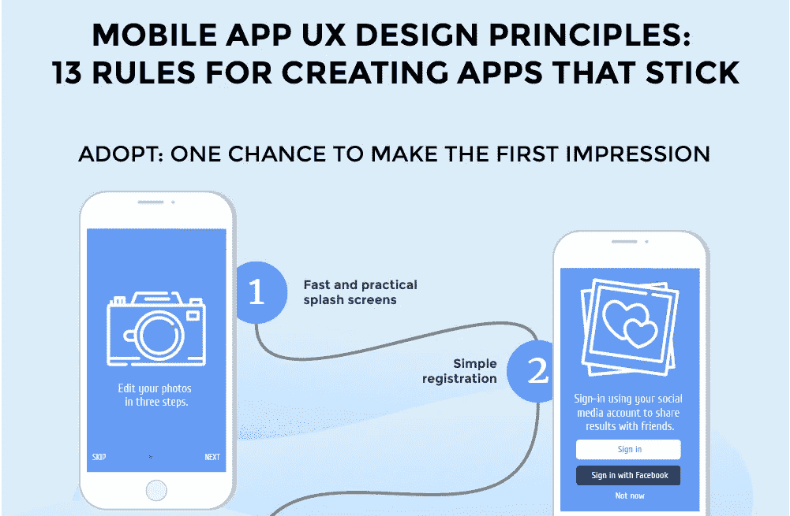
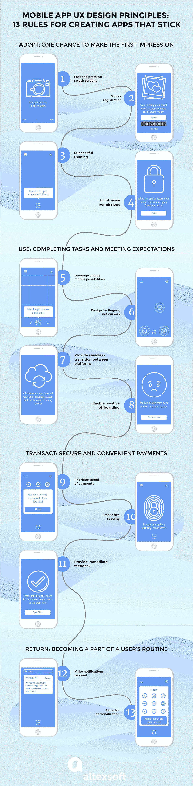

# [信息图表]移动应用程序设计原则:创建应用程序的 13 条规则

> 原文：<https://medium.com/swlh/infographics-mobile-app-design-principles-13-rules-for-creating-apps-that-stick-f607959692be>

谷歌，和苹果一样是 UX 潮流的主要引领者，[描述了](https://www.thinkwithgoogle.com/intl/en-gb/advertising-channels/mobile/mobile-app-ux-principles-improving-user-experience/)移动应用的主要 UX 原则的四个阶段:

1.  采纳——旨在引导用户对产品的初始体验、创造积极的入门体验和轻松学习的原则
2.  使用——关注用户的目标和期望，每次都提供无错误和有效的任务完成
3.  交易—无缝、安全地转换，实现一键式支付
4.  回报——吸引用户并与用户的日常生活保持联系

我们将遵循同样的逻辑，在新的信息图表中分享这些原则。你也可以阅读关于[移动 UX 原则](https://www.altexsoft.com/blog/mobile/mobile-app-ux-design-principles-15-rules-for-creating-apps-that-stick/#utm_source=MediumCom&utm_medium=referral)的原始文章，我们用它作为这个视觉故事的基础。

***喜欢这个故事吗？为我们鼓掌，让更多人发现它！👏***
原载于 AltexSoft 的博客:“[移动应用程序设计原则:创建应用程序的 13 条规则坚持](https://www.altexsoft.com/infographics/mobile-app-design-principles-13-rules-for-creating-apps-that-stick/#utm_source=MediumCom&utm_medium=referral)”

## 这个故事发表在 [The Startup](https://medium.com/swlh) 上，这是 Medium 最大的企业家出版物，拥有 309，732+人。

## 在此订阅接收[我们的头条新闻](http://growthsupply.com/the-startup-newsletter/)。

