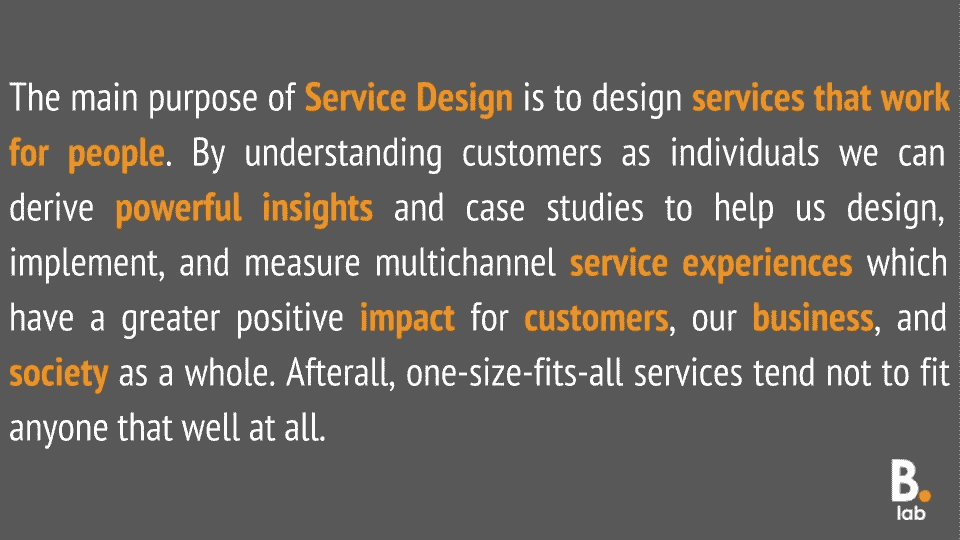
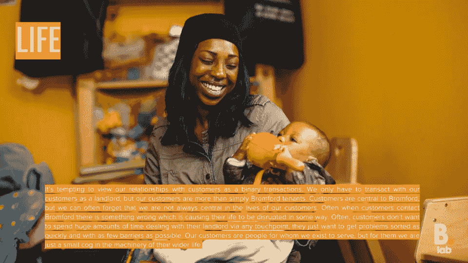
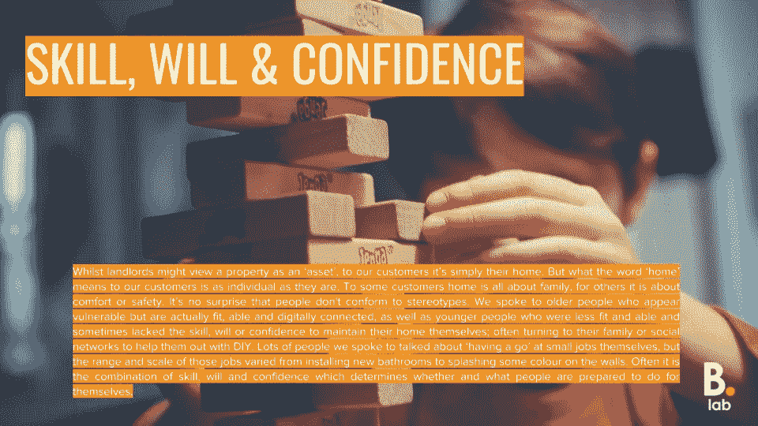
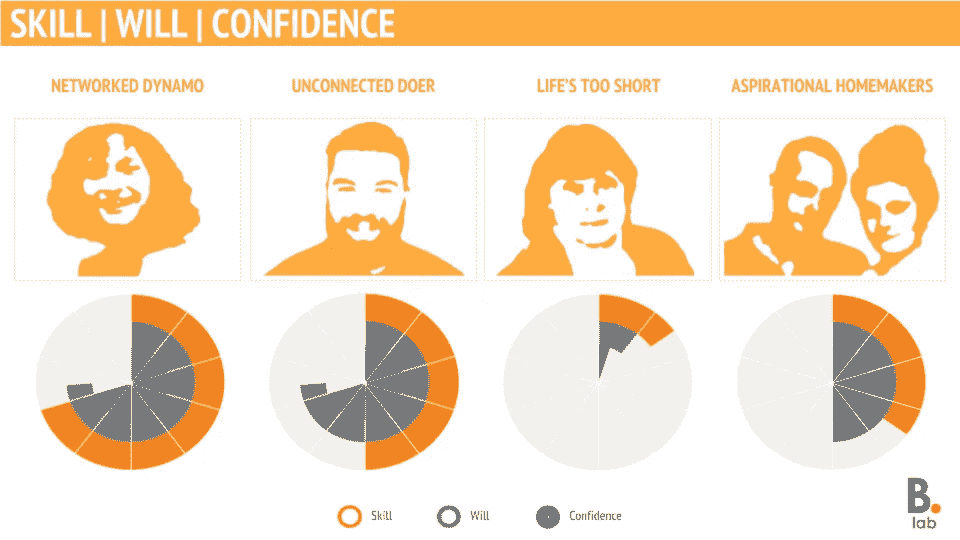
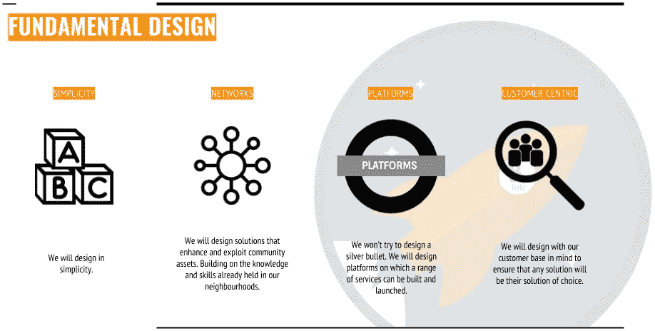

# 通过真实的顾客故事为服务设计提供信息

> 原文：<https://medium.com/swlh/informing-service-design-through-real-customer-stories-275e1c2691ff>

洞察是对观察结果的分组，这些观察结果形成一个清晰的主题，即 IRA:有趣、相关且可行

[玛莎棉花](https://twitter.com/CottonMartha)，[峡湾](https://www.fjordnet.com/)

我们的 [Starting Well pilot](https://www.slideshare.net/BromfordLab/starting-well-engineer-pilot-overview) 于 2017 年 2 月推出，旨在减少维修，同时增强客户维护自己房屋的信心和责任感。试点服务在租赁的前 3 周内，由一名初始油井工程师对客户进行访问。在访问期间，工程师提供了如何完成一系列简单维修的指导。该试验在斯塔福德郡和马奇地区进行了 12 个月，访问了 519 名客户。

虽然[启动井试点评估](https://trello.com/c/Ms4tIDT7/8-starting-well-engineer)提供了客户和同事都喜欢该服务的证据，但几乎没有证据表明该服务减少了维修或增加了客户信心。经过 6 个月的评估，实验室决定进行一项定性研究，以便更好地了解我们试图解决的问题，并更深入地了解我们的客户以及他们与自己家的关系。

> *“我们需要在我们的设计挑战和更广泛的背景下理解人。他们是做什么的？他们为什么这么做？他们的身体和情感需求是什么？他们如何看待这个世界？什么对他们有意义？人种学既关注人们做了什么，也关注他们没说什么。”*

在 2017 年末和 2018 年初，我们与布罗姆福德地区的 15 名客户举行了[场背景对话](http://www.bromfordlab.com/lab-diary/2017/10/17/conversations-with-customers-recruitment)(在客户自己的家中进行)。我们没有用一套规定的问题来进行对话，而是用一个主题指南来为我们提供一个一致的起点，让我们的对话有条不紊地进行。通过交谈，我们梳理出了几个关键主题和子主题，这些主题和子主题确定了我们以前可能从未考虑过的客户需求、优先事项和行为模式。因此，我们已经能够构建一套**观察和见解**和**四个客户案例**，这些案例让我们超越了假设和刻板印象，当与试点结果结合使用时，将提供一种资源，帮助我们基于真实案例、证据和见解设计更好的服务。

虽然我们可能会将我们的酒店视为“资产”，但对我们的客户来说，这只是他们的家。但“家”这个词对我们的顾客来说意味着什么，就像他们是个人一样。对一些顾客来说，家就是家庭，对另一些顾客来说，家就是舒适和安全。

通过我们的谈话，我们观察到:

*   人不符合刻板印象。
*   顾客对家居的行为和态度大相径庭——有些人有能力打理好家居，但缺乏意愿或信心。
*   有些人对自己的能力、健康和环境质量采取赤字思维。
*   社区在人们的生活中无处不在，但作为服务提供商，我们倾向于将服务视为我们和个人客户之间的二元交易。
*   许多客户谈到自己“尝试”一些事情，经常使用家庭网络或其他社会关系来帮助他们完成超出自己能力、舒适区或技能范围的工作。
*   这项工作需要考虑许多利益相关方，包括客户、客户朋友、客户家人、客户雇主、邻里教练、邻居。

我们在与客户交谈时能够识别的[心态、行为模式和紧张关系](/design-voices/three-i-s-for-impactful-design-research-9bd41929c3eb)自然归入 6 个紧急主题，这 6 个主题构成了我们观察和见解文档的结构。

*   主题 1——技能、意志和信心:
*   主题 2——沟通
*   主题 3——动机
*   主题 4——生活
*   主题 5——蔻驰的作用
*   主题 6 —棘手问题

最强的主题描述了顾客在与家居关系方面的技能、意愿和信心。

我们发现，顾客经常求助于他们的家人或社交网络来帮助他们 DIY。客户准备承担的工作类型不仅反映在他们自己的能力上，也反映在他们非常了解的人的能力上。因此，技能、意愿和信心应该从客户认识谁以及客户能够或准备做什么的角度来考虑，而不仅仅是他们知道什么。

**观察和洞察**

*   对他们的财产做了最大努力的顾客经常谈论家庭成员或朋友，他们是帮助他们摆脱困境的专业人士。

那些关系不太好、缺乏技能或信心来进行美容改善的顾客经常描述说，找到他们信任的商人是多么困难，尤其是如果他们是该地区的新手

在家里处理工作是你喜欢并从中获得乐趣的事情，或者你根本不感兴趣。通常，人们可能很乐意照看他们的财产，但不愿意做不必要的事情。这可能是由于各种各样的因素，但人们经常谈到 Bromford 有责任开展更大的工程，或者将自己的时间和金钱花在他们实际上并不拥有的房子上的危险。对另一些人来说，房产不归他们所有这一事实并没有什么影响，他们准备花自己的时间和金钱进行改造。

**观察和感悟**

*   照看一个家、维护一个家和改善一个家是有区别的。
*   承担较大项目的人经常这样做，因为他们想要比布罗姆福德能够提供的标准更高水平的完成。

人们对自己解决问题的能力的信心通常取决于他们对可以帮助他们的人的能力的信心，或者他们将从布罗姆福德得到的支持的信心。如果他们觉得自己有能力或者有良好的人际关系，许多人会很乐意自己处理一些小工作。工作范围从装修到任何不需要专业证书的工作。

**观察与感悟**

*   当人们与布罗姆福德的关系更积极时，他们的意愿和信心往往会更高。如果顾客觉得布罗姆福德在某种程度上让他们失望了，他们的积极性往往会降低。

从整体上看，我们与之交谈的 15 个人展示了一系列属性，这些属性可以浓缩为一组[人物角色](http://www.bromfordlab.com/labblogcontent/2017/8/3/how-we-are-using-personas)，能够以各种方式帮助设计过程中的所有利益相关者:

*   好的人物角色可以帮助验证或否定一个设计决策
*   好的人物角色可以帮助我们决定前进的方向
*   好的人物角色提供敏捷的学习，而不是统计上的生存能力
*   好的人物角色在想法产生的过程中提供灵感
*   好的人物角色能表达最终用户的心声，并培养共鸣

我们最近围绕问题— [我们如何支持客户在照看他们的家方面发挥他们的作用](http://www.bromfordlab.com/lab-diary/2018/2/19/how-might-we-support-customers-to-play-their-part-in-looking-after-their-home)的探索会议提供了灵感，通过围绕客户设计的服务生态系统，我们可以重复利用从 Starting Well 试点项目中吸取的经验教训，从而利用社区资产。随着我们在[探索管道](https://trello.com/b/DUUozEVO/bromford-exploration-pipeline)工作中的进展，我们通过对话生成的观察和见解文档以及客户角色将有助于构建和通知一些出现的工作包，提供一个参考点，我们可以从该参考点确定进一步研究、测试和试点的方向。

我们在与顾客的交谈中发现的一个重要观点是，照看房屋、维护房屋和改善房屋之间存在细微差异，我们需要明确我们希望顾客做什么，以及他们希望我们做什么作为回报。根据这些见解以及[探索会议](http://www.bromfordlab.com/lab-diary/2018/3/14/designing-for-tomorrow-a-discovery-session-round-up)本身，我们目前正在研究一些工作，这些工作将使我们能够阐明我们的服务，并最终帮助我们回答这个问题以及与我们的维修和投资服务与我们新兴的教练关系之间的潜在脱节有关的其他问题。

我们需要花一些时间问自己，而不是立即开始测试:

*   如果我们基于信任和责任而不是法律合同来提供服务，会怎么样？
*   如果我们设计一个支持愿望而不是提供抑制因素的提议，会是什么样子？

这一点，加上我们的观察、见解和人物角色，将有助于我们将同事在发现会议期间产生的想法转化为新的测试，使我们能够改进我们的服务，并为我们的客户和业务取得更好的结果。

这项工作为在我们的实验室工作中使用人物角色提供了一个概念证明，在接下来的几个月里，我们将寻找方法来扩展这种工作方式，以帮助我们[由外向内](/experiments-in-working-out-loud/innovative-leaders-think-outside-in-e99d9053c00f)思考，从而更好地了解我们的客户，[从我们的社区](http://www.bromfordlab.com/lab-diary/2017/12/7/picking-up-signals-from-our-communities)中理所当然地获得丰富的见解。

请访问我们的 [Trello Board](https://trello.com/b/DUUozEVO/bromford-exploration-pipeline) 或关注未来几周的更多博客，了解我们的进展。

— —

[@西蒙 _ 佩妮](https://twitter.com/simon_penny)

[评论](http://www.bromfordlab.com/labblogcontent/2018/5/21/informing-service-design-through-user-insight#comments-outer-wrapper)

*原载于*[*www.bromfordlab.com*](http://www.bromfordlab.com/labblogcontent/2018/5/21/informing-service-design-through-user-insight)*。*

## 这个故事发表在 [The Startup](https://medium.com/swlh) 上，这是 Medium 最大的企业家出版物，拥有 348，974+人。

## 在这里订阅接收[我们的头条新闻](http://growthsupply.com/the-startup-newsletter/)。

