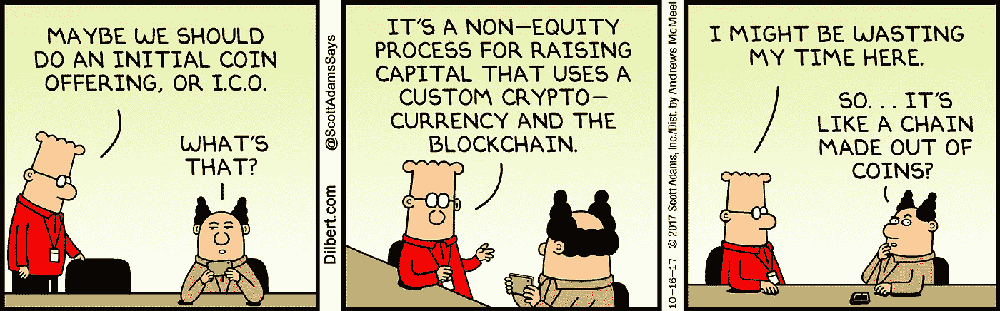

# 最初的硬币发行:切断废话

> 原文：<https://medium.com/swlh/initial-coin-offerings-cutting-through-the-bullshit-4784c2a5ce16>

你有没有感觉到大多数 ICO 都是一派胡言？你是不是很难看出这些公司将如何赚钱？考虑到最近围绕 ICO 的一系列新闻，以及迄今为止已经筹集了 24 亿美元的事实，我想务实地看看 ICO 在当前形式下的地位以及它们在不久的将来可能/应该如何发展。

对于那些需要重温 ICO 的经济学和含义的人，请[看这里](/cornell-tech/everything-you-always-wanted-to-know-about-icos-but-were-afraid-to-ask-b9728dc38b81)。

# **优点**

为了避免重复其他专家对 ICO 好处的论述，这里简要总结了 ICO 的四个主要优点。这些优点都有相反的论点，我们将在缺点部分详细探讨。

**1)资本市场的民主化**——任何人，无论地理位置、种族、宗教或财富，都可以筹集资本并投资创业公司。

流动性——投资者可以在二级市场交易代币，而不是将其价值锁定在股票上。

大众支持——ICO 的杠杆作用一个投资者群体，从理论上讲，这是一个鼓励增长的激励机制。

**4)速度&便利** — ICO 大大简化了建立和管理融资流程的工作。只需要一份白皮书、一个网站和一些营销。

# **CONS**

## **1。骗子**

这个领域有很多骗子，因为资金很容易获得。当你这么容易就能获得资金时，骗子们就会突然冒出来把钱吸走。如果你需要的只是一份白皮书、一个漂亮的网站和一些公关，你能责怪他们吗？通常情况下，ICO 是由那些永远不会去找风投的企业家领导的，因为 a)他们不想被管理，b)他们想保持他们天文数字般的、站不住脚的估值。如果根据他们的条款，他们不能筹集到资金，他们宁愿根本不筹集。任何时候，当你看到一家初创公司有多个顾问委员会，里面都有来自世界各地的名字很奇特的人时，请三思这家公司。为什么该公司在如此早期的发展阶段需要这么多的顾问委员会？当你有收入、客户和动力时，开源团队就能工作——而不是一开始就工作。不幸的是，这些骗局的最大后果是公众对区块链技术的信心下降。

## **2)流动性**

ICO 的流动性程度令人恐惧。我完全理解为什么早期前 ICO 投资者和创始人希望在发行后获得流动性，但代币在交易所交易，这些交易所实际上是没有透明度的暗池。这意味着你在 ICO 中支持的人可以很容易地在 ICO 产生任何实际价值之前直接退出，或者如果他们对自己的业务感到不确定，可以在市场之前逐渐抛售他们的股票。目前没有办法降低这种风险，你只能相信他们不会。

## 3)投机者

当投资一个 ICO 时，你是在推测一个想法——开发者想要在**未来**创造的东西的概念想法。你读了白皮书，做了一些调查，如果你认为团队是可信的，项目有前途，你就投资。90%的创业公司都会失败，区块链当然也不能幸免。ICO 容易被黑客攻击，开发者不完成他们开始的工作，以及被鲸鱼操纵价格。更不用说，公司在没有有效性的想法上筹集数千万美元，这很麻烦。至少，应该需要一个展示产品市场适应性的工作原型。

## **4)鲸鱼**

鲸鱼是拥有大量金钱和资源来操纵空间和操纵 ICO 游戏的人。他们通过支付极高的采矿费来“插队”，并在 ICO 期间获得优先权。以 BAT ICO 为例，[在短短 24 秒内筹集了 3500 万美元](/@codetractio/bat-ico-usd-35-million-in-24-seconds-gas-and-gasprice-6cdde370a615)，鲸鱼支付了高达 6600 美元的交易费，以确保它们吃到第一口馅饼。之后，这些个人以溢价出售他们的代币来获利。只有少数人控制投机，操纵价格，并在本质上创造或破坏你的代币的价值。这种波动对于一个希望建立一个可持续发展的公司的企业家来说可能是个麻烦。

## **5)上市压力**

许多成功的公司选择永远不上市，因为繁重的报告要求，也因为这可能迫使公司变得短视和保守，这通常被视为创新的杀手。许多 ICO 的初创公司天真地认为，众筹需要有一个永久的投资者关系团队，以不断与投资者沟通，管理社区情绪。然而，与普通的股权众筹不同，ICO 充满了投机者，他们一旦获利就可以/会做空你。此外，在创业公司实现产品市场匹配之前投资它们意味着支点无疑会发生，这需要支持和经验丰富的投资者。上市前的准备工作很麻烦，我认为早期风险投资公司可以发挥很大的作用，让这些初创公司为 ICO 做好准备。

## **6)政府干预**

这是 ICO 真正停下来的地方。由于诈骗数量的增加和大量不受监管的资金，政府可能会简单地决定开始监管 ICO，就像他们在就业法案中对股权众筹所做的那样。未经认可的投资者仍可被允许参与，面向公众的代币发行营销仍可被允许。然而，加密货币去中心化和不受政府控制的全部意义将变得毫无意义。那些真正希望看到这个新兴行业成长的人有责任帮助它自我监管，这样它就不会被关闭。

# **结论**

事实是，当今 99%的 ICO 都会失败。有太多的人蒙着眼睛冲进去，一群应声虫围着他们。人类倾向于利用任何漏洞来谋取私利，ICO 似乎是大多数人的首选工具。

我们必须克服的一个核心问题是专业尽职调查。专业投资者和分析师确实需要进行尽职调查，并作为 ICO 前的支持者，以确保有标准和质量控制。在这种新模式中，早期风险投资可以发挥关键作用。

综上所述，你无法阻止技术的发展。各种形式的 ICO 将继续成为加密生态系统的重要组成部分。忽视 ICO 的巨大贡献是非常错误的，比如催生了以太坊和假人这样的技术。潘多拉的盒子已经被打开了。买家当心。

## 这篇文章发表在[《创业](https://medium.com/swlh)》上，这是 Medium 最大的创业刊物，有 275，365+人关注。

## 在这里订阅接收[我们的头条新闻](http://growthsupply.com/the-startup-newsletter/)。

