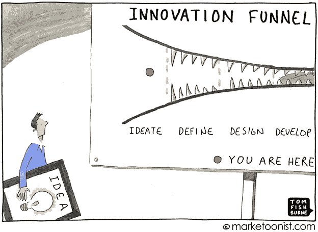
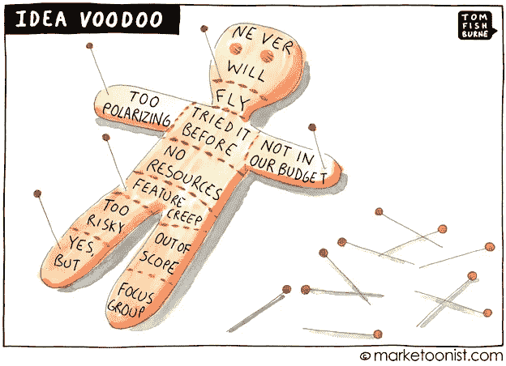
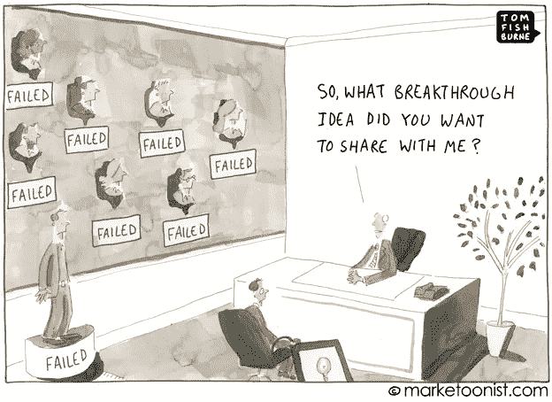
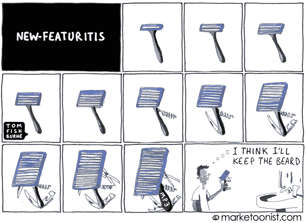
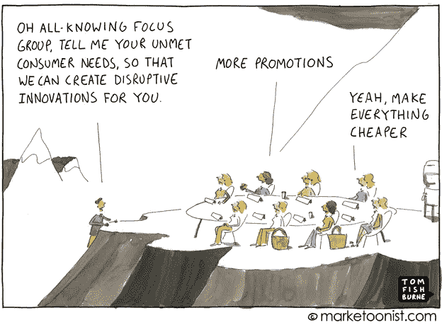

# 创新地狱:从过早死亡中拯救好想法

> 原文：<https://medium.com/swlh/innovation-hell-saving-good-ideas-from-premature-death-38312c993e3b>

为什么如此多的想法在理论上被设计成使它们变得有生命力的过程中变得越来越弱？这是一个令人痛苦但真实的现象(如果你的目标是生存下去，而不是成为昨日黄花，这也是一个非常糟糕的公司文化指标)。

创新是每个品牌旅程的天堂和地狱。灵感和激情激发了创新的潜力，而委员会则比一屋子的政客更快地扼杀潜在的伟大。或者更糟，一个政客委员会。

# **创造力不是敌人(除非进步是你的对手)**

任何参与过创新过程的人都知道，批评比创造容易得多，对任何经历过的人来说，这是一个令人厌恶的事实，不管你站在桌子的哪一边。

汤姆这样总结道:

# **射杀信使**

很多时候，公司创造或鼓励一种文化，在这种文化中，敢于冒险的人往往会受到惩罚。然而，真正伟大的公司(伴随着客户的忠诚和信心)在它的存在下蓬勃发展，而潜在的超级明星公司则因缺乏它而死亡。

值得庆幸的是，由于一些顽固的远见者敢于问“为什么”，创新得以幸存——导致了从灯泡到电话到联邦快递(通过中央枢纽隔夜运输)到 iPad 的一切。正如商业大师彼得·德鲁克在*的《创新与企业家精神*中写道，“创新是企业家精神的具体工具……赋予资源创造财富的新能力的行为。”(举个例子:最近的一份报告称，现在世界上每秒卖出的 iPhones 比出生的婴儿还多。谈论一个家庭计划…)

因此，激发创新的重要性成为底线基础以及顶线增强。

# **创新:知道何时停止**

很少有首席执行官有能力知道*在哪里*和*何时*进行创新，无法区分什么时候简单才是正确的答案。已故的伟大的史蒂夫·乔布斯和他的首席设计师乔纳森·艾夫斯拥有这种技能。

其中一部分是意识到你是在敞开大门，而不是建造围墙来抵御竞争。这就是理查德·布兰森的商业模式与唐纳德·特朗普模式的区别。

多少才算多？你是法官:

# **价格和功能不是答案**

例如， [Kickstarter](http://www.kickstarter.com/) 在一个资金来源理论上已经枯竭的经济体中重塑了创业行业，但它每周都能看到超过 200 万美元的承诺。或者是流行的[改变游戏规则的移动应用](http://www.fastcompany.com/1816610/why-entrepreneurs-must-focus-on-saying-no-bump-slashes-features)，Bump，它使信息交换像拳头碰撞一样容易(6000 万次下载证实了它的可取性)。正如 Square 的杰克·多西最近所说，“我们所做的一切都是为了让人们变得更开放、更有创造力、更有勇气。”

因此，真正的创新与旨在掩盖更大问题的小创可贴之间的区别在于*而不是*价格，而是价值。史蒂夫·乔布斯有句名言，人们不知道自己想要什么，直到你展示给他们看，本着这一精神，人们最终会在创新地狱中遭遇这种噩梦:

# **吸取的教训**

这里有三个教训:

*   创新是可以鼓励的。更是如此，*它* ***必定*** *是。*
*   创新是区分伟大和平庸的基础。
*   挑战现状不应该是例外，而是规则，可能是创新领域唯一值得遵循的规则。

自由地实践它们，并赢得胜利。

自从我最初为《快速公司》写这篇文章以来，我一直在探索创新的主题，由此产生了一个视频，我在这里包括了这个视频，没有额外的服务费，没有精美的印刷，也没有隐藏的义务:

Like this video on Innovation, please tweet it and share it around. If you would like more insights, then subscribe at [www.RisingAboveTheNoise.com](http://www.RisingAboveTheNoise.com)

— — — — — — — — — -

*特别感谢* [*汤姆·菲什伯恩*](http://www.fastcompany.com/person/tom-fishburne) *，内容营销机构 Marketoonist 的创始人兼首席执行官，该公司为联合利华、O2、克罗诺斯和《华尔街日报》等企业开发卡通广告。他之前是创新家庭护理品牌 Method 的副总裁，并领导雀巢和通用磨坊的品牌。他在哈佛商学院学习如何画漫画。在***报他的每周行情。**

**

> **“如果你在使用陈词滥调，你是在推广你的产品类别，* ***而不是*** *你的业务。”大卫·布瑞尔**

**在这里***索取你自己的免费大卫电子书《幸运的品牌》。***

**原载于 2012 年 2 月 17 日 www.fastcompany.com***。***

****

***发表于* **创业、旅游癖和生活黑客****

************

**-**