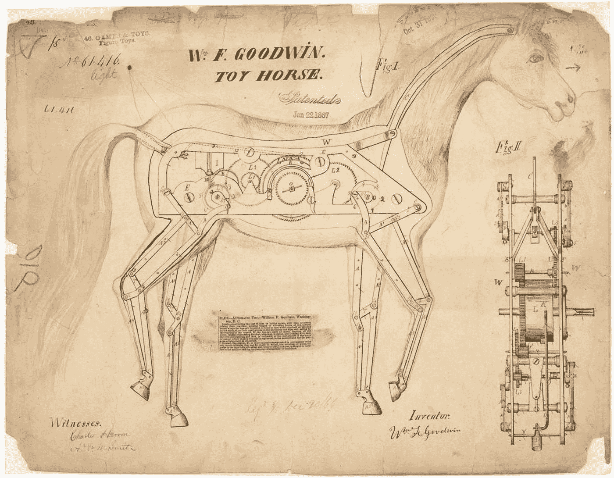

# 创新并不等同于发明

> 原文：<https://medium.com/swlh/innovation-is-not-the-same-as-invention-eb0cfc4510fc>

## 是的，你的字典错了。

“three persons in front of table” by [rawpixel](https://unsplash.com/@rawpixel?utm_source=medium&utm_medium=referral) on [Unsplash](https://unsplash.com?utm_source=medium&utm_medium=referral)

许多企业家经常混淆创新和发明这两个词。如果你也有，你并不孤单。那么，这些单词有什么不同呢？这种差别很微妙，但却至关重要。

# 不要相信你的字典——或者同义词词典

“opened book on brown table” by [Pisit Heng](https://unsplash.com/@pisitheng?utm_source=medium&utm_medium=referral) on [Unsplash](https://unsplash.com?utm_source=medium&utm_medium=referral)

当人们不理解一个单词时，他们会在字典或词典中查找。好吧，对不起。没有字典或词典会帮助你。因为，坦率地说，这些定义令人困惑。

> 发明:以前从未存在过的，由发明者创造或设计的东西
> 
> 创新:新事物，如产品或方法

当看这些定义时，它们看起来惊人地相似。发明是新事物，创新是新事物。《韦氏词典》甚至将创新和发明列为同义词。但是，用词不同。不要让一堆英国老学者写的书迷惑了你。

# 那么实际的定义是什么呢？

“close up photo black Android smartphone” by [Edho Pratama](https://unsplash.com/@edhoradic?utm_source=medium&utm_medium=referral) on [Unsplash](https://unsplash.com?utm_source=medium&utm_medium=referral)

所以现在我们明白了创新和发明并不相同。但是如果它们不一样，它们实际上意味着什么呢？好吧，字典确实做对了一件事。这就是发明的定义。

> 一项发明是新的东西，从未被世人所见。

发明是由发明者创造的，在此之前没有其他产品。他们是他们班的第一名。但是，发明并不总是受欢迎的，而且往往永远不会成为主流，直到在其他地方使用或应用。例如，手机和一些电脑中的多点触摸屏技术(触摸屏)早在 1982 年就被发明出来，使用相机来绘制手指。然而，它从未成为主流，直到它以苹果 iPhone 的形式得到更好的应用。这种新的应用，多点触控技术的再利用，被称为创新。

> 创新是对现有产品或想法的改进，通常通过改变发明的用途或引入新的想法和技术来改变

创新是更好的版本，更好的应用程序，或者是他们前辈的功能更丰富的版本。我们这个时代的许多“革命性”产品都是以前技术的创新。我们这个时代最著名、最成功的创新者之一史蒂夫·乔布斯就是一个很好的例子。史蒂夫被誉为苹果公司的梦想家，一个可以彻底改变一切的人。他的一些最著名的产品 iPhone、iPod、Mac 等。被称为他们那个时代最伟大的发明。但是，这些革命性的产品都不是真正的发明。Mac 是充斥消费市场的个人电脑的一个巨大改进版本。iPod 是被大肆宣传的索尼随身听，可以存储更多的歌曲。甚至 iPhone 也只是一项创新。它是电话、iPod 和互联网浏览器——三个以前发明的产品合二为一。

# 那么，创新比发明好吗？

“toy horse patent” from [U.S. Patent and Trademark Office](https://www.uspto.gov)

是，也不是。回到 iPhone，你听说过发明多点触摸屏技术的人吗？除非你是麻省理工学院的计算机科学毕业生或苹果迷，否则可能不会。但是，这是一个公平的假设，几乎每个人都听说过史蒂夫·乔布斯。几乎在所有情况下，创新者都比发明家更有名。创新者也几乎总是因为发明者的工作而获得荣誉。然而，仅仅因为创新者更出名，并不能让他们变得更好。

为了有创新，首先必须有发明。虽然发明可能没有创新酷，但它们对最终产品同样重要。你可以这样想:发明家是拿出令人敬畏的技术的书呆子气的科学家，而创新者是能够看到这项发明的潜力并将其应用于消费品的企业家。它们同等重要。在一些罕见的情况下，一个产品既是创新又是发明，但这种情况非常罕见，我无法给你一个非常好的例子。这种罕见是由这样一个事实造成的:当新技术发布时，它对消费者来说是陌生的。它是不同的，它是怪异的，并且它经常不是技术的完美应用。通常需要二次尝试，或者一次创新，才能完善发明，使其成为主流产品。

# 总结(对于那些不想阅读的人)

创新和发明远远不是一回事。发明是以前从未存在过的东西；全新的技术。创新采用这种发明，并以一种使其受目标消费者欢迎的方式应用它。但是一项创新或发明不会让你的公司或企业自动成功。该产品只是通往成功的漫长旅程中的一英里。企业家们，准备好，你还有很长的路要走。

## 这篇文章发表在 [The Startup](https://medium.com/swlh) 上，这是 Medium 最大的创业刊物，有+ 380，474 人关注。

## 订阅接收[我们的头条](http://growthsupply.com/the-startup-newsletter/)。

