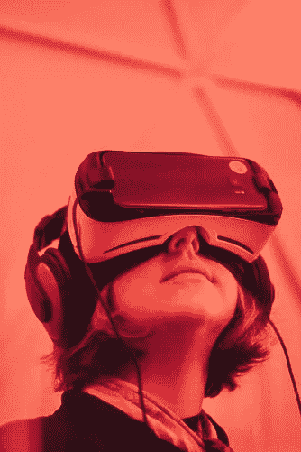
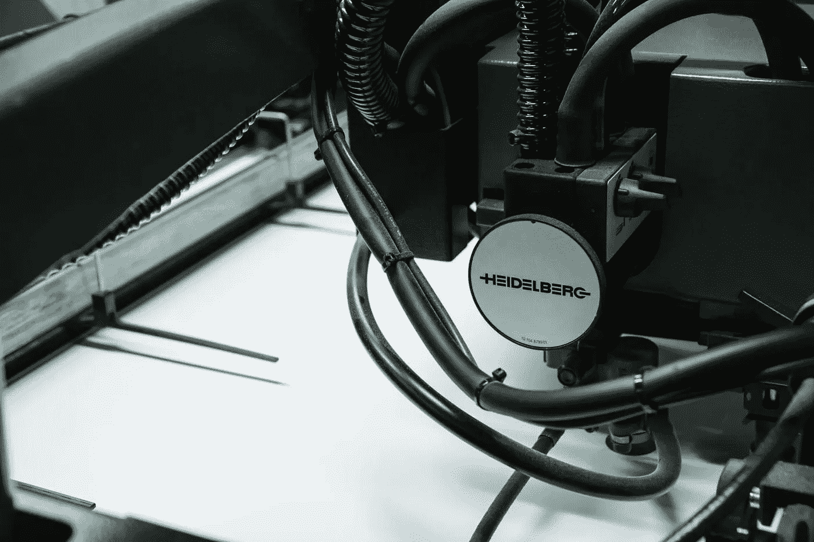

# 2018 年的创新、理念和趋势

> 原文：<https://medium.com/swlh/innovations-ideas-and-trends-in-2018-d571d6ad8632>

既然 2017 年已经过去，我们需要开始思考未来的一年。2018 年有哪些创新、想法和趋势会很大？

这显然是一个很难确切知道的问题，但这不会阻止我们去猜测。对于这个预言，我们将着眼于过去。我们认为，最近的某些趋势可能会继续下去。此外，多年来一直处于爆发边缘的旧想法可能会在 2018 年最终实现。当然，还会有无人预见的创新，但是在这篇文章中，我们不会对这些类型的发明做出疯狂的假设。

那么，2018 年将会发生什么呢？这里有一些我们认为将在未来一年影响我们生活的创新、想法和趋势。

# 增强现实

很多人认为增强现实将在 2018 年大受欢迎。这绝不是一项新技术。还记得 2016 年发布并在一天半内风靡全球的口袋妖怪游戏应用吗？你当然知道。这个应用程序使用增强现实获得了巨大的成功。

那么为什么增强现实会在 2018 年特别大呢？当 iPhone 8 和 iPhone X 于去年 9 月推出时，两者都宣传增强现实是其主要功能之一。从那时起，许多应用程序开发人员开始使用和实现增强现实。但还是有那么多东西需要探索。我们很可能会在明年看到大量使用这项技术的新应用。起伏肯定会发生，没有什么是确定的，但如果我们必须打赌，我们会说，增强现实非常有可能对 2018 年的创新、想法和趋势产生巨大影响。

看看下面的视频吧！

# 加密货币

几年前，比特币和其他加密货币成为主流媒体的热门话题。然后，在 2014 年，它似乎逐渐消失了。一些人仍在使用和投资这些新货币，但大多数人——至少是普通人——几乎忘记了这一点。也就是到 2017 年下半年。在一年的时间里，对加密货币的投资飙升。[仅比特币的价值在 2017 年就增长了 2400%。](https://coinmarketcap.com/currencies/bitcoin/)对加密货币的兴趣增加很可能会对 2018 年产生很大影响。如果市场稳定下来，它可能会成为一种真正的货币替代品。尽管这很可能不会在 2018 年发生，但我们确信加密货币的宣传只会在 2018 年增长，并成为今年最重要的创新、想法和趋势之一。

# 3D 打印机

3D 打印是我们多年来一直听说的事情之一，但却没有真正看到它实现我们所有人预期的量子飞跃。这已经变成了一种“喊狼来了的男孩”的情况。事实上，它已经被谈论了很长时间，以至于大多数人几乎已经不再关心它了。但是，2018 年可能最终成为 3D 打印之年吗？

简短的回答是……也许吧。这项技术的最大障碍之一是价格。到目前为止，3D 打印大多被制造商(小型和大型)使用。价格实际上已经下降，但 3D 打印机是否会成为标准的家用电器仍有待观察。如果是这样，那就需要更便宜。[截至 2017 年底，价格已降至约 250 美元，部分型号低至 125 美元。这是一个开始。请记住，曾经有一段时间，计算机只供组织使用，并不意味着平民。3D 打印机仍有可能从严格用于少数专业场合的机器转变为每个人在家中都有的东西，定价是一个很好的起点。如果今年没有发生，请在 2019 年回来检查。](https://www.amazon.com/s/ref=nb_sb_ss_c_1_7?url=search-alias%3Daps&field-keywords=3d+printer&sprefix=3d+prin%2Caps%2C225&crid=PZQISELLI609)

# 蓝牙

蓝牙技术是旧闻了。这里没什么新东西可看，对吧？好吧，自从 iPhone 在 2016 年去掉了耳机插孔之后，实际上发生了一些有趣的变化。比如无线耳塞在 2017 年就成了一个东西。[现在越来越多的手机采取了同样的措施，去掉了耳机插孔。](https://www.linkedin.com/pulse/list-smartphones-without-35mm-headphone-jack-lee/)这将迫使那些生产耳机插孔产品的公司改变政策。因此，市场需要关注创新、想法和趋势，以获得超越竞争对手的优势。这将导致蓝牙技术的更多变化。这是一个真正的蓝牙复兴，人们。

# 流媒体战争

迪士尼于 2017 年 12 月收购了福克斯公司的一部分。主要原因是迪斯尼计划与网飞竞争。因此，他们需要福克斯能够提供的更多的积压材料。合并的一部分也是流媒体服务 Hulu 30%的股份。迪士尼已经拥有该公司 30%的股份，现在是大股东。最初的计划是在 2019 年启动迪士尼流媒体服务，但随着迪士尼对 Hulu 的控制越来越多，他们可以很容易地改变 Hulu 以适应他们的需求。如果他们决定提前计划，他们可能会在 2018 年推出国际流媒体服务。谷歌和亚马逊也对这个市场感兴趣，并有自己的服务。随着竞争的加剧，我们可以看到更多与在线流媒体相关的创新、想法和趋势。因此，看看这个相对较新的市场在 2018 年会有什么变化将会很有趣。

# 零售业的死亡

过去两年对传统零售店来说非常艰难。像 J . C Penney，Macy's 和 Sears 这样的大公司已经关闭了许多商店，零售业的股票价格也下跌了。许多人指责亚马逊和其他在线零售商，而其他人则指责千禧一代对消费主义的态度发生了变化。人们买更少的东西，把钱更多地用于体验。他们宁愿和朋友出去吃饭或出国旅游，也不愿买新衣服。这一趋势在 2018 年仍将延续。随着旅游和餐饮业的机会，看看由此会产生什么样的创新、想法和趋势也将是有趣的。在房地产(随着更多商店的关闭)、在线零售和销售体验方面将会有机会。不管怎样，消费主义的面貌肯定在改变。

# 2018 年的创新、创意和趋势

这些是我们认为将影响 2018 年的几件事。但显然，对你影响最大的创新、想法和趋势很可能是那些与你和你的工作生活密切相关的——你工作场所的新实施、产品发布、发展和想法。

为了充分利用这一点，能够管理公司或团队内部的创新是非常重要的。这就是为什么 2018 年应该是你开始使用数字想法管理平台来分享、开发和组织你和你的同事的想法的一年。尝试一下 [Ideanote](https://ideanote.io/) 或者尝试一下另一个想法管理平台(但是你可能应该尝试一下 Ideanote，只是说说)——尝试一下数字想法管理。它将帮助你和你的同事在 2018 年充分利用你自己的创新、想法和趋势。坦率地说，这比 3D 打印机和 Hulu 有价值得多。

## 这个故事发表在 [The Startup](https://medium.com/swlh) 上，这是 Medium 最大的创业刊物，有 287，184+人关注。

## 订阅接收[我们的头条](http://growthsupply.com/the-startup-newsletter/)。

