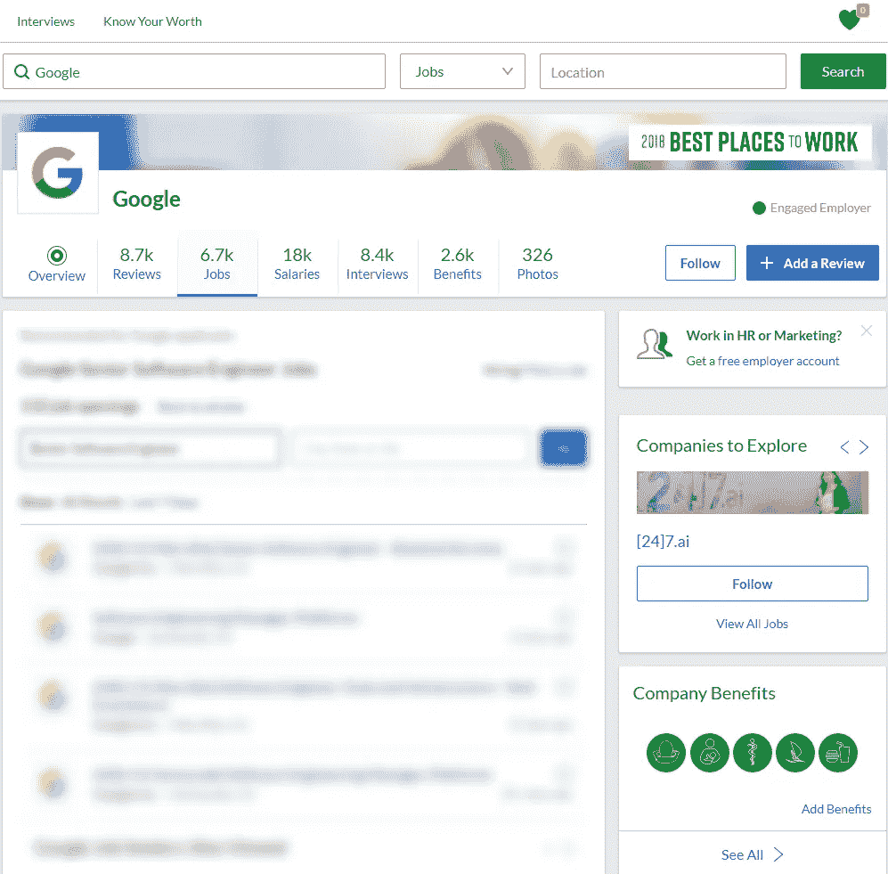

# 创新招聘，数字和绿草上的一只小狐狸

> 原文：<https://medium.com/swlh/innovative-recruitment-numbers-and-a-little-fox-on-green-grass-a68919e1621a>

I wanted to choose a stock photo of a fox, but you would assume that’s some “animal planet” stuff so here we go

如果你是一名招聘人员/猎头或首席执行官，招聘过程正在走下坡路，那么欢迎加入。我告诉你一个有效的招聘策略。我们绝望了(我们的一个同事刚刚输入了“请谷歌，做点什么，为我们聘请一位高级软件工程师”，然后按下了我感觉很幸运)。

如果你在猜测她最后去了哪里，这里有一个线索的快照:

Google’s Glassdoor page

这就是我认为“这就够了”的观点，并起草了一个看起来有点像这个的 3 步指南。

1.你能谷歌到的一切，你能在网上找到的一切，从电子书/书籍/门户网站等等你跳过。

2.你必须关上你那被高估和定价过高的笔记本电脑，去你雇佣的人通常消磨时间的地方。

3.不管承认与否，你必须明白以下几点，你是一名推销员，或者让我换一种说法——如果你努力争取成功，你应该成为一名推销员。你必须了解这些人除了工作之外还说些什么，做些什么。

在接下来的几天里，我关闭了这个职位，并可以保证，你有更好的机会雇用一个高级开发人员，同时与他一起观看尤文图斯-国际米兰(顺便说一下，我是利物浦球迷，但在这种情况下是“Forza juvene”)，而不是躲在你的笔记本电脑后面，提供一些他不需要的东西，使用“专家”编写的语言，并在福克兰群岛附近的封闭实验室中成功测试(人口密度:每平方公里 0.3 人)

## **要记住的事情**

永远不要联系任何人，如果这不是他们职业生涯中的下一步合乎逻辑的行动。
永远不要联系他们，如果你在招聘过程结束后会忘记他们的话。
开始编码——现在，你必须从零开始。没有一个单独的 Hackerrank 测试或任何其他测试平台可以显示任何客观的结果。电话筛选不能揭示个人的个性。

面对面——这不是浪费时间，要有个性，做一个人。
人脉是关键，这一直都是关键。如果你 50%的雇员不是来自推荐，那么你就做错了。你没有建立起你应该建立的信任。

## **你应该知道的事情**

如果上面写着“技术”，这并不意味着你必须记住最多的布尔字符串，或者给每个在社交资料中提到开发人员或工程师的人写无用的自动消息。如果你理解布尔逻辑，或者知道如何搜索和使用哪些工具，那就太棒了。这是你必须拥有的最低包装。哦，对了，标题承诺了一些关于狐狸的事情。

盒子里的狐狸。

盒子里的狐狸。

盒子里的狐狸。

让那声音在你脑海中响起。如果你不是足球迷，这个短语描述了一个致命的前锋，一个在禁区内进球最多的球员。他技术不是特别好，但是进了很多球。我想，现在你明白了。

记住这一点。你会摇滚的！

看看我之前的文章[这里](/swlh/overcome-your-fears-like-a-champion-e54258f64e24)，让我们在 [LinkedIn](https://www.linkedin.com/in/ghukasstepanyan/) 上保持联系。

## 这篇文章发表在《T4》杂志《创业》(The Startup)上，这是 Medium 最大的创业刊物，有 317，238 人关注。

## 在这里订阅接收[我们的头条新闻](http://growthsupply.com/the-startup-newsletter/)。

