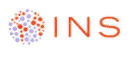
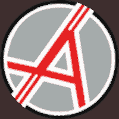

# INS 和 ANON——加密之王的最佳选择

> 原文：<https://medium.com/swlh/ins-and-anon-the-crypto-kings-top-picks-28e86eb04f9>

我之前的两个“首选”TRIG 和 VIBE 在我强调它们的“最佳”属性后的 72 小时内都向北移动了超过 100%。利润应该总是轮换的，在大海里找到下一根针和找到前一根针一样重要。上周，TRIG 和 VIBE 在多个时间点推动了 200%和 300%的涨幅。ANON 和 INS 应该很容易与 VIBE 和 TRIG 的%回报率相匹敌，原因如下。

在过去的 5 个月里，我非常努力地为我的个人项目 ANON 建立了一个由开发人员、技术人员和顾问组成的团队。由于显而易见的原因，这使我有点偏见。

然而，在接下来的短期内(几天到几周)可能会看到最高回报的两种硬币是 ins(在币安交易)和 ANON(在 Tradesatoshi 和 Safe 交易)。贸易)。

如果你更关心合作伙伴关系、效用以及成为前 10 名加密公司，XRP 将是我的选择，因为他们与世界上许多顶级金融机构有着密切的联系。然而，在短期内，XRP 的回报可能会远远低于 ANON 或 INS。

**INS**

在 INS 的历史高点，INS 的交易价格超过 10 美元。目前在 0.35 美元，达到 1 美元至 2 美元的范围很容易在短期内实现，提供 300%-500%的回报。这仍将使 INS 整体下跌 80%(与 1 月份以来的市场其他股票类似)。

然而，INS 的历史新高与它为什么应该超越目前无关。INS 在币安和 OKEx 交易，这两个交易所是最难上市的。这意味着他们的项目不仅仅是概念性的。

INS 承诺在第四季度末(3 个月内)他们的平台将上线。这意味着 INS 将从一枚没有目的的硬币变成一枚具有现实生活效用的硬币。

他们的团队由来自高盛、哈佛商学院和 IBM 的专业人士组成。我有没有提到他们在 crypto 领域的合作伙伴包括:Civic、Bancor、Wings、Ambrosus 和 Blockchain Ventures。INS 不仅有一个杀手团队和伟大的加密合作伙伴，而且他们也看到了来自世界各地的制造商的兴趣:Borjomi，Calgon，Vanish 等等。

如果你能避开亚马逊或杂货店，并能省下一大笔钱，为什么还要去那里购买消费品呢？这就是 INS 的用武之地，他们的平台将很快上线(第四季度末)。购买具有真实用例的硬币的时间不是在用例实现的时候，而是在享受市场上涨之前。对于一枚市值低于 1000 万美元的硬币来说，这在短期内应该是很容易的 2-5 倍。

如果我要突出一个硬币来提供最被低估的最高回报，那就是 INS。似乎市场已经开始转向 INS 了。

**INS 目标价 1.00-2.50 美元，最快 3 天，最长 60 天(我认为更接近 72 小时)。**

**匿名**

除了《马上就是我的宝贝》之外，这周还有很多关于它的好消息。分叉在 9 月 10 日取得了圆满成功，现在分叉后的工作已经开始。

masternode 目前的年回报率超过 1000%,这意味着您的 master node 几乎每月都能收回投资！

ANON 已经开始在 Tradesatoshi 和 Safe 进行交易。周一早上，神秘国度开始交易。如果你对 MNs 或 ANON 感兴趣，强烈建议你在 Cryptopia 上市前进行积累。包括我自己在内的 ANON 团队专注于获得 1 或 2 个前 10 大交易所，因为已经为此预留了充足的资金，并可能将如何使用它们的选择权留给 Masternode 持有者！

ANON 在 CoinGecko 和 Blockfolio 上市(即将在 CoinMarketCap 上市)。该团队还通过与 General Bytes 合作，巩固了大规模采用的重要用例。这将允许 ANON 在全世界的加密自动取款机上被购买！

ANON 的顾问们在几个月的动荡中保持勤奋和投入，并准备帮助 ANON 迈向下一个层次。美国消费者新闻与商业频道加密交易商的 Ran Neu-Ner 和 Steven Nerayoff 一直站在旁边，继续提供有用的建议，并向团队开放他们的网络。我们非常感激他们所做的一切！

采矿池已经建立，一个点击主节点功能将在本周内可用！我们的 bounty 2.0 于本周发布，社区对此非常兴奋！

ANON post fork 的前景似乎越来越好。价格低于 2.00 美元，目标是进入前 10 名，ANON 似乎有很大的增长空间。如果我不是创始人，我会更看好 ANON，然而，这似乎是一个梦幻般的短期和长期游戏。ANON 的团队花了一周时间在新加坡与亚洲的一些顶级交易所建立联系……接下来的几周需要做什么？

接下来几个月最棒的事情是，所有无人认领的代币将在 1 月 1 日被焚烧。该小组预测，这一数量将超过 30 个(约 1000 万)代币。)百万的流通供应量。这意味着个别代币的价值应该在 2019 年 1 月 1 日升值约 30%。然而，更令人兴奋的消息是 ANON 团队将让 MN 持有者决定如何处理烧毁的令牌。是不是应该全部烧掉，以提高大家的 ANON 值？还是应该存入 Masternode 基金，用于更多的交易所上市和广告？MNs 会投票！现在他们将被烧毁，除非 MNs 另有决定！

**匿名目标价 2.20-3.50 美元，最快 2 天，最长 60 天(基于何时宣布新的交易所，合作关系，或何时人们意识到荒谬的 MN 回报)。**

*阅读国王之前的文章，了解他目前推荐哪些 ICO，或者直接与国王取得联系，可以在 Twitter (@JbtheCryptoKing)或者*[**Reddit**](https://redd.it/81hj5q)*(ICO 更新和每日报道)。国王是 ANON 的创始人，并积极交易加密货币。*

## 这篇文章发表在 [The Startup](https://medium.com/swlh) 上，这是 Medium 最大的创业刊物，有+ 371，336 人关注。

## 在这里订阅接收[我们的头条新闻](http://growthsupply.com/the-startup-newsletter/)。

