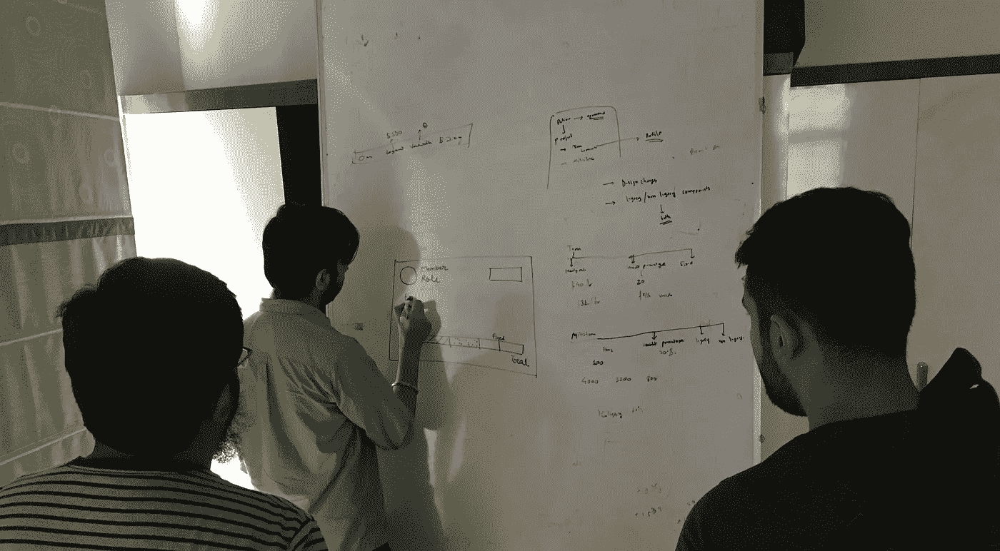
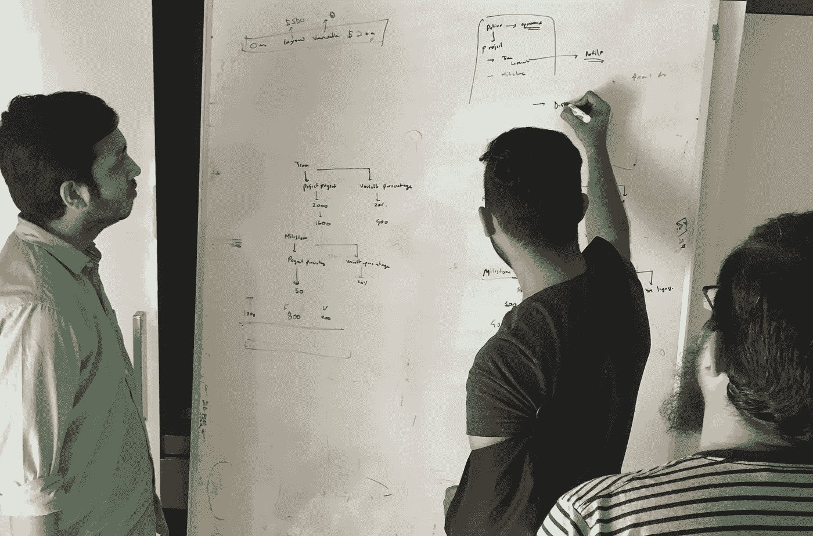
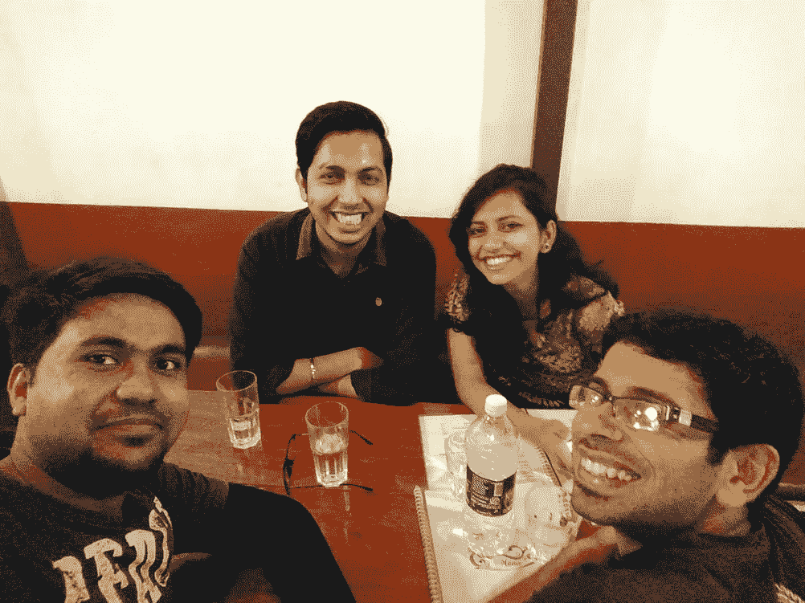
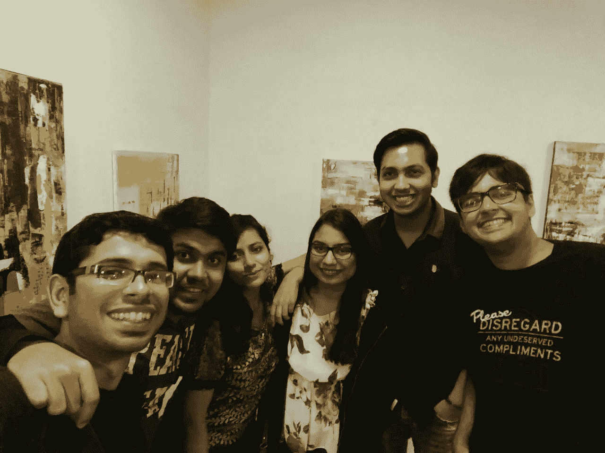
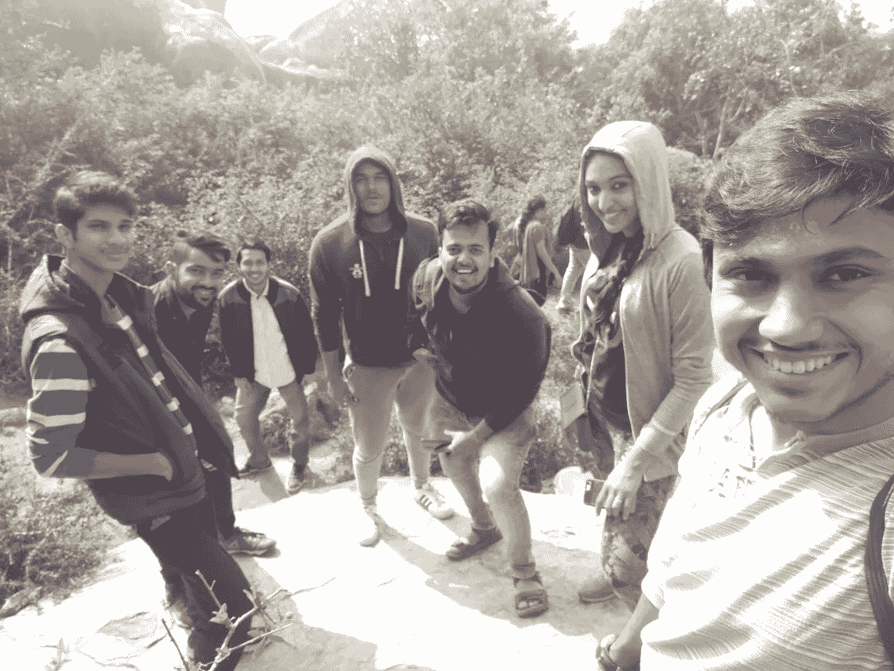

# Indiez 内幕:Indiez 如何构建工作的未来

> 原文：<https://medium.com/swlh/inside-indiez-how-indiez-is-building-the-future-of-work-b4a995d2903d>

## 我在 2017 年冬季作为产品设计实习生在 Indiez 工作的经历

每天在严格的烧毁程序和学习新工具之间挣扎，我开始从 Indiez 的文化中找到慰藉。没有一天不让我接触到新的学习机会。[概观](https://medium.com/u/e05bd23e3296#futureofwork 。目前，Indiez 已经建立了一个由 400 多人组成的远程工作社区，他们可以自由选择和实现目标，同时创造出受数百万人喜爱的 kickass 产品！
<h1 id=)

[My Room at Indiez Hq](https://medium.com/u/e05bd23e3296#futureofwork 。目前，Indiez 已经建立了一个由 400 多人组成的远程工作社区，他们可以自由选择和实现目标，同时创造出受数百万人喜爱的 kickass 产品！
<h1 id=)

[我的实习生来自班加罗尔，一个夜生活丰富、交通繁忙的城市。嗯，我很幸运地在 Indiez 总部的同一个地方工作和生活，这使我免受班加罗尔日常通勤和巨大交通的困扰。此外，Indiez 的人非常乐于助人，支持我，我在那里逗留期间没有遇到任何麻烦。此外，工作环境也不同于其他公司。它有更多的个人自由，让我可以随心所欲地发挥作用。我过去常常在上午 10:00 醒来，尽管我总是设法在睡觉前完成我的任务。天气也是一个巨大的加分点，让整个经历变得值得珍惜。](https://medium.com/u/e05bd23e3296#futureofwork 。目前，Indiez 已经建立了一个由 400 多人组成的远程工作社区，他们可以自由选择和实现目标，同时创造出受数百万人喜爱的 kickass 产品！
<h1 id=)

# [在 Indiez 的第一天](https://medium.com/u/e05bd23e3296#futureofwork 。目前，Indiez 已经建立了一个由 400 多人组成的远程工作社区，他们可以自由选择和实现目标，同时创造出受数百万人喜爱的 kickass 产品！
<h1 id=)

[Amrose Birani(CTO) explaining the product flow. Standing to right, Khaja Naquiuddin(Frontend Developer)](https://medium.com/u/e05bd23e3296#futureofwork 。目前，Indiez 已经建立了一个由 400 多人组成的远程工作社区，他们可以自由选择和实现目标，同时创造出受数百万人喜爱的 kickass 产品！
<h1 id=)

[在我实习的第一天，我被介绍给了创始人和其他团队成员，他们告诉我关于 Indiez 的情况，他们的 MVP 产品叫做 Cosmos，他们的目标是在今年冬天建立，他们向我保证我会有一生中最棒的实习经历(事实上，他们说到做到)。在了解该项目一段时间后，在短短 30 天内设计出如此复杂的产品似乎是一项完全不可能的任务，但通过严格的烧毁过程，我们不仅成功设计了产品，还开发了产品。](https://medium.com/u/e05bd23e3296#futureofwork 。目前，Indiez 已经建立了一个由 400 多人组成的远程工作社区，他们可以自由选择和实现目标，同时创造出受数百万人喜爱的 kickass 产品！
<h1 id=)

[与大多数公司遵循的 7 天冲刺不同，我们在 Indiez 遵循严格的“燃尽”流程，目标是在 2 天内完成任务，在最后向整个团队通报任务完成情况，并为下一次燃尽设定新目标。这允许工作的灵活性和根据需求分配新的任务给团队成员。它还节省了大量的时间，这些时间通常会被 7 天冲刺所阻塞，在 7 天后才更新任务，而不管任务是否比预期的时间表提前完成。燃尽法加快了发展中的初创企业所急需的进展速度。](https://medium.com/u/e05bd23e3296#futureofwork 。目前，Indiez 已经建立了一个由 400 多人组成的远程工作社区，他们可以自由选择和实现目标，同时创造出受数百万人喜爱的 kickass 产品！
<h1 id=)

> [在“燃尽”过程中，团队成员的目标是在 2 天内完成任务，在结束时向整个团队通报任务完成情况，并为下一次燃尽设定新目标。](https://medium.com/u/e05bd23e3296#futureofwork 。目前，Indiez 已经建立了一个由 400 多人组成的远程工作社区，他们可以自由选择和实现目标，同时创造出受数百万人喜爱的 kickass 产品！
<h1 id=)

# [Indiez 的人](https://medium.com/u/e05bd23e3296#futureofwork 。目前，Indiez 已经建立了一个由 400 多人组成的远程工作社区，他们可以自由选择和实现目标，同时创造出受数百万人喜爱的 kickass 产品！
<h1 id=)

[我想用一个单独的部分来讲述我在 Indiez 总部期间最钦佩的两个人。](https://medium.com/u/e05bd23e3296#futureofwork 。目前，Indiez 已经建立了一个由 400 多人组成的远程工作社区，他们可以自由选择和实现目标，同时创造出受数百万人喜爱的 kickass 产品！
<h1 id=)

[Amrose Birani](https://medium.com/u/156d8fed3c74?source=post_page-----b4a995d2903d--------------------------------), CTO & Co-founder

Amrose Birani 是 Indiez 的联合创始人兼首席技术官。他是一名多才多艺的技术极客，曾与硅谷的 Snaplogic 等顶级初创公司合作，此前曾在美国运通领导他们的 DevOps 团队。他身材高大，留着长胡子，是一个极其谦逊的人。他帮我理清了关于职业的困惑，告诉我不要再担心工作/实习，更好地关注我的技能发展。他帮助我了解到主要的目标应该是尽可能多地从工作周围的人那里收集信息。

[Khaja Naquiuddin](https://medium.com/u/f1a9aaff5cd6?source=post_page-----b4a995d2903d--------------------------------), Frontend-Developer

**Khaja Naquiuddin** 是一名全栈工程师，后来成为了一名专业的前端工程师，拥有多家初创公司的工作经验，比如现在已经被收购的 Gharpay 和 Clinknow。在 Indiez，他致力于自动化前端开发任务，以提高项目交付速度。他非常脚踏实地，是一个友好的人，也是一个伟大的导师。和他说话的时候，我从来不觉得我是在和我的学长说话。此外，他和我一样是一个爱喝茶的人。所以，我们常常在下午散步，在附近的咖啡馆或茶摊喝茶。

# 我的项目和职责

一旦我熟悉了这个团队，我就加入了不同的 slack 频道、JIRA、Gitlab 和其他必要的工具。他们给了我 2 天的时间来理解需求，并在我澄清了所有疑问后，尽快开始故事板。由于我的工作不仅仅是设计产品，还包括使用 React JS 编写前端代码，Khaja 与我分享了一些关于 React JS 的教程和文章，以帮助我熟悉这种新的前端语言。在我从事设计之前，我每天睡觉前都会练习 2 个小时的教程。

我加入 Indiez 的动机之一是有机会学习 React JS 和实施我正在设计的项目。React JS 对我来说无疑是一个新的挑战。

设计师到底该不该学开发，一直有很大的争论。我觉得一个不能为最终用户开发的设计或想法将不能满足设计它的唯一目的。因此，设计师必须了解开发人员的语言。这不仅有助于设计人员在设计时站在开发人员的立场上，也有助于他们比前端开发人员更好地执行设计，因为前端开发人员有时会做出一些假设，如果他们没有得到设计人员的良好沟通。

> 设计师必须了解开发人员的语言。它不仅有助于设计人员在设计时站在开发人员的角度，也有助于他们更好地执行他们的像素完美设计

在 15 天内，我完成了设计，并开始前端开发工作。这几天标志着我在实习期间的学习曲线有了明显的增长。每天，我都会更深入地研究 React 开发的广阔领域，Khaja 不断提醒我不要被浩瀚的知识淹没。他让我相信确实有很多东西要学，但我不可能在一天之内完成。

> 我将在另一篇博文中分享更多关于 project 的设计过程和我用于开发的工具的细节。

# 听起来太忙乱了，乐趣在哪里？

听起来我在实习期间确实有一个忙碌的时间表，但这些忙碌的时间表对我来说从来都不忙碌，因为我喜欢我正在做的工作。由于随时随地工作的灵活性，我正在学习新的东西。我们有时在咖啡馆工作。这对我来说确实是一次新的经历。此外，我们过去常常在周末举行团队午餐和晚餐聚会。

> Indiez 的人当然知道如何努力工作，更努力地聚会。

在星期天，我经常和我的大学朋友出去逛逛，探索新的咖啡馆和茶点(我是个爱喝茶的人。你绝对应该试试哈蒂卡皮(Koramangala)的马萨拉茶。星期天真的很有趣。

我们还去了班加罗尔郊区附近的 Anthargange 洞穴。这真是一次冒险的旅行，从一个有各种狭窄通道和裂缝可以爬行的洞穴开始。在另一端，有一个美丽的景点，我们可以整天坐在那里欣赏风景。

There was pitch darkness inside the cave. We couldn’t take much photos.

最后，我的实习生结束了为期一天的迈索尔市之旅，我们参观了迈索尔宫。它的夜景非常壮观，你不能错过。

Visit to Mysore Palace with Indiez team

# 我的实习生就是这样结束的

在这些有趣的旅行、晚宴和严格的烧毁过程中，我的实习生最终给了我我一直想要的学习经历，与人的永久联系，以及在很短的时间内对生活和职业的更深刻的意义。这位实习生帮助我理清思路，让我明白我应该把目标放在一个能让我成长得更好、让自己接受新挑战的地方，而不是一份看起来漂亮、有保障但单调的早 8 点到晚 8 点的公司工作。

工作的灵活性，身边有才华的人，每天让自己面对新的挑战，并不断提高自己以适应快节奏的环境，所有这些都构成了在 Indiez 的一次很好的学习经历。

现在，我带着大量的记忆和新技能回到了 with 罗克，我再次准备好迎接即将到来的新挑战和新机遇。

我目前正在寻找一些自由职业者的工作机会。请随时联系我，电话:[yadavnikhil012@gmail.com](mailto:yadavnikhil012@gmail.com)🔥🔥🔥

你也可以在 [Dribbble](http://dribbble.com/yadavnikhil012) 上关注我，了解宇宙项目的设计更新。🏀

## 这篇文章发表在《T4》杂志《创业》(The Startup)上，这是 Medium 最大的创业刊物，拥有 318，983+读者。

## 在这里订阅接收[我们的头条新闻](http://growthsupply.com/the-startup-newsletter/)。

