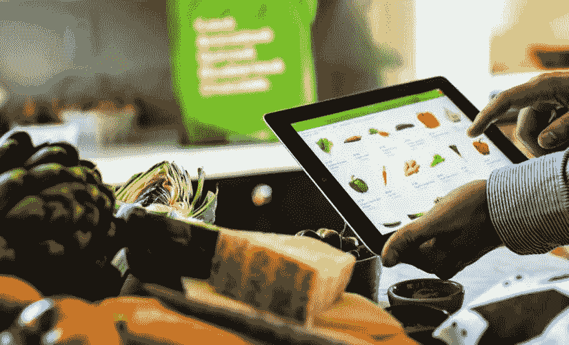
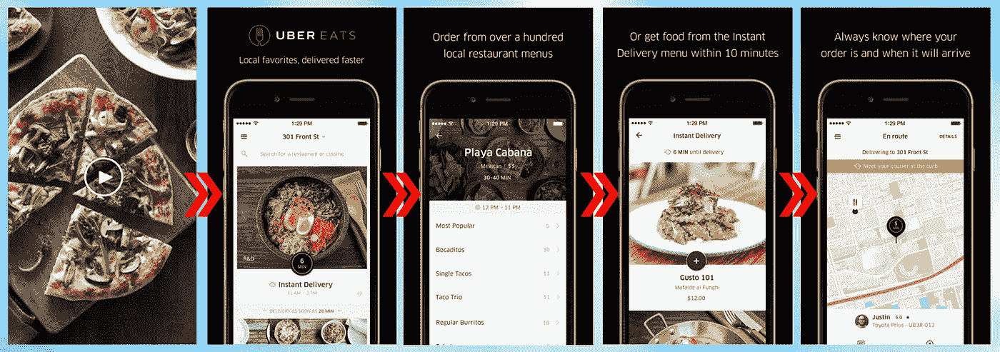
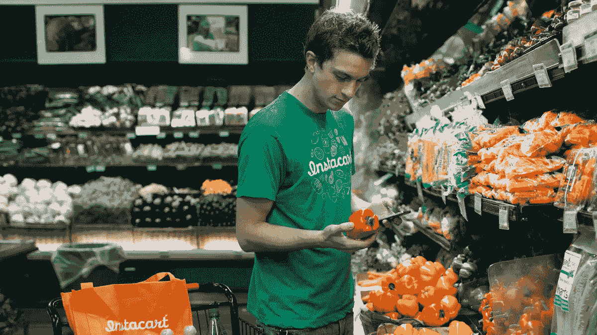
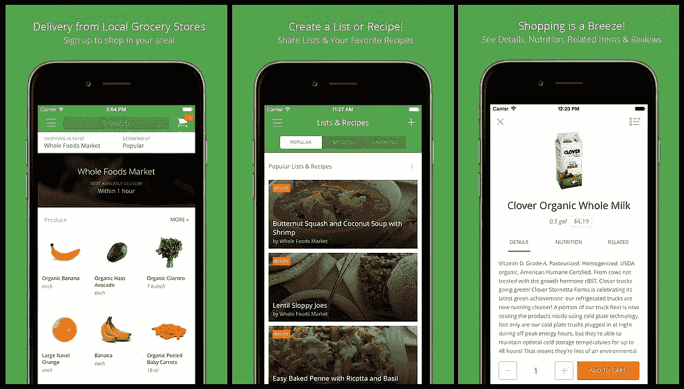
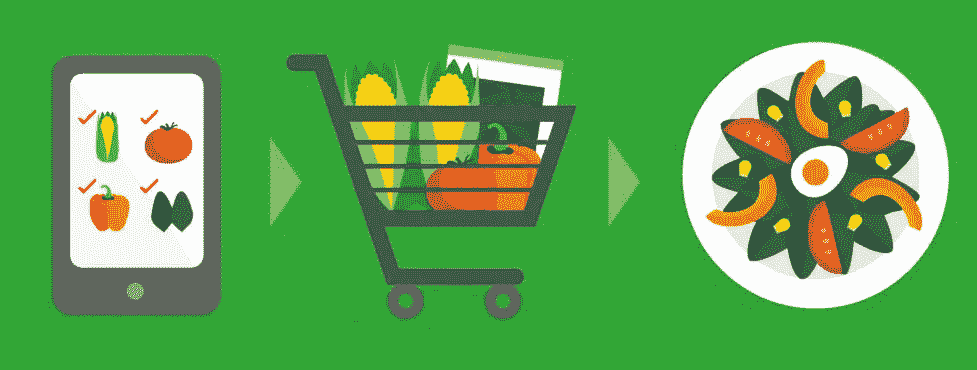

# Instacart 等应用的见解

> 原文：<https://medium.com/swlh/insights-of-apps-like-instacart-2437ade820e0>

过去十年的科技繁荣部分是由按需公司创造的。事实上，电子购物已经主导了零售业，并带来了约 1 . 2 亿美元的收入。因此，对于有抱负的应用程序开发人员来说，在市场上有一个强大的立足点。在某些方面，它始于勺子火箭。这家位于加州伯克利的初创公司在不到 15 分钟的时间内，将精选的舒适食品直接送到你的门口。

Instacart 和其他将当地餐厅和商店与客户联系起来的本地交付应用程序像风暴一样席卷了市场。在我们的其他文章中，我们已经谈了一些关于交通应用的内容，但在这里，我们将更详细地研究这些应用到底能做什么，以及它们是如何交付的。

# 不断变化的市场

Instacart 的商业模式包括 3 个主要特征；即与领先的超市建立联系，包括工人(即个人购物者)以涵盖实际交付，并支持作为杂货业不幸副产品的大量库存。该公司声称节省了高达 30%的劳动力成本。

市场巨头亚马逊(Amazon)和谷歌(Google)已经抓住了扩大业务的机会，谷歌的购物快递(Shopping Express)当然还有无伤大雅的 T2 亚马逊优惠(Amazon Prime)服务(T3)，它允许你以 99 美元的年费无限制地运送“优惠商品”(其中有 2000 万件)。优步推出了自己的外卖服务， [UberEats](https://newsroom.uber.com/ubereats-tech-update/) ，其理念是在 10 分钟或更短时间内将快餐从餐馆送到顾客手中，菜单每周都有变化。

但 Instacart 已经成为杂货的优步，作为一个杂货订购和交付应用程序，允许用户(杂货店买家)查看一系列可用产品，并进一步将产品直接送到他们的家门口。

用户可以购买各种各样的产品，从新鲜水果和蔬菜，到肉类和海鲜，以及其他家庭必需品，所有这些都可以通过几个水龙头送到家里。该应用程序节省了时间，减轻了寻找、停车、排队和连续逛多家商店的整体压力，为自己赢得了荣誉。

# Instacart 的洞察力

像 Instacart 这样的应用程序提供个性化的无缝购物体验，而交付应用程序的模型要么能够像 UberEssentials 一样提供一系列预设的选项，要么可以根据需求从任何地方提供一系列商品和服务。当然，能够按需点餐打开了一系列可能性的大门，某些 iOS 和 Android 应用程序允许用户从你指定的任何餐厅点任何东西。

Instacart 的核心是一项服务，通过在不到一个小时内将个人购物者送到你家门口。根据你所在的地区，你可以从一系列杂货店中挑选，包括全食超市、好市多、克罗格、食品商场和超级新鲜。

这项服务在美国 14 个城市开展，它会把你的私人购物者送到你选择的商店，让他们在一个小时内把你所有的商品送到你手中。它更关注用户的购物清单，而不是具体的商店。

Postmates 的工作方式有点像 Instacart，它发送一个本地快递员，也被称为“车轮上的潮人”，以更好地从商店和餐馆递送产品。事实上，Instacart 确实脱颖而出，因为它为送货市场开创了一个全新的阶段。

仅从全食超市来看，与 Instacart 的合作已经帮助每周在线交付销售额超过 100 万美元。因此，转向按需经济有它的好处，也能带来巨大的回报。

该应用程序有五个主要功能:

1.  *用户签到*
2.  *产品分类*
3.  *轻松下单*
4.  *不同的支付方式*
5.  *订单调度*

这似乎是一个简单的模型，但这就是它的优点。Instacart 使买家能够在他们希望送货的时间订购新鲜农产品。用户甚至可以使用优惠券，如果他们手头有“最喜欢的”商品，可以保存下来供将来参考。此外，购物者在商店时可以实时编辑列表，并与朋友和家人分享这些列表。

它们缩短了供应链，减少了拥有仓库的需求，并让个人购物者确认购买的产品。他们通过收取会员费来进一步赚钱，并提供 99 美元至 159 美元的年度会员“Instacart Express”。这有点像亚马逊 Prime，但对于杂货来说，通过这个计划，用户可以在长达 1 年的时间内免费送货。

Instacart 还在实际价格的基础上上涨 15%,然后这笔收入直接进入 Instacart，用于支付他们的管理费用和购物者。他们还从送货费中赚钱，向顾客收取 3.99 美元到 5.99 美元不等的费用，根据地点不同，最高可达 11.99 美元。和其他行业一样，这个行业也存在一些问题，即获得合适的产品和确保个人购物者是合法的人，但随着这个行业的成熟，肯定有空间消除这些障碍。

我们可以从 Instacart 中学到的是如何利用问题解决为我们的应用程序带来优势。所有的餐馆都有同样的问题:不均衡的顾客流动。一个移动应用程序通过连接需求和供应来帮助商店和餐馆解决客户流失的问题。他们满足了经济中的一个基本需求:对食品杂货的需求，而他们的个人购物者受益于广泛的网络范围。

因此，Instacart 对杂货服务的影响就像优步对出租出租车的影响一样，有效地竞争着每个人都在寻求利用的商品:便利。

开发像 Instacart 这样的应用程序需要你处理产品交付，因此你可以直接从商店的库存中获得商店的库存数据。为了解决没有自己的仓库来销售商品的问题，他们从商店手动组装他们的产品基础，购买所有的产品，并将购买的照片上传到网上。这是一种新颖的方法，也是各种创业公司以某种方式整合的方法。

例如，Shotfarm 充当了一个免费产品图像交换平台，通过用户自己的内容网络将用户与产品直接联系起来。同样，他们实际上并不拥有产品，而是制造商、经销商和零售商分享他们最新的产品属性、形象、营养价值等。另一方面， [Kwikee](https://www.kwikeesystems.com/members/handler?func=display_welcome) 提供对最新产品图片的访问，进一步为那些对电子商务或移动开发感兴趣的人提供 [API](https://www.kwikeesystems.com/api-product-image-delivery.shtml) 交付选择。

ItemMaster 拥有一个完全免费产品图片的平台来源， [Gladson](http://www.gladson.com/) 维护着一个美国包装商品的产品信息数据库。此外，现在还有从农场到餐桌的服务，如[门到门有机物](http://www.cbinsights.com/company/door-to-door-organics)和送餐专用初创公司，如[送餐英雄](http://www.cbinsights.com/company/delivery-hero)。所以真的，这里有一个全新的市场利基，它将取代传统的杂货店购物方式。

像 Instacart 这样的应用程序，以及以它为原型的一系列应用程序，并不专门取代定期的杂货店旅行，而是为那些没有时间出去购物的职业人士或忙碌的家庭提供了一个替代选择。它填补了一个我们甚至不知道的市场空白！事实上，印度移动杂货购物行业的领跑者，Bigbasket 的 Hari 称这个市场是一个“复杂的、以执行为导向的行业；理解执行和供应链才是最重要的”。

杂货配送的供应链物流现在使其成为一种可行的商业策略，并有利于投资。事实上，Instacart 如何能够填补额外的利润，以覆盖基础设施和物流的各种成本，这是很有见地的——现在，它将消费者与许多很可能缺货的产品直接联系起来。

当然，Instacart 已经永远改变了我们看待杂货店的方式。

以 Instacart 为模型的应用通常价格在 5500 美元到 14500 美元之间，取决于你想在哪个平台上开发它。详细的估计会让您对设计和开发的总成本有更好的了解，因为这些因素取决于包容性水平和您希望在应用程序中包含的功能数量。但是没有梦想是太大的。

我们的[专业开发人员](https://octodev.net/portfolio/)将帮助您创建一个移动杂货交付应用程序，提供无缝和个性化的杂货购物体验。在我们开始应用程序开发之前，我们将与您详细讨论您的移动应用程序的所有规格，为您构建一个功能强大的应用程序，并让您从头到尾参与到开发过程中。

这似乎是一个挑战，但为一个规模较小、服务不足的市场开发一个应用程序，有可能让你扩大业务规模，并获得惊人的结果。我们想帮忙。向我们咨询更多信息，以便我们可以帮助您构建您的杂货交付应用程序！因此[今天就联系我们](https://octodev.net/contact-us/)，我们可以为您的业务和发展需求奠定基础。

*本文原载于* [*Octodev 博客*](https://octodev.net/insights-of-apps-like-instacart/) *。*

如果你喜欢这篇文章，请点击下面的拍手图标，让我知道！

## 这个故事发表在 [The Startup](https://medium.com/swlh) 上，这是 Medium 最大的企业家出版物，拥有 276，798+人。

## 在此订阅接收[我们的头条新闻](http://growthsupply.com/the-startup-newsletter/)。

