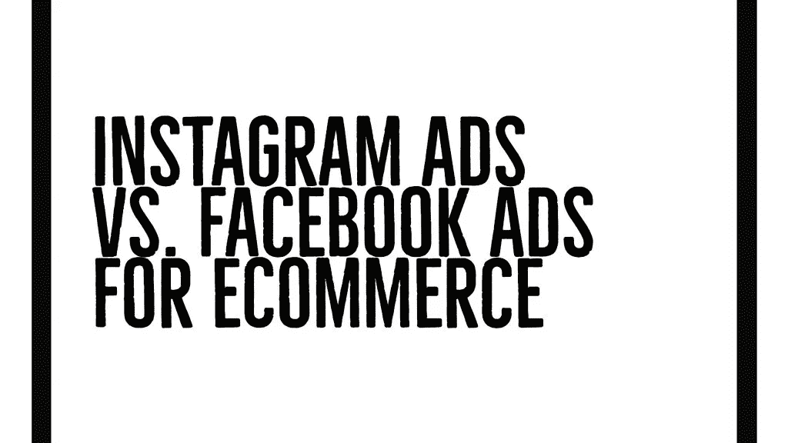
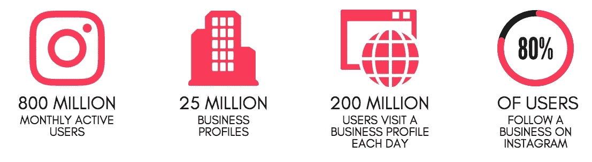
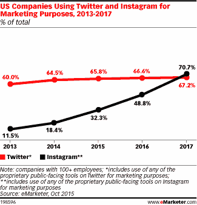
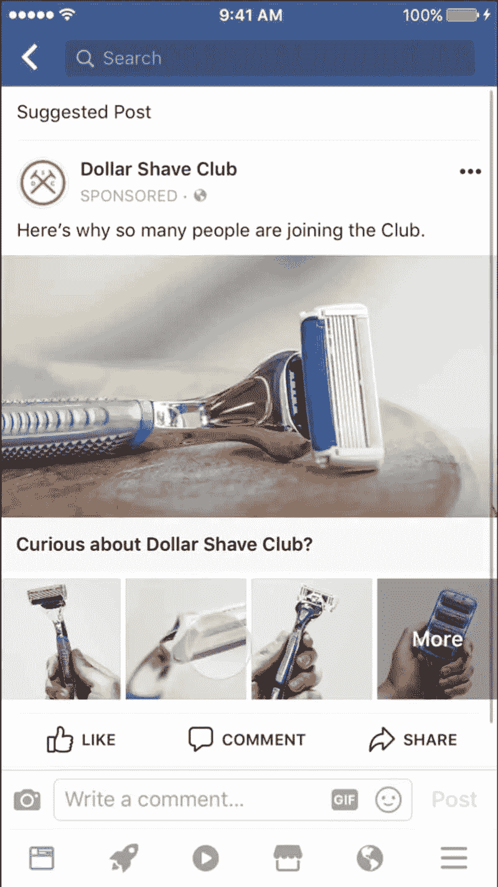
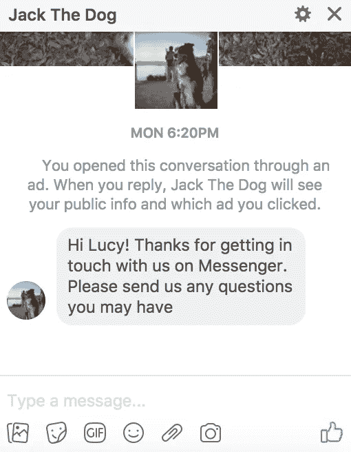
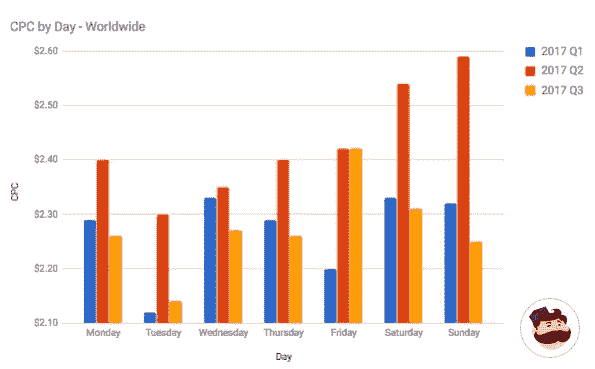

# Instagram 广告与脸书广告:哪个更适合电子商务？

> 原文：<https://medium.com/swlh/instagram-ads-vs-facebook-ads-which-are-better-for-ecommerce-ca3fae44ad12>

社交媒体广告为营销人员提供了先进的受众定位选项和可靠的转化跟踪。虽然脸书更老，用户群更大(截至 2017 年 9 月 30 日，月活跃用户为 20.7 亿，而 Instagram 为 8 亿)，但 Instagram 正在稳步普及，特别是随着像 [Instagram Stories 这样的新功能的大量采用。](https://simplymeasured.com/blog/instagram-stories-part-2018-social-strategy/)

如果你的品牌在脸书和 Instagram 上都很活跃，最好的方法是在两个网络上逐个活动地激活广告活动。

> 营销人员应该……超越季节性购物时刻，思考如何利用脸书和 Instagram 推动全年在线和店内销售。
> 
> **-脸书北美全球营销解决方案副总裁纳达·斯特拉特**

但是，在固定或紧张的[社交媒体营销](https://get.simplymeasured.com/rs/135-YGJ-288/images/2018SocialMediaPlanningGuide-V2-WORKSHEETS.pdf)预算下，你可能需要问问自己，你应该把大部分广告投入到哪里:脸书[还是 Instagram。答案可以通过识别哪个平台将带来最多的收入来确定。](https://simplymeasured.com/blog/7-ways-to-increase-ecommerce-sales-with-facebook-ads/#sm.00004dow2db7hcqpy2i1p1jmi9mj5)

为了确定最适合你的电子商务业务的社交媒体平台，请研究以下三个主要目标:

1.  到达
2.  [订婚](https://simplymeasured.com/blog/create-blog-post-designed-engagement/)
3.  人口统计数据

在本帖中，我们将详细探讨这两个平台的三个主要目标。

# 1.到达

# 照片墙

Instagram 拥有 8 亿月活跃用户。如此庞大的全球用户数量使得 Instagram 成为商业和品牌推广的一个好赌注。

关注标签

给你的建议

Instagram 还拥有更强的有机影响力，这是该网络有意保留的一种品质，它具有更新的功能，如关注标签的能力和显示朋友喜欢的帖子的“给你的建议”部分。

# 脸谱网

脸书是最古老的社交媒体平台之一。与 Instagram 相比，它拥有更大的活跃用户群:脸书拥有 20.7 亿月活跃用户。

这使得脸书成为第一大社交媒体平台，所以如果你想提高品牌知名度而不针对特定年龄组，脸书可能是正确的选择。

也就是说，脸书确实有大量的广告定位选择。以下是可用于创建新受众的选项，您可以在脸书管理器上的广告集创建的“受众”部分找到这些选项:

*   **地点。**根据位置(例如:国家、州、省、市、国会选区、邮政编码)向人们投放广告。大多数目标让你瞄准全球(键入“全球”)、地区(例如:“欧洲”)、自由贸易区(例如:“NAFTA”，北美自由贸易协定)或应用商店可用性(例如:“iTunes 应用商店国家”)。[了解更多。](https://www.facebook.com/business/help/285255905140138?helpref=faq_content)
*   **年龄。将广告瞄准某一年龄范围内的人。**
*   **性别。将广告瞄准女性、男性或所有性别的人。**
*   **语言。**针对特定语言的用户投放广告。
*   **详细定位。**根据人口统计、兴趣和/或行为从受众中包括或排除人员。[了解更多。](https://www.facebook.com/business/help/182371508761821?helpref=faq_content)
*   **连接。**根据与您的页面、应用或活动的联系，从您的受众中包含或排除人员。[了解更多。](https://www.facebook.com/business/help/1819812758298988?helpref=faq_content)
*   **定制受众。**自定义受众是您已经认识的人的目标受众。这些分组是根据您提供的信息或脸书产品生成的信息创建的。您可以从[客户档案](https://www.facebook.com/business/help/381385302004628?helpref=faq_content)、[脸书像素](https://www.facebook.com/business/help/449542958510885?helpref=faq_content)、[脸书 SDK、](https://www.facebook.com/business/help/1472206006327390?helpref=faq_content)和[脸书约定](https://www.facebook.com/business/help/1707329062853572?helpref=faq_content)中创建自定义受众。

定制受众的一个子集是长相相似的受众。长相相似的受众是你从“来源”创造的目标受众它会在脸书上找到与源中的人最相似的人。

您可以在目标受众中包括或排除自定义受众或相似受众中的人员。

# 2.约会

# 照片墙

[2017 年，70.7%的美国企业在使用 Instagram。](https://sproutsocial.com/insights/instagram-stats/)

这与 2016 年的 48.8%形成对比。为什么品牌都涌向 Instagram？订婚。

根据 Instagram 的数据，80%的用户在 Instagram 上关注至少一项业务。截至 2017 年 3 月，[超过 1.2 亿 Instagram 用户](https://business.instagram.com/blog/welcoming-1-million-advertisers)访问了一个网站，获得了方向，给一家企业打了电话，或者给一家企业发了电子邮件或直接发了信息。

# 脸谱网

有机帖子的脸书参与度[可能会降低，](https://simplymeasured.com/blog/facebooks-algorithm-change-social-marketers/)但这个网络上的广告定位机会是巨大的。有了广告，你可以非常具体地了解你正在寻找的参与类型。

一些例子:

*   [奥克兰突袭者队](https://www.facebook.com/business/success/oakland-raiders)通过旋转木马和链接广告向球迷提供特别的节日优惠，为他们的“节日储蓄”头饰促销带来了 19 倍的广告支出回报
*   [fabbit fun](https://www.facebook.com/business/success/fabfitfun)凭借脸书广告的 Canvas + collection 增加了 80%的点击率
*   Denny's 通过将脸书加入他们的电视宣传活动，增加了 15%的增量覆盖面

# 3.人口统计数据

# 照片墙

皮尤研究中心进行的一项研究发现，Instagram 上的女性用户比男性用户多。根据这项研究，31%的女性和 24%的男性每天都会使用 Instagram。

研究还发现，Instagram 在 18 岁至 29 岁的年轻人中非常受欢迎。此外，这一年龄组的总互联网用户中有 55%使用 Instagram。这证明了 Instagram 对更年轻的受众更有吸引力。

# 脸谱网

皮尤研究中心的同一项研究发现，脸书吸引了所有年龄段的成年用户。就像 Instagram 一样，脸书的女性用户比男性用户多。66%的男性互联网用户和 77%的女性互联网用户正在使用脸书。

皮尤研究中心的研究还发现，脸书在 18 至 29 岁年龄段的年轻人中最受欢迎。30 至 49 岁的互联网用户中有 79%使用脸书。这些统计数据证明，脸书覆盖了所有年龄段的用户。

# 电子商务企业可以经营哪些广告类型？

脸书和 Instagram 有几种广告形式。在脸书，您可以选择:

*   **照片广告:**你懂的，带照片的。

*   **视频广告:**你知道，用视频。

*   **轮播广告:**单个广告中的多个图片或视频。

*   幻灯片广告:这些功能相当于轻量级视频广告。

*   **集合广告:**用多个产品讲一个故事。

*   **信使广告:**帮助人们开始与你的企业对话。

# 你应该在这两个平台上投放广告吗？

经过详细的研究，你可以选择在这两个平台上投放广告。在这种情况下，首先创建一个可以在两个平台上运行的广告活动。

以下是您应该考虑在这两个平台上投放广告的原因:

**优化**:您的广告将根据您的活动目标进行优化。通过在两个平台上投放广告，你的广告活动将得到优化。这将显示哪个平台得到了最多的关注。相应地，您将能够分析哪个平台上的哪个广告获得了最多的点击，以及花费了多少。

简单:脸书最近的一项研究发现，在脸书运行良好的内容在 Instagram 上也运行良好。脸书允许你管理脸书和 Instagram 广告，你只需要选择一个目标。您的广告目标将自动选择您需要在两个平台上运行广告的正确模板。另一个在两个平台上投放广告的好理由。

**不需要 Instagram 账户**:如果你没有 Instagram 账户，你仍然可以在 Instagram 上投放广告。如前所述，脸书的广告管理器将帮助你管理你的脸书和 Instagram 广告。

# 有哪些成本？

AdEspresso 的一项研究显示，Instagram 广告的平均点击成本约为 0.80 美元。然而，决定你的 Instagram 广告成本的因素有很多。例如，Instagram 广告的每次点击成本根据用户年龄组而有所不同。

点击费用最高的年龄组是 18 到 24 岁，25 到 34 岁和 35 到 44 岁。在 Instagram 上进行营销时，这些也是最有价值的用户年龄组。

另一项关于脸书广告成本的研究发现，脸书的平均每次点击成本为 0.35 美元。但是，这也是由多种因素决定的。

脸书的广告定价是由一年中你投放广告的时间决定的。例如，在节假日发布广告会比非节假日贵很多。

该研究还显示，脸书的广告在 10 月、11 月和 12 月最为昂贵。此外，请记住，脸书广告的费用根据广告发布的时间而有所不同。在策划脸书的广告活动时，[最好记住一些重要的事情—](https://www.bigcommerce.com/blog/facebook-advertising-guide/)比如使用哪个广告活动，广告应该是什么样子，等等。

# 后续步骤

脸书和 Instagram 都是发展电子商务的绝佳平台。选择合适的平台完全取决于你对广告活动的期望。

你需要为你的活动确定目标和期望。请记住，这两个平台都是高度主观的，并且都提供了独特的优势和功能。适合您的平台将是适合您的活动需求的平台。

**关于作者**

[谢恩·巴克](https://shanebarker.com)是[内容解决方案](https://contentsolutions.io/)和 [Gifographics](http://gifographics.co/) 的创始人兼 CEO。你可以在[推特](https://twitter.com/shane_barker)、[脸书](https://www.facebook.com/ShaneBarkerConsultant/)、 [LinkedIn](https://www.linkedin.com/in/shanebarker/) 、 [Instagram](https://www.instagram.com/shanebarker/) 上和他联系。

**【simplymeasured.com】原载于******。****

**

## *这篇文章发表在《创业公司》杂志上，这是 Medium 最大的创业刊物，有 311，185 人关注。*

## *订阅接收[我们的头条](http://growthsupply.com/the-startup-newsletter/)。*

**