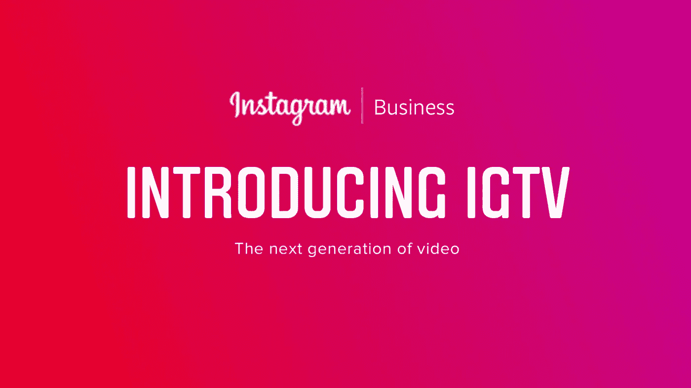
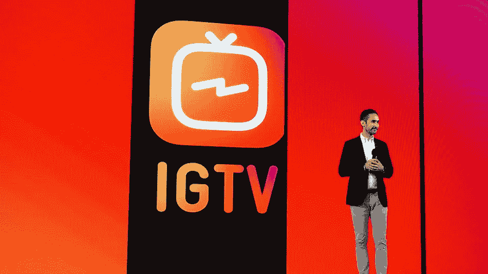
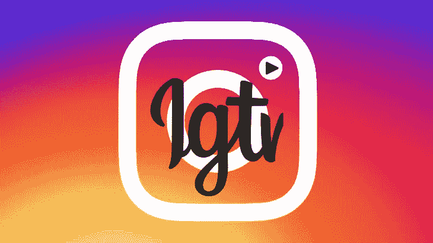

# Instagram 用 IGTV 向 Youtube 宣战！

> 原文：<https://medium.com/swlh/instagram-declares-war-on-youtube-with-igtv-554cee94d164>

## 随着新应用 IGTV 的推出，Instagram 正在为 YouTube 的视频宝座**而努力，用户可以上传超过一分钟的视频。**

**

*传闻 I nstagram 将涉足长格式视频已经有一段时间了——昨天，该公司正式宣布了这些计划，推出了面向网络创作者的新独立视频应用 IGTV 和 youtube。IG 的联合创始人凯文·系统表示，“一小时的限制只是为了启动应用程序”，因为该公司计划最终让人们不受限制地上传视频内容。*

***IGTV 是关于 1080x1920 规格的垂直视频，**虽然它有自己的应用程序(如果你不知道的话)，但你可以在主 Instagram 应用程序中获得完整的体验。在 IG 界面中，你现在可以看到一个图标，带你进入完整的垂直视频体验——同样，尽管 Instagram 开发了一个专门的 IGTV 视频应用程序，但任何不想下载它的人仍然可以通过 Instagram 主应用程序观看它们——通过应用程序顶部的一个按钮，最终消费者可以访问 IGTV 内容。这基本上意味着你可以使用 IGTV 服务，而不会疏远以 IG 为中心的观众或疏远你自己。您也可以通过故事集锦旁边的按钮从您的个人资料中访问视频。*

**

> *Instagram 想成为年轻人的电视，这是绝对没有疑问的。周三在旧金山举行的一场精心策划的新闻发布会上，这一点显而易见——然而，该公司未能具体说明有一个收入流系统来支付其创作者的报酬！*

*没错……[YouTube 为支付给内容合作伙伴的费用而苦恼](http://allthingsd.com/20130304/youtubes-show-me-the-money-problem/)，但至少它确实支付给了他们——通常是通过收入分成——这就是为什么它对今天的“创作者”有如此大的影响力 Vine 从不付钱给创作者，所以他们离开了，Vine 倒闭了。脸书希望人们为其平台制作视频，但奇怪的是，还没有建立起一个能为人们的工作持续支付报酬的系统。*

*有一些显而易见的方法可以让 IGTV 做到这一点。最有可能的情况是，Instagram 将在这些长格式视频中植入中插播或前插播视频广告，并与创作者分享收入，这与脸书的新视频栏目 Watch 采用的策略相同。它还可以推出订阅服务，这是它最近开始在脸书测试的东西，或者它甚至可以为创作者的一些作品直接付费。(脸书以前曾直接向出版商付费，但也明确表示长期计划是收入分成，而不是授权交易。)*

*如果 Instagram 试图从 YouTube 近乎垄断的视频市场上分一杯羹，它的出发点是好的。Instagram 拥有一批忠实的观众，其中相当一部分是千年用户，他们是[10 亿月活跃用户](https://www.engadget.com/2018/06/20/instagram-1-billion-users/)—[最近的一项皮尤研究](https://thenextweb.com/facebook/2018/06/01/surprise-teens-hate-facebook/)发现，使用 Instagram 的 Y 一代几乎与使用 YouTube 的 Y 一代一样多(分别为 72%和 85%)。同一项研究发现，其中 95%的人可以使用智能手机，45%的人“几乎不间断地”在线！*

**

*现在 IGTV 上的品牌内容会如何演变？我们都必须开始为 Instagram 制作高质量的类似电视的体验吗？*

> *也许吧！！*

*如果你有时间、预算和技能来组织这种类型的内容，那么是的，这对你的个人品牌和/或企业来说可能是一个很好的游戏。*

*但随着视频内容越来越长，制作价值和时间投入也在增加。虽然在 Instagram 上为一个故事制作一系列引人入胜的 10 秒以下的视频本身就是一门科学，但制作 15 分钟的视频却是一个完全不同的挑战。*

*在 IGTV 上的成功将更类似于[创建和发展一个 YouTube 频道](https://blog.bufferapp.com/create-a-youtube-channel)，而不是 Instagram 个人资料，我们将看到品牌和创作者们的大量实验，看看在这个新平台上什么行得通。*

# *我想做的是…*

****……就是写值得你花时间，能给你带来价值的东西。如果你喜欢阅读，请点击💚这样其他人也会看到它(你最多可以点击 50 次)！！****

*此外，如果你伸出手说‘嘿！’,那绝对会让我开心一天 via DM on[***insta gram***](https://www.instagram.com/iblamesid)***。真的很期待连接！*😊***

## *西德尼*

**

## *这篇文章发表在 [The Startup](https://medium.com/swlh) 上，这是 Medium 最大的创业刊物，拥有 337，320 多名读者。*

## *在这里订阅接收[我们的头条新闻](http://growthsupply.com/the-startup-newsletter/)。*

**