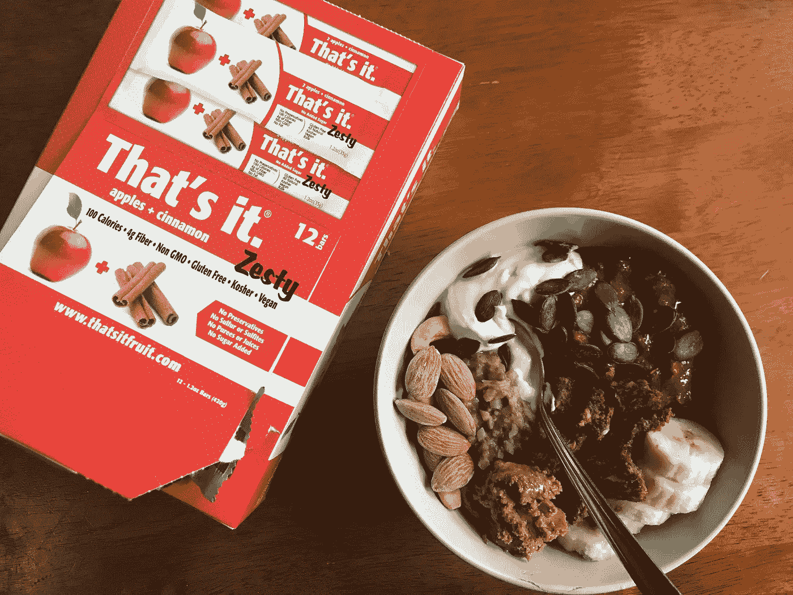

# 如何获得 11K+ Instagram 关注者(开个玩笑)

> 原文：<https://medium.com/swlh/instagram-followers-36095a4760e9>

## 你点击了点击诱饵标题吗？

From a blog post I did for an awesome brand.

前几天有人问我:“你怎么会有这么多关注者？？?"

这是一个我经常被问到的问题。无论是从滑入我的 DMs 的人还是从我认识的 IRL 的人那里。

当今世界，Instagram 影响者无处不在。很明显，今年，[他们将会比以往更有影响力](https://www.forbes.com/sites/forbesagencycouncil/2017/12/19/seven-influencer-marketing-trends-to-watch-for-in-2018/)。

拥有成千上万的追随者并不特别。拥有成千上万的追随者并不特别。见鬼，有时即使有成千上万的追随者也不是那么酷。

正如一位同事经常说的:

> “拥有大量 Instagram 粉丝就像拥有垄断资金一样。”

人们可以购买追随者。你可以赢得追随者。有时候事情就这么发生了。通常情况下，它就这样发生了。

**对企业来说，这可能会产生影响。**你见过多少次标题为“[跟随](https://blog.bufferapp.com/instagram-growth)发展社交媒体的 10 招”的 LinkedIn 帖子或 B2B 内容营销博客？

**对于普通人来说，** **可能会产生影响。有追随者感觉很好。说明有人关心你。见鬼，你甚至会觉得自己像个名人。**

对于企业家来说，这可能会产生影响。拥有追随者意味着你拥有支持你并向你推销产品的观众。

对于艺术家来说，这可能会产生影响。拥有关注者意味着你可以分享你的工作，并得到他人的欣赏。

## 但事实是:

> 拥有最忠实追随者的人不关心他们有多少追随者，也不关心他们如何获得更多追随者。

这是很容易忘记的事情。这是我这种数字驱动型、好胜型的人有时会忘记的东西。

但后来我提醒自己为什么要开 Instagram。我开始工作的原因。

## 我被驱使去创造比自己更伟大的东西。

当我第一次开始写博客时，它是为了帮助我克服我的饮食失调症。

这是为了给那些在我承认通过一篇勺子大学文章拥有一千到几千读者后联系我的人提供一个社区。

这是作为一个诚实的声音，作为一条生命线，向人们表明他们在这场战斗中并不孤独。

在那段时间里，我花了一周的时间不睡觉(不是开玩笑),思考[如何使用 Squarespace](https://blog.usesixty.com/how-to-build-a-squarespace-website-in-4-hours-5f372601332e) 和网页设计，写帖子，想名字，头脑风暴我想要我的博客是什么。

> 这是很长一段时间以来，我第一次被驱使去做一件我如此热情、如此坚定的事情，以至于睡眠和其他一切都被抛到了一边。

## 从那以后就变了。

我的博客曾经被称为“天生任性”——我认为这是对我的首字母(NC)的一个有趣的游戏，也是我一直以来一直以来(像大海一样任性；一直在变，一直在动，一直在跑，一直在退)。

但是生活发生了一些变化；我有我的起伏——复发、[比担心我的身体更重要的事情](https://spoonuniversity.com/lifestyle/why-mental-health-and-eating-disorders-are-so-connected)，一切。

## 我不再关注我的博客，我的梦想，我的激情，我的生活。

当我在旧时代生活方式的帮助下，在家人和朋友的支持下，开始再次康复时，我感到了一种新的目标感。

我开始了我的新博客([接近旧石器](http://approachingpaleo.com))和我的[同名 insta gram](https://www.instagram.com/approachingpaleo/)，在那个时代，旧石器被嘲笑为“穴居人饮食”。

作为一名运动员，人们问我如何通过训练获得足够的能量。作为一名大学生，人们问我如何负担得起这种生活方式。

## 我想证明他们是错的。

我想向他们展示，旧石器(或者总的来说，健康食品)可以是美丽、简单和美味的。

我想继续倡导饮食失调和精神疾病意识。

我想对这个世界永远诚实，因为没有人是完美的，我需要提醒自己这一点。

我想打破健康就是每天摄入 X 卡路里，只吃低脂鸡胸肉和西兰花的饮食心态。

我想用“过你最好的生活”的焦点来解决这个问题，而不是“只吃这些东西”的焦点。

## 就像我发表了我的饮食失调的帖子并找到了一个帮助我痊愈的社区一样，

> 我在 Instagram 上发现了一个社区，它帮助了我，支持了我，发展了我，挑战了我，远远超出了我的想象。

我联系过的人在我最糟糕的日子里让我微笑，在我情绪低落的时候告诉我*是的，你可以*,在我不想休息的时候鼓励我做饭和休息，并且不断地让我惊讶于他们是多么有动力、诚实、有雄心和善良。

> 这个社区对我来说比我拥有的任何数量的追随者都重要。

所以当有人问我这个问题*你怎么会有这么多 Instagram 粉丝，我怎么也能有这么多粉丝？*我告诉他们要真诚，去寻找你的部落，去追随你的激情，我不想“隐藏我的秘密”或“吐出流行语”

如果你发帖是为了获得追随者，如果你痴迷于看着你个人资料上的数字上升，如果你的帖子没有获得足够的喜欢，你的一整天就被毁了，**那么重新评估你为什么在这里。**

## 我不是说这不会发生在我身上。

有时我需要重新评估。

有时候，我感到被发布帖子的压力压垮了，为了获得 X 数量的喜欢，为了向 X 大公司证明我的价值，他们给我发了帖子的产品。

有时我想知道如果我得到免费产品并推广它，人们是否会认为我是一个出卖者。

有时候，当我因为觉得自己不适合某家公司而对其说“不”时，我会想，*我凭什么告诉这家高收入的公司我不想和他们一起工作？*

有时候我被驱使去创造内容，去帮助别人，我花了几个小时在咖啡馆或者躺在床上工作，回复评论，做研究，我问自己是否有人在读这个或者关心这个。

## 但最终，我会后退一步。

Instagram 给了我很多机会，很多人脉，很多欢乐，但说到底，这不是生活。

这是我激情的一部分，是我艺术的一部分，是我生活的一部分，但它不是一切。

*感谢阅读！* *被影响者迷住？**[***点击这里***](/@nancylinchen/life-lessons-instagram-influencer-72f86bdc8e0b) *学习我作为“Instagram 影响者”学到的 10 件事**

**

## *这个故事发表在 [The Startup](https://medium.com/swlh) 上，这是 Medium 最大的创业刊物，拥有 295，232+人关注。*

## *在这里订阅接收[我们的头条新闻](http://growthsupply.com/the-startup-newsletter/)。*

**