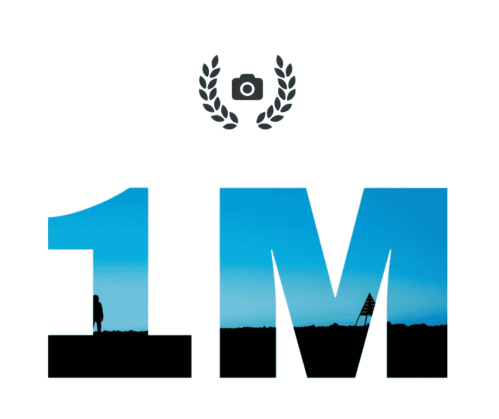
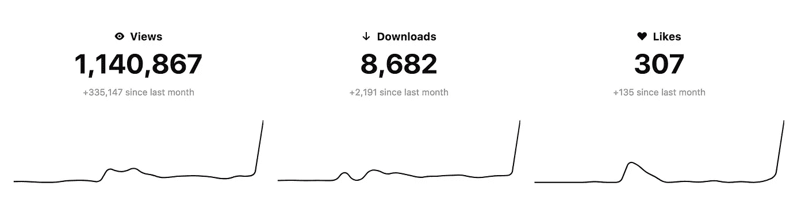
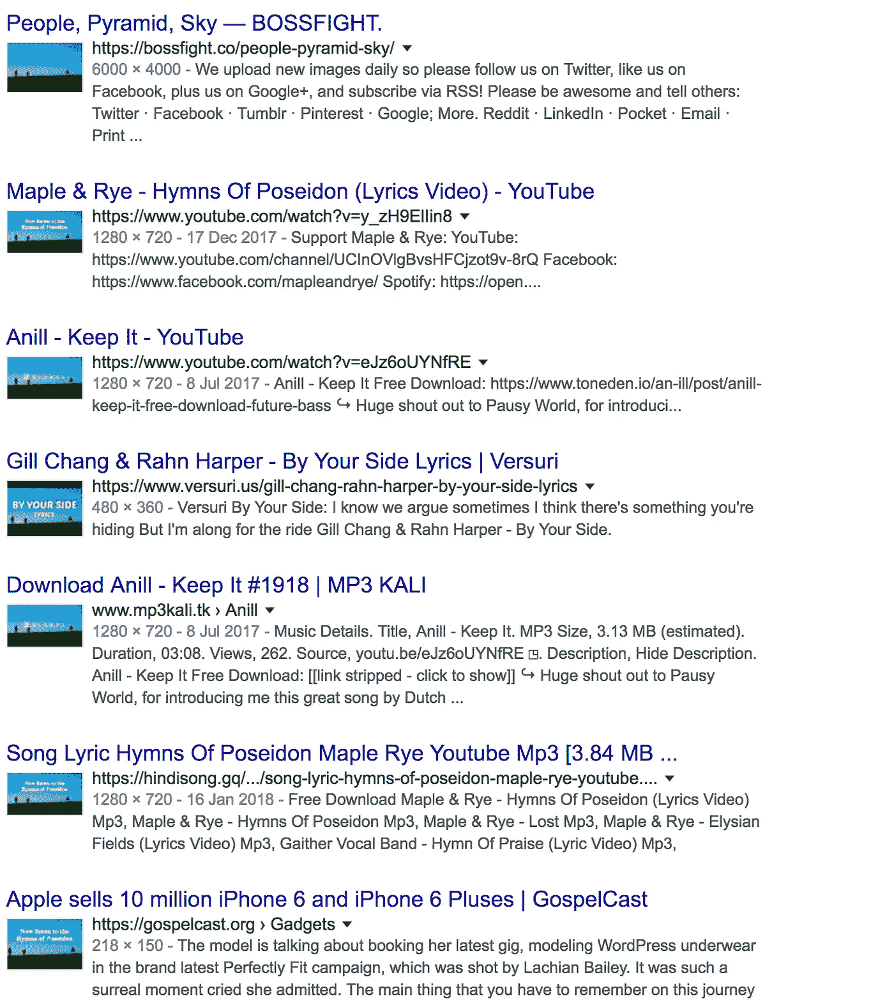
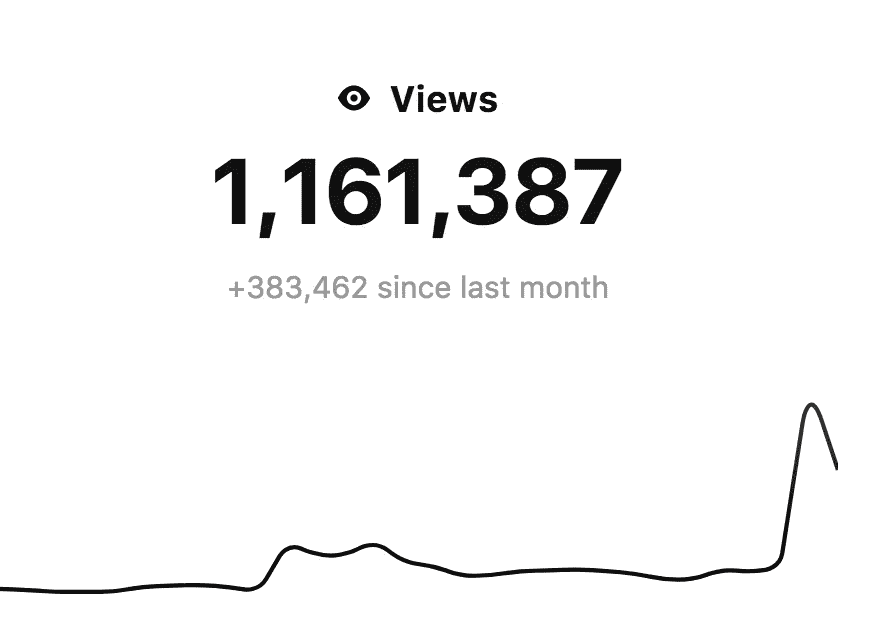

# Instagram 不再为你做了？

> 原文：<https://medium.com/swlh/instagram-not-doing-it-for-you-anymore-e60ea176f4c6>

作为一个为我的客户制作电影和摄影作品的人，我总是在寻求额外的曝光率。

过去，这方面的理想空间是 Instagram，但该平台非常拥挤，因为用户会搜索尚未开发的标签来展示他们的作品(即使该标签与他们的内容无关)。

我想和你分享我有多喜欢寻找离群平台，这些平台为用户增加了真正的价值。

如果你从事任何形式的内容营销/网站开发工作，你会知道寻找高质量图像的斗争，你可以在商业上使用，但不要花费太多。

因此，你可能听说过 Unsplash 和 Pexels。两个平台允许用户上传高分辨率图像并与社区分享，以任何方式和任何他们认为合适的地方使用，**免费**。

去年年底，我有一些没有在 Shutterstock 上出售的图片，想好好利用一下(不只是占用硬盘空间)。

输入 Unsplash。

就在这个月，我收到了一封来自 Unsplash 的电子邮件，告诉我我的浏览量已经达到了 100 万。

Email from the Unsplash team — 1 Million Views

我惊呆了。

当时我在网站上只有大约 6 张图片。这是我在 Instagram、脸书和 Twitter 上永远也不会达到的巨大的免费覆盖范围！

我现在有动力了。

在过去的几天里，我添加了更多的图片，获得了我的标签等。然后，在接下来的几天里，我的 5 张照片出现在了“新”页面上，并获得了 140，000 次浏览。

Unsplash: My Stats — +1M views, +8k downloads, +300 likes

更好的是，在互联网上的某个地方有超过 8000 张我的图片，因为人们已经下载了它们，并可能在他们的内容中使用它们(在某个地方)。

一个快速的谷歌图片搜索之后，我的图片就出现在了网上。

Google Image Search

它可能是免版税的，信用是可选的，但你有 1，140，867 次机会让人们看到我的作品和我网站的 URL。

为了说明规模，自从我加倍努力积极分享我的作品以来，上个月我又看到了 335，147 次浏览。

如果你想亲眼看看，都在这里:

【https://unsplash.com/@redvers 号

## 更新

自从写了这个帖子，24 小时内，浏览量又增加了 **2 万**。

根据我在数字和印刷领域的经验，要在这么短的时间内把你的作品展示给这么多人，你必须付很多钱。

是的，他们没有针对性，但作为观众，他们是一个寻找高质量摄影和参与你的内容的利基群体。你在 Instagram 上是看不到的。

## 这篇文章发表在 [The Startup](https://medium.com/swlh) 上，这是 Medium 最大的创业刊物，有 290，182+人关注。

## 在这里订阅接收[我们的头条新闻](http://growthsupply.com/the-startup-newsletter/)。

