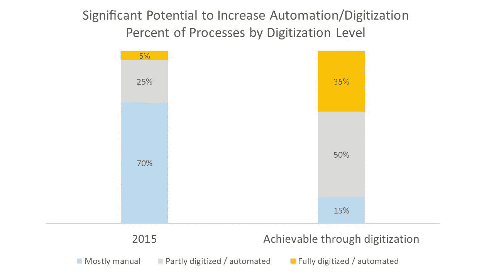
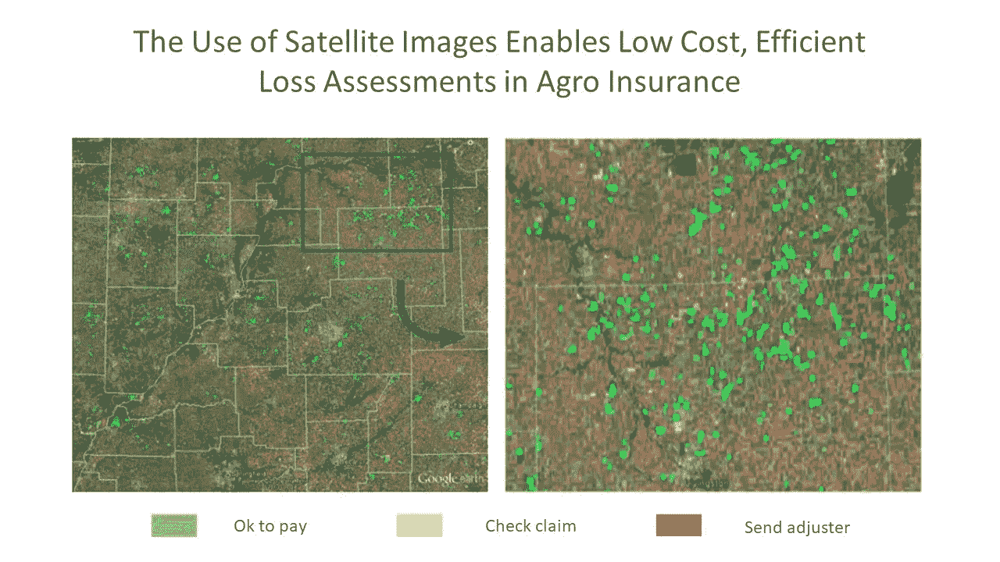
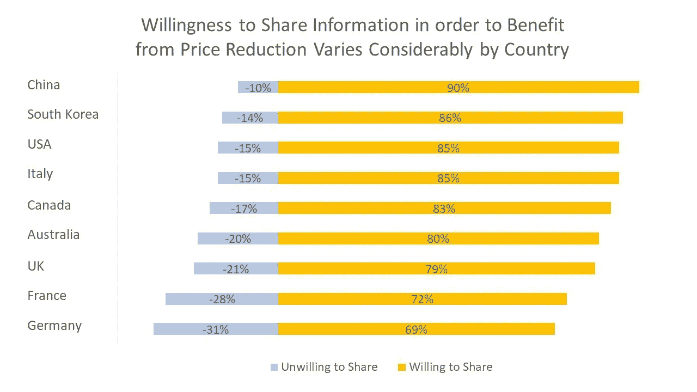
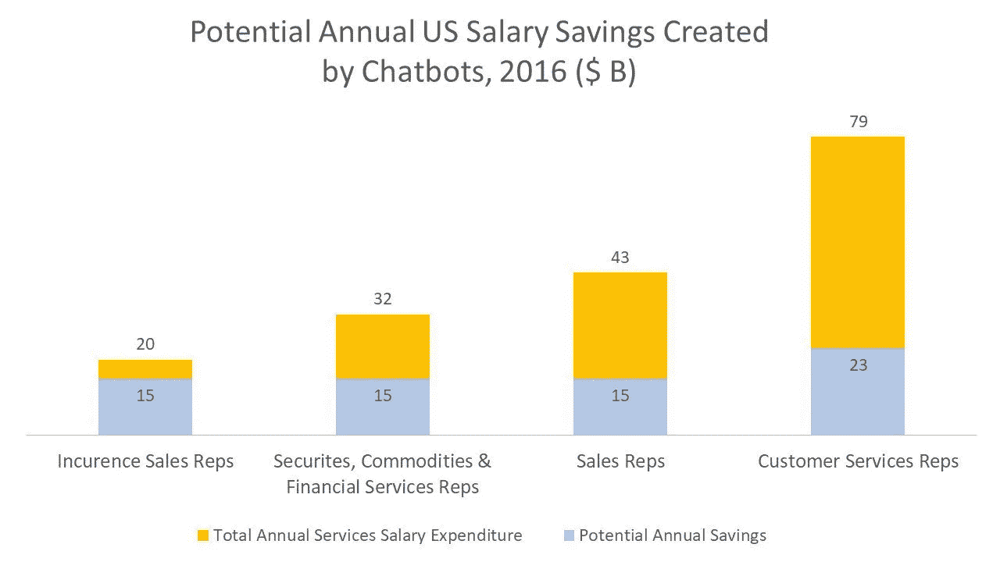

# 保险技术:用机器学习、API、区块链和远程信息处理改造传统保险公司的 11 个颠覆性想法

> 原文：<https://medium.com/swlh/insurance-technology-11-disruptive-ideas-to-transform-traditional-insurance-company-with-machine-725c29b1725f>

你有没有试过查询自己的保险理赔状态？通常需要打几个电话，发几封电子邮件，甚至拜访一个代理人来获得索赔状态的详细信息。缺乏网站就等于降低客户满意度。如今，近 61%的客户更喜欢用数字工具监控他们的应用程序状态。

虽然一些保险公司由于颠覆性数字化而做出了重大修改(我们已经在我们的白皮书中讨论了这个主题,),但大多数公司都落在了后面。现代保险技术机构和传统机构之间的鸿沟正在加深。由[天堂生活](https://havenlife.com/)引起的混乱就是一个最好的例子。该公司通过其网站上的在线调查问卷，将处理申请的时间从通常的 1-2 周缩短到 20 分钟。

2016 年，保险公司在这方面的支出接近 1873 亿美元，占整个[金融服务](https://www.altexsoft.com/finance/)支出的 25.7%。然而，总数仍然很低，遗留系统的复杂性只是减缓了创新。[据麦肯锡](http://www.mckinsey.com/~/media/McKinsey/dotcom/client_service/Financial%20Services/Latest%20thinking/%20Insurance/Making_of_a_digital_insurer_2015.ashx)称，十分之九的保险公司认为遗留软件和基础设施是数字化的障碍。因此，这个在美国价值 1.2 万亿美元的大行业迫切需要改变商业发展的方式。很明显，让保险再次伟大的使命在今天严重依赖于技术的采用。

全球 IQX 公司总裁兼创始人迈克·德瓦尔说:

> "*核心遗留系统的现代化、新的保险交易所和不断变化的业务模式(平台和点对点)定义了这一年。随着运营商采用数字战略，他们将继续这样做……应对新创新的冲击，并了解如何用它来创造竞争优势——非常快——可能会令人不安。然而，这些破坏性力量应被视为刺激增长和新保险产品所需的剧烈变化的必要催化剂*。

垂直玩家寻找通往数字时代的捷径。一些公司通过支持 insurtech 初创公司或建立创新实验室来进行内部变革，而其他公司只是在犹豫。首先应该做出什么样的改变？这些是需要解决的主要问题:

1.  保险公司的内部流程往往过于复杂。重复的业务操作如此之多，以至于仅在美国就有近[100 万份保险工作可以实现自动化](https://techcrunch.com/2016/04/16/the-new-world-insurance-agent/)。[麦肯锡声称](http://www.mckinsey.com/~/media/McKinsey/dotcom/client_service/Financial%20Services/Latest%20thinking/%20Insurance/Making_of_a_digital_insurer_2015.ashx)自动化和数字化定义了该行业的主要潜力。这意味着，通过自动化高达 30%的操作，您可以削减约 40%的成本。
2.  被保险人对他们的服务提供商不满意。摩根士丹利和波士顿咨询公司最近的研究声称，保险公司倾向于提供糟糕的客户体验。全球约 60%的保险客户对他们的服务提供商不满意，近 50%的保险客户考虑转向更新的模式。
3.  年轻的神童更喜欢加入科技、咨询或其他金融公司，而不是保险业。根据埃森哲的调查，只有 2%的美国大学校友计划进入这个行业。因此，公司经常没有足够的技术熟练的员工来跟踪变化，更不用说推动变化了。

*Source: McKinsey*

这些就是问题。如何接近他们？让我们来讨论将引领传统保险机构向创新型保险技术公司转型的 7 个机会。

# 具有机器学习功能的内部工作流自动化

文书工作、手写通知、跟进和承保通常都很无聊。自动化使公司能够降低日常工作的成本，并让一些全职员工专注于更具创造性的任务。削减成本的一个有说服力的例子是 Fukoku Mutual Life Insurance 的自动赔付计算。该公司用人工智能取代了 34 名员工，现在预计在完成系统集成后，生产率将提高 30%。据估计，该公司在人工智能使用的第一年将节省约 125 万美元。

[保险商店](http://www.insuranceshopllc.com/)的营销助理 Mitchell Sharp 说:

> *“该保险公司对我们自己的流程进行了工作流审查，并正在实施一个工作流自动化流程，我们估计该流程将提高 40%的效率，这是一个巨大的进步，将使我们的客户服务部门有更多的时间关注我们客户的真正需求，并减少处理工作。”*

问题的另一面是入境信件和文件。每天，所有金融机构都要处理和收集成千上万的纸质档案。这不是存储、处理和交换信息的最佳方式。它也无助于拯救环境。

如果文件被数字化、分析并存储在云中，则在信息不一致或有错误的情况下，可以自动审查并拒绝文档，这使得保险员工可以只处理一致和正确的信息。

在纸质档案中积了几十年灰尘的客户数据，不再是损益表中的支出项目。如果您应用图像和文本识别算法，这些将成为有价值的资产，讲述关于您的客户的深刻故事。

# 保险中的机器学习:索赔处理的自动化

人工智能保险软件也重塑了索赔处理。问问你自己，你的机构做出索赔决定需要多长时间。有许多不同范围的问题:断指、重大车祸、豪华别墅的火灾，或者大公司客户的重大土地索赔。假设他们的美国土地银行受到了干旱的影响。全国有数千英亩的土地种满了庄稼。员工收集和处理支出决策所需的所有数据需要多长时间？通过使用人工智能，有一个很好的方法来降低这类项目的成本。机器学习算法可以使用卫星图像或无人机探索田野来计算损害。它将消除人为因素，并大幅削减时间和成本。

*Source: Scor*

机器学习和移动技术的结合也改变了索赔报告。国营农场用一个袖珍代理程序武装客户。客户可以发送车辆图像，然后提交索赔，而无需浪费时间处理纸质文档或大型 web 表单。

# 在数字保险时代，重新定义传统的理赔和保单管理方式

除了人工智能驱动的自动化，索赔管理还受到更广泛的软件解决方案的影响。

索赔管理是任何保险公司的关键业务流程，从索赔登记开始，到向被保险方付款结束。索赔管理软件减少了人工工作流程和大量人与人之间的交互。客户需要更少的时间来申请并顺利进行索赔处理。从保险公司的角度来看，该公司通过自动化降低了劳动力成本。

这是现代工业标准的一个例子。假设一家保险公司在医疗保健领域开展业务。

1.  索赔管理软件自动化了保险和医疗保健提供商系统之间的信息交换。
2.  如果该公司处理许多小型私人业务，这些业务仍然使用纸质文档，那么通过数字化文档的图像识别算法可以简化导入过程。
3.  系统根据设定的政策计算每项索赔的承保范围和支付金额。
4.  系统处理索赔并将其发送到欺诈检测模块。
5.  一旦索赔被批准，被保险人就会收到他们的付款。

策略管理软件必须是系统的集成部分，以便为业务用户提供管理对账、定制业务逻辑、管理策略权限等工具。

SAP、Oracle、Patra Corp、GuideWire、Claim Kit 和 Insly 开发的软件满足了保险行业对索赔和保单管理工具的标准化需求。然而，创新的前沿是保险科技初创公司和技术咨询公司，它们利用人工智能、区块链和物联网技术的力量。

# 物联网和社交媒体将通过个性化产品改变保险定价

老式的风险评估方式是依赖非个人化的数据集。但是今天，终端设备和社交媒体可以提供大量更多的个人数据。这种方法可以帮助保险公司和客户——消费者获得更便宜或更好的保险和高度个性化的服务，而企业获得更准确的风险评估、稳定的利润和满意的客户。最近摩根士丹利和波士顿咨询公司的研究表明，这种模式是可行的——客户愿意分享个人数据以获得更便宜的风险保障。

*Source: Morgan Stanley, BCG*

保险商可以考虑广泛的高度个性化的记录。互联设备和可穿戴设备可以深入了解客户的身体状况，如血压、体温和脉搏。现在，保险公司甚至可以探索客户的生活方式，例如每天的步数，或者某人刷牙的频率和时间。来自脸书、推特或其他网络的社交媒体数据也可能是有用的。它通过应用机器学习或其他预测分析技术来揭示客户的风险承受能力。此外，所有这些数据都是实时可用的，这为保险公司提供了额外的价值。

[光束](https://beam.dental/)是另一个相关的例子。该公司利用物联网技术提供牙科保险。智能牙刷可以追踪顾客对牙齿的护理程度。然后，该公司根据刷牙数据提供个性化的保险计划。该公司声称，与竞争对手相比，它可以提供低 25%的价格。

# 远程信息处理保险——改善汽车风险管理的新途径

远程信息处理保险是一组创新的汽车保险产品，其工作方式类似于黑匣子。远程信息处理盒被安装在汽车里。该设备包括 GPS 系统，运动传感器，SIM 卡，并有分析软件。远程信息盒跟踪速度、位置、时间、碰撞事故、驾驶距离、刹车和其他驾驶数据。

首先，该系统处理收集的信息，并通过移动互联网将其传输到保险公司进行进一步分析。然后，驾驶分析被添加到客户个人账户。

通过跟踪司机的行为，保险公司可以制定量身定制的保险计划，并改善风险管理。例如，一家公司可以提高不负责任的司机的收费，奖励安全驾驶的顾客，并在发生车祸时通知警方。远程信息处理的采用允许利用这样的颠覆性商业模式，如:

*   基于使用的保险(UBI)
*   现购现付(PAYD)
*   支付驾驶费用

已经有成功的使用案例。一家英国电信公司 O2 推出了一款特殊的汽车保险产品,支持这样一个理念:驾驶越安全，价格越便宜。驾驶习惯由一种特殊的设备跟踪，用户可以在每次旅程后在移动应用程序上跟踪他们的分数。O2 应用程序还通过提供改善驾驶和降低风险的提示来帮助客户。

# 颠覆性商业模式——P2P 保险

点对点(P2P)保险是最具颠覆性的商业模式之一，由于有可用的技术基础，它正迅速受到欢迎。这种模式要求人们同意通过创建一个由他们的溢价股份组成的单一资金池来覆盖类似的风险。P2P 模式不需要传统的中介——保险公司。

 [## 分布式账本和区块链:技术在金融行业的应用

### 几年来，围绕区块链技术的炒作一直没有平息。一步一步，社会…

www.altexsoft.com](https://www.altexsoft.com/blog/business/distributed-ledger-and-blockchain-applications-of-technology-in-financial-industry/) 

在每个覆盖期结束时，可用资金将被退还。这样，客户可以最大限度地降低成本，减少索赔冲突。然而，该模型有几个缺点，如欺诈敏感性、道德方面、难以达成共识以及同行之间缺乏信任。

P2P 保险已经走过了三个主要的里程碑:

1.  **保险分销**。例如， [Friendsurance](https://www.friendsurance.com/) 是一家初创公司，它通过一款手机应用将小群体(10-16 名被保险人)联系起来。如果发生保险事故，被保险人通过友邦保险提出索赔并获得保险。一旦合同到期，客户就可以从资金池中的可用资金中获得预先约定的返现。友谊保险专注于与财产相关的小风险(例如，房子的窗户被打破)。
2.  保险承运人。P2P 保险载体的一个很好的例子就是[保险](https://besurance.ca/)。该公司是一个保险技术风险分担平台，根据被保险人的风险相似性对他们进行分组。这一过程由精算软件处理，该软件为各组提供适当的报价。申请由机构群体成员评估和批准。
3.  **自治。**自治保险技术组织的一个例子是 [Teambrella](https://teambrella.com/) 。Teambreala 提供一个总部位于区块链的保险平台。这是一个普通的 P2P 网络，但是由[区块链](https://www.altexsoft.com/blog/business/distributed-ledger-and-blockchain-applications-of-technology-in-financial-industry/)驱动。对于索赔和政策管理，该公司使用以太坊智能合同。它们允许透明度和自我监管。参与者讨论每项索赔并投票，以就索赔范围达成共识。如果索赔获得批准，每个参与者将与受损的同伴分享一部分保费。

# 保险区块链颠覆再保险运营

普华永道称，区块链的实施为全球再保险公司带来了 50-100 亿美元的成本节约机会。再保险的本质接近于链式结构。难怪它被公认为金融科技中仅次于支付的第二大分布式账本用例。对利益相关者的主要好处是减少验证和确认时间，消除错误和最小化声誉风险。通过[使用区块链](http://www.mckinsey.com/~/media/McKinsey/Industries/Financial%20Services/Our%20Insights/Blockchain%20in%20insurance%20opportunity%20or%20threat/Blockchain-in-insurance-opportunity-or-threat.ashx)，再保险人将不必与保险人交互来获取客户提供的数据。例如，您需要验证一份健康风险再保险合同的几个保险事件。如果各方都通过智能合同联系在一起，再保险人将能够直接访问被保险人的健康数据。

另一个好主意是[防止再保险人的损失进入](http://www.longfinance.net/Publications/LongFinance_How_Blockchain_Technology_Might_Transform_Wholesale_Insurance_July2016.pdf)。这里的关键问题是，由于复杂的文件处理，索赔处理的不同阶段的损失可变性。区块链通过记录每个合同的损失估计历史来解决这个问题。它支持更好的责任跟踪和差异解决。

# 保险公司的聊天机器人——对话界面为虚拟代理人和经纪人提供动力

每年，保险代理人都要花费数千小时来支持客户的决策过程，提供标准的按需信息或报告。聊天机器人、报告工具、移动技术和语音识别算法可以轻松地自动化这些繁琐的操作。聊天机器人可以像大型客户服务中心一样有效，并大幅削减客户支持和销售成本。

*Source: McKinsey*

一些美国保险公司已经装备了这种技术。在加拿大，总部位于安大略省[的 Excalibur Insurance](https://www.agencynation.com/insurance-facebook-chatbot/) 已经使用人工智能机器人来实现客户互动的自动化。保险公司不仅可以通过网站或脸书全天候提供服务，而且该系统还可以吸引新客户、处理索赔报告和服务请求。这是电话的一个很好的替代方式，因为 70%的来电者在等待客服回复时会挂断电话。此外，智能系统可以发送续订通知，向代理分配任务，并通过向客户发送友好的问候和特别优惠来建立友好的关系，以保持他们的参与。

# 保险 API 是通向创新的捷径

过度监管、陈旧的商业模式和技术人才的缺乏减缓了行业创新，这对客户体验是有害的。客户需要灵活和创新的体验。[根据 IBM](https://www.ibm.com/industries/insurance/resources/connected-insurers-paper/) 的数据，41%的被保险人放弃他们的保险公司而选择新的，因为供应商不想根据客户需求调整服务。

保险 API(应用程序编程接口)的使用解决了保险公司缺乏灵活性的问题，因为他们可以与第三方共享信息和服务。公司有机会提出更好的客户体验，创造新的数字产品，增加销售额，并尝试颠覆性的商业模式。

例如，拥有自己 API 的保险公司可以进入在线旅游保险市场，并通过与在线旅行社(如 Booking.com 或 Travelocity 等在线旅行社)的[合作，直接从合作伙伴的网站向旅行者交叉销售服务，从而促进销售。](https://www.altexsoft.com/blog/engineering/travel-and-booking-apis-for-online-travel-and-tourism-service-providers/)

最重要的是，保险公司使用第三方 API 来检查客户数据，以防止滥用和欺诈。

以下是保险技术人员可以利用的保险 API 和 API 的一些示例:

**安盛保险。**2017 年，安盛保险推出了自己的 API，帮助该公司利用在亚洲地区开创的保险即服务战略。 [AXA API](https://www.axa.com.sg/insurance-api) 轻松集成电子商务网站和应用程序。该技术提供了对保险服务的实时访问，包括报价、保单管理以及家庭、旅游和汽车领域的保险产品。该公司计划在不久的将来将他们的 API 引入健康和人寿保险领域。

**柠檬水公共宣传短片。** [柠檬水公共 API](https://www.lemonade.com/api) 是一家财产保险公司柠檬水开发的 API。该 API 允许与各种数字产品(iOS/Android 应用程序和网站)集成。 [Lemonade 公共 API](https://www.prnewswire.com/news-releases/lemonade-launches-insurance-api-650210233.html) 为开发者提供产品、报价、策略创建和支付功能。该 API 还提出了一个可定制的聊天机器人界面。

**NAIC 登记处。** [NAIC 注册中心](https://eapps.naic.org/NaicRegistry/#/home)是一个公共保险 API，它可以自动向监管机构进行标准报告，允许在[在线欺诈报告系统](https://eapps.naic.org/ofrs/)中提取和存储数据。

# 保险欺诈检测软件将行业带到新的高度

欺诈是保险业的一大灾难。根据反保险欺诈联盟的数据，美国航空公司每年至少损失 800 亿美元。平均而言，它占北美保险公司索赔成本的 5-10%。云和移动技术可以为保险代理人提供实时信息，以处理重复索赔、夸大索赔、虚假诊断、虚假家属、互斥诊断、被保险人数据不一致、超额赔付和内部员工欺诈。例如，一个客户两次为失去的右眼索赔，或试图通过伪造文件改变日期从同一场财产火灾中恢复。系统会将索赔数据与数据库进行比较，识别欺诈行为。这将通过提高操作速度、提供更高的准确性以及消除利益相关方的影响来降低成本。

例如， [Shift Technology](https://www.shift-technology.com/) 向欺诈分析师提供端到端的保险服务。Shift 技术解决方案超越了基于概率分析的传统索赔评分。此外，它还为业务用户提供可操作的分析，指出索赔看起来可疑的原因。其 SaaS 交付模式实现了低实施成本和与现有运营的轻松连接。据 Shift Technology 称，他们的软件工具比市场平均水平高出 250%的欺诈识别率。

# 保险市场将产品分销带入在线空间

客户必须打电话或拜访保险代理人才能拿到保单的日子已经一去不复返了。网络让人们更加了解市场上的产品，今天任何人都可以很容易地比较产品，查看评价，或者找到符合个人需求的特殊计划。像[insuraify](https://insurify.com/)、 [CoverHound](https://coverhound.com/) 和 [Friendsurance](http://www.friendsurance.com/) 这样的保险购物平台正在积极地重新定义分销模式。虽然客户可以更具体地了解他们在寻找什么，但如果服务提供商满足需求，他们就会获得更多的可见性。这些市场帮助保险公司削减分销成本，同时带来更多目标明确的销售线索。

PetInsuranceQuotes.com 公司的创始人尼克·布劳恩说:

> "*我们看到的最大变化是移动设备正在如何改变比较购物。宠物保险市场变得越来越受欢迎。这一趋势将迫使提供商创建在线报价、服务和 API，以便他们能够接触和服务这些新受众*。”

# 保险行业应该期待什么？

数字技术给保险业带来了几个颠覆性的趋势，如个性化、向平台经济的转变、自动化以及基于实时而非历史的评估。影响最大的功能是什么？

1.  **削减成本。**与传统运营商相比，数字保险公司拥有强大的竞争优势。[根据 BCG](https://www.bcg.com/industries/insurance/insights.aspx) 的说法，颠覆性的技术变革可以削减高达 10%的保费成本和 8%的索赔费用。转向网络平台生态系统可以削减分销成本，并通过社交媒体、电子邮件、移动应用程序等与客户进行更好的沟通。
2.  **更准确的风险评估。**数字业务模式能够实现更好的风险评估，有时甚至有助于预防驾驶辅助或健康和生活方式监控方面的保险事故。
3.  **更好的客户体验。**使用移动应用程序和社交网络集成有助于更好地了解客户，并确保全天候可用性。
4.  **从被动决策转变为主动决策。**保险是一项数据驱动的业务，应该考虑许多关于客户的因素，并且非常依赖统计数据。然而，该行业仍然利用历史数据而不是实时数据。各种可穿戴设备和传感器尚未发挥其数据流和超个性化的潜力。
5.  **扩大投资组合。**广泛的数据记录允许保险公司承保非常具体的风险，并与新的微观细分市场合作。它还会重新考虑意外产品的性质(例如，将它们变成按使用付费的产品)。
6.  **保险公司变得更加远离骗局。**API 和 mobile 缩短了欺诈检测所需的时间，并使评估流程更加严格。

# 总结:值得实施的保险应用理念

该行业对技术人才的需求很大，在创新过程中需要支持或合作伙伴。移动和无处不在的自动化已经成为保险业的现实。以下是我们之前讨论过的关于[企业移动性](https://www.altexsoft.com/blog/cloud/five-components-of-enterprise-mobility-strategy/)的几点考虑。保险应用和代理管理软件让精通数字技术的客户能够更轻松顺畅地处理索赔和沟通。

 [## 企业移动性管理:模型和解决方案

### 你是那种在走进办公室打开电脑之前就开始工作的人吗？我们大多数人都会…

www.altexsoft.com](https://www.altexsoft.com/blog/cloud/enterprise-mobility-management-models-and-solutions/) 

人工智能、物联网、区块链、API、可穿戴设备和远程信息处理是近期的新兴技术趋势，应该加以考虑，以保持竞争优势。新技术使保险公司能够建立更好的客户体验并提高运营效率。

*   **可穿戴设备**和**远程信息处理**跟踪客户行为，实现风险防范，并开辟新商业模式的道路。
*   **AI insurance** 解决方案允许公司为客户提供个性化报价，集成机器人顾问，并改进欺诈检测。
*   **区块链**有助于改善工作流程治理，确保透明度。
*   保险 API 简化信息交换，通过在线渠道促进产品分销，并最终让保险公司推荐更通用的产品。

保险业正在向数字化转型。客户需求变化和创新产品，这个因素是他们在 2018 年更换一个载体的强大原因。Insurtechs、数字化保险公司和科技巨头将把落后者挤出市场。

*最初发表于 AltexSoft 的博客:“* [保险技术:用机器学习、API、区块链和远程信息处理技术改造传统保险公司的 11 个颠覆性想法](https://www.altexsoft.com/blog/finance/insurance-technology-7-disruptive-ideas-to-transform-traditional-insurance-company/)

## 这篇文章发表在[《创业](https://medium.com/swlh)》上，这是 Medium 最大的创业刊物，有 340，876+人关注。

## 在这里订阅接收[我们的头条新闻](http://growthsupply.com/the-startup-newsletter/)。

