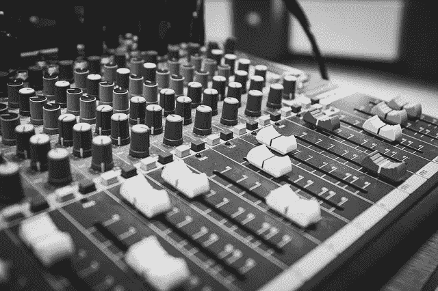

# 整合看似相反的个性特征，以获得高绩效和成功

> 原文：<https://medium.com/swlh/integrating-seemingly-opposite-personality-traits-for-high-performance-and-success-5638933a8240>

[freestocks-photos/pixabay](https://pixabay.com/en/audio-black-and-white-black-white-2941713/)

上周六，我发表了一篇关于“存在”目标的[帖子](https://ideavisionaction.com/personal-development/determine-and-cultivate-the-personality-traits-that-serve-your-goals/)。这些是你为了实现“做”和“拥有”的目标而培养的人格特质。

在同一篇文章中，我分享了五大性格特征，本杰明·富兰克林的 13 种美德，以及 600 多种主要性格特征。这些列表会帮助你列出你自己需要培养的性格特征。

今天，我将讨论人格特质的两种方法，二元性和整合性。我们默认的方法是二元性。学习和使用整合将大大提高我们在“存在”目标上的成功。

让我们来讨论一下这两种方法，看看它们对我们性格的影响。

# 二元性

我们默认的思维是基于二元性的。在这种模式中，我们从对立面看世界。

*   白纸黑字
*   光明与黑暗
*   好与坏

如果我们看看五大性格特征，我们会在每一类中看到两个对立面。

*   开放:好奇与谨慎
*   责任心:有条理还是粗心大意
*   外向:内向与外向
*   宜人性:友好与挑战
*   神经质:紧张与自信

[研究表明，认真、外向、不随和的人在事业上更成功。](https://hbr.org/2018/04/these-3-personality-traits-affect-what-you-earn-but-only-after-age-40)

一个普通的职业顾问会告诉你要有责任心和外向，不要那么随和。

他们会认为你可以是有条理的或粗心的，内向的或外向的，友好的或有挑战性的。

世界比这更微妙。

# 综合

在集成方法中，我们定义相互独立的质量。我们不会把它们描述为彼此的对立面。

解释融合最好的类比就是音乐。您可以将音调定义为低音或高音。你可能认为它们是彼此对立的。实际上，它们是不同频率的音调。

你认为一首歌是低音还是高音？你不会的。一首好的歌曲包括各种频率的声音。在整首歌曲中，每个频率范围的音量都不同。一首歌是一段时间内各种音量和频率的组合。

现在，让我们用同样的类比来分析人格特质。

# 宜人性

宜人性是解释整合的一个很好的例子。

假设你很友好，富有同情心，没有挑战性和超然。在这种情况下，你的方法就像一首只有高音而没有低音的歌曲。你愿意听这样一首歌吗？我不会。

如果你去找普通的高管教练，他们会告诉你不要再友好和富有同情心，要变得富有挑战性和超然。那会是什么样的歌？全低音，没有高音？谁会喜欢呢？

艺术就是根据需要在组合中加入挑战和超然的特质。如果你是一名经理，你需要偶尔超然一下，做出解雇某人的决定。这并不意味着当你与相关的人分享这个决定时，你不能友好和富有同情心。

友好并不意味着当某人犯错时不去挑战他。

# 外翻

一个有挑战性的例子是外向性。

当我在大学的时候，我希望在我们的项目团队中有一个由内向者和外向者组成的团队。内向的人会开发项目，外向的人会做必要的陈述。

公司也采用同样的方法。一方面，你有内向的工程师，另一方面，外向的销售人员。作为一家公司，你需要这两个群体都成功。

如果你能综合这两种特质，并在需要的时候使用它们，你将在职业生涯中不可阻挡。

# 神经质

综合神经质是一个很难把握的例子。

*   谁愿意紧张？
*   紧张会增加什么样的价值？
*   紧张不正是自信的对立面吗？

为了理解这一点，想想你典型的大学班级。你有一位教授，他一点也不紧张，因为他们对这个话题了如指掌，而且之前已经给过同样的课十几次了。

这样一堂课结束了，你会有什么感觉？以前，我会感到无聊和困倦，因为课堂上没有一点紧张气氛。

相比之下，想象一个学生就他们的学期项目做报告。他们会因为这次演讲而失败或通过。在这样的表演中你会有什么感觉？会很激烈，不是吗？

> 在生活中的某些时候，我们需要紧张。

一周 7 天 24 小时都紧张可能有点过分，但是在关键时刻，比如演讲或者开会，紧张会增加我们身体产生的能量。我们有责任建设性地引导这种能量。

紧张不是自信的对立面。这是一种身体状态，当你的身体超负荷运转并产生大量能量时。你可以既自信又紧张。

> **在关键时刻，你需要既自信又紧张。**

你需要相信你能成功应对眼前的挑战，同时，你需要身体能产生的所有能量。

下次你感到紧张时，不要试图冷静下来。相反，专注于增加你的自信，把你身体产生的能量集中在手头的任务上。

# 结论

我们倾向于从反面看待世界。当我们培养自己想要的性格特征时，这种对现实的认知对我们没有帮助。

整合是比二元更好的方法。在这种方法中，我们培养想要的特征，而不试图抑制我们现有的特征。

我们认为我们的个性是多种特质的组合。我们在必要的时候使用每一种特性，而不是试图压制其他特性。

因此，我们培养了在各种情况下都能表现出色的坚强个性，成功也就不可避免了。

[***注册我的电子邮件简讯***](https://ideavisionaction.com/email-newsletter/) ***每周都会收到我关于个人发展和生活经验的最新帖子。***

## 这篇文章发表在 [The Startup](https://medium.com/swlh) 上，这是 Medium 最大的创业刊物，有 331，853+人关注。

## 在此订阅接收[我们的头条新闻](http://growthsupply.com/the-startup-newsletter/)。

