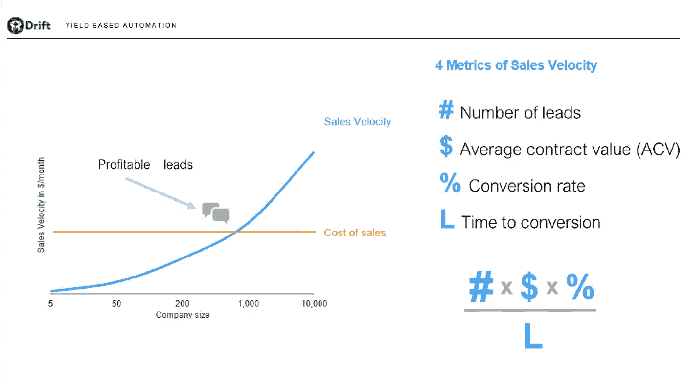
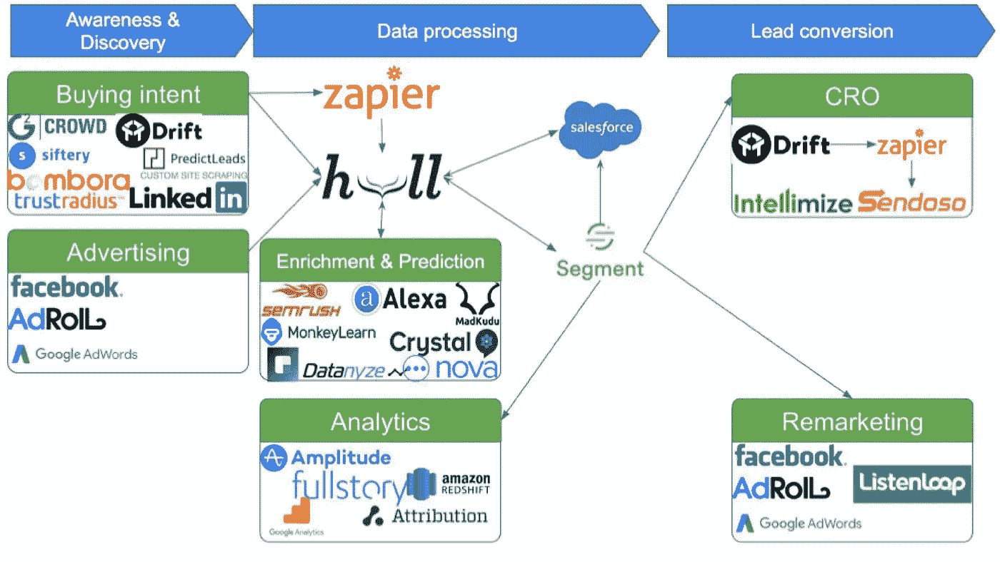

# 面向 B2B 营销的意图驱动自动化

> 原文：<https://medium.com/swlh/intent-driven-automation-for-b2b-marketing-88bd72908e4a>

在 2018 年 、[、 *Guillaume "G" Cabane* 、](https://twitter.com/guillaumecabane)、**、**Growth at Drift 副总裁的这一环节中，他介绍了 B2B 营销如何演变为一种超个性化的体验，并分享了 Drift 让人工智能接管营销世界的邪恶计划。

以下是 G 的主题演讲摘要。欲了解更多#GHConf18 会议摘要和增长战略资源，请访问 [**火箭战略**](https://www.rocket-strategy.com/) **。**

“‘喷撒祈祷’的日子已经过去了。”

多年来，营销人员一直在使用“喷洒和祈祷”策略，因为他们不太了解自己的联系人。许多营销人员竭尽全力降低每条线索的成本，而不是专注于优化每条线索的正确体验。

2017 年改变的是知识。我们从完全不了解我们的客户发展到了解他们并能够做出基本的预测。但是准确的预测需要数据。

以 2017 年某聊天活动的销售速度为例。聊天是有人力成本的。有些线索是好的，有些是坏的。因此，营销人员试图通过自动化来降低成本。但是这种自动化往往会导致糟糕的用户体验。

自动化可以产生更好的 B2B 营销体验，但要做到这一点，你需要更多地了解你的线索，这样你就可以预测他们的销售速度和未来价值。

**销售速度=(销售线索数量 x 平均合同价值 x 转化率)除以转化时间。**

**“现在可以知道每个来源匿名流量的质量，并采取行动！”**

2017 年，Drift 希望找到除了通过 lead 表单询问之外的获取网站访客数据的方法。通过使用 IP 地址跟踪和各种预测分析软件平台，Drift 的营销团队能够建立一个预测访问者意图的模型，仅用 16%的线索赢得 79%的机会。

G 的团队最初如何利用这些预测数据平台:

*   获取访问者的 IP 地址
*   找到他们的公司域名(Clearbit Reveal)
*   获得预测分数(MadKudu)
*   向潜在客户发送电子邮件
*   通过广告瞄准高价值的潜在客户
*   通过仅针对高价值销售线索的实时销售聊天，在网站上积极吸引用户(漂移)
*   根据您对潜在客户的了解，更改网站上显示的内容(Intellimize)

**发现未表达的意图:**

在看到如此有限的数据在准确预测领先分数方面取得如此大的成功后，Drift 的团队决定进一步挖掘他们可以找到的其他类型的数据，以帮助预测个人用户行为，从而进一步优化他们的 B2B 营销策略。

以下是他们的发现:

*   **Datanyze** 让您获取 SDK 安装历史记录，以锁定竞争对手的客户。
*   **Product Hunt** 有一个 API，可以让你拉起任何帖子上的所有投票，并返回 Twitter 句柄。
*   [**G2 Crowd**](https://www.g2crowd.com/) ，一个商业软件的评论网站，有一个高级订阅，每当你的标志显示在他们的任何页面(类别页面，竞争对手页面等)上，就给你客户 IP 流量数据。).
*   Bombora 与数千家商业内容出版商建立了合作关系。他们收集和汇总 IP 地址访问哪些内容主题的数据。他们甚至可以对您的客户列表进行历史分析，让您了解客户在转化之前的 12 个月内阅读了哪些主题，从而创建主题路径模型。
*   Apptopia 提供移动应用数据，包括 SDK 安装和收入数据。

**结果如何？在买家表达之前预测其意图。**

大多数人认为网站是销售漏斗的顶端，但他们已经把它变成了漏斗的底部，并且自动地把客户预测移到了第一次接触的地方。

如果你将所有数据集中在一个客户身上，并在他们访问你的网站之前了解他们，这将有助于你为他们优化和个性化内容。随着对个人销售速度的了解增加，在不损失太多销售资金的情况下，花更多钱来达成高价值销售线索的能力也增加了。

**“2017 年，我们观察行为。2018 年，我们理解并预测它。”**

营销活动通常是游戏的后期。用户离开网站后，我们说“请回来！”。通过智能地集成所有的数据挖掘平台，您现在可以预测产品与市场的契合度，从而根据用户信念和用户动机来评估用户行为和转化率。

如果你能知道一个特定用户的销售速度，你可以优化最佳时机注入促销优惠，以达到转换临界点，并转换该用户；所有这些都不需要放弃太多，也不需要失去它们。

**martech 的堆栈是什么样的？**

**2018 年，我们可以自动化保证金。**

理想的 B2B 营销结果不应该仅仅是转换或线索。应该是最大利润。漂移不再专注于预测*意图*(完成)；他们专注于预测价值。他们计划通过构建一个系统来实现这一点，该系统根据行动的成本及其潜在(预测)影响来选择对每个网站访问者和领导者采取的最佳行动。

MadKudu 可以根据与其 IP 地址相关联的正负数据信号，对客户适合度进行鉴定和评分。然后，您可以使用这些数据来查找公司中特定个人档案的更多信息，以制定适合他们的销售策略。

**例子**:使用 Crystal 建立公司首席执行官的档案，以确定向他们销售的最佳方式。

**漂移的邪恶计划自动化世界**

Drift 的 5 年计划是建立一个不仅能计算下一个最佳行动，还能计算其内容的系统。基于所有聚合的信号，有一天，内容将被完美地制作出来，并大大优于人类使用人工智能所能写的内容(让我们许多作家失业)。

最后，G 给我们留下了这个关于人工智能和销售未来的猜测来考虑:

> *“我们拒绝自动发送的电子邮件，因为如今，它们的价值低于人类书写的电子邮件。但是，当我们达到人工智能驱动的电子邮件比手工制作的电子邮件更有价值的时候，这种看法将如何改变？”*

*原载于 2018 年 6 月 11 日*[*www.rocket-strategy.com*](https://www.rocket-strategy.com/intent-driven-automation-for-b2b-marketing/)*。*

## 这个故事发表在 [The Startup](https://medium.com/swlh) 上，这是 Medium 最大的创业刊物，拥有 333，853+人关注。

## 在这里订阅接收[我们的头条新闻](http://growthsupply.com/the-startup-newsletter/)。

