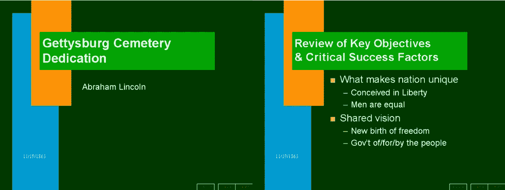

# Intercom 的 Des Traynor 介绍了如何在会议上发言

> 原文：<https://medium.com/swlh/intercoms-des-traynor-on-how-to-get-started-at-conference-speaking-fe656c4955cb>

## 要成为一个数千人大会的主题演讲人，道路上布满了昏暗的酒店会议室。

[Intercom 的联合创始人兼首席战略官德斯·特雷纳(Des Traynor)在 2016 年的大部分时间里都在世界各地的大型科技会议上发表演讲，从旧金山的 Mind the Product 到里斯本的 Web Summit，在此过程中累计飞行里程超过 10 万英里。他分享了开始使用扬声器电路的 4 个技巧。](https://www.intercom.com/?utm_source=medium&utm_medium=distribution&utm_campaign=201702-publicspeaking)

*这篇文章的一个版本首先出现在内部通信* [*博客上，内部通信团队定期在这里分享他们的想法、想法和过程。*](https://blog.intercom.com/?utm_source=medium&utm_medium=distribution&utm_campaign=201702-publicspeaking)

# 1.明智地选择你的主题

你应该只选择那些你有足够自信的话题，以及你的听众想听的话题。小心那些需要你放弃其中一个要求的事件。

> 自信通常来自研究和经验。对于职业生涯早期的人来说，这意味着就特定领域进行深入的讨论，而不是泛泛而谈的“国家状况”，这需要更多的可信度才能实现。

例如，如果你是一名职业生涯早期的工程师，不要试图用 TED 风格谈论“软件工程如何改变世界”。你实现这一点的可信度和影响力的可能性非常低。相反，从一个你有把握的特定主题开始，比如一个库、一门语言、一种方法等等。

除了几个明显的例外，大多数演讲要么深入要么广泛，要么有教育意义或鼓舞人心。如果有足够的时间和经验，一个伟大的演说家可以让你拥有这四种能力，但这种情况很少发生。这里最大的错误就是根本没有做出选择。

# 2.舒适的小空房间

我最早的公开演讲是针对 20 到 40 人的小组，通常会更少。这当然不是你所梦想的，但却是重要的敲门砖。

> 你很早就会搞砸，所以最好是在一小群人面前，而不是在成千上万人直播的活动上。

在这些活动中，你可以犯错误，学习神秘的基调知识。在这里，您可以了解到 HDMI 到 Mini DisplayPort 的电缆是如何断裂的，在一个小时内哪里可以买到替代品，在演示过程中当您的笔记本电脑电池电量低时该怎么办，如何使用 Keynote 的演讲者视图，以及为什么您应该*永远不要*依赖演讲者笔记。

# 3.建立你自己的社会证明

你实际上可以建立自己的演讲简历，而不需要一个舞台。博客文章是一种很好的方式。很多时候，当我在演讲时，实际上是把博客文章变成了演示文稿，反之亦然。

举例来说，[瑞安·辛格](https://vimeo.com/68342874)和[本尼迪克特·埃文斯](http://ben-evans.com/benedictevans/2016/12/8/mobile-is-eating-the-world)已经在他们的笔记本电脑上发表了精彩的演讲，并在网上发布。所以当人们告诉我他们找不到他们的“第一个演讲事件”时，我告诉他们它就在他们面前。像瑞安或本尼迪克特这样的演讲能迅速在全球传播，无疑会让他们获得更多的演讲请求。

拥有这样的材料也意味着当你邀请某人在他们的会议或聚会上发言时，你可以清楚地说，“这是我可以涵盖的主题类型”。记录它们也有助于你省去那些“嗯”和“啊”,让你的表达更加完美。

# 4.公开演讲不是关于幻灯片的

有一个不成立的假设，公众演讲意味着一套 20 张幻灯片和你身后一个发光的屏幕。很多时候你根本不需要任何幻灯片，你可能只需要一张图片或一张纸上的一些要点。事实上，过度依赖幻灯片会削弱你的信息的力量。看看当你把葛底斯堡演说放进 Powerpoint 时会发生什么。

*Credit:* [*Peter Norvig*](http://norvig.com/Gettysburg/)

不要一开始就纠结于你的幻灯片。它不是关于你的信息的格式，而是关于你试图讲述的故事。这方面最好的书是南希·杜阿尔特的 [*共鸣*](https://www.amazon.com/Resonate-Present-Stories-Transform-Audiences/dp/0470632011) 。一旦你知道了这个故事以及你将如何传达它，那么你就可以开始阅读加尔·雷诺兹的[*Presentation Zen*](http://www.presentationzen.com/)，这将帮助你将你的故事形象化。

公开演讲还有很多，但以上四个领域是一个很好的起点。

这篇文章最初出现在 [Inside Intercom](https://blog.intercom.com/?utm_source=medium&utm_medium=distribution&utm_campaign=201702-publicspeaking) 博客上，我们定期在这里分享我们对创业公司、公司文化、产品战略和设计的想法。

[Intercom](https://www.intercom.com/?utm_source=medium&utm_medium=distribution&utm_campaign=201702-publicspeaking) 为企业开发消息应用，帮助他们理解客户并与客户交谈。

## 想看看 Des 的表现吗？观看他在 2016 年 Inside Intercom 世界巡回赛上的演讲。

 [## 你的产品已经过时了-内部对讲机

### 技术进步的无情前进意味着，就其本质而言，技术企业会失败。那是…

blog.intercom.com](https://blog.intercom.com/your-product-is-already-obsolete/?utm_source=medium&utm_medium=distribution&utm_campaign=20170118-publicspeaking)