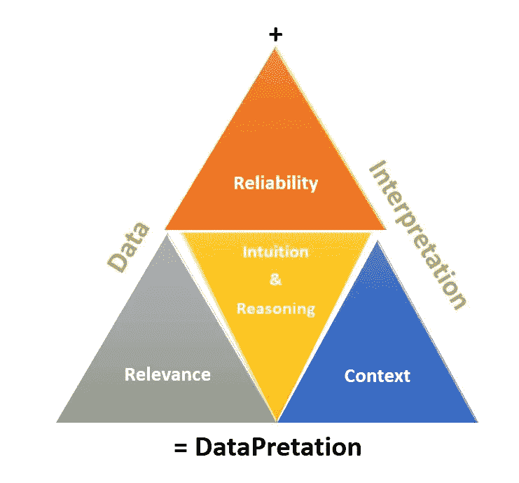

# 对数据的解释基于可靠性、相关性和上下文

> 原文：<https://medium.com/swlh/interpreting-the-data-datapretation-is-based-on-reliability-relevance-and-context-22af56f7c0bc>

Source: [https://pixabay.com/en/facebook-analytics-graphs-2265786/](https://pixabay.com/en/facebook-analytics-graphs-2265786/)

数据已经取代石油成为世界上最有价值的资源。正如一句新的谚语所说:“**数据是新的石油**”——克莱夫·亨比(2006)

我们无时无刻不被数据所包围。无论是在线还是离线，我们都在消费和产生数据。互联网的繁荣和全球化让我们能够即时获取数据和内容。但问题是我们对数据的解读有多好？

这里需要考虑一些问题:

1.  收集的数据**可靠吗**。
2.  还和**有关**。我们可能已经收集了 2 年或 2 个月前的数据，但在快速变化的时代，它可能会失去相关性。所以需要思考。
3.  数据的**上下文**是什么。

如果被忽略，语境是一个很容易被误解的词。所以我们来理解一下。语境是围绕一种情况的背景或环境。因此，在解释数据时，理解收集数据的环境非常重要。它可能是可靠和相关的，但仍然没有用，因为上下文是不正确的

在解释数据时，有许多工具可用。事实上，最近出现了许多新的研究领域，如数据科学、分析、大数据、可视化。软件如 R，SPSS，Kibana，Tableau 等。对我们的数据解释和决策有很大的帮助。但是不管工具和技术有多好，不要让人类的推理和直觉被数据所掩盖。

如果数据是新的石油，那么大脑就是发动机。人类可以想到更多的可能性，并超越现有的数据。大脑的左右两边分别赋予我们推理和直觉的能力。好好利用。

## 这个故事发表在 [The Startup](https://medium.com/swlh) 上，这是 Medium 最大的企业家出版物，拥有 293，189+人。

## 在此订阅接收[我们的头条新闻](http://growthsupply.com/the-startup-newsletter/)。

