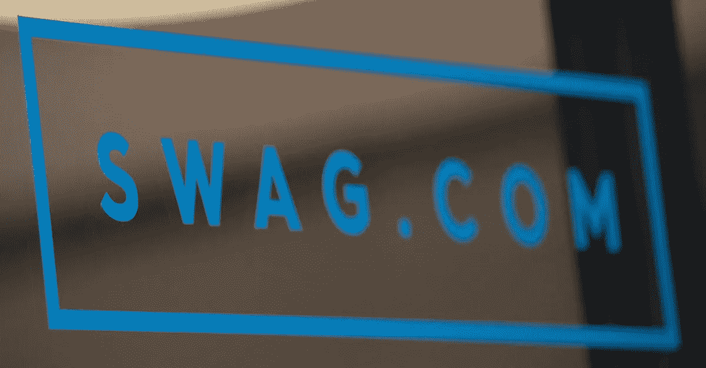

# 采访电子商务创业公司联合创始人:Swag.com 杰里米·帕克

> 原文：<https://medium.com/swlh/interview-with-ecommerce-startup-co-founder-jeremy-parker-swag-com-65805052a7f>

今天，我们采访了电子商务初创公司联合创始人杰里米·帕克，他是 Swag.com 和 Ezetech client 的共同所有者。我们已经一起工作两年了。两年内，Swag.com 从 MVP 变成了一台处理数百万订单的电子商务机器。

杰里米·帕克从 22 岁开始创业。他在大学时是一名电影制作人，后来他创办了一家社交媒体初创公司 Vowch。他一直都知道，沃许之后他要开始的下一个生意将会是赚钱的。发生了！Swag.com 的故事就是这样开始的。

你是如何想到 Swag.com 的？

> ***杰瑞米·帕克:*** *嗯，我大约两年前开始创业，两年多一点。关于赠品的想法是促销产品的行业是非常庞大的。这是一个大约 400 亿美元的市场。然后我意识到这个领域有 50 家公司年销售额超过 5000 万。所以，有很多玩家赚了很多钱，但没有明确的赢家。所以，我们看到了这个大产业是怎样的，它是怎样的分散。我们觉得很有可能成为这个领域的知名品牌。*

**E:你是什么时候觉得值得的？**

> **JP:*我们知道这个品牌在这个领域有多有价值，所以我们与 Swag.com 域名的所有者达成了交易，因为我们知道这个域名会有多有价值。*
> 
> *但是当时我们显然没有钱去购买他们的域名。因此，我们与域名所有者达成了一项协议，我们将在两年内独家授权该域名，并可选择购买。因此，它允许我们真正启动业务，而实际上不必购买域名。*
> 
> *大约 8 个月后，我们意识到我们有了真正的生意。我们在做销售，我们认为我们可以筹集资金，我们最终筹集资金并最终购买了域名。因此，我们公司现在完全拥有该域名。*
> 
> *因此，从我们开始运营到我们实际购买域名，大约花了 8 个月的时间，我们才真正知道我们在这里有一些东西。*

*你在这个项目中遇到的最大挑战是什么，你是如何克服的？*

> ****JP:*** *我认为任何真正的创业公司，尤其是 B2B 公司面临的最大挑战是让他们相信我们是足够大的公司，我们是足够优质的公司来处理他们的订单，如果你想让它成为世界上的脸书和世界上的谷歌真正信任我们。所以，当你开始的时候，你真的从来没有过去的客户，你是从零开始。**
> 
> **所以，我们的感觉是——我们从脸书开始，而不是真的尝试从斜坡开始，尝试获得小型创业公司，然后建立风险投资以获得脸书。我们的第一个客户是脸书。我们去了他们的办公室，去了他们的大厅，建立了一些关系网。我的意思是，我们刚刚有了一些疯狂的经历，我们觉得我们像顾客一样关心脸书。即使是 100 美元的订单，也没什么大不了的。我们可以去其他公司，说“我们有脸书这个客户”。**
> 
> *这正是我们所做的。我们找到了脸书，第二天我们去了 WeWork，他们问我们有多少客户，谁是我们的客户。我们说脸书，他们以为我们有成千上万的其他客户，但实际上我们只有脸书。然后我们去了脸书，我们工作，然后我们去了布拉沃。我们一直这样做，直到我们有了大约 6 家蓝筹公司，就像我们主页上的一排标志。我们觉得，一旦我们有了那一排标志，每个人都会来找我们，说当他们看到 Swag.com 和标志时，他们简直不敢相信我们是最好的。*

*你还记得你的第一次销售吗？感觉如何？*

> ****JP:*** *果然是脸书。价格是一千多美元。这不是一笔大买卖，但我们可以说脸书是我们的客户。感觉棒极了，因为我们知道，一旦我们有了脸书，销售周期将会容易得多。每一家大型蓝筹股公司都变得越来越容易。**

*你认为 Swag.com 与众不同的关键是什么？告诉我三件你喜欢的东西*

> ****JP:*** *嗯，我认为有三个主要因素使我们与众不同，使我们与这个行业中的其他人不同。正如我所说的，这个行业非常庞大，非常庞大。有这么多玩家，我们相信很多人都做错了。因此，我们在课程中认识到，从一开始，千禧一代就控制了从大机构购买的奢侈品。不再是年长的办公室经理，而是 22 到 25 岁的年轻人。他们有着非常不同的需求和愿望。**
> 
> *首先，他们不想和任何人说话。所以，老式的通过电话与人交谈的过程是一个非常手工的过程，已经成为过去。我们意识到我们需要自动化整个过程。我们需要使它真正简化，我们需要让他们在我们的网站上找到产品，他们可以很容易地上传他们的设计，他们可以模拟东西，他们可以自己做而不用和任何人说话。这就是我们网站的主要重要性。我们的网站就像终极销售引擎。我们没有销售团队，我们没有打电话，我们没有创造性的甲板。我们的网站只是一个永远在走的销售人员，就像它随时处理数百万份订单一样。这只是一个自动的事情。这是第一点。*
> 
> **第二是我们的产品选择。大多数促销产品网站提供数千种产品。这使得无法做出决定。你要翻遍成千上万的水瓶和笔记本，简直应接不暇。我们所做的是我们已经查询了那里最好的东西。那么，让我们假设你要查看成千上万个水瓶，现在你要给出前三十个，前三十个水瓶，前三十个 t 恤。这让我们更容易知道我们得到了这种品质，男人也做出了决定。**
> 
> **三号。我们有非常棒的设计和品牌。所以，它吸引了今天的买家，今天的千禧一代。**
> 
> **第四，还有一点，我们实际上能够获得促销产品空间中其他人无法获得的产品。想象你是一个发动机公司，你是一个高发动机公司。你不想卖给 JCPenney，你宁愿卖给 Barneys 甚至 Marquis 或者高端。你希望你的品牌与此相关联。我们网站上的普通产品也是如此。从 Incase 到 Knomo London 再到 Stuart & Lau 再到 Bellroy bags，我们的网站上有很多很酷的产品。以前没做过促销产品的产品。他们不会这么做，因为他们希望与我们行业的这种垃圾性质联系在一起。**

*E:和乔希一起管理公司是什么样的体验？我知道你们互补*

> ****JP:*** *对，对。所以，我总是喜欢说我更像是房子的正面。第二种是技术，比如正面和背面。我是前台，我负责用户体验设计，产品外观，我们的整个品牌。订单下达后乔希会做所有的事情。因此，一旦下了订单，Josh 就与制造商和供应商打交道，并确保他们的产品按时交付给客户服务部。所以，我觉得我们真的是互相平衡。嗯……我们关注非常不同的事情，非常不同的个性。**

**

*Josh Orbach (left) and Jeremy Parker*, Swag.com**

*关键是要划分责任。是吗？*

> ****JP:*** *肯定是的。当我在考虑 Swag 的业务时，我知道我需要与 Josh 合作，帮助我一起启动这个业务，因为我有自己的才能，而 Josh 有许多我没有的才能。我需要像乔希这样的人，他很随和，但也能在整个回归过程中帮助我。因为这是一个大平台。这不仅能让顾客有信心在我们的网站上购买，还能让卖家和供应商以及所有顾客看不到的东西有信心购买。在后台有很多事情，它们是配色、拼板、生产、时间表和运输以及所有其他事情的移动部分，这些事情并不性感，但它们需要完成。乔希很擅长这个。**

*你们认识多久了？*

> ****JP:*** *我们从大学开始就是朋友，所以，我自己也是很久以前的事了，但我会告诉你已经很久了。我今年 33 岁。2007 年我毕业了，所以我们从 2005 年就认识了。**

*你什么时候意识到赃物是一种彩票？我的意思是，说真的，你有没有想过在不到两年的时间里，Swag 会成为这样一个大公司？*

> ****JP:*** *我还是觉得我们还有很长的路要走。当我们两年前成立时，我知道我们有机会成为一家真正的大公司，我认为我们正在实现这一目标。但是，在年销售额达到 5000 万英镑之前，我们不会感到高兴。我们还没有到那一步。**
> 
> **我们在 2016 年发布，自发布以来，我们已经完成了 216 万多一点的销售额。今年我们完成了一点点，我想 2018 年到目前为止有 130 万。但是我们觉得今年应该达到 400 万辆，明年有望达到 1000 万辆。**
> 
> *所以，我们还有很长的路要走。我们认为，我们只是处于早期阶段。我们认为我们真的可以建立超过 1 亿美元的业务。*

*我们已经和你一起工作了一年半，我知道你真的有了一些新的特点。他们将如何影响项目？*

> ****JP:*** *很好的问题。我们正在整合许多功能。我们有大约 15 个核心的前端功能，我们真的希望在未来 2 个月内完成，大约 25 个左右的后端功能，将有助于促进订单管理的过程。因此，对于正面，一切都是为了给顾客信心。**
> 
> *因此，当客户找到我们，说因为我们没有一个庞大的客户服务团队来帮助他们，因为我们没有销售代表在电话上与他们交谈。这是一种定制产品，所以我们通常的平均订单规模约为 4000 美元，这个范围可以高达 60，000 美元。*
> 
> **当有人购买定制产品时，他们需要对产品的完美表现充满信心。例如，我们现在正在构建一个名为“关联产品”的功能。这基本上是我们在不到一年半的时间里一直在做的，记录所有客户的笔记。他们告诉我们他们需要什么，他们想要什么，我们没有什么，我们一直在慢慢地削减功能，这些功能将帮助我们，你知道，使产品更容易。**
> 
> **例如，顾客总是来找我们，说‘我想买一百件男式 t 恤和一百件女式 t 恤’。这是一个常见的要求，通常我们会说要么买一百个，要么先做一百个。但有时他们会要求价格折扣，因为没有相同的印刷。所以，想象一下，你有一百件男式 t 恤和一百件女式 t 恤都有相同的图案。我们真的可以节省他们的销售费用，所以，有一些后端的东西。所以，我们总是说现在放 200 件男式 t 恤，然后在设计笔记中写下这 100 件男式 t 恤中有多少件是女式的，以及尺码明细。这不是最好的体验，所以现在我们正在建立一个功能，希望你选择一个产品。你可以挑选与之配套的相关产品。所以，你可以在订单中增加 100 个男的，再增加 100 个女的，这样你就可以在价格上涨时节省你的钱。你知道，上传节省了你的打印成本，它会给客户更好的体验。所以，我们现在所做的一切只是试图解决我们已经知道存在的问题。我们大约完成了 80 %,我们说还有 20 %,但我认为在接下来的 2 个月里，我们将真正完成网站的 90 %。**

**

*Swag.com tech team*

*让我们来谈谈你吧。如果你能和 5 年前的自己对话，你会说什么？*

> ****JP:*** *哦！我从 22 岁大学毕业后就开始创业。我在大学时是一名电影制作人，后来我真的在一所创业学院做游戏，因为我想赚些钱，我试图为自己找到一份职业。所以，我一直是个企业家。**
> 
> *5 年前，我实际上是在经营一家社交媒体初创公司。它叫做 Vowch，是一个社交网络应用。我们和一些名人合作，比如皮特保罗、雷夫·朗和 50сent，他们都是社交媒体的名人。它从来没有飞到它该去的地方。它拥有成千上万的用户，但对于社交媒体应用程序来说，你真的需要获得数百万的日活跃用户才能产生广告和盈利。所以，在那一点上，我总是知道当我关闭那家企业时，我要做的下一个企业必须是赚钱的。*
> 
> **所以，我会为自己感到骄傲，我会对自己说，5 年前我真的到了一个地方，我们正在建立我们真正的业务，这是可扩展的，能够赚钱，这不是白日梦，这就像实时为人们提供真正的价值。**

***E:在经营自己的创业公司时，什么是最好的？***

> ****JP:*** *最好的东西。人们说你有自己的时间表。但作为一名企业家，你基本上是在日以继夜地工作。你没有自己的时间。我想说我已经两年没有休假了，但我觉得我喜欢它的创意。我喜欢醒来后对自己正在做的事情充满激情，并努力做一些我认为能为我们的客户带来真正价值的事情，并且勇于创新，打破常规。**
> 
> **思考解决难题的方法，让难题变得简单。这就是我所说的编译，我总是称赞这是一个如此简单的网站，如此干净，如此容易理解。**
> 
> *要是他们知道让它变得如此简单有多难就好了。*

*如果你每天有额外的 6 个小时，你会做什么？*

> ****JP:*** *我就睡了。)))**

*我敢肯定，某个想要自己创业的人正在阅读我们的文章。你能给他们的建议是什么？*

> ****JP:*** *这可是个大问题。我想说的是，在做之前，要对你要做的事情充满热情。因为我有过这样的经历，你认为这是一种赚钱的方式，但你并不一定对此充满热情，当你意识到你会遇到一些问题时。事情从第一天起就不会有结果，也不会百分百完美。每当你面对这些挑战时，如果你对你正在做的事情没有超级的热情和兴奋，你就会放弃。**
> 
> *因此，在你开始之前，很明显，企业是以赚钱为目标的。但是你也需要对你正在做的事情感到兴奋，你需要对这个行业感到兴奋，也许对你在这个行业中的发展感到兴奋。所以只要对它充满热情。*

***艾凡:你保持专注的秘诀是什么？***

> ****JP:*** *嗯，我越来越老了，我现在 33 岁了，听起来并不老。但是我认为我的秘密是我真的热爱我正在做的事情。我不认为这是一份工作。我醒来，我为完成它而兴奋，我看到了 Swag.com 的宏伟蓝图。我知道我们现在正处于婴儿期。从外面看起来。我们在增长，我们在赚钱，这是事实，但我认为我们要大得多。我真的相信我们有机会成为这个领域最大的公司之一，这个领域是由数十亿美元的公司组成的。在我看来，我们没有理由不能到达那里。所以，只是看到那个长远的愿景并努力去实现它。**

*作为一名商人，你读过的最鼓舞人心的书是什么？*

> ***杰西有一个最精彩的故事。你们应该读一读杰西·伊茨勒的《与海豹一起生活》这本书。***
> 
> *杰西是一位成功的企业家。他创建了私人飞机公司 Marquis Jet，以超过 10 亿美元的价格卖给了沃伦·巴菲特。他是济科椰子水的创始人之一，椰子水卖给了可口可乐。他和他的妻子拥有 NBA 亚特兰大老鹰篮球队。他的妻子是萨拉·布雷克里，她发现了斯潘克斯。她是最年轻的白手起家的女亿万富翁。他基本上雇了一个海豹突击队员在他家住了一个月，基本上塑造了他。你知道，他是，尽管他是超级马拉松运动员，每天为慈善直道跑 100 英里，他想真正改变它。所以，我会说“和海豹一起生活”——真的要振作起来，不要满足于现状，即使你认为你做得很好，你总是可以做得更好。这就是那本书。*

*最后一个问题。如果把你的创业公司比作一辆车，你会选哪辆车？什么型号，为什么？*

> ****JP:*** *我不是最大的汽车人。但我不得不说，Swag.com 是促销产品的优质来源。我不想认为这是最贵的，它不是劳斯莱斯，也不是法拉利，它是优质的来源。所以，我会说雷克萨斯，奥迪，质量很好的车。你知道，对一些人来说很贵，但真正的质量，这都是质量方面的问题。你可以买一辆便宜的雷克萨斯，也可以买一辆更贵的雷克萨斯，有不同的选择。**

*我们非常高兴与 Jeremy 谈论 Swag.com 的成功故事。我们希望 Swag.com 将很快征服世界。*

****本文原载于***[***Ezetech***](https://eze.tech/)*[***博客***](https://eze.tech/blog/interview-ecommerce-startup-co-founder-jeremy-parker-swag-com/) ***并与媒体社区分享。*****

**更多创始人访谈和有趣文章，请订阅[我们的机器人](https://m.me/ezetech?ref=w2236447)。**

# **别忘了给我们你的👏下面！**

********

## **这篇文章发表在 [The Startup](https://medium.com/swlh) 上，这是 Medium 最大的创业刊物，有+ 382，862 人关注。**

## **在这里订阅接收[我们的头条新闻](http://growthsupply.com/the-startup-newsletter/)。**

****