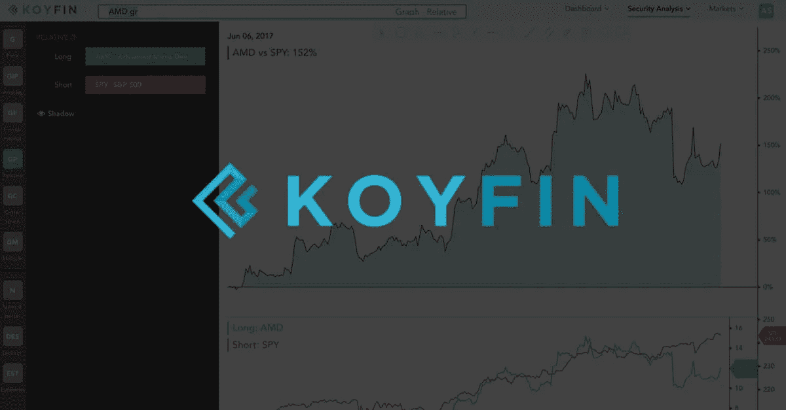
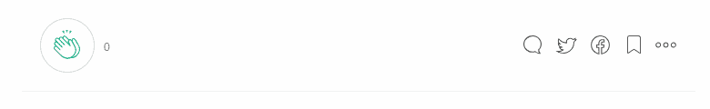

# 采访 Fintech 初创公司创始人:Rob Koyfman，Koyfin

> 原文：<https://medium.com/swlh/interview-with-fintech-startup-founder-rob-koyfman-koyfin-8cb74294470d>

今天，我们发布了对金融科技初创公司创始人罗布·科伊夫曼的采访，他是 [Koyfin](https://www.koyfin.com/) 和 [Ezetech](https://eze.tech/) 客户端的首席执行官，采访是在我们刚刚开始合作时拍摄的。

Rob Koyfman 自 2002 年以来一直是华尔街的投资分析师，在高盛、花旗集团和最近的 Tekne Capital 担任研究和战略角色。在他的职业生涯中，他专注于使用彭博、路透社、Factset 和 Capital IQ 分析股票和宏观投资。他毕业于罗格斯大学，拥有金融和数学学位，是 CFA 特许持有人。Rob 创立 Koyfin 是因为他无法进入彭博时，缺乏可用的功能性投资工具。

**Ezetech:告诉我们你是如何想出 Koyfin 这个主意的，以及你想要解决的问题。**

> ***Rob Koyfman:*** *华尔街的投资者和交易员可以接触到像彭博这样功能强大的软件来帮助做出投资决策。彭博和类似软件的费用非常昂贵，每人每年的订阅费从 15，000 美元到 25，000 美元不等。*
> 
> 由于成本高昂，许多投资者负担不起这些软件工具，只能选择雅虎财经或 Ameritrade 等在线经纪商提供的基本服务。我创办 Koyfin 是因为我想开发功能性投资软件工具，价格比目前投资者能承受的更低。

你能分享一下你对像 Koyfin 这样的初创企业的研究和规划阶段正规化的想法吗？

> ***RK:*** *我公司的研究和规划阶段包括考察几个因素以确定我的想法的可行性。我是投资软件的长期用户，所以我已经在一定程度上了解市场。*
> 
> 与许多投资者谈论他们的研究过程，有助于我了解现有公司目前提供的产品范围，以及我的产品的潜在适用性。技术研究帮助我了解构建我的产品的可行性，以及我需要使用哪种编程技术。

作为一个单身创始人，创办并运营一家初创公司是什么感觉？

> ***RK:*** *单身创始人不是创业公司的典型。如果我能有一个共同创始人就好了，但不幸的是，情况并非如此。很多人最初告诉我，我需要一个联合创始人来创办我的公司，因为这是创业的典型路径。*
> 
> 但是创业的关键在于没有必须遵循的规则或传统。一天结束时，唯一重要的是你是否能创造出有需求的产品。

**E:为你的早期创业公司自筹资金，让它为投资者做好演示准备，要花多少钱？**

> ***RK:*** *这取决于产品和你希望演示的功能性。你可以制作一个低于 10，000 美元的演示，展示给潜在的投资者或用户。*
> 
> 我认为雇佣一名平面设计师让你的产品看起来更专业是很重要的，这和一开始的功能一样重要。人们不想使用看起来不太棒的东西。

**E:请告诉我们如何选择合适的技术供应商，以及为什么选择 Ezetech。**

> ***RK:*** *我采访了几家科技公司，出于几个原因，我选择了 Ezetech。*
> 
> 首先，Ezetech 很小，我觉得我的项目会得到足够的关注，但他们也有我联系参考的已完成项目组合。
> 
> 其次，我觉得斯坦(Ezetech 的首席执行官)和帕特里克(Ezetech 的首席运营官)真的对我的项目感兴趣，希望它成功。他们花时间来了解我在短期、中期和长期建设什么。
> 
> *第三，Stan 的技术知识给我留下了深刻的印象，他帮助我做出了正确的技术决策，例如为我的前端、后端和数据库使用哪种编程语言。最后，我继续与 Ezetech 合作，超出了我最初只构建一个演示的期望，因为我对开发的质量、速度和价格感到满意。*

在你看来，早期雇员和合同工应该具备什么样的品质？

> RK: 对于编程来说，当今的语言是不断变化的，所以培养能够快速适应的人是很重要的。

在金融科技领域，你有什么建议想和有抱负的企业家分享吗？

> ***RK:*** *三条建议:
> 1。开始建立一个公司和产品是非常困难的，因为有许多未知。你永远不会拥有完美的信息，但你必须从某个地方开始。在你开始构建你的产品之前，不要花太多时间去计划每一件事。一个不完美的演示总比没有好。*
> 
> *2。作为一名企业家，就是要建造一些以前没有建造过的东西。如果很容易或者很明显，有人会在你之前做了。这意味着有一个愿景或做出别人不同意或不理解的决定。听取别人的建议很好，但最终还是要由你来做决定，因为你有别人没有的远见。如果你得到某件事是好主意还是坏主意的建议，理解建议背后的推理比结论更重要。*
> 
> *3。我喜欢企业家精神的一点是，一家公司的成功是客观的，并由可观察的指标来验证。对于早期阶段的公司，用户群的增长是关键，最终是收入和收益等财务指标的增长。你可以在产品发布后很快发现你的想法是好是坏。在传统的企业界，成功取决于许多其他因素，如公司政治。你永远不会像为自己努力一样为别人努力。如果你有一个好主意，那就去做吧！你只能活一次。*

我们非常高兴与 Rob 讨论他的想法、资金以及如何在创业时选择合适的技术供应商。

*本文原载于*[*Ezetech*](https://eze.tech/)*[*博客*](https://eze.tech/blog/interview-fintech-startup-founder-rob-koyfman-koyfin/) *并分享给 Medium 社区。*
更多创始人访谈和有趣文章报名[我们的 bot](https://m.me/ezetech?ref=w2236447) 。*

# *别忘了给我们你的👏下面！*

****

## *这篇文章发表在 [The Startup](https://medium.com/swlh) 上，这是 Medium 最大的创业刊物，拥有+ 378，907 读者。*

## *在这里订阅接收[我们的头条新闻](http://growthsupply.com/the-startup-newsletter/)。*

**