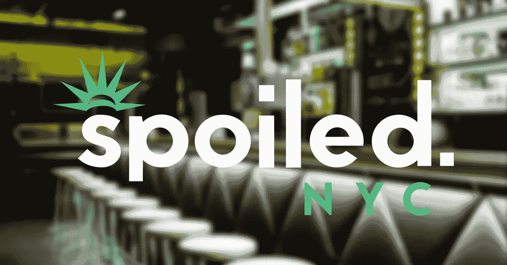

# 采访创业公司创始人:帕维尔·科诺普连科，被宠坏了。纽约市

> 原文：<https://medium.com/swlh/interview-with-startup-founder-pavel-konoplenko-spoiled-nyc-e18326150e79>

今天我们采访了媒体创业公司创始人帕维尔·科诺普连科，被宠坏的 CEO。纽约和 [Ezetech](https://eze.tech/) 合作伙伴。他认为成功与好奇心、慷慨以及最重要的热情有关。

Pavel Konoplenko, CEO Spoiled.NYC

在与他人共同创建“被宠坏的媒体”之前，他在纽约市的营销和广告公司担任各种角色，探索社交媒体的全部潜力。如今，作为自己媒体公司的掌舵人，Pavel 比以往任何时候都更热衷于通过体验媒体倡导个性、愿景和创造性表达。

## Ezetech:你是如何想出“被宠坏的纽约”这个主意的？

> ***帕维尔·科诺普伦科:*** *我看到了纽约人对新声音的真正需求。生活在世界上最大的城市之一，口袋里装着电脑，我们纽约人比以往任何时候都有更多的机会以新的方式体验我们的世界。如今，比以往任何时候都更多的人有能力追求一种“被宠坏”的生活方式。我们想重新定义这对今天的人们意味着什么。毕竟，没有理由为努力丰富你和你朋友的生活而感到内疚。*

## 艾凡:你是独自创业的吗？

> ***PK:*** *不，我是和我的联合创始人丹尼·贾杜洛一起做的。他一直在帮助建立基础，让我们更上一层楼。我们以前有过一起工作的经历，我知道作为一个团队，我们在如何解决问题和解决问题方面有一些东西，总是互相推动，做对公司最有利的事情。*

## e:公司成长初期最难的部分是什么？

> ***PK:*** *现金流，让我们能够扩大规模的流程，以及从* *任何创业公司都会犯的典型错误中吸取教训——无论是雇佣了错误的人还是没有做足够的测试。*

## 你认为运气在《被宠坏的纽约》的成功中起了作用吗？

> ***PK:*** *我认为运气在任何业务中都发挥着巨大的作用——无论是遇到某些合伙人，被随机介绍给未来的客户，甚至是让实习生成为团队不可或缺的全职成员。然而，据说运气偏爱勇敢和有准备的人。*

## 你什么时候第一次感觉到《被宠坏的纽约》正在发展一批重要的观众？

> ***PK:*** *我们 2015 年 7 月 3 日的活动，发生在曼哈顿的一个屋顶上，是对我们的影响范围和影响力的一次大的现实检验。为了进入会场，人们在街区周围排起了长队。看到数百名陌生人急切地等待加入这个被宠坏的派对，绝对是一次灵魂出窍的经历。*

## e:在过去的一年里，社交媒体发生了怎样的变化？

> 脸书成为一个庞然大物，拥有足够的市场力量来威胁较小的出版商，Snapchat 开始显示出成为未来强者的迹象——大量广告商和媒体公司全力投入其中。

## 最近你有没有参加什么活动？

> ***PK:*** *今年夏天，我们大举进军活动，实现了一个新的收入流，也是推出品牌的新机会，进一步推进了创造体验的使命。*

## e:告诉我们你最近经历的技术革新。这与公司的战略方向有什么关系？

> ***PK:*** *技术日益成为我们业务的核心。我们相信，强大的专有技术将使我们有别于其他媒体公司，能够更有效地管理流程，并为我们提供对追求新计划的更大控制权。*

## e:对于一家刚刚开始建立社交媒体受众的媒体公司，你有什么建议？

> ***PK:*** *专注于向读者传递真正的价值。了解他们需要什么，并努力满足他们的需求。建立信任，永远倾听他们。不要只依赖一个观众。了解你的品牌的价值和声音。*

我们很高兴与 Pavel 谈论他的创业、风险投资、社交媒体，并揭示技术在他的业务中扮演的角色。

更多创始人访谈和有趣文章，请注册[我们的机器人](https://m.me/ezetech?ref=w2236447)。

*本次采访由* [*奥莱克西·舍甫琴科*](https://eze.tech/author/oleksii-shevchenko/) *拍摄。最初发表于* [*Ezetech 博客*](https://eze.tech/blog/interview-media-startup-founder-pavel-konoplenko-spoiled-nyc/) *并分享给媒体社区。*

# 别忘了给我们你的👏下面！

## 这篇文章发表在 [The Startup](https://medium.com/swlh) 上，这是 Medium 最大的创业刊物，有+365，103 人关注。

## 在这里订阅接收[我们的头条新闻](http://growthsupply.com/the-startup-newsletter/)。

