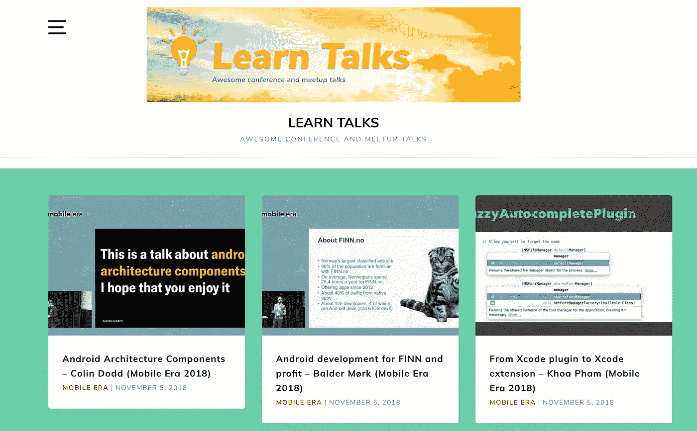

# 介绍学习讲座——精彩的会议和聚会讲座

> 原文：<https://medium.com/swlh/introducing-learn-talks-awesome-conference-and-meetup-talks-e97c8cf7e0f>

嗨，我是柯阿。我很高兴终于推出了 [LearnTalks](https://learntalks.com/) ，以帮助他人和我自己赶上新的会议和 meetup 讲座。

该网站是在 https://www.producthunt.com/posts/learn-talks 的[进行产品搜索的😇](https://www.producthunt.com/posts/learn-talks)

作为一个对[制造东西](https://github.com/onmyway133/blog)和[写作](/@onmyway133)充满热情的人，我也喜欢了解科技领域的每一个新事物。科技发展如此之快，我们今天所学的可能很快就会过时，只有不断学习才能让我们前进。技术会议和 meetup 是学习新事物和新技巧的最佳场所，尽管也有一些起伏...他们仍在成长，并为许多人提供了宝贵的资源。有很多会议和聚会，一个人不能全部参加，这会给人一种害怕错过的感觉。

幸运的是，人们足够善良，总是公开发布视频，以便其他人可以学习。很长时间以来，我一直在策划一份[清单](https://github.com/onmyway133/fantastic-conference-videos)...跟踪所有酷的视频，但它很快就失控了。

这就是为什么我把 LearnTalks.com 作为一个搜索和探索新技术的便利场所。这些功能包括
-轻松搜索演讲、作者和活动
-查看即将举办的活动
-探索主题和技术的标签
-移动友好

首先，感谢所有帮助我测试网站并提供宝贵反馈的人。我处理并解决了许多问题。非常感谢许多会议组织者，他们在我发送电子邮件后立即给了我肯定、支持和鼓励。非常感谢你在空闲时间组织很酷的活动，并把视频分享给社区。我真的很感激。

这个网站只是一个视频的策展，它不转贴或声称任何视频的版权。还有返回到 conference 和 meetup 页面的链接。它可以免费使用，没有任何商业目的。

希望你和我一样觉得这个网站有用。当然还有很多需要改进的地方，我期待着收到你❤️的反馈和支持。如果有任何问题或侵犯版权，请随时给我留言。

## 这篇文章发表在 [The Startup](https://medium.com/swlh) 上，这是 Medium 最大的创业刊物，拥有+385，976 名读者。

## 在这里订阅接收[我们的头条新闻](http://growthsupply.com/the-startup-newsletter/)。

