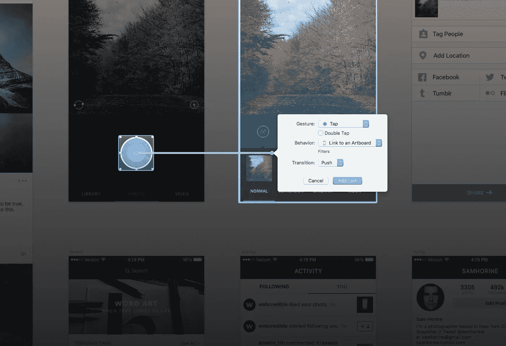
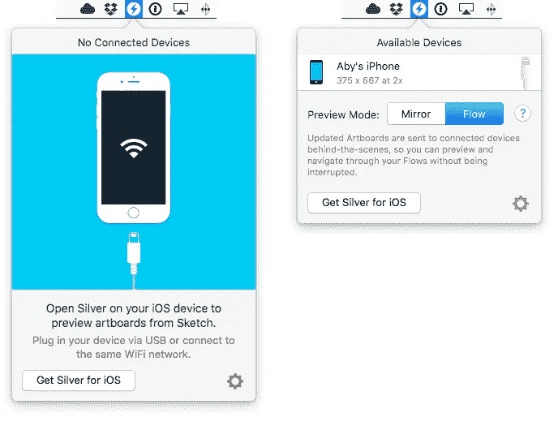

# 介绍 Silver:草图 3 中的轻量级移动原型

> 原文：<https://medium.com/swlh/introducing-silver-lightweight-mobile-prototyping-in-sketch-3-cee46d267f1f>

[Silver](http://silverflows.com) 是一个 iOS 应用程序、Mac 应用程序和 Sketch 插件的组合，它们可以无缝地相互通信，使您的移动设计过程尽可能地顺畅。

這篇文章亦有中文版本 請點選以下連結：
[http://www.ui.cn/detail/81033.html](http://www.ui.cn/detail/81033.html)

# 背景故事

2015 年初，我开始将 Silver 作为一个兼职项目，当时我对完美原型工具的追求产生了喜忧参半的结果。在我的搜索过程中，我发现了一些出色的工具，包括 Framer、Pixate、Form、Origami、Invision、Flinto、漫威、Proto.io 和 UXPin。这些工具都有自己独特的好处，但是它们都给我的设计过程增加了更多的麻烦。虽然有些适合设计微观交互，但其他的非常适合基于流程的原型。由于这些工具之间完全没有集成，在流程的每一步都要在它们之间切换是很痛苦的。

基本上，我找不到一款能满足我所有需求的软件*。*

**我的需求很简单:**

*   当设计一个应用程序时，我需要从一开始就建立一个用户流的原型。虽然我是一次设计一个屏幕，但流程是完整的故事，我不想忘记它。
*   我需要立即看到应用程序在移动设备上的外观、感觉和流动，而不必导出图像、同步文件或绘制热点(我讨厌绘制热点)。原型越容易制作，我对它的依赖就越少，如果我意识到这不是最好的方法，就更容易放弃。
*   我需要首先在低保真度下设计我的应用程序，并开始测试。当我从这些测试中学习并迭代设计时，我想同时提高每一步的保真度， ***，而不必切换工具*** 。
*   我需要在最终开发应用程序的开发人员所面临的约束下工作，这样我们就不会以一个非常难以构建的设计而告终。
*   我想继续用 Sketch 进行设计，因为它是迄今为止最好的界面设计工具。我需要一个工具，可以很好地与 Sketch 集成，利用所有优秀的插件和特性。
*   一旦定义、测试并批准了整个流程，我需要在屏幕级别上构建微交互的原型。Framer 是我个人最喜欢的在原型中添加屏幕级交互性的工具，所以理想的工具应该与 Framer 很好地集成。
*   最重要的是，我需要减少渗透到我设计过程中的琐碎事务，这样我就可以把时间花在与客户交谈、做研究或简单地制作更多测试选项的原型上。

我没有抱怨缺少这个能神奇地解决我所有问题的银弹应用程序，而是开始自己开发它。我已经在做插件了，并且对 Sketch 的内部有所了解，所以一个基于插件的解决方案立刻吸引了我。然后我和 Andrey(我认为他是插件开发的大师之一)合作，帮助将这个想法提升到一个新的水平。

以下是我们最终构建的 Silver 的一些功能，以及如何使用它们来加快设计过程:

# 与草图整合

当你在 Mac 上安装 Silver 时，你还会被要求安装配套的 Sketch 插件，该插件在后台与 Mac 应用程序进行通信。Silver 应用程序本身位于菜单栏中，并帮助您连接到移动设备，但所有其他功能都建立在 Sketch 之上，并由插件提供便利。

The Silver menubar app, with and without connected devices.

将设计转换成原型的所有逻辑都存在于草图文档中。我们的目标是消除工具之间的导入、导出、同步和切换过程。

# 通过 WiFi 或 USB 连接设备

如果你正在设计一个移动应用程序，当你设计界面的时候，你 ***必须*** 在移动设备上预览你的设计。没有借口！

使用安装在 iOS 设备上的 Silver Preview 应用程序，您可以从 Sketch 流式处理对当前画板所做的更改，或者预览使用 Silver Sketch 插件创建的整个流。

通过 WiFi 连接设备使您可以灵活地在办公室展示您的原型，但 Silver 也允许您通过 USB 连接设备，这大大提高了镜像速度。Silver 会根据设备是否插入而自动在 USB 和 WiFi 之间切换。

# 设计流程，不仅仅是屏幕

Silver 的一个我们最喜欢的特性是能够将图层与画板链接起来，直接在 Sketch 中创建流 ***。要创建一个链接，选择一个层，然后按键盘上的“C”键。这将启动一个界面构建器风格的面条连接器，它可以放在目标画板上。然后，您可以选择触发过渡的手势以及特定于过渡类型的其他详细信息。***

当您使用 Silver 创建一个流并在 iOS 应用程序中预览它时，您得到的是一个具有真实过渡的实际 iOS 导航堆栈。这不仅让你的原型*感觉*更真实，也有助于你更好地使用 iOS 导航结构。

Silver 支持三种类型的过渡段:

## 推送转换

Creating Push Transitions

您可以使用推送过渡来导航到应用程序内容的下一个层级。例如，在“信息”应用程序中，从聊天对话列表转到单个对话。要返回上一个屏幕，你可以从屏幕的左边缘滑动，或者设置一个具有**链接返回**行为的层。

## 模态转换

Combining Push and Modal Transitions

模式转换用于开始一个独立的任务，该任务必须由用户完成或明确放弃。撰写一封新邮件，在 Instagram 上发布一张新照片，在 Evernote 上创建一个新笔记，都是必须在一个或多个分层步骤中完成的独立任务的例子，或者必须完全取消。要取消模态任务，您必须创建一个具有**消除模态**行为的层。

模态过渡在使目标画板进出动画方面提供了更大的灵活性。您还可以设置一个模式转换，通过滑动手势交互消除。

Creating a Slide-Out Navigation using Modal Transitions

## 没有过渡

如果您希望立即切换到另一个画板，可以通过将过渡类型设置为**无**来实现。这将立即用您链接的画板替换当前画板。如果您希望以不同的状态显示当前画板，可以使用此选项。您也可以使用此设置来原型化基于标签栏的应用程序，并在不同标签之间切换时将过渡设置为无，如下所示:

Creating a Tab Bar app using Artboard Links with No Transition

# 触发核心 iOS 功能

除了创建流，Silver 还允许您创建触发核心 iOS 功能的链路层，例如启动相机、浏览照片、启动系统电子邮件或短信编辑器、拨打电话或在默认浏览器中启动外部 URL。您不再需要创建虚假的静态屏幕来模拟原型中的这种功能。

这里有一个例子，展示了如何创建允许用户在他们的 iOS 设备上浏览照片的链接。你也可以用选中的照片填充图层，命名为 *_photo* 。

Creating a Link to Browse Photos and displaying the selected photo

# 固定页眉和页脚

Creating Headers and Footers with Silver

Silver 可以让您通过简单的键盘快捷键创建固定的页眉和页脚。选择你想要保持固定的图层，对于页眉点击 ***Ctrl+Shift+H*** 或者对于页脚点击 ***Ctrl+Shift+F*** ，就大功告成了。此后对这些层的大小和位置所做的任何更改都将自动更新预览。

# 实时输入字段

Creating Input Fields with Silver

有时，您需要构建一个要求用户输入一些信息的流程原型。也许这是一个简单的带有用户名和密码字段的登录屏幕，或者是一个包含更多文本字段的编辑个人资料屏幕。您可能会假装这种行为，因为在原型中创建实际的输入字段是一个非常痛苦的过程。

嗯，不再是了。使用 Silver，只需编辑一些设置，就可以在预览时将 Sketch 中的常规文本层转换为实时输入字段。活动输入字段带来了一些 *UITextField* 对象的功能，比如设置占位符、在文本字段中显示清除(x)按钮、选择键盘类型等。，作为设计师触手可及。

# 嵌入网络视图

Embedding web content and Framer prototypes

Silver 还可以将矩形图层转换为实时网络视图。当你的应用程序的一些功能已经内置在 HTML 中，并且你想在现有的上下文中添加新的设计时，这可能会很方便。

Web 视图还可以包含到本地框架器原型的链接。这允许你将 Framer 中内置的屏幕级交互与你的应用程序的更广泛的上下文相结合。一个用于 Framer 的模块也正在开发中，使得直接从您的 Framer 代码中调用 Silver 特定的功能更加容易。

# 公共测试版

这些是我们目前为止一直在测试的私人测试版中包含的功能，这只是皮毛。今年晚些时候的最终版本还会有更多的计划。

我们将邀请有限数量的设计师/开发人员加入我们的公开测试，这将在几周内开始。如果你有兴趣，请在 silverflows.com[报名。](http://silverflows.com)

如果你有问题，建议，或者只是想表示你的支持，请在这里添加回复或者在 Twitter [@silver_flows](http://www.twitter.com/silver_flows) 上找到我们。

如果您希望在自己的工作流程中使用 Silver，请记得点击下面的绿色小♥！

发表于*[**# SWLH**](https://medium.com/swlh)**(***创业、流浪、生活黑客)**

******