# 为企业和高端应用引入现场时间分析

> 原文：<https://medium.com/swlh/introducing-time-on-site-analytics-for-businesses-and-high-end-applications-be4943fc320d>

TI 可以在网页和应用程序中使用现场分析来衡量用户在现场的时间，这是衡量用户反应的重要指标。了解用户和业务应用程序是网络分析的一部分。有了 [**时间现场跟踪器。js**](https://github.com/saleemkce/timeonsite) 成为可能，时间度量跟踪器负责在 web 应用程序中测量准确的页面访问持续时间。

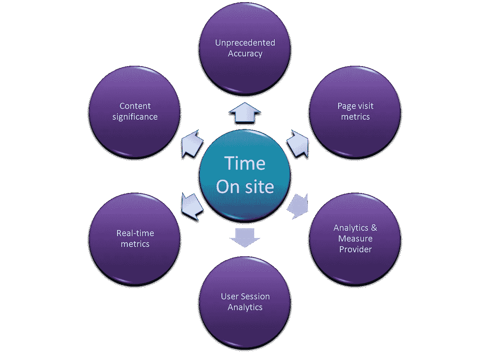

Timeonsite-tracker features

此图片描述了实时跟踪功能。它可以从应用程序数据的页面访问中跟踪和生成大量分析。在本文中，我们将从收集的单一数据源中**挖掘**现场时间(tos)分析，并尝试**可视化丰富的分析**数据，这些数据都与用户的现场时间有关。

***您可能对*** [***现场跟踪实时演示***](https://saleemkce.github.io/timeonsite) ***感兴趣一两分钟后，再继续本文。***

曾想过如何回答以下问题，以帮助您从站点/应用程序中获得智能分析？

*   给定月份，用户在单个页面/帖子上花费的时间是多少？
*   我上周写的博客真的引起了用户的注意吗？
*   在某个特定的博客版块(例如医学)上投资是否值得？这个版块是通过写新文章/更新现有文章而收集的大量文章。
*   在给定的一天/周/月，用户在我的应用程序中花费的总时间是多少？
*   访问和使用我网站信息的匿名用户与认证用户的**比例是多少？**
*   我想依靠一个分析**软件，精确地跟踪用户访问时间**。有什么我可以依靠的吗？
*   我能了解最近的**用户会话**和**的页面访问时长**吗？

如果您像我一样愿意非常清晰地回答这些问题，那么 [Timeonsitetracker.js](https://github.com/saleemkce/timeonsite) 可以用非常详细的信息来回答这些问题。让我们探索一下我们可以从应用程序中挖掘哪些**信息，以更好地了解我们的用户和网站使用情况。**

> ***我们在这里大量使用“矿”这个词来描述查询数据。为什么？我们挖掘时间，因为时间是金子，通过跟踪时间来找到可测量的洞察力，对吗？***

对于这篇文章，我们将考虑从一个虚构的 Wordpress 应用程序中**挖掘洞察力**，该应用程序是帖子和页面的集合。我们将针对由 ***100k 记录*** 组成的 **MySQL 数据库**运行查询。让我们先来探讨一下“ **tos** ”表保存站点信息时间的模式。

DB 名称: **tosdata**
表名: **tos**
表样数据:[***https://github.com/saleemkce/tos_dump/tree/master/php***](https://github.com/saleemkce/tos_dump/tree/master/php)

时间现场分析中心:[https://github.com/saleemkce/timeonsite_analytics](https://github.com/saleemkce/timeonsite_analytics)

让我们用 ***DESC tos*** 语句开始查看保存所有时间现场分析数据的“tos”表的模式

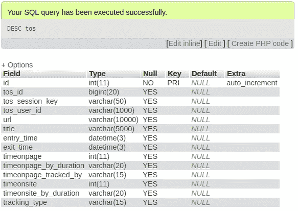

**tos** schema in MySQL, most popular open source RDBMS

如您所见，这是一个非常简单的表，其中“ **tos_session_key** ”唯一地标识了用户会话。没有什么是强制性的，列用于存储现场时间和相关数据；一列用于保存页面标题，一列用于 url，一列用于页面进入时间，一列用于页面退出时间，一列用于用户类型等。所有其他字段都是不言自明的。请[查看描述每个字段](https://saleemkce.github.io/timeonsite/docs/index.html#getting-current-TOS-data)类型信息的文档。

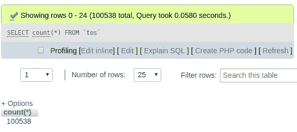

tos table records count -MySQL

## *查询单个 tos_session_key 的记录集

record set for single tos_session_key -query

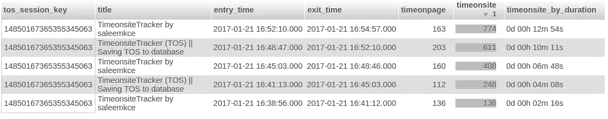

record set for single tos_session_key; top row in timeonsite column contains final timeonsite for given session-results

## *使用 timeonsite-tracker 及其分析工具，您会有什么期望？

*   **对数据的完全控制**；你拥有所有的数据，因此隐私得到保证
*   **数据精度**
*   构建**简单到复杂的 SQL 查询**，发现见解并生成定制报告
*   **了解特定页面和应用使用的用户行为**

**让我们在这里探讨一下 timeonsite analytics 中的几个问题…..**

## *让我们来看看最近的 10 次会议…

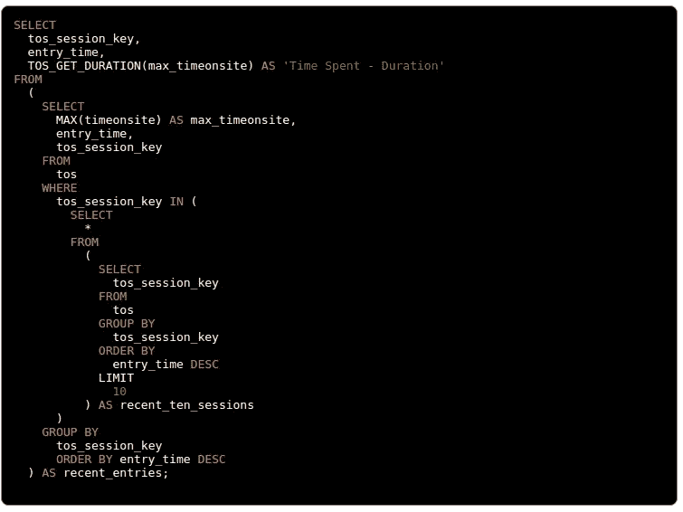

Recent sessions SQL query

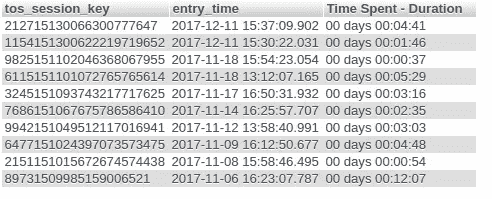

Recent sessions SQL query -results

[全时间查询 onsite_analytics 页面](https://github.com/saleemkce/timeonsite_analytics/blob/master/tos_ten_recent_sessions_duration.sql)

我们查询最近的 **tos_session_key** ，并从结果集中获取其最大 **timeonsite** 条目。然后我们按**条目 _ 时间**排序结果。所以，我们首先得到最近的会话；然后我们应用**限制**从用户会话中过滤出 10 条记录。

这里，我们使用 **TOS_GET_DURATION** 函数将秒转换为用户友好的格式，即总的持续时间。

## *让我们根据总花费时间来查找独特的帖子…

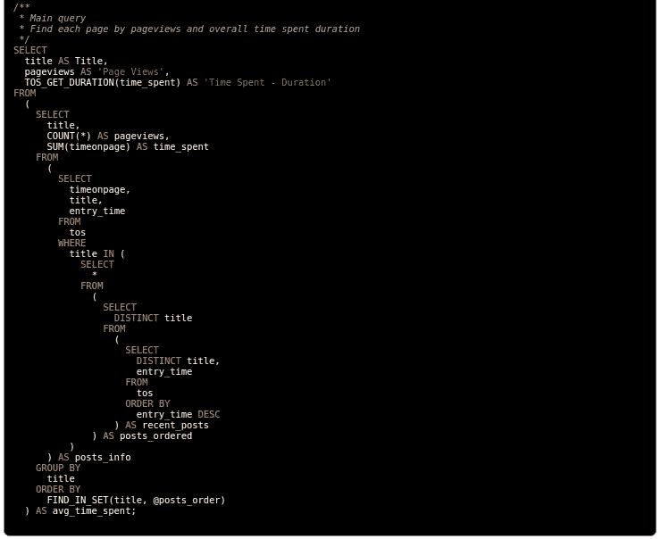

All posts overall duration -query

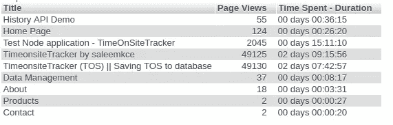

All posts overall duration -results

[全时间查询 onsite_analytics 页面](https://github.com/saleemkce/timeonsite_analytics/blob/master/tos_post_pageview_time_spent.sql)

这是一个相当大的查询，但很简单(嵌套子查询)，由两部分组成。一个用于查找最近访问的帖子，并将其顺序存储在变量中。另一个是实际查询，查找每个帖子的浏览量，并计算每个帖子花费的总时间。

让我们简要解释一下主要的查询，即第二个查询。我们查询唯一的**标题**，即按照最近的顺序与**条目 _ 时间**一起的帖子。然后，我们从带有标题的结果集中查询 **timeonpage** 。最后，我们使用记录上的 **COUNT** 函数来查找页面浏览量，使用 timeonpage 上的 **SUM** 函数来计算每个帖子花费的总时间。我们还应用了 **TOS_GET_DURATION** 来转换成想要的输出格式。

## *让我们找出上个月单个帖子的总时长…

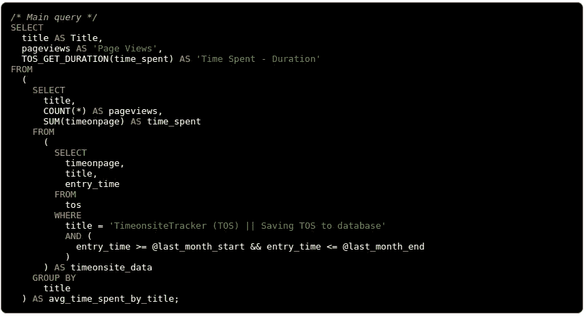

Single post overall duration last month -query

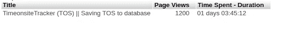

Single post overall duration last month -results

[全时间查询 onsite_analytics 页面](https://github.com/saleemkce/timeonsite_analytics/blob/master/tos_single_post_last_month_pageview_time_spent.sql)

这个查询与我们现在看到的最后一个非常相似，因为它捕获了所需帖子的浏览量和在同一篇帖子上花费的总时间，除了我们不需要任何额外的查询来查找最近的帖子顺序，因为我们查询手头的单个已知帖子，即我们查询单个页面标题(**WHERE title = "**Nature ' s beauty in Amazon forest**"**)。

## *帖子的访问有短有长？

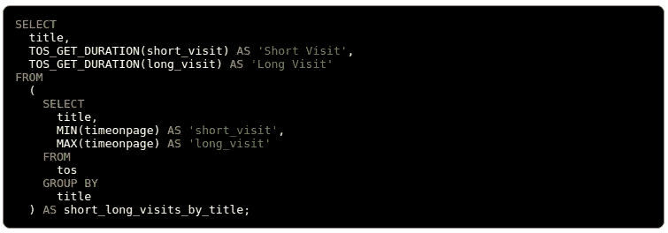

Short & long visits duration -query

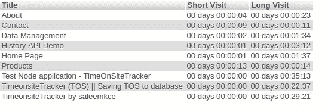

Short & long visits duration -results

[全时间查询 onsite_analytics 页面](https://github.com/saleemkce/timeonsite_analytics/blob/master/tos_short_long_visit_posts.sql)

这是另一个简单的查询，用于查找应用程序中所有帖子的最短和最长访问持续时间。它帮助我们比较帖子/页面，询问为什么某些页面没有得到用户的预期关注，并找到哪些帖子变成了最受欢迎的访问。

这个查询非常简单，不言自明，因为我们没有像前面的场景那样使用任何子查询。我们对每个 **timeonpage** 应用 **MIN** 和 **MAX** 函数，并按 **title** 对结果进行分组，以找到每个帖子的 **Short & Long visit**

## *按持续时间划分，用户类型“花费的时间”是什么？

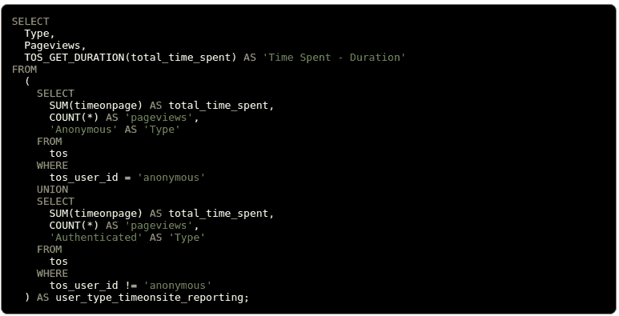

user type time duration -query

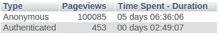

user type time duration -results

[全时间查询 onsite_analytics 页面](https://github.com/saleemkce/timeonsite_analytics/blob/master/tos_time_spent_by_user_type.sql)

## *过滤数据和修改结果集

在上面的大多数查询中，我们可以根据需要应用过滤来定制数据并找到感兴趣的记录集。例如，您通常可以通过应用 **SQL 条件**进行过滤，

***其中 entry _ time = ' 2015–07–22 '***

***其中 title= '首页'&&entry _ time = ' 2010–07–22 '***

***介于 entry _ time = ' 2015–07–22 '和 entry _ time = ' 2016–07–22 '***

***按时间顺序现场 DESC 限制 50***

只有当您应用所需的过滤器并添加定制的查询时，分析才会变得更有趣。

## *性能说明

这篇文章不是关于优化 SQL 查询/MySQL 表来提高查询性能。相反，它只是说明了我们可以通过 timeonsitetracker.js 从 timeonsite analytics 中挖掘哪些数据和见解

对于本文，我们使用 MySQL 表保存大约 **100k 条记录**。在大多数情况下，在本地机器上查询这些有价值的数据大约需要**2 到 8 秒**。您需要创建必要的索引、优化查询和微调数据库，以便在处理**数百万条记录和实时创建分析**仪表板时大幅提高性能。

## *在 timeonsite analytics 中构建和分享您自己的查询

我们在 timeonsite analytics 中仅仅触及了皮毛。有许多[关键查询随时可用](https://github.com/saleemkce/timeonsite_analytics/)，提供关于网站使用的更多见解。这个查询列表目前可能很小。此外，这只是这种分析数据和寻找见解的方式的一个起点。更多有价值的查询将被添加到这个分析中心，以便企业可以使用这些查询并为其应用程序获得现成的定制报告。

您可以构建更多适合您的应用程序的有趣查询，并与 analytics hub 共享，以便其他人了解查询 timeonsite 数据和页面访问持续时间的新方法。毫无疑问，**现有的查询可以用更好的方式编写**。改进真的很感谢。

## *谁是使用 timeonsite analytics 的最大受益者？

*   银行网站
*   学术网站
*   旅游服务
*   新闻网站和出版物
*   金融服务
*   分析应用
*   实时应用和时间关键型系统
*   消费者网站和更多…

## *开始在您的应用程序中集成 timeonsite-tracker.js？

如果你还没有开始使用它，你很可能**错过了帮助你做出关于用户和网站使用的明智决定的关键洞察力**。今天就开始使用它，找到推动你的业务的关键措施，并帮助你投资于最大化利润的领域。虽然使用追踪器每年要交一小笔费用，但检查一次还是值得的。否则，您可以在非生产领域使用它，在那里可以免费测试和使用。

如果你觉得这篇文章有趣且有价值，请随意[点击项目页面](https://github.com/saleemkce/timeonsite)上的明星，并在社交媒体上分享该页面。

****参考文献为 timeonsitetracker.js***

[Timeonsite-tracker.js](https://github.com/saleemkce/timeonsite)

[文档&实时演示](https://saleemkce.github.io/timeonsite)

[时间现场分析](https://github.com/saleemkce/timeonsite_analytics)

[媒体相关文章](/@saleemkce/time-on-site-tracker-for-web-analytics-timeonsitetracker-js-894958db3458)

## 这个故事发表在 [The Startup](https://medium.com/swlh) 上，这是 Medium 最大的创业刊物，拥有 333，853+人关注。

## 在这里订阅接收[我们的头条新闻](http://growthsupply.com/the-startup-newsletter/)。

