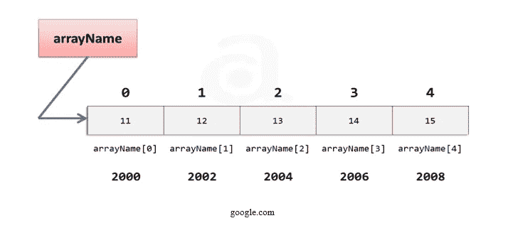
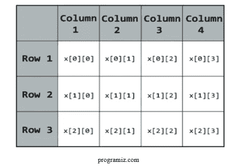
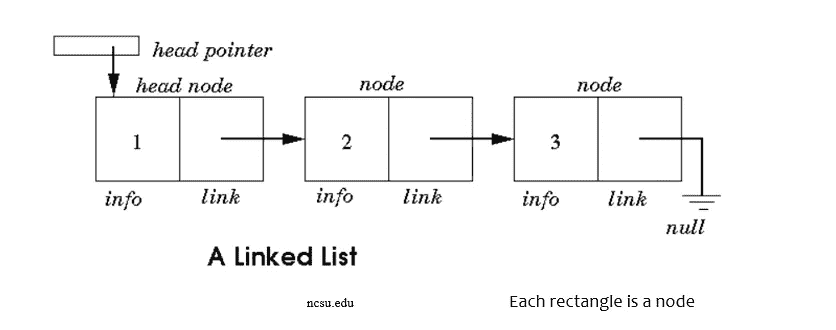
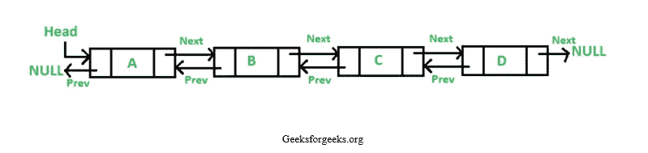
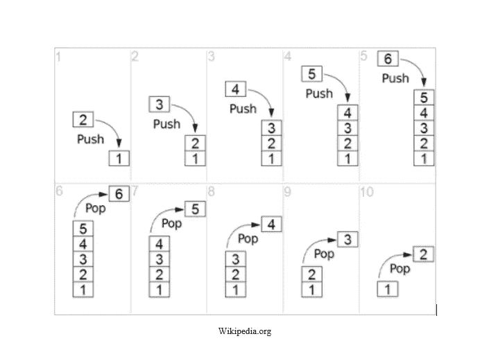
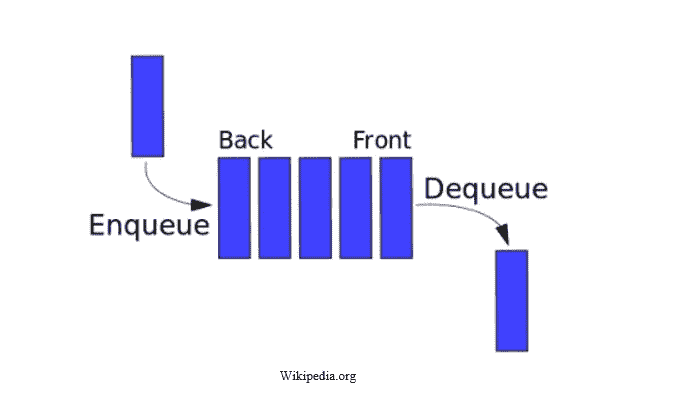
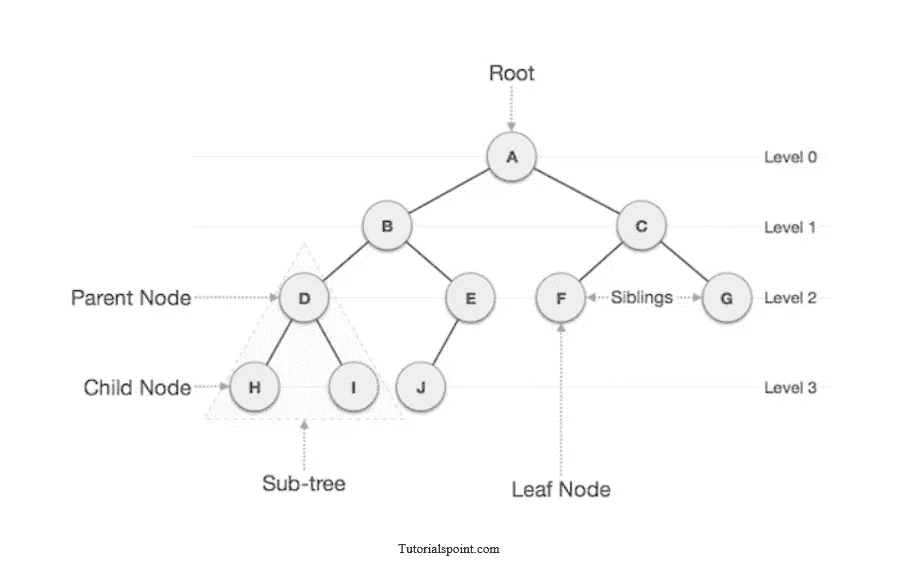
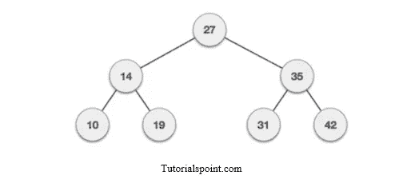

# 数据结构介绍

> 原文：<https://medium.com/swlh/introduction-to-data-structures-9134b7d064a6>

**什么是数据结构？**

即将就读于计算机工程、软件工程或计算机科学专业的大二学生报名参加了数据结构导论课，他们经常会问同一个问题:到底什么是数据结构？

回答他们问题的最简单的方法是将数据结构描述为一种组织和存储数据的方式，以便可以有效地执行操作。这使我们想到一个问题，我们谈论的是哪种行动？访问、插入、删除、查找和排序数据是使用数据结构可以执行的一些基本操作。并不是所有的数据结构都能高效地执行这些操作，这就是导致不同数据结构发展的原因。假设你要在一个杂乱无章的图书馆里找到一本特定的书，这个任务会花费大量的时间。就像图书馆组织它的书籍一样，我们需要组织我们的数据，以便可以有效地执行操作。

如果您以前有过编程经验，您可能知道什么是预定义的数据类型。预定义的数据类型(如整数、字符串、布尔型)用于创建数据结构。数据类型的使用基于用户需求和他们想要存储的数据类型。现在让我们深入了解日常编程中使用的数据结构，我们还将了解不同编程语言对数据结构的支持。

# **一维数组**

日常编程中使用的基本数据结构是数组。一个数组可以容纳固定数量的容器来存储数据，并且可以根据用户的需要对这些数据执行操作。

在上图中，一个名为 *arrayName* 的数组被定义为整数数据类型。下面的粗体数字显示了数组中每个容器被分配到的内存地址。这里要记住的重要一点是，数组索引总是从 0 开始，到(总数组大小-1)结束。所以，假设你定义了一个长度为 5 的数组， *arrayName[5]* ，那么这个数组的索引就是 *arrayName[0]* ， *arrayName[1]* ， *arrayName[2]* ， *arrayName[3]* ， *arrayName[4]* 。

# 多维数组

多维数组只是普通数组的扩展，在普通数组中，我们用一行容器定义一个数组。在多维数组的情况下，我们有行也有列。为了访问一个索引，我们需要两个数字。

在上图中，我们定义了一个有 3 行 4 列的 *arrayName[3][4]* ，总共有行*列(3*4)个索引。由于其结构，多维数组有时被称为表或矩阵。

# 动态数组

大多数编程语言都允许定义动态数组，这意味着内存是在程序执行期间分配的。请这样想，您定义了一个有 10 个索引的数组，但是您只需要 3 个索引，因此剩余的 7 个索引被浪费了，从而消耗了额外的内存。动态数组给了你根据程序需求分配内存的灵活性。

# 支持不同编程语言的数组:

Java:-有几个数组类，但是最著名的是 *ArrayList* 类。

C++:向量用于表示 C++中的动态数组。可以使用 *std::vector* 来实现。

Python:- Python 有一种新的数据类型，称为*列表*，就像布尔和整数一样。列表数据类型可以用来动态定义数组。

# 单向链表

链表是由链接连接的节点的集合。链表包含一个节点，它存储数据项和下一个节点的地址。第一个节点通常被称为头节点，最后一个节点被称为尾节点。头节点的指针指向下一个节点，尾节点的指针指向空。

这种数据结构的动态性使得添加或删除节点变得更加容易。为了添加/删除一个节点，您只需要跟踪前一个节点和后一个节点，并相应地调整指针。

# 双向链表

双向链表和单向链表没有太大的区别，唯一不同的是指向前一个节点的指针。下面的图片可以给你一个大概的结构。

在双向链表的情况下，头节点的上一个指针指向 Null，尾节点的下一个指针指向 Null。前一个指针使得在任一方向上遍历变得更加容易。因此，节点的添加和删除变得超级容易，你需要做的就是跟踪上一个节点和下一个节点，并相应地调整指针。

# 循环链表

循环链表是所有节点连接起来形成一个圆的链表。没有头节点或尾节点。拥有这种类型的链表的好处是任何节点都可以作为起点。

# 数组和链表的比较

列表是一种不同于数组的数据结构。阵列需要连续的内存空间，而不是将数据存储在内存块中。如果向数组中添加一个元素，可能会改变整个数组的内存位置，但数据保持不变。数组给你一个索引号，因此，你可以直接或顺序地访问它。而要访问任何数据成员，就必须遍历整个列表。

# 支持不同编程语言的链表:

Java:- Java 有一个名为 *LinkedList* 的内置类，可以用来实现一个链表。

C++:和 Java 一样，C++也有一个标准的模板库，叫做 *list* ，用于链表的实现。

Python:- Python 还有一个内置模块 *llist* ，它实现了链表。

# 堆

你可能在日常生活中听说过这个词，不管它是指桌子上的一副卡片还是一本书。嗯，数据结构的工作方式与您在现实世界的堆栈上执行操作的方式类似。例如，您只能在书库顶部添加或移除书籍。

堆栈是一种 LIFO 数据结构，这意味着后进先出，最后到达的项目是第一个出去的。堆栈可以使用数组或链表来实现。考虑一摞书，最后一本书显然会放在最上面，如果你想拿走一本书，你会从最上面拿走一本。堆栈可以执行的三个基本操作是:

Push —将数据输入堆栈并将其放在顶部。

Pop 从顶部删除数据。

查看—查看顶部的数据，而不删除它。

下图显示了这些操作对结构的影响

# 支持不同编程语言的链表:

Java:- Java 有一个名为 *Stack* 的内置类，可以用来实现堆栈数据结构。

C++:和 Java 一样，C++也有一个标准的模板库，叫做 *stack* ，用于链表的实现。

Python:- Python 没有显式的栈类，但是列表可以作为栈来实现。

# 长队

就像单词栈一样，单词队列也来源于日常活动。你很可能在超市的收银台看到过一队人，最后一个来的站在最后，第一个来的是第一个去结账的。以类似的方式，队列在两端执行操作。

队列是一种先进先出的数据结构。像堆栈一样，队列可以使用数组或链表来实现。对队列最常执行的三个操作是:

入队—将数据输入堆栈并将它们放在底部。

出列-从顶部删除数据。

查看—查看顶部的数据，而不删除它。

# 支持不同编程语言的队列:

Java:- Queue 可以使用 Java 中的 *List* 类来实现

C++:和 Java 一样，C++也有一个名为 *Queue* 的标准模板库，用于队列实现。

python:-python 中的*队列*模块提供了*队列*类的功能。由于队列可以使用链表来实现，因此， *list* 也可以使用。

# 树

树形数据结构类似于一个上部的树，在顶部我们有一个根节点，它被分成一个左节点和一个右节点。它们之间有链接，连接所有的节点。与一个节点只能连接到一个节点的链表不同，树可以有一个节点连接到两个或更多的节点。

# 二分搜索法树

二分搜索法树是一种特殊的树，其左节点总是小于父节点，而右节点总是大于父节点。为了添加/删除节点，我们必须将值与根节点进行比较，然后遍历到特定的点进行插入/删除。

# 支持不同编程语言的树

Java:- Java 没有任何内置的类来实现树形数据结构。

C++:就像 Java 一样，C++在标准模板库中也没有任何容器来实现树。

Python:- Python 没有内置的数据结构，所以为了实现树，你必须手动创建结构。

# 结论

在决定哪种数据结构满足您的需求时，您需要考虑一些要点。除非你有一个非常大的数据集，否则你使用哪种数据结构并不重要。在实现数据结构之前，您需要问自己的问题是:

*   你需要存储多少数据？
*   您多久访问一次数据？
*   数据的目的是什么？您需要访问、插入、删除或排序数据吗？

对于不同的数据结构和不同的编程语言，算法的工作方式是不同的，所以在实现数据结构之前，您需要理解语言各自的语法。

## 这个故事发表在 [The Startup](https://medium.com/swlh) 上，这是 Medium 最大的创业刊物，有 295，232+人关注。

## 订阅接收[我们的头条](http://growthsupply.com/the-startup-newsletter/)。

