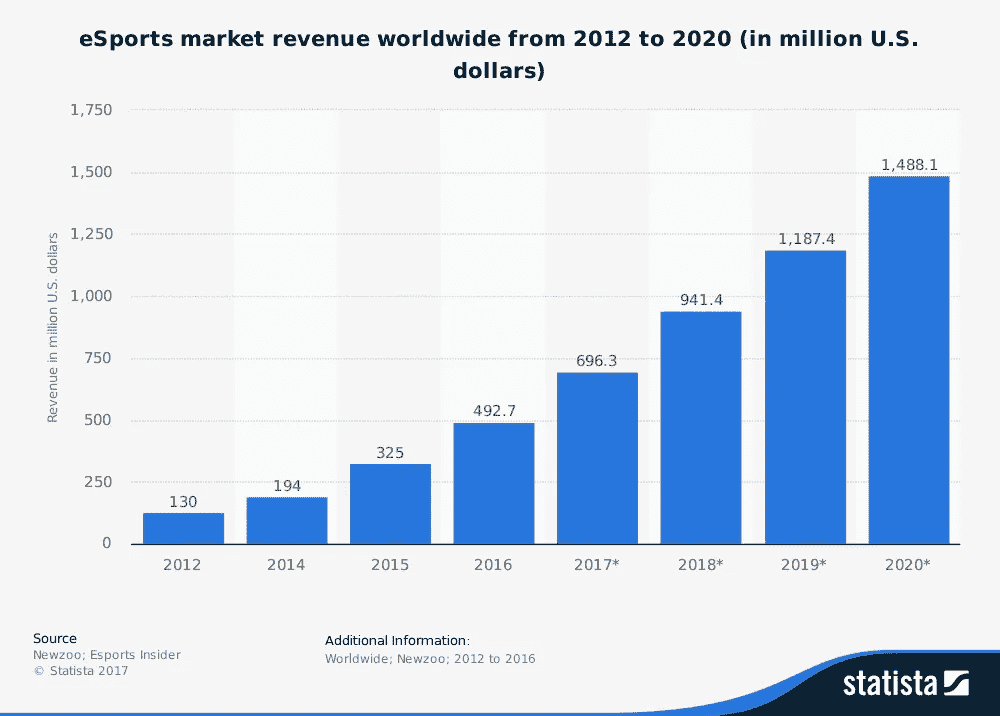
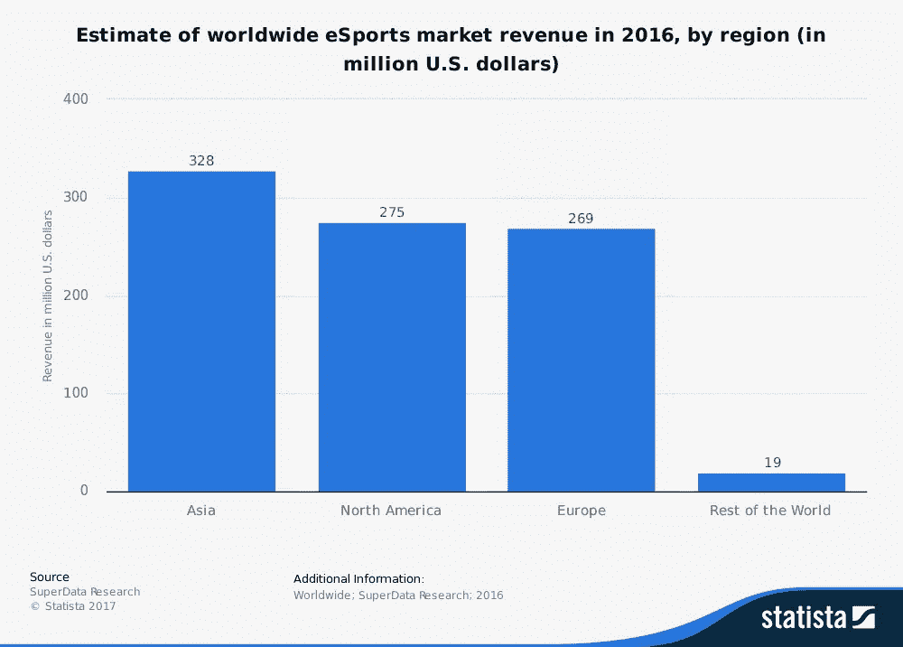

# 电子游戏简介

> 原文：<https://medium.com/swlh/introduction-to-egaming-d4f75f88baca>

视频游戏早已不再仅仅是躲在客厅里的孤独玩家的娱乐。玩家们在 2000 年代末看到了巨大的转变。比赛和锦标赛变得更加专业，开始吸引观众和观众，游戏开发商在新游戏中加入了有利于这种比赛的功能。

今天，视频游戏不仅是一种网络活动，而且还以电子竞技的形式成为一种定期安排的盈利性消遣。电子竞技可以被描述为有组织的多人游戏活动，大多在职业选手之间进行。通常会有一系列的锦标赛，最终会有地区性和全球性的锦标赛。

随着游戏和体育的交叉提供了一波创新的品牌机会，吸引了全球数百万人的内容和活动，围绕电子竞技的快速增长现象继续聚集蒸汽。

尽管电子竞技市场正处于形成阶段，但它确实在快速增长。2016 年，全球电子竞技市场收入达 4.927 亿美元。到 2020 年，该市场预计将产生超过 14.8 亿美元的收入，这表明年复合增长率为 32%。

这些收入来自投注、奖金池和锦标赛，但绝大多数来自赞助和广告，这在 2016 年带来了近 6.61 亿美元的收入。查看最新的区域盈利数据，亚洲被认为在 2016 年产生了很大一部分收入，其次是北美和欧洲，北美的电子竞技市场规模为 2.75 亿美元。

凭借这种潜在的收入，该市场将吸引大量的爱好者，如 F1 或奥运会观众。在下一篇文章中，我们将探讨电竞市场的受众市场。

## 这篇文章发表在 [The Startup](https://medium.com/swlh) 上，这是 Medium 最大的创业刊物，有 271，476+人关注。

## 订阅接收[我们的头条](http://growthsupply.com/the-startup-newsletter/)。

