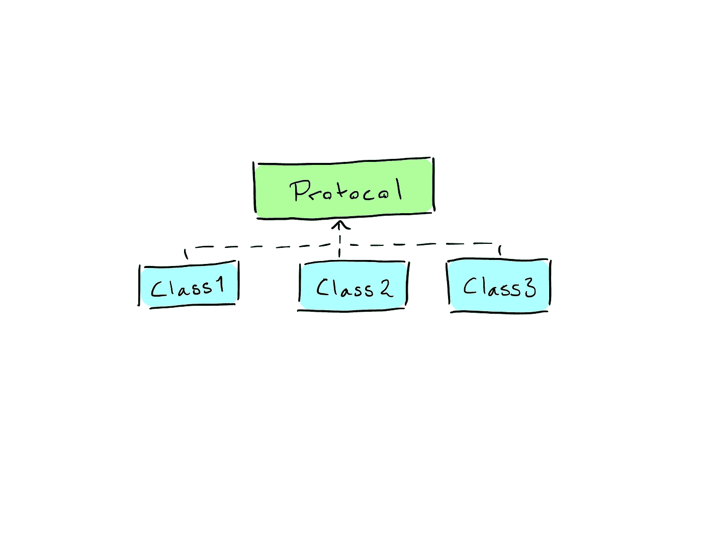

# 面向协议编程介绍

> 原文：<https://medium.com/swlh/introduction-to-protocol-oriented-programming-1ff3862f9a3c>

在过去几年中，面向协议的编程获得了很大的吸引力，并成为 Swift 社区中的热门词汇。有人爱它，有人恨它，但它到底是什么？它应该解决什么问题？它与我们钟爱的面向对象编程有什么关系？

# 什么是面向协议的编程？