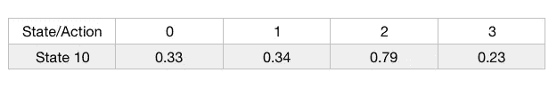

# 强化学习介绍(编码 Q 学习)——第三部分

> 原文：<https://medium.com/swlh/introduction-to-reinforcement-learning-coding-q-learning-part-3-9778366a41c0>


Talk is cheap. Show me the code — Linus Torvalds

> 在前一部分中，我们看到了什么是 MDP，什么是 Q 学习。现在，在这一部分，我们将看到如何解决一个有限的 MDP 使用 Q 学习和编码。

# 奥鹏健身馆

如 OpenAI 健身房[官网](https://gym.openai.com/)所述:

> Gym 是一个开发和比较强化学习算法的工具包。

我们将使用这个工具包来解决[冰冻湖](https://gym.openai.com/envs/FrozenLake-v0)的环境。有各种各样的游戏可用，如雅达利 2600 的，基于文本的游戏等。点击查看全部[。](https://gym.openai.com/envs/)

# 装置

使用此处提供的[步骤安装 gym。首先安装体育馆库，然后安装操作系统特定的包。](https://github.com/openai/gym)

现在，让我们看看如何使用健身房工具包。

导入健身房使用:

```
import gym
```

然后，指定你想要使用的游戏，我们将使用 FrozenLake 游戏。

```
env = gym.make('FrozenLake-v0')
```

游戏的环境可以被重置为默认/初始状态，使用:

```
env.reset()
```

要查看游戏 GUI，请使用:

```
env.render()
```

官方文档可以在[这里](http://gym.openai.com/docs/)找到，在这里你可以看到 gym toolkit 的详细用法和解释。

# 冰冻湖游戏

现在，让我们看看什么是冰冻湖游戏。

想象一下，你站在一个结冰的湖上。这个湖并不都结冰了，有些地方冰很薄。你的目标是从地点 S 到 G，不要掉进洞里。


[Source](https://www.google.co.in/url?sa=i&rct=j&q=&esrc=s&source=images&cd=&cad=rja&uact=8&ved=2ahUKEwjnpe-owY_cAhUGVH0KHVyTAYAQjRx6BAgBEAU&url=https%3A%2F%2Fanalyticsindiamag.com%2Fopenai-gym-frozen-lake-beginners-guide-reinforcement-learning%2F&psig=AOvVaw095bfUMvJGKysgeHZjz6ZT&ust=1531139425155647)

这里，S 是起点，G 是目标，F 是代理人可以站立的固体冰，H 是如果代理人去，它会掉下来的洞。

代理有 4 种可能的移动，在环境中分别表示为 0、1、2、3，分别表示向左、向右、向下、向上。

对于每个状态 F，代理人获得 0 奖励，对于状态 H，它获得-1 奖励，因为在状态 H 中，代理人将死亡，并且在达到目标时，代理人获得+1 奖励。

游戏在终端中呈现后看起来像这样:


FrozenLake-v0

这里的状态是 F、S 和 g，也就是说有 4x4=16 个状态和 4 个动作。

为了使用 Q-learning 解决这个游戏，我们将利用我们在[上一部分](/@adeshg7/introduction-to-reinforcement-learning-part-2-74e0a3fad9d3)中看到的理论。

这是使用 Q-learning 解决“FrozenLake-v0”环境的代码。这是非常直接的，你会觉得很舒服，直到文章结束。

我们来解剖一下。

第 1–3 行是导入我们将使用的库。 **Numpy** 用于存储 Q 表，而 **pickle** 用于将我们的 Q 表保存为“pkl”文件。

第 5 行初始化 FrozenLake 环境。

第 7–12 行初始化我们的变量。***ε***对于ε-贪婪方法，***γ***是折扣因子，***max _ 剧集*** 是我们将运行游戏的最大次数， ***max_steps*** 是我们将运行每一集的最大步数， ***lr_rate*** 是学习率。

第 14 行将我们的 Q-table 初始化为一个填充了零的 16x4 矩阵。***env . observation-space . n***告知游戏中状态总数***env . action-space . n***告知动作总数。

在第 30 行，我们开始播放剧集。

在第 31 行，变量 ***state*** 使用 ***env.reset()*** 存储初始状态。

在第 32 行， ***t*** 用于存储时间步数。

使用第 35 行，环境被渲染。

在第 37 行，选择适当的动作。这是使用***ε贪婪*** 方法完成的。参见第 16–22 行，这里我们随机生成一个 0 到 1 之间的数，看看它是否小于ε。如果它较小，那么使用***env . action _ space . sample()***选择一个随机动作，如果它较大，那么我们选择在 Q 表中具有最大值的动作作为状态: ***状态*** 。例如:



State 10 with q values

假设，对于状态 10 中的动作 0–3，其值为 0.33、0.34、0.79 和 0.23。对于动作 2，最大 Q 值是 0.79，并且该动作 2 被选择用于状态 10。

在第 39 行，我们选择的行为发生在环境中，下一个状态，行为的奖励被返回。 ***done*** 如果剧集已经终止，则返回 true，并且 ***info*** 存储用于调试的额外信息。

此时，我们有:

1.先前的**状态，*状态，*状态，**。

2.下一个状态， ***state2。***

3.而 ***动作******奖励*** 为 ***状态 2*** 。

在第 41 行，我们使用上面的信息通过下面的等式使用函数 ***learn(state，state2，reward，action)*** 来更新我们的 Q 表:


Q-value updation equation

在更新 Q-table 后，我们将第 43 行的 ***状态、*** 状态设置为当前状态、 ***状态 2*** 。

第 45 行的时间步长增加。第 47–48 行检查 done 是否为真，也就是说，这一集是否结束。

在第 54 和 55 行，我们将 Q 表保存到*“frozen lake _ Q table . pkl”文件中。*

仅此而已。请随意摆弄代码。

# FrozenLake 在行动

运行上面的代码，你会看到游戏在运行。但是，请耐心等待，因为完成 10000 集需要一些时间。


Agent in action

你可以在之后加载 Q-table 并使用下面的代码玩游戏。这相当简单。下面的代码中只删除了培训部分。

请继续关注强化学习的更多乐趣。快乐探索😄。

请点击👏按钮，如果你喜欢这个帖子，拿着它给更多的爱。

如果您希望连接:

[**推特**](https://twitter.com/gautamades)**[**insta gram**](https://www.instagram.com/adeshgautam/)**[**LinkedIn**](https://www.linkedin.com/in/adesh-gautam-518810127/)**[**Github**](https://github.com/adesgautam)******

****[](https://medium.com/swlh)****

## ****这个故事发表在 [The Startup](https://medium.com/swlh) 上，这是 Medium 最大的企业家出版物，拥有 343，876+人。****

## ****在这里订阅接收[我们的头条新闻](http://growthsupply.com/the-startup-newsletter/)。****

****[](https://medium.com/swlh)****