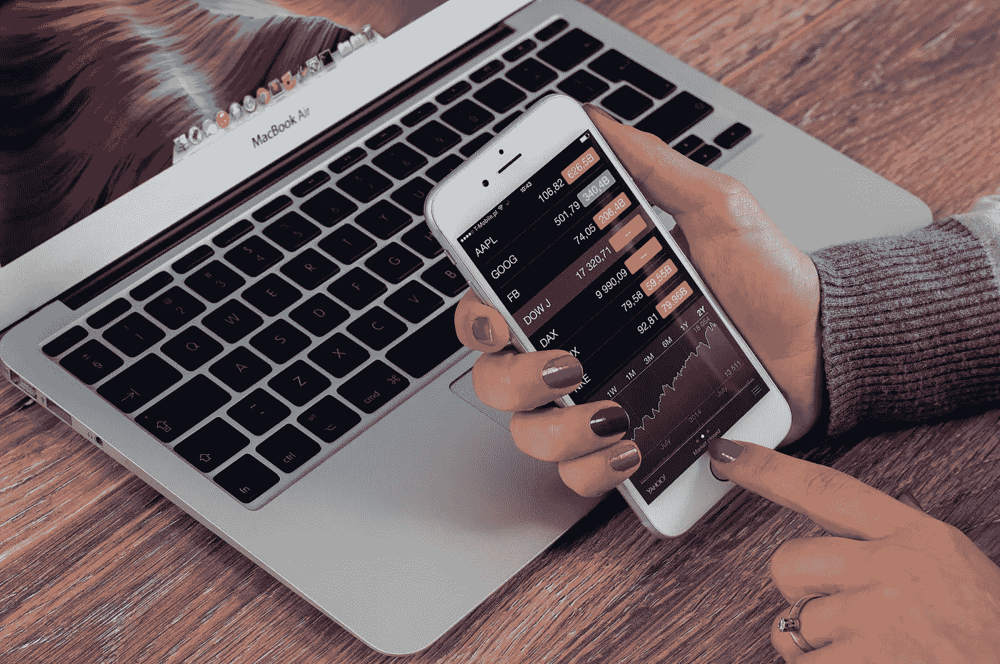
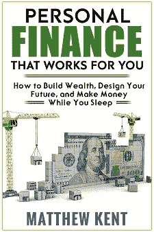

# 投资现在是免费的——是时候开始储蓄了

> 原文：<https://medium.com/swlh/investing-is-now-free-time-to-start-saving-7a7fb24c45a9>

## 富达如何通过 FZROX 改变了游戏规则，这对您意味着什么

Photo by [William Iven](https://unsplash.com/photos/dAmHWsRYP9c?utm_source=unsplash&utm_medium=referral&utm_content=creditCopyText) on [Unsplash](https://unsplash.com/search/photos/graph?utm_source=unsplash&utm_medium=referral&utm_content=creditCopyText)

我们都听说过这样一句话“你得到你所付出的”，但是投资，事情有点不同:

> 在投资中，你会得到你没有付出的东西。

换句话说，你支付的费用和费用越多，随着时间的推移，为你保持增长而投入的资金就越少。

# 投资的基础

在我们谈论为什么刚刚发生的事情如此重要之前，我们需要确保我们对投资有一个坚实的理解。

当你投资股票市场时，你买的是真实公司的一小部分。

这是一件伟大的事情，因为那些公司正在不知疲倦地工作以获得收入。作为一个所有者，你根本不需要工作，但是你可以从工作的人那里得到好处。

投资企业的问题在于，它们可能会倒闭，而你的投资可能会变得一文不值。

## 共同基金

那你是做什么的？你可能已经知道答案了——通过分散投资来降低风险。你投资的公司越多，你就越不用担心其中一些会倒闭。

但是等一下，这只是提出了一个更大的问题，你从哪里得到钱来投资各种各样的公司？

解决办法很简单:你投资一个共同基金。顾名思义，共同基金是一种拥有“共同”所有权的基金。许多人把钱投入一个集体基金，这些钱被用来购买股票。所以你自己可能没有足够的钱来分散投资，但是基金有。

哎呀，我们在这方面取得了一些进展，但看起来我们意外地遇到了另一个问题:价格。(几乎)生活中没有什么是免费的，通常共同基金会带来巨大的成本。事情的通常运作方式是，有一个“基金经理”拿着丰厚的报酬挑选构成基金的股票。

如果他从你的投资中获得的回报能弥补你支付的费用，这没问题，但在任何一年，大多数基金经理都无法超越市场整体的平均回报。即使是那些跑赢市场的人，也不能长期坚持下去。

共同基金的价格可能很高，通常是基金价值的 1%。这听起来可能不是很多，但请记住，你支付的每一美元的费用和开支都会随着时间的推移而复利。

同样，在投资中，你会得到你在 T2 没有得到的东西。

精明的投资者将寻找一种方式，以尽可能低的成本匹配市场的整体回报，而不是以高成本获得一只传统的共同基金，其基金经理也无法长期跑赢市场。

## 指数基金

1976 年，约翰·c·博格尔——又名杰克，是先锋集团的创始人——创造了第一只指数化共同基金，从而永远改变了投资游戏。

指数基金是一种共同基金，它依靠一个基准(或“指数”)来确定它应该持有什么股票，而不是让基金经理利用他们(有缺陷的)判断来买卖股票。

也许最著名的基准是标准普尔 500 标准普尔 500 家美国大公司加权指数，占整个股票市场的大部分价值。

我个人倾向于总股票市场指数基金，其中包括构成标准普尔 500 的股票以及较小的公司。人们经常用标准普尔 500 作为整个市场的代表，但我更喜欢拥有尽可能多的整个市场。

指数基金有两大优势:

第一个是你买的是(接近)整个市场，所以你得到了市场回报率。随着时间的推移，大多数积极管理的共同基金将无法跑赢市场，甚至那些过去表现良好的基金也不一定会在未来继续这样做。

第二，你是在以尽可能低的成本投资。

记得我之前说过，主动管理型基金的费用率为 1%并不少见，我们来看看这两只优秀基金的费用率:

*   先锋总股票市场:0.04%
*   查尔斯·施瓦布股市总指数:0.03%

不受费用侵蚀的高回报使指数基金成为一种非常精明的投资。再加上你几乎不需要了解任何投资知识，也几乎不需要做任何工作，你就有了一个真正的赢家。

## FZROX

这让我们看到了国际清算银行上周的新闻，即富达推出了一只总费用率为 0.0%的股票市场基金。

令人难以置信的是，这意味着当你投资 FZROX 时，你是在免费投资整个股票市场*。*

*现在，来自 Vanguard 和 Schwab 的指数基金已经处于*非常低的成本，但是免费仍然很重要。**

*0.04%的费用率相当低，但随着时间的推移，它很容易复合，悄悄地让你花费数万美元。*

*如果你已经有了一只低成本的指数基金，你可以继续投资，做得很好。但是如果你想开始存钱，FZROX 是一个很好的选择。*

*如果你还需要一点帮助，这篇文章的其余部分是一个完整的投资指南——一个你会真正理解的指南。*

# *开始前您需要知道的一切*

*好消息是，到目前为止，你已经比大多数人更了解股票市场，并且几乎了解了所有必要的知识。*

*为了缩小你所知道的和剩下的之间的差距，让我们从不同种类的账户开始，讨论几个更重要的点。*

## *投资账户*

*有不同类型的账户可以用来投资股票市场，分为两大类:常规经纪账户和税收优惠账户。*

*税收优惠账户就是你通常听说的退休账户，比如 401k 账户和 IRA 账户。你能贡献多少是有限制的，但是它们应该是你投资的第一个地方。*

*   *401k(你在工作中拥有的)和 IRA(你可以在富达或先锋等公司开设的个人退休安排)是*延税账户*。这意味着，当你缴款时，他们会降低你缴款当年的应税收入，导致你少缴税。这些钱是免税的，当你取出来的时候就要交税。*
*   *Roth 401k 和 Roth IRA 在增长时同样免税，但在其他方面则相反。他们不会降低你当年的应纳税收入，导致你现在多缴税，但在你提取时不用缴税。*

*一般的经验法则是，如果你认为退休后收入会更高，就选择罗斯，如果你认为现在收入会更高，就选择传统的罗斯。*

*如果你还不确定，我建议你选择传统型，如果你提前退休，这是一个更好的选择，而且可以在以后转变为罗斯型，正如《疯狂的狂热》杂志的这篇精彩文章所解释的那样:*

* [## 传统个人退休帐户与罗斯个人退休帐户-提前退休的最佳选择

### 传统个人退休账户和罗斯个人退休账户，你应该选择哪一个？每个人都有自己的看法，但没有人有一个明确的…

www.madfientist.com](https://www.madfientist.com/traditional-ira-vs-roth-ira/) 

无论如何，如果你足够幸运，在某个与你的贡献相当的地方工作，你首先应该做的就是对你公司的 401k 计划进行足够的投资，以获得雇主匹配。

在我的工作中，他们为我的贡献匹配高达 6%的工资。这种瞬间 100%的投资回报基本上胜过了你能想到的所有投资。

把你的 401k 投资到你能找到的成本最低的指数基金。如果他们有像 Vanguard 的 VTSAX 这样的基金，那是一个很好的选择。我的工作没有 VTSAX，但是他们有 VFIAX，Vanguard 的标准普尔 500，所以我的 401k 就是投这个的。

寻找像“指数”、“总市场”和“标准普尔 500”(或者仅仅是“500”)这样的词，然后选择费用率最低的一个。如果你找不到低成本的指数基金，就去找一只“目标退休日期”基金。

一旦你的贡献足够让雇主匹配，就在富达(或先锋，或嘉信理财等)开一个传统的个人退休帐户。).在线操作需要 5-10 分钟。链接你的银行账户，转一些钱，投资 FZROX(或者 VTSAX，或者 SWTSX 等。— *注意:如果你的资金少于 1 万美元，你就不能投资 VTSAX。如果你想投资 Vanguard，并且资金不足 1 万美元，你可以投资一只名为“VTI”(T3)的 ETF。*

如果您达到了年度缴费限额，您可以增加您在 401k 中的投资金额。

如果你足够幸运，也达到了这个限额(如果你达到了，你就是在压榨它)，你可以在富达开一个定期应税账户，投资 FZROX。

## 资产配置

在某种程度上，你会希望比仅仅拥有一只投资于股市的基金更多元化一些。

这是因为市场是不稳定的。它总是随着时间的推移而增长(这也是我们投资 It 的首要原因)，但一路上会有很多起伏。

你永远不想在市场下跌时卖出(这是许多人都想做的)，但你想找到一些方法来保护自己免受市场波动的影响。

做到这一点的方法是投资一种与股票市场无关的资产，这样当你的市场下跌时，另一种投资就有机会保持稳定甚至获利。

人们用来平衡股市的最常见的资产类别是债券。例如，你可以投资一只股票市场指数基金，然后再投资一只债券市场指数基金。你可以选择一种配置，比如 75%的股票，25%的债券，当这些比例不可避免地失调时，定期“重新平衡”你的账户。

所以当股票价值下跌时，大多数人都会卖出，违反了投资最基本的规则(低买高卖)。如果你有一个维持 75/25 组合的策略，你将需要卖出债券和购买股票来恢复你的目标组合。再平衡过程本质上迫使你低买高卖，这与你的直觉相反。

对我来说，我计划在积累财富的同时，进行 100%的股票投资组合。原因是因为股票是让我的钱增值的最好方式，我不介意市场的涨跌。还有一个事实是，我有我的贡献，以平稳行驶一点。

一旦我需要开始退出，我会多分散一点。我可能会坚持简单的配置，只投资股票和债券。其他人喜欢增加国际股票市场基金和 REITs(房地产投资信托)，但我不喜欢把事情变得不必要的复杂。

不要让资产配置把你吓得太厉害。很重要，但是你在投资生涯中越早，越不重要。

现在最重要的事情就是首先开始。

关于资产配置的更多信息，这里有一篇来自《不可思议的吉姆·科林斯》的精彩文章:

 [## 股票-第二十三部分:选择你的资产配置

### 生活就是平衡和选择。多加点这个，少点那个。说到投资，这种平衡和…

jlcollinsnh.com](http://jlcollinsnh.com/2014/06/10/stocks-part-xxiii-selecting-your-asset-allocation/) 

## 早期投资

随着时间的推移，市场会上涨。它有起有落，但总的趋势将是上升的。

最好的投资策略是尽早投入尽可能多的资金到低损失指数基金中，从你能接触到的任何税收优惠账户开始。

我上个月从 Medium 赚了一点钱，一拿到工资，我就把它转到我的 Fidelity 账户，投资到 FZROX。

如果你已经读到这里，你已经有了一个可靠的投资计划，可以立即付诸实施。

请不要推迟。

# 结论

所以现在有两个理由开始投资股市:

对于股票市场，你总是想尽可能早地开始…

投资现在是免费的。

享受看着你的钱增长。

## 如果你喜欢这篇文章，你会喜欢我的书:

[***适合你的个人理财:*** *如何积累财富，设计未来，趁你睡觉时赚钱*](https://amzn.to/2JfESW8)

在亚马逊独家购买:

[https://amzn.to/2JfESW8](https://amzn.to/2JfESW8)

## 这篇文章发表在 [The Startup](https://medium.com/swlh) 上，这是 Medium 最大的创业刊物，拥有 358，974+人关注。

## 在此订阅接收[我们的头条新闻](http://growthsupply.com/the-startup-newsletter/)。

*