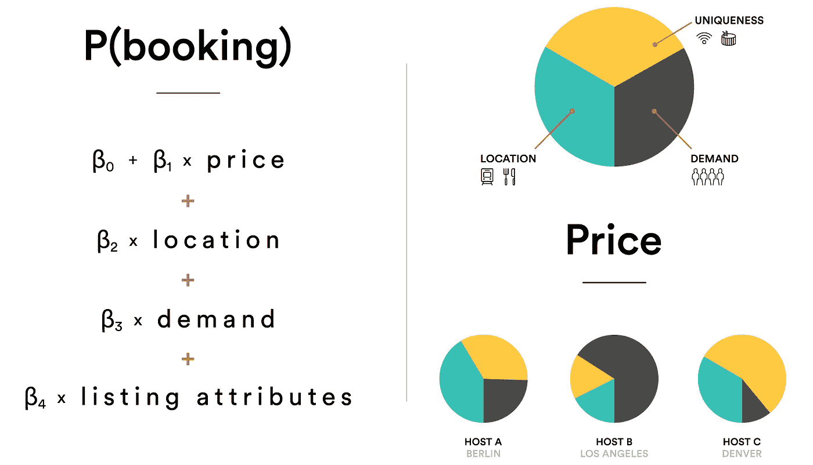
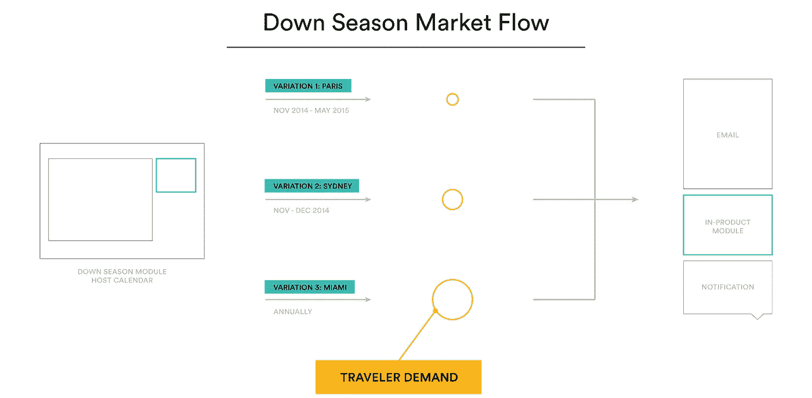
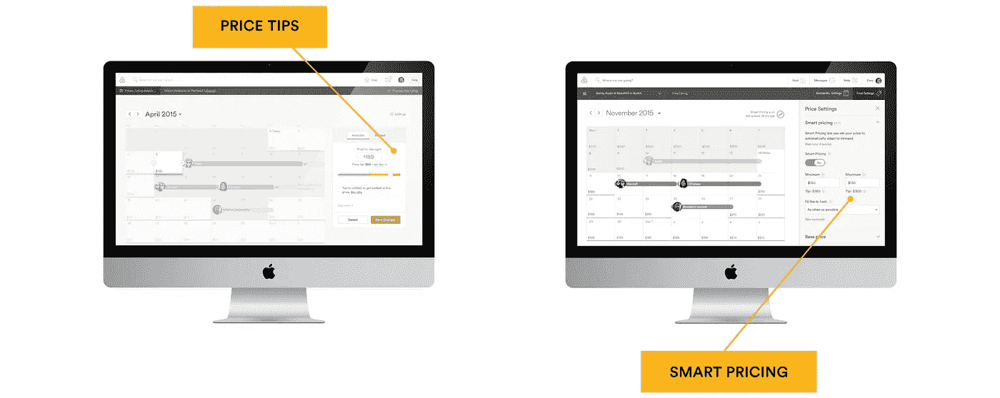

# 无形设计:与机器合作设计

> 原文：<https://medium.com/swlh/invisible-design-co-designing-with-machines-aea62a1e0f6d>

这台机器过去是，现在仍然是我忠实的伙伴。我需要她来将我头脑中的创造性想法转化为我可以与世界分享的切实想法。在我二十多岁的时候，从现代舞职业过渡到设计，我从未想过机器会成为我创新的帮凶。

机器在这一代迅速发展了智能，它们的能力正在改变我们设计的产品。它们的设计过程也需要发展。这篇文章是关于与机器合作设计的对话的开始，我称之为无形设计——一种为产品设计师提供的与人工智能和机器学习等技术合作的过程和设计语言。我相信这些过程和工具是未来产品设计的种子。

> **隐形设计——一种产品设计师使用人工智能和机器学习等技术的流程和设计语言。**

数学和科学是看不见的力量，当我们花时间去观察和分析它们时，它们会以更可识别的方式展现出来。举个例子，18 世纪，一位英国绅士漫步在他的花园里。他观察到一个苹果从树上掉下来，想知道为什么它没有从地上向侧面或向上掉下来。这怎么可能？起作用的力量是什么？它们是由什么制成的？同样的效果也适用于像苹果一样小和像马车一样大的东西吗？二十多年来，艾萨克·牛顿爵士一直在努力解决这些问题，这就是后来成为他的万有引力定律。他能够描述一种无形的力量，这种力量对我们的日常生活有着切实的影响。

无形的力量对我们生活的影响是意想不到的。我最近在浏览我的脸书 feed 时，注意到我的几个朋友喜欢 Simply Framed，这是一家允许你为海报和艺术品在线创建和订购定制框架的公司。我开始思考我衣柜里所有未装框的作品，并通过点击查看。是什么让我想尝试这种推荐？什么引起了我的注意？需要什么样的信息来个性化那个帖子？这里科学和数学的无形力量不是重力，而是脸书的算法。当谈到机器学习的力量以及这些产品在未来五到十年的发展方向时，广告软件只是一个受精卵。机器将越来越多地在用户体验中做出决定，与它们合作设计是未来产品设计的一个重要伙伴关系。

正如任何工艺一样，创造过程都有独立的组成部分——理解、工具和解释。当我在 Airbnb 的几次数据密集型产品发布会上经历这个过程时，我开始有了开发隐形设计的想法。我想分享一些我在自己的工作中观察到的想法。

> 你必须真正了解一件东西才能设计出一件东西。

你必须真正理解一个东西才能设计一个东西。想象一下，试图设计一架飞机，但对空气动力学一无所知，或者设计一只手套，但不知道它将用于什么环境或手的解剖结构。为了设计好一个产品，你必须了解某样东西能做什么。

去年，我的产品合作伙伴团队就一种机器学习模型进行了一次对话，这是一种新的定价工具，我们希望为我们的主机构建这种工具。我们试图创建一个模型来回答这个问题，“在未来的任何一天，一个上市的预定价格会是多少？”回答这个问题并不容易。我试图跟上我的数据科学合作伙伴描述他们正在构建的回归模型。他用的词是 alphas 和 betas，当他向我展示我可以理解的图表时，这种语言对我的设计背景来说是陌生的。后来我和他坐在一起，请他画出模型的草图，并告诉我怎么做。这是一次令人大开眼界的经历。当他开始说我所知道的语言——草图和图表——时，我立刻明白了这个模型和它想要达到的目标。这是我的电灯泡时刻。我明白机器可以为产品做什么，以及如何将信息整合到体验中。我们都对这种理解感到兴奋，一旦我们的语言障碍被打破，我们可以流畅地谈论产品的发展方向，我们就可以真正开始将产品思维提升到下一个层次。

*Smart Pricing regression model next to a visualization explaining the model is made of three parts that vary per host*

我意识到这次谈话不一定是一个孤立的事件，但可能会对我们的团队产生更大的影响。我们的讨论就像讲故事一样，就像设计师在笔记本上快速勾画屏幕一样。我从我的同事那里了解到，产品的故事并不局限于用户可以触摸和看到的屏幕，它还可以描述幕后发生的事情。在产品创建的初始阶段，通常会创建一个关于体验将如何影响最终用户的总体故事，以帮助每个人了解产品的外观和感觉。这些可以采取多种形式，从故事板到原型，战略甲板和图表。创建这些演示文稿的原因有很多，其中一个非常重要的原因是创建对产品愿景的共同理解。

> **理解赋予团队力量。建立共享的知识使创新成为一个渐进的变化，而不是一小步一小步。**

理解赋予团队力量。建立共享的知识使创新成为一个渐进的变化，而不是一小步一小步。将数据和机器在发现过程中扮演的角色可视化是无形设计的第一部分。

我将继续与我的团队合作，构建数据可视化，通过用户交互界面讲述故事。这些可视化往往随着我们正在创建的产品而变化，但结果总是它们有助于激励、启发和教育更广泛的产品团队。

在理解了我们正在设计的东西和它是如何工作的之后，我们可以开始用各种工具来构建产品。木匠有一把锤子。一个摄影师，一台相机。一个产品设计师，素描。软件工程师、代码。有趣的是，上面所有的例子中，只有一个拥有能够学习、改变和成长的工具。如今，大多数产品设计师用反应式工具来塑造用户界面——形状和像素直接从设计师那里画在屏幕输入上。我们还使用这些工具来设计输出，这些输出在诸如响应平台和组件之类的系统中以编程方式控制。我们的产品数据合作伙伴擅长使用随时间发展的工具。物理系统、经济模型和算法随着变量塑造其结果而有机增长。基于这些因素的技术可以学习并确定自己的路径。结合起来，设计师、数据科学家和工程师使用的工具在整个产品流程中都是相互有利的，而不仅仅是在构建最终用户界面方面。这是产品设计发展的下一步。

无形设计将数据集和算法决策添加到设计的初始阶段——线框化和用户流——以将维度带入流程中通常平坦和静态的部分。

举个例子，一个关于定价技巧的假日活动，这是我们智能定价产品的第一次迭代。我们从过去的假日季节中了解到，在 12 月的最后几周，游客需求通常较低，而在新年前后，人们会为了庆祝活动而大量旅行，此时游客需求会出现高峰。我们想让我们的接待社区知道，如果他们在 12 月降低价格，他们可以吸引更多的游客。在我们的线框过程中，我们有一个尺寸适合所有模块来传达这一信息。我们从数据模型中了解到，市场有不同的淡季，需要不同的信息和可视化。例如，悉尼的淡季从 11 月开始，而迈阿密不会经历淡季，因为度假游客的需求一直很旺盛。我们的用户流和线框可以显示市场趋势和数据将如何对产品产生影响。

*Example market flow showing variations of modules and messaging needed based on fluctuations in market demand*

在 Airbnb，我们为在多个平台上有不同需求的全球观众设计。我们一直在我们的流程和产品中寻找系统性模式的机会，以帮助简化和理解复杂性。来自市场需求的用例，当可视化时，显示一个通信系统，而不仅仅是几个模块。尽管我们在推出新功能之前迅速调整了我们的视觉设计，但我们的回顾发现，由于没有按原计划在 12 月之前发布淡季信息，我们在一些市场错过了机会。

每个人都可以理解一些东西，并学会如何使用工具，但真正的工艺是随着时间的推移通过经验和个人风格的发展而形成的。这种品质是真正的人类，还没有机器学会表达个人的创造性思维和艺术表达。我很荣幸能和才华横溢的设计师一起工作，他们是这个领域的顶级工匠。我很谦卑地说，今天我在 Airbnb 和许多这样的设计师一起工作。尽管如此，创造性的洞察力并不局限于设计师。数据科学家带来的洞察力本身就是一种艺术形式。创建模型并将数据集解释为关于人类行为的假设，这向我展示了一件重要的事情:人类行为是复杂的，产品体验不能由一个团队孤立地设计。

多年来，我在一家学科分离的机构工作——设计师在一个部门工作，软件工程师在另一个部门工作。我加入 Airbnb 的时候也是这样。在一个有一百多名工程师的公司里，我们只有 10 名设计师，根本不够人手。随着我们的成长，我们的产品副总裁组建了一个领导小组，由设计经理(我自己)、产品主管、数据科学家主管、工程经理和财务经理组成。我的世界观开始转变。我接触到了以前没有过的对话，我们集体做决定时都考虑到了彼此的纪律。我了解了其他世界是如何运作的，以及如何利用我的合作伙伴的专业知识和能力来建设更好的东西。

> 产品领导团队应该由各个领域的专家组成，他们作为一个整体做出关键决策。

产品领导团队应该由各个学科的专家组成，他们作为一个整体做出关键决策。这种结构对于隐形设计的工作过程非常重要，并不是硅谷所有科技公司的典型模式。有些公司是工程主导的；在某些情况下，产品经理就是国王；在另一些情况下，设计师们在主持大局。但是，很少有主要学科在真正的伙伴关系中并肩工作，一起发号施令，并尊重属于其他专业领域的决定。有时候一点健康的辩论有助于制造一个非常好的产品。

让我们以智能定价为例，团队结构推动了产品的发展。该模型预测了主机在未来任何一天的预定价格。该产品将允许我们的主机打开定价提示，他们的价格会自动调整。我们认为这在任务管理方面对我们的主机非常有利，因为他们不必每天调整价格。然而，在用户调查中，我们听说一些主机想要设置最高价格的能力，不管需求如何。这是令人惊讶的，因为这些主机可能会赚更多的钱，但这个特殊的用例有一个个人的价格定义，他们希望为旅行者设置自己的家园。

该模型按预期工作，但产品还需要考虑来自我们的主机的定性反馈。团队中的跨学科领导讨论了调查结果和必要的经验更新。通过在一个房间里进行研究、设计、产品管理、工程和数据科学，该团队能够快速调整产品战略和体验，以平衡用户和数据需求，从而开发出非常成功的产品。我们的主机集成了更多的控制，允许设置最低和最高价格，以及所需的托管频率。您可以在下面看到从我们的产品版本 1“定价技巧”到我们今天的智能定价的进展。

定价提示是对模型的简单解释，其中调整价格显示了被预订的可能性。如果一个主持人打开了一个月的定价提示，那么在设置提示的上限方面就没有灵活性，除非覆盖个别的日子。我们的最新版本 Smart Pricing 提供了长达 4 个月的小费，并提供了更精细的工具来计算整体最低和最高价格，以响应我们的主机认为有价值的控制和功能。智能定价受到许多主持人的喜爱，是确保跨学科团队成员在关键时刻进行必要对话的结果。

这些想法只是关于隐形设计的对话的开始。随着我在产品设计的道路上越走越深，我将继续探索并写下我在理解、工具和解释方面的发现。要了解隐形设计在实践中是如何发展的，你可以在设计科学家的[上观看一个关于智能定价的更深入的用例，这是我今年早些时候在赫尔辛基的 IxDA 上做的一个演讲。](https://vimeo.com/159666827)

*本文原载于 2016 年 6 月 16 日*[*Airbnb . design*](http://airbnb.design)*。*