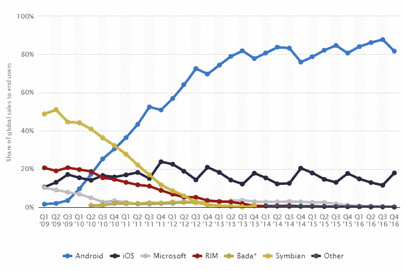
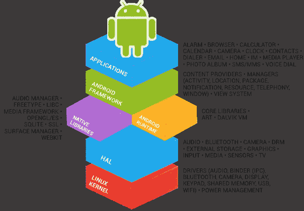
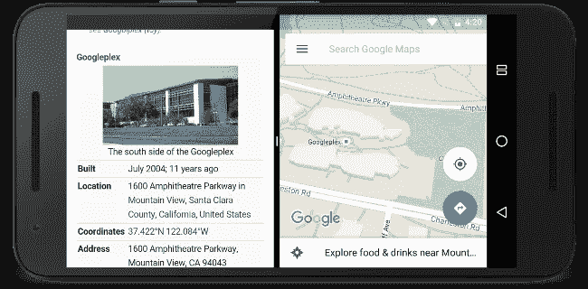
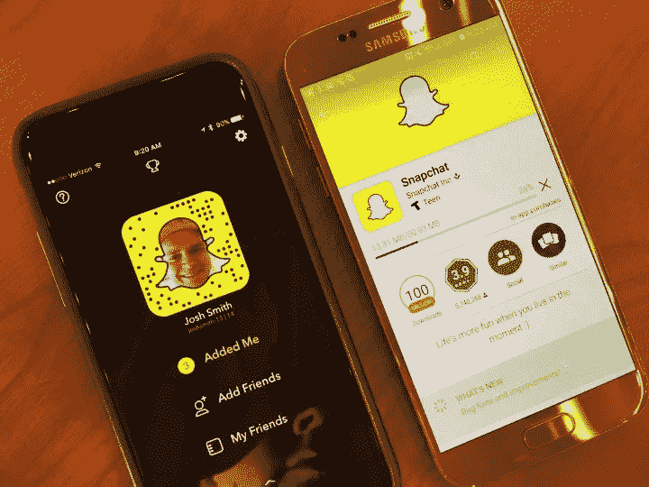
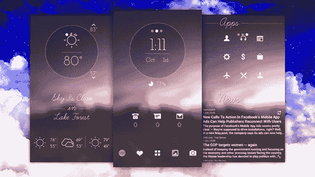
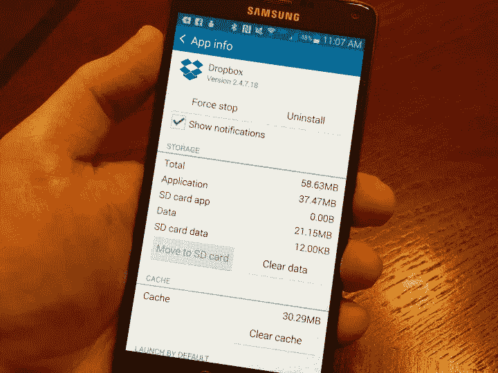
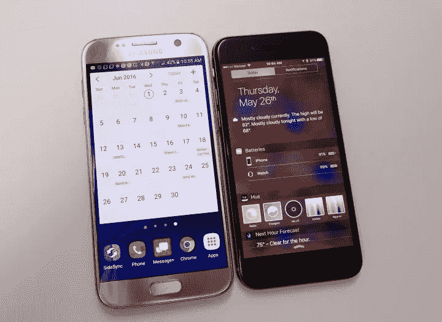
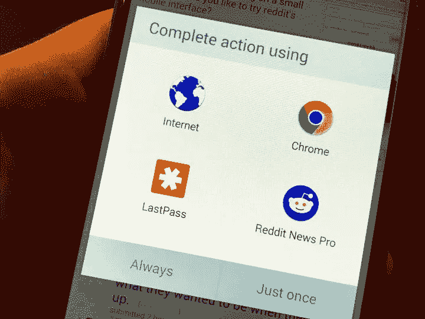
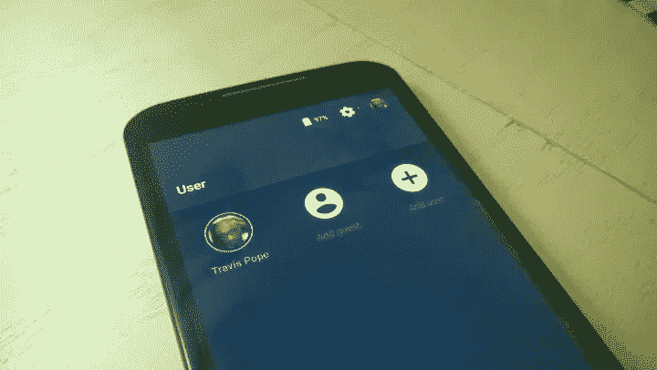
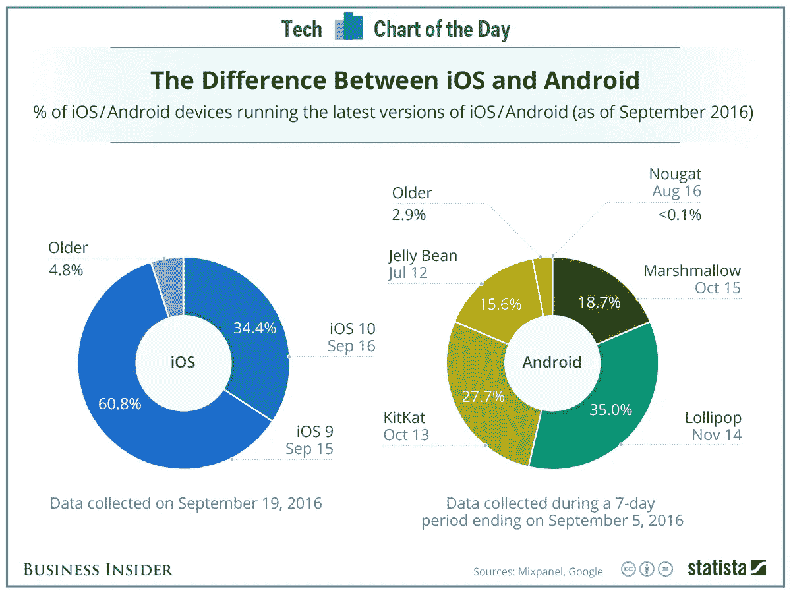

# iOS 10 vs 安卓牛轧糖:你该挑什么？

> 原文：<https://medium.com/swlh/ios-10-vs-android-nougat-what-should-you-pick-45fe80d319cf>

移动时代最持久的争论之一是 iOS 是否优于 Android。

当苹果的狂热爱好者对他们的设备信誓旦旦，瞧不起手持安卓系统的大众时，另一方称在苹果商店闲逛的人群是笨蛋，嘲笑他们对乔布斯崇拜的绝对服从。

但是，如果我们超越情感，看看这些硬数字，这个故事就变得有趣了。

根据跟踪 2009 年至 2016 年不同移动操作系统全球市场份额的[下图](https://www.statista.com/statistics/266136/global-market-share-held-by-smartphone-operating-systems/)，iOS 早些年就领先于 Android。考虑到第一代 iPhone 是在 2007 年发布的，这并不奇怪。

然而，Android 的受欢迎程度稳步上升，到 2010 年第二季度，Android 设备的数量超过了 iOS 设备。

这一差距一直在扩大，到 2016 年第四季度，Android 的市场份额为 81.7%，而 iOS 的市场份额为 17.9%。

就出货量而言，由于高度分散的移动市场[，苹果在安卓市场领头羊三星之后排名第二](http://www.gadgetsnow.com/slideshows/worlds-10-biggest-smartphone-companies/huawei/photolist/56223949.cms)。

Android 有多种价位，每个人都有一部手机。由于操作系统是开源的，并且基于 Linux，因此有数百个操作系统版本。

正因为如此，维护 Android 开源项目的谷歌并不能控制大量 Android 设备的最终用户体验。

另一方面，iOS 是一个封闭的系统，苹果严格控制着整个生态系统和 iOS 体验的方方面面，从硬件到软件。这有助于形成统一的 UX，但对某些人来说可能是限制性的。

在本帖中，我们将向用户和开发者展示 Android 和 iOS 是如何相互竞争的。

## Android 牛轧糖和 iOS 10 有什么新功能

但在此之前，我们先来看看市场上最新的操作系统版本 Android Nougat 和 iOS 10 都包含了什么。

**在 iOS 10 中:**

*   许多系统应用程序，如 Safari、新闻、音乐等都已更新。
*   传感器可以识别你何时提起设备，并为你打开显示屏。
*   许多应用程序都与 Siri 紧密集成，允许您订购出租车、预订桌子，以及做许多以前不可能做的事情。
*   应用程序也与 iMessage 更紧密地集成在一起。

**在安卓牛轧糖:**

*   谷歌助理经历了一些重大升级，现在是一个完全成熟的个人助理，能够为你阅读新闻和管理你的日程安排。
*   一些应用程序具有分屏功能，允许您在同一屏幕上同时运行两个应用程序。
*   快速点击可以让你在最近使用的应用程序之间切换。

通知、定制选项和其他设置也有所更新。

## iOS 优于 Android 的优势

如果你是用户，下面是 2017 年 iOS 对 Android 的评分。

## 1.更好看的 iOS 应用

很多顶级的应用和游戏都是先在 iOS 上发布的，现在还有很多只支持 iOS 的应用。新的 Snapchat 和 Spotify 功能先于 Android 出现在 iPhone 上。iPhone 用户正在玩超级马里奥 Run，但[超级马里奥 Run Android 应用](http://www.gottabemobile.com/super-mario-run-android-release-date-what-we-know/)尚未发布。

## 2.更快的 iOS 更新

iOS 用户总是能更快地获得操作系统的更新，无论他们使用的是哪家运营商。苹果公司也支持长达三年的设备。

使用 Android，用户将根据制造商和/或运营商的时间表获得更新。操作系统碎片化是一个巨大的问题，许多设备仍在运行过时的 Android 版本。超过 18 个月的 Android 设备通常不会获得任何更新。

## 3.与其他苹果设备无缝协作

如果您有其他 Apple 设备，iPhones 或 iPads 将很容易与您的设置配合使用。您可以将照片同步到所有设备，在 iPad 或 Mac 上接听电话，以及发送短信。有了 Handoff，你可以在 iPhone 上开始一个任务，然后继续到另一个设备，不会有任何中断。

隔空投送使无线文件共享设备即使在没有 WiFi 的情况下也能防白痴。

## 4.没有腌制品

在许多安卓手机上，有许多第三方应用程序，广告商[会付钱给运营商，让他们默认安装](http://www.appsterhq.com/blog/app-installs-facebook-ads)。其中许多应用程序无法卸载，除非你对设备进行 root，它们会占用空间。

苹果不允许第三方在设备上安装任何应用程序。虽然 iPhone 或 iPad 中有许多默认应用程序，但您可以移除用户数据部分并隐藏它们。

## 5.更高的转售价值

iPhones 的转售价值高于大多数安卓手机。

例如，2014 年的 Galaxy S5 完美无瑕，在 Gazelle 上价值 70 美元。与此同时发布的情况类似的 iPhone 6 的价格为[210 美元](https://www.gazelle.com/iphone/iphone-6/at-t/iphone-6-16gb-at-t/495672-gpid)。

## 6.可靠的售后支持

许多 Android 制造商提供有限的或不存在的售后服务。虽然三星或 HTC 等制造商提供标准保修，但支持和延长保修计划仅限于旗舰机型。

苹果就不是这样了。使用 AppleCare+，您可以通过电话或店内支付 99 美元至 129 美元获得两年的制造商保修和两年的意外保修和支持。

## 7.共享到其他设备

使用 Airdrop 在一个设备和另一个设备之间共享文件简单得可笑。Android 到 Android 的共享仍然存在问题，尽管新版本使这项工作变得更容易，但如果 Android 手机运行不同的操作系统，你可能仍然需要下载文件共享应用程序。

## Android 优于 iOS 的优势

## 1.Android 带来更多选择

有了苹果，你几乎没有尺寸、颜色和型号可供选择。然而，Android 有一个令人眼花缭乱的范围，你可以选择任何颜色，型号或材料。您可以选择触控笔，也可以添加防水选项。

谈到软件，Android 有超过 5000 种不同的 rom，让你定制平台的外观和感觉。你也可以通过使用主题来调整特定 ROM 的外观。

## 2.微型 SD 卡支持

iPhones 不支持 microSD 卡。因此，除非你升级到一个新的型号，否则你将被现有的型号所困，不得不在两年内将就使用。

Android 手机确实允许 SD 卡，最高可支持 128 GB，售价仅为 15-20 美元。您可以存储音乐、视频、数据和应用程序，并释放手机的存储空间。

## 3.更好的谷歌地图

在 iPhone 和 iPad 上，Siri 将始终默认为苹果地图。

虽然 iOS 10 上的苹果地图比让用户开车离开悬崖的原始版本好得多，但它仍然无法与谷歌地图相比，谷歌地图有更多城市的交通方向，更好的驾驶方向，可怕的搜索，停车信息，以及与其他应用程序如通讯录的深度集成。

## 4.轻松收回空间

在 iPhone 上，你必须删除应用程序并重新安装，以获得应用程序用于创建照片、视频、推文、藤蔓等的空间。在像 16GB iPhone 这样的手机上，你可能必须定期这样做。

安卓应用没有这些麻烦。许多应用程序都有清除缓存以释放数据的选项。您也可以手动导航到应用文件夹并删除应用数据。

## 5.更好地支持 Android 小工具

用户有许多调整小部件行为的选项。他们可以设置小工具在锁上或主屏幕上显示，并显示有用的信息，如天气，实时日历和闹钟，而无需打开手机。

iOS 对 widgets 的限制非常严格，没有那么大的灵活性。用户可以在通知中心增加一些灵活性，但苹果限制了他们的功能。

## 6.更好的默认应用

iPhone 使用 Safari、Mail 和 Apple Maps 来浏览、收发电子邮件和指示路线。一些第三方应用程序可能会让你使用深度链接选择你最喜欢的浏览器，但在大多数情况下，你会被苹果公司的选择所困扰。

在 Android 上，你可以选择一个默认应用来打开 pdf、播放 MP3、打开 HTML 链接、播放视频或发送电子邮件。这些设置只需轻点几下就能轻松更改。

## 7.Android 上更好的多用户支持

在 Android 设备上，您可以轻松创建多个拥有不同权限的用户帐户。

您可以为您的孩子创建一个访问受限的帐户，或者创建一个访客帐户，将设备借给其他人，而不会危及您的个人信息。

iPhones 并没有真正提供多用户支持或开箱即用的儿童模式；只有 iPads 允许学校在一台设备上创建多个用户帐户。

## 8.从任何地方下载电影和音乐

在 iOS 设备上，如果你想添加电影或音乐，你的选择非常有限。您可以将它们下载到电脑上，并与 iTunes 同步。你也可以使用 Spotify 等应用程序或 iTunes 等服务来下载电影和音乐，或者从网飞等应用程序下载。

然而，在 Android 设备中，你可以直接下载媒体文件并播放它们，而不需要通过电脑进行同步。您还可以使用许多其他服务在线购买音乐，而不仅仅是使用 iTunes。

## 开发人员的选择

就开发者而言，Android 和 iOS 也有显著差异。

## 1.程序设计语言

Android OS 主要使用 Java，这使得大多数开发者更容易在该平台上开始开发应用程序。这是因为 Java 是最常见的编程语言之一。

相比之下，iOS 使用 Swift，这是一种更小众的语言，对学习者来说可能有更陡峭的学习曲线。

## 2.应用开发平台

Android 对于开发平台和工具相当自由放任，你可以使用 Google 官方的 IDE，叫做 Android Studio，也可以使用第三方 IDE，比如 Eclipse。

除了使用熟悉平台的灵活性，这些 IDE 可以安装在 Windows 和 Mac 电脑上，使任何人都可以轻松开始开发 Android 应用程序。

另一方面，你只能在官方 Xcode 环境下开发 iOS 应用。苹果有非常严格的开发者指南，因为 Xcode 只能在 Mac 上运行，所以在你开始开发 iOS 应用之前，你必须先买一台功能强大的 Mac。

## 3.分裂

对于 Android 开发者来说，操作系统的类型是一个大问题，如图所示。

考虑到各种不同规格的手机和平板电脑的操作系统碎片化，测试应用程序兼容性所需的资金和时间可能会令人望而生畏。

这种碎片化也意味着，如果绝大多数用户使用的是旧版本，Android 开发者可能无法利用操作系统的最新功能。

相比之下，iOS 开发者必须确保兼容两个或最多三个操作系统版本，而且是在数量有限的设备上。这使得发布和更新应用程序变得更加容易。

## 4.应用批准

苹果现在平均需要大约 2 天来批准一个应用程序，比 2015 年的两周有所下降。 [app store 审查指南](https://developer.apple.com/app-store/review/guidelines/)也很严格，这意味着一个应用程序很容易被拒绝，因为它是由一个开发团队人工审查的。

在谷歌的情况下，审查过程在大约 2 小时内结束，它用于检查是否违反规则，如是否存在恶意软件/间谍软件、成人材料或侵犯版权。

Android 应用在内容方面更加宽大。

## 5.支出

虽然 iOS 开发者可以保留其应用销售收入的 70%，但他们还需要每年支付 99 美元才能访问 iPhone SDK。

Android 开发者需要支付 25 美元的一次性注册费，并可以获得其应用销售收入的 70%。Android 应用程序也可以毫无问题地出现在第三方应用程序商店中。

## 结论

iOS 和 Android 设备都有优点和缺点，最终归结为你想要利用的功能。您的选择还取决于您的预算和具体需求，以及您过去使用任一平台的经验。

*最初发表于*[*Appsterhq*](http://www.appsterhq.com/blog/ios-10-vs-android-nougat)*。*

## 这个故事发表在 [The Startup](https://medium.com/swlh) 上，这是 Medium 最大的企业家出版物，拥有 292，582+人。

## 在此订阅接收[我们的头条新闻](http://growthsupply.com/the-startup-newsletter/)。

