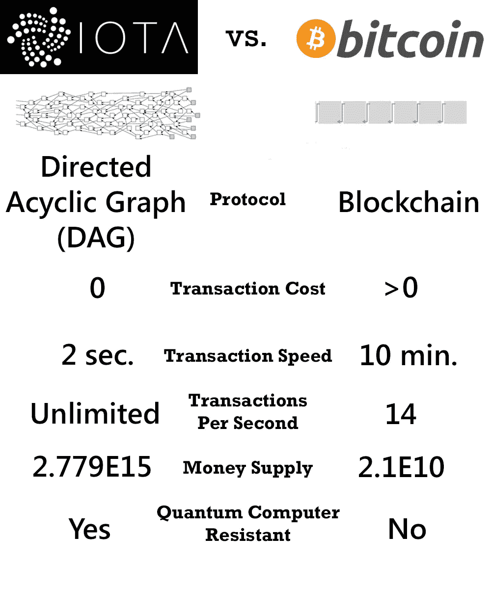

# IOTA——下一件大事？

> 原文：<https://medium.com/swlh/iota-the-next-big-thing-9e46ad49db4d>

**IOTA 可能最终超越区块链**

区块链技术不再是只有黑帽黑客和地下分裂组织知道的秘密代码。相反，这项新生的技术正被部署在似乎无限数量的[工业平台](https://www.coindesk.com/mufg-ntt-data-trial-blockchain-for-cross-border-trade/?utm_content=buffer6ab04&utm_medium=social&utm_source=twitter.com&utm_campaign=buffer)和[金融公司](https://hbr.org/2017/03/how-blockchain-is-changing-finance)上。随着区块链的大规模采用，一些人认为它是互联网的技术版[，并将颠覆一切。](https://blog.equinix.com/blog/2017/10/05/blockchain-a-new-type-of-internet/)

然而，一家公司认为，区块链只是分布式技术的第一次迭代，最终将接管全世界的所有数据交换。这家名为 IOTA 的公司对区块链技术进行了技术升级，称之为“Tangle”，并被宣传为“区块链的区块链”

**纠结的网？**

泰戈不是区块链的技术。相反，据它的创造者说，这是区块链技术“进化的下一步”。Tangle 是一个相互连接的节点系统，这些节点同时验证参与网络的事务。这意味着验证本身就是创建事务的手段，反之亦然。这个系统以这种方式自我验证，自我再生。

作为传统区块链技术的升级，这一点为何如此重要？答案是多方面的。首先，Tangle 系统为交易提供了一种方法，可以在分布式账本上处理和验证交易，而无需支付交易费用。

Tangle 创建了一个巨大的互联节点网络，所有节点都在验证事务以创建事务。与传统区块链迭代中的“矿工”和“用户”的分歧不同，Tangle 将这些组联合成单个节点，每个节点都具有创建、构建和验证分类帐的功能。

无交易费用的系统对于分布式账本技术的持续发展至关重要，尤其是在物联网(IoT)方面。随着物联网的发展(有消息称，到 2025 年将有多达 800 亿台设备连接到互联网)，通过微交易进行数据传输和货币化的需求将呈指数级增长。

然而，在传统的区块链技术中，这些微交易的费用高于实际交易本身。IOTA 认为，这样的系统是不可持续的。有了通过验证/创建节点创建的免费系统，该平台可以免费运行，而无需区块链生态系统中对立的两方不断争吵。

**哇…好快啊**

另一方面，Tangle 创建了一个交易验证节点网络。

这意味着每笔交易只需通过之前的两笔交易进行验证，因此验证速度远远快于传统的区块链。

但是，它不仅可以快速进行验证，还具有与传统区块链系统相同的安全性和信任度。因为每笔交易在被验证之前都需要确认之前的两笔交易，所以分布式分类帐的互连性得到了支持，并且任何变化都可以立即知道。

当出现差异(即未验证的交易)时，由于未验证的原因，它们可以立即从分类帐中删除。通过这种方式，互连节点系统的信任得以维护，并且产生的分类帐是“分布式的”并且完全不可变的，就像传统的区块链平台一样。

**我想这行得通……**

如果用户对 Tangle 系统的有效性有任何疑问，[最近达成的为大量参与公司处理微交易和数据控制的协议](https://cointelegraph.com/news/iota-partners-with-microsoft-fujitsu-others-for-iot-data-monetization)应该会消除所有疑问。这笔交易包括微软、富士通、博世、德意志银行电信，将实现企业对企业的数据交互。

最近几天，参与者将 IOTA 加密货币(MIOTA)推上了屋顶，因为该公司的系统正在为物联网和国际数据使用获得巨大牵引力的现实已经深入人心。仅在上周，硬币的价格就上涨了 300%，巨大的上涨压力仍在继续。

IOTA 的 Tangle 系统是否是物联网数据传输的答案仍有待观察。然而，很明显，对区块链技术及其衍生产品的需求将持续到未来。

## 这篇文章发表在 [The Startup](https://medium.com/swlh) 上，这是 Medium 最大的创业刊物，拥有 298，432+人关注。

## 订阅接收[我们的头条新闻](http://growthsupply.com/the-startup-newsletter/)。

