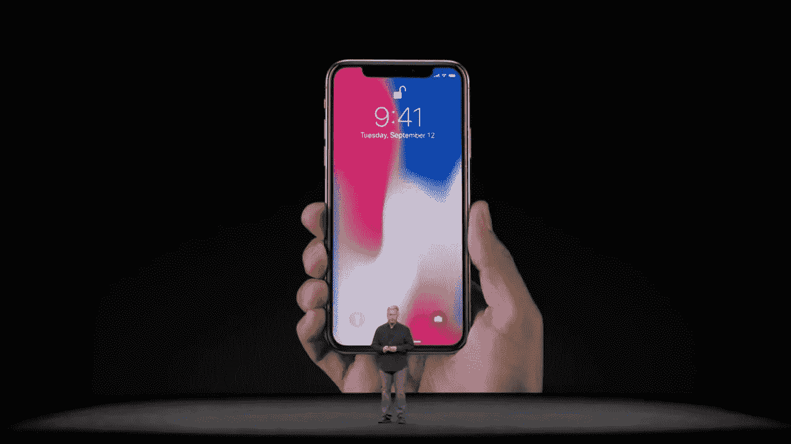
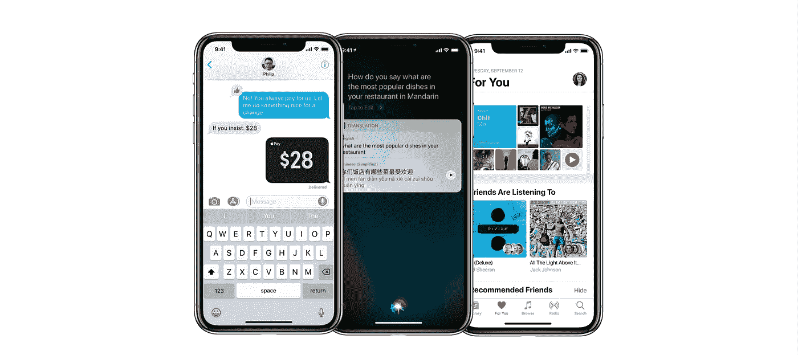
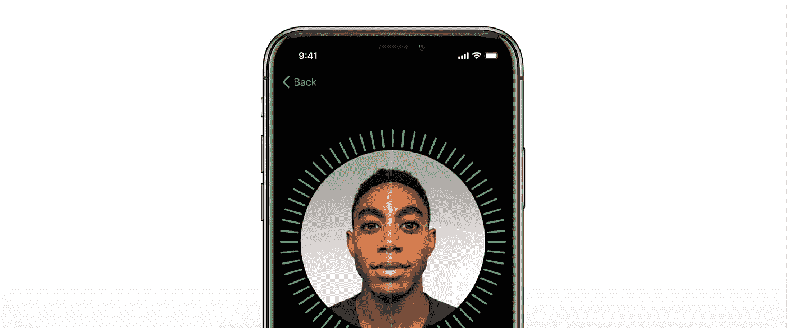

# iphone X 评论:苹果想告诉世界什么

> 原文：<https://medium.com/swlh/iphone-x-review-what-apple-might-be-trying-to-tell-the-world-e93ba1ca265b>

*乐观积极地看待苹果雄心勃勃的 iPhone X 新品发布。抛开所有负面因素，让我们试着保持乐观:)*

# 介绍

9 月 12 日，蒂姆·库克在史蒂夫·乔布斯剧院的苹果园区宣布了这一消息，*“iPhone X 是自第一代 iPhone 以来最大的飞跃。”*当然，在过去的几年里，每当苹果公司推出新的 iPhone 时，现场所有的疯狂都是我们已经习惯了的。

显然，我们知道不同公司生产的所有新手机几乎都会在性能和规格上有所改进，如电池寿命、充电速度、显示分辨率、耐用性等等。然而，我们总是有兴趣听到的是，***“iPhone X 有哪些与众不同的新颖之处？”***

iPhone X 推出后不久，就有许多关于它的在线评论、文章、推文甚至有趣的 Youtube 视频，传达了兴奋和失望。如果你正在看直播，你会同时感到惊讶和无聊。然而，今天——抛开所有这些，让我们换个角度，试着想想苹果的新手机想告诉世界什么。

这些只是基于我个人的想法，基于我所听到的和观察到的。欢迎评论，但最重要的是，我希望你喜欢这篇小文章:)

# #1.超越传统的矩形屏幕

我们都知道手机一般都是矩形屏幕。然而，在这一天，苹果打破了传统，决定通过在顶部利用更多空间来偏离常规(称为*“notch”*或*“ears bar”，*无论人们想怎么称呼)。这在世界范围内引发了很多争议，甚至像设计师和工程师这样的专业人士也在咆哮，他们现在需要如何想出新的方法来围绕这个问题进行设计和工程。而且没错，它和三星 Galaxy 的 edge 有点不一样，多了一点野心和冒险精神。

坦率地说，这是一个合理的问题，*“我们还能有多少额外的空间？这有必要吗？”*然而，**苹果可能试图表达的是，他们正在积极寻找利用手机上一些未使用空间的方法**(甚至在带有交互式滑动条的新款 Macbook Pros 上！).与此同时，这甚至可能是创造更具创造性的屏幕空间的第一步。公平地假设，苹果未来的 iPhones 可能会更加不同，完全打破矩形屏幕的传统，但这只是我个人的想法。

(可能是 iPhone 的设计者盯着它看了足够长的时间，试图发明新的方式来销售产品。或者该团队可能已经考虑过充分利用二维空间，甚至正在考虑超越他们目前在新 iPhone X 中拥有的东西。)

# #2.探索保护个人数据的最佳方式

在之前的 iPhone 版本中，苹果实现了触控 ID(指纹)解锁手机。除此之外，我们总是有标准的密码输入机制。然而，对于 iPhone X，他们提出了一项名为 **Face ID** 的新技术，该技术*“分析超过 30，000 个不可见的点来创建你面部的精确深度图。”*显然，它应该有更安全的认证，因为*“你的脸就是你的密码。”有了这项酷炫的技术，用户现在可以通过扫描面部解锁手机，甚至让支付变得更加简单快捷。*

然而，对于这一点，触控 ID 仍然存在一些争议。有些人认为，

> “即使在美国法律下，持有搜查令的官员也可以强迫你在手机的触控 ID 传感器上按下指纹并解锁，以便对你的数据进行合法搜索。同样可以说，一个军官可以把你的手机举到你的面前，用 Face ID 解锁。(有一点很公平:Face ID 要求手机用户睁大眼睛。)这些生物特征发作比你可能意识到的更频繁。
> 
> 但是你不能在法律上被强迫用一个密码来解锁一个设备。那是因为根据美国宪法，第五修正案保护你头脑中的东西，而不是你身体上的东西。"
> 
> ——作者[扎克·惠特克](http://www.zdnet.com/meet-the-team/us/zack-whittaker/)为[零日](http://www.zdnet.com/blog/security/) ( [来源](http://www.zdnet.com/article/is-face-id-secure-it-depends/))

但是从更积极和现实的角度来看(考虑到上面的情况不太可能发生很多)，Face ID 可能会提供一种更安全的方式来保护数据。老实说，当他们按下密码或密码模式时，没有多少人会隐藏他们的屏幕或键盘。当我们和朋友在一起时，无论在哪里，我们每天都可以看到这一点。对于其他浏览过它的人来说，很容易就能拿到手机。一个公平的例子可能是一个嫉妒的伴侣，当另一个伴侣短暂离开没有电话时，他想浏览所有的聊天记录。

但不管这些，关键是，苹果在不断尝试。他们在不断努力，并在想出新的方法(快速)解锁手机的最前沿，同时试图发现保护个人数据的最佳方式。

# #3.找到让动作(手势)更加自然和直观的方法

我们都知道苹果的 iPhone 是手机行业的游戏改变者。由于只有一个(home)按钮，整个屏幕都是交互式的(点击、滑动、强制触摸、3D 触摸等)，iPhone 很快成为成功和雄心勃勃的创新。每当新版本发布时，人们都在苹果商店前日夜排队购买新的 iPhone。然而，除了史蒂夫·乔布斯和团队的创造性思维之外，这可能只有通过对人类行为的持续研究、反复试验以及无数次用户测试才能实现。

与我们习惯的 iPhones 不同，苹果做了一些不同的事情。在新的 iPhone X 中，苹果去掉了 surface 上剩下的唯一一个按钮。如前所述，他们试图充分利用二维空间(甚至进一步实验)。但重要的是，在做这个决定时一定有很多想法，并想出了新的方法，这些方法对人们来说是有意义的，并且易于采用，以便可以成功地替换剩下的唯一按钮。当然，它最终成为完全有意义的“新”手势。

如前所述，一定有很多研究和测试会议来调查和解决这个问题。我们可以假设的一件事是，苹果对能够“教”用户如何使用他们的产品非常有信心。

# #4.推动增强现实(AR)在不久的将来真正成为现实

苹果最近将注意力集中在增强现实(AR)上。从他们新的 iPhone X 演示中，我们可以看到他们对这项酷技术的重视程度。此外，ARKit 也在不断发展，邀请专业人士加入这个派对，同时提高普通大众对有能力的事物的认识。因此，在我们的脑海中，我们可能会想， ***“苹果可能会推动 AR 在不久的将来真正成为一件事情！”***

对于不熟悉 ar 的人来说，已经有了很多成功的用例，比如 [Pokemon Go](https://techcrunch.com/tag/pokemon-go/) 和 [IKEA app](https://techcrunch.com/2017/09/12/ikea-place-the-retailers-first-arkit-app-creates-lifelike-pictures-of-furniture-in-your-home/) 。每天，专业人士都会提出新的创造性方法来实现 AR，但对于它是否有一天真的会成为主流仍有很多争议。另一方面，许多人认为它事实上将成为主流。

最重要的是，在他们如何修改传统的矩形屏幕空间的类似意义上，可以公平地假设苹果知道人们与手机互动的方式有无限的可能性和潜在的新方式。有很多很好的例子，就像之前提到的，如何在 AR 的帮助下增强额外的信息甚至日常娱乐功能(体验)。

苹果可能会发出一个信息，*“请更多地关注 AR，并尝试在概念、应用程序及其工作方式方面变得更加友好*”此外，这可能是对行业的一个信息，即我们真的需要共同努力(或竞争)将 AR 变成主流和人们使用的习惯，因为有无数的事情可以用它来做。

# #5.“是的，我们一直在努力创新，主要关注人”

苹果称之为**“animo Ji”**，这是一种基于用户面部表情的表情符号。它包括一个新的面部相机系统，可以实现解锁手机和用用户的面部进行支付等实际应用，但它也可以用于看起来有趣和互动的东西——它可以跟踪面部表情，并用它们来制作各种表情符号。根据苹果公司的说法，这样做的目的是将*【我们自己的个性】融入到最受欢迎的表情符号中，最酷的部分是用户甚至可以用它来发送语音信息。*

*在 iPhone X 宣布其功能后，当然，关于“Animoji”有正面和负面的评论。然而，这实际上是“创新的”，因为这是一种全新的借助虚拟动画角色进行对话的方式。人们一直在试图找出让谈话变得更有趣、更感性，同时又更私人化的方法。虽然这可以被视为销售 Face ID 安装的新“相机”功能的另一种方式，但它可以被视为更多的东西。*

*据我们所知，苹果一直并将永远努力创新，在他们的 iPhones 中安装有趣和酷的功能。他们热衷于让用户在使用他们的产品时有更好的体验。*

# *结论*

*通过自己的思考和许多在线资源的帮助，我写下了这篇短文。到目前为止，我已经阅读了许多关于新 iPhone X 的正面和负面反馈，并认为值得对它采取不同的看法。*

*虽然我可能不是一个能够理解苹果公司对他们的新 iPhones 的想法和愿景的专家，但通过观看发布会，我发现他们如何不断尝试实验和创新我们如何使用手机的新的潜在方式。有时，这可能是所有的业务，我们可能没有完全理解潜在的原因，但我们可能会看到自己在手中握着新的 iPhone X 时点头。*

*阅读时，你可能有其他想法(可能不同意),老实说，可能有许多其他方式来解释和思考它。当然，是购买它还是大肆宣扬它完全取决于你。*

*非常感谢你花时间阅读这篇文章，祝你有幸福的一天:)*

## *我写的更多文章:*

*   *[“我的脸书产品设计实习面试”](/@geunbaemikelee/my-facebook-product-design-internship-interview-ea92ec07cd1c#.92ka3jxc7)*
*   *[“如何构建你的第一个 UX 设计作品集”](https://uxplanet.org/how-to-structure-your-first-ux-design-portfolio-7b51576a04df#.e9c1m7sci)*
*   *[“如何准备你的首次 UX 面试”](https://uxplanet.org/how-to-prepare-for-your-first-ux-interview-72358bd2238c)*
*   *[“拥有心理学背景已经是迈向用户体验的一大步了(UX)](https://uxplanet.org/having-a-psychology-degree-is-already-a-huge-step-towards-user-experience-ux-235c072f9002#.xezgcchk5)*
*   *[“设计师不可或缺的技能:撰写和呈现可靠问题陈述的能力”](https://uxplanet.org/designers-indispensable-skill-the-ability-to-write-and-present-a-solid-problem-statement-56a8b4b8060)*
*   *[“设计师自我清单:你是什么样的设计师或者想成为什么样的设计师？”](https://uxplanet.org/designers-self-checklist-what-kind-of-designer-are-you-or-want-to-become-b2b3590a071b)*

## *在这里找到我:*

*[领英](https://www.linkedin.com/in/geunbaelee/) / [滴滴出行](https://dribbble.com/geunbae-lee) / [中等](/@geunbaemikelee)*

**

## *这篇文章发表在《T8 创业》(The Startup)杂志上，这是 Medium 针对企业家和创业公司的领先出版物。*

# *你可以订阅[在这里获取头条](http://growthsupply.com/the-startup-newsletter/)。*

**