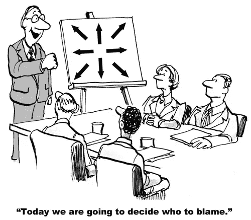

# 在您公司中，责备文化是一种日益增长的安全风险吗？

> 原文：<https://medium.com/swlh/is-a-culture-of-blame-a-growing-security-risk-at-your-company-77b2dcb58e49>

通用数据保护法规(GDPR)是各种规模的组织审视其信息安全管理方式的催化剂。这项工作可能会发现一些令人惊讶的结果，因为过程审查和一些以前没有认识到的风险被确定。在参与这一时间有限的流程时，重要的是要记住，所有这一切的核心是管理和处理信息的人，而组织最终要对这些信息负责。因此，您工作场所的文化及其对信息安全的影响现在比以往任何时候都更会给您的公司及其营业额带来重大风险。

指责是透明的障碍。如果一家公司的员工害怕因为他们报道的问题而被斥责，你就不能指望他们公开发言。如果没有一个开放和支持性的文化，安全事件可能不会被报告，漏洞也可能得不到解决。

我们只需看一下 Equifax 最近的违规事件就能明白这一点。在 Equifax 中，发现了一个 Apache Struts 漏洞，但没有打补丁[1]。虽然报告的修补程序策略应该确保易受攻击的服务器在 48 小时内得到更新，但事实并非如此，因此策略失败。该策略中定义的流程分为两个阶段，一个是手动应用补丁程序的步骤，另一个是自动扫描并确保网络上没有已知漏洞的步骤。这两个步骤都没有执行，因此该策略没有实施。首席执行官很快指责了一名负责传达补丁需求的员工。虽然这可能回答了策略第一阶段的失败，但它没有回答为什么自动扫描也会失败。可以说，首席执行官的这种解释是在用责备来推卸责任。这一过程的总体失败和归咎是更广泛的组织失败的标志。

## 需要注意的责备类型

责备受害者在社会的许多领域都很普遍，在任何情况下都是不可取的。当受害者成为网络钓鱼诈骗的目标时，无意中责备受害者是有风险的。如果受害者被认为是此次安全事件的根本原因，那么该事件极有可能在另一名员工身上再次发生。与其将根本原因归咎于用户，不如确定网络钓鱼攻击是如何发生的，以及如果资产被盗用，如何通过更改流程或权限来防止这种情况发生。

哈佛大学心理学博士后劳拉·涅米和波士顿学院心理学教授莲恩·杨对受害者责备现象进行了一项有趣的研究，并发表在《人格与社会心理学公报》上[2]。研究发现，当事件的受害者成为报告的主题时，他们更有可能因为事件的发生而受到指责。这突出了以平衡和适当的方式报道安全事件的重要性。不要过于关注某个特定用户的行为，而是要考虑允许事件发生的流程、权限和技术。

传染性的指责会像野火一样蔓延。斯坦福大学商学院的 Larissa Tiedens 的一项研究发现，只需要一个群体中的一个人就能引发这种情绪。暴露在一个人对一个事件进行指责的情况下，足以导致其他人对有时完全不相关的失败做出进一步的指责。在事故验尸时要注意这一点。如果一连串的指责发生了，你将无法找到根本原因并防止进一步的事故。

“踢狗”也是一种非常常见的情况，在这种情况下，责任会通过组织的层级结构向下传递[4]。在这一点上，责任和问责的观念已经丧失，任何卷入指责链的人都只是想把自己的伤害发泄到更低级的人身上。如果你目睹了这种情况的发生，而你的同事在这个链条中处于中间或更高的位置，那么建议你私下把这件事告诉他们。很可能他们甚至没有意识到他们正在这样做。

适度也要兼顾，不要陷入无可指责的陷阱。如果一个人有过错，例如通过规避已经到位的安全措施，那么这应该被识别并以适当的方式处理。无论是通过额外培训、让他们的直线经理参与还是通过人力资源团队，都应该有明确的政策和程序来规定如何管理。

问责制是成功的信息安全战略的关键，但是当存在一种指责文化时，它也可能成为员工焦虑的来源。他们可能会将此视为对他们进行评估的一种方式，因此，当被问及具体事件时，他们可能会显得闪烁其词。我们都听到了对这个共同问题的回答:

“事情发生的时候，你在做什么？”——“哦，没什么……”

确保强调询问安全事件的原因是需要学习，而不仅仅是为了合规或归咎。请确保在您的意识培训计划中包含这样的例子，因为如果所有用户都理解问责制的价值，这也将有助于防止帐户共享。

## 如何改善你的公司文化

虽然我们可能认为信息是数据，我们通常认为数据属于技术领域，但它总是会回到在组织中工作的人身上。毕竟，正是这些人拥有对他们所管理的信息的访问权、责任和最终责任。

意识对于确保高水平的信息安全至关重要，但如果没有一个提供心理安全的氛围来鼓励员工表达他们的意见，警钟将保持沉默。查看您的认知培训，并包括多个场景中的问题报告示例。考虑实施奖励计划，以表彰发现和报告问题的人员。

在你的公司里提倡宽恕[5]。这是几个世纪以来被社会中的宗教文本所提倡的，但它也适用于我们的职业生活。这将对组织内的领导者产生最大的影响，通过展示接受我们都会犯错的能力，这将改善整个团队的动态。

如果责备是你的组织内部的一个问题，考虑实施一个匿名的方法来报告问题。许多流行的公司聊天应用程序都有激活匿名反馈的插件，可以用于此目的，或者也可以使用更基本的方法，如意见箱。这种解决方案的结果将有助于向高管强调变革的必要性，展示公开反馈而不用担心报复如何能够改善公司业绩，并最终消除指责文化。

[1][https://www . the verge . com/2017/10/3/16410806/equifax-CEO-责备-违约-补丁-国会-证言](https://www.theverge.com/2017/10/3/16410806/equifax-ceo-blame-breach-patch-congress-testimony)

[2][http://journals . sage pub . com/doi/full/10.1177/0146167216653933](http://journals.sagepub.com/doi/full/10.1177/0146167216653933)

[3][https://press room . USC . edu/shift-knights-is-social-infective/](https://pressroom.usc.edu/shifting-blame-is-socially-contagious/)

[https://hbr.org/2010/05/how-to-stop-the-blame-game](https://hbr.org/2010/05/how-to-stop-the-blame-game)

[5][https://positive sharing . com/2007/05/创造一种工作场所的宽恕文化/](https://positivesharing.com/2007/05/create-a-culture-of-forgiveness-in-the-workplace/)

## 这篇文章发表在 [The Startup](https://medium.com/swlh) 上，这是 Medium 最大的创业刊物，拥有 283，454+人关注。

## 在这里订阅接收[我们的头条新闻](http://growthsupply.com/the-startup-newsletter/)。

