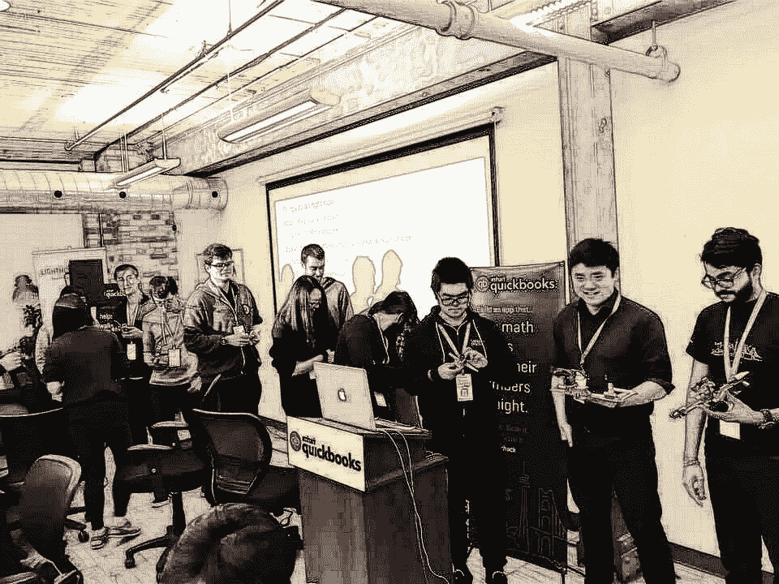
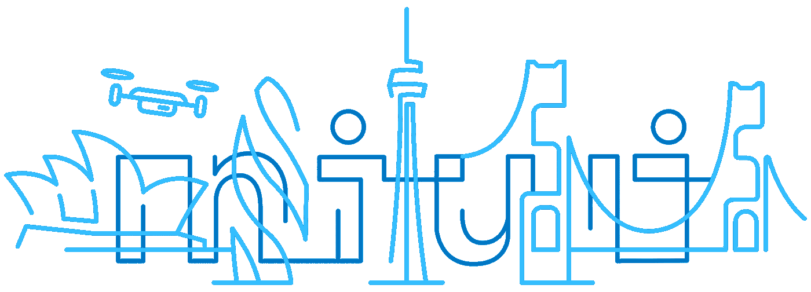
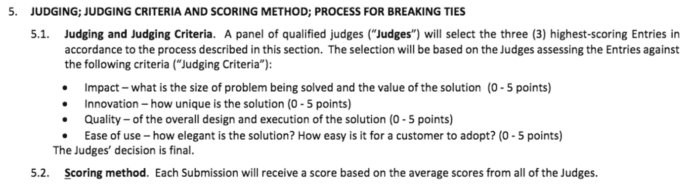
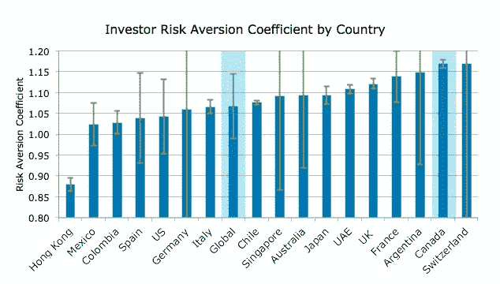

# 加拿大的保守文化是否影响了加拿大的黑客马拉松赛事？

> 原文：<https://medium.com/swlh/is-canadas-conservative-culture-affecting-canadian-hackathon-events-2459eee2d2c5>

## 来自多伦多 IntuitDev Hackathon 的帖子

写这篇文章的目的是向行业专家学习，而不是批评加拿大的创业/黑客马拉松文化。

# 故事

[SmallbizHack](https://www.smallbizhacktoronto.com/)

上周末，我在由 [Intuit Quickbooks](https://quickbooks.intuit.ca/) 和 [Square](https://squareup.com/) 组织的 SmallbizHack 上完成了我的第一次黑客马拉松。黑客马拉松的挑战是创建一个全新的解决方案，为小型企业节省时间或金钱。然而，在收到评委这位知名公司资深投资人的私信反馈后，我感到了强烈的失望和挫败感:

> 你有最大胆的想法，但它很难用技术实现，并且在安全方面有很多潜在的风险。很难。💔

老实说，我们队没有赢得 5，000 美元奖金的事实一点也没有让我失望。这是一次非常有趣、有价值的学习和交流经历，非常美味的食物，我非常感谢这一切。然而，**这位评委的反馈和黑客马拉松的评判标准之间的冲突点(*影响力、创新、质量、易用性，见下面的截图)👇*)一开始让我超级失望，后来我开始想:是什么让他这么说的？如果这个项目发生在美国，会有什么不同吗？**

[Screenshot from SmallBizHack Official Rules](https://www.smallbizhacktoronto.com/terms-and-conditions), p.3

# 我的问题

什么是黑客马拉松？我认为这是一个提出疯狂想法并快速测试/失败它们的完美地方。然而，我似乎是带着错误的心态来参加比赛的，因为获胜的团队带来了一个非常小规模的想法(获胜的团队利用 API 技术开发了一个 Messenger chatbot， *QuickChat* ，它可以自动响应客户，帮助他们的花🌹购买)。

几天前，我读完了阿什莉·万斯的《埃隆·马斯克》，这本书让我对这种“我可以改变世界”的心态感到兴奋。但是现在，一位经验丰富的商人告诉我，一个大胆的想法在现实世界中是行不通的。我似乎无法放下这种强烈的负面情绪，想写下这一点，希望对这个问题有更多的见解和更深的理解:

> 加拿大保守文化是否在影响加拿大黑客马拉松赛事？它与美国有什么不同(如果有的话)？

然后更多的问题出现在我的脑海里:

*   加拿大黑客马拉松更关注具体的技术问题解决方案还是将创新的想法付诸实践？
*   美国投资者对待 ***高风险*** 创业项目的方式会与加拿大投资者不同吗，或者这只是我的主观臆断？
*   为什么我们在多伦多有大多数安全玩家的创业公司，而大多数改变世界的创业公司都来自硅谷？
*   为什么马斯克从皇后大学毕业后就去了美国，而不是在加拿大创业？

# 加拿大的文化与商业

回家后，我谷歌了一下我的问题，有了一些有趣的发现。早在 2012 年，德勤加拿大副总裁比尔·柯里就已经指出[加拿大的保守文化是如何影响其创业业务](http://business.financialpost.com/executive/investment-fear-risky-business-for-canadas-conservative-business-culture):

> 围绕加拿大糟糕的生产率表现的最有争议的争论之一是文化问题。许多人认为，加拿大企业缺乏勇气、雄心，也没有与美国和新兴市场竞争的风险承受能力。

特别是我的内心与这个问答产生了共鸣:

> ***问:冒着听起来很粗糙的风险，交易是什么？我们只是懦弱吗？为什么我们在业务增长方面不能像美国同行一样雄心勃勃？***
> **答:**我觉得我们又胖又幸福。我们很富裕。我们感觉很舒服。我们记录和谈论的生产力问题是一个长期的问题，它对我们孩子的影响比对我们的影响更大。而且，对许多加拿大人来说，包括企业主，他们不觉得有必要去冒那些可能让他们不舒服的风险。…[加拿大人]有世界上最大的经济体作为他们的贸易伙伴，并签署了自由贸易协定；他们有——取决于他们所处的行业——进入壁垒；如果他们是小企业，他们会得到一些税收支持。所以，这是一个非常舒适的地方，我认为人们在这种情况下没有太多的理由感到不舒服并去冒险？

麻省理工学院研究[的另一项发现](http://www.advisor.ca/investments/market-insights/are-canadian-investors-too-cautious-209490) (2016)👇也表明加拿大投资者比其他发达国家如美国和新加坡更倾向于规避风险。

[Source: MIT/Natixis, July 26, 2016](http://www.advisor.ca/investments/market-insights/are-canadian-investors-too-cautious-209490)

# 但是加拿大的文化和黑客马拉松怎么样？

不幸的是，谷歌没有提供太多关于加拿大黑客马拉松社区的信息，因此我想在这里得到更多的见解。基于我的个人经验，我的假设是**加拿大黑客马拉松评委更喜欢带来切实利润和短期回报的小规模项目，尽管经常使用模糊的标准，如*创新的*和*有影响力的***。但那是受加拿大保守文化的影响吗？嗯…我不确定。我希望有一天会有一篇详细的文章分析加拿大文化和黑客马拉松活动之间的关系。我确信，对于热情的黑客来说，了解潜在的期望并做好更充分的准备是很有价值的。

如果你参加过黑客马拉松活动，并有任何见解/观点要分享，我很乐意了解更多。请在下面评论😄

*特别感谢*[*Lucy Zhao*](https://www.linkedin.com/in/lucy-zhao-8783341b/)*&*[*Pankil Dave*](https://www.linkedin.com/in/pankildave/)*对本文的帮助👏👏👏*

## 这篇文章发表在 [The Startup](https://medium.com/swlh) 上，这是 Medium 最大的创业刊物，拥有 281，454+读者。

## 在这里订阅接收[我们的头条新闻](http://growthsupply.com/the-startup-newsletter/)。

