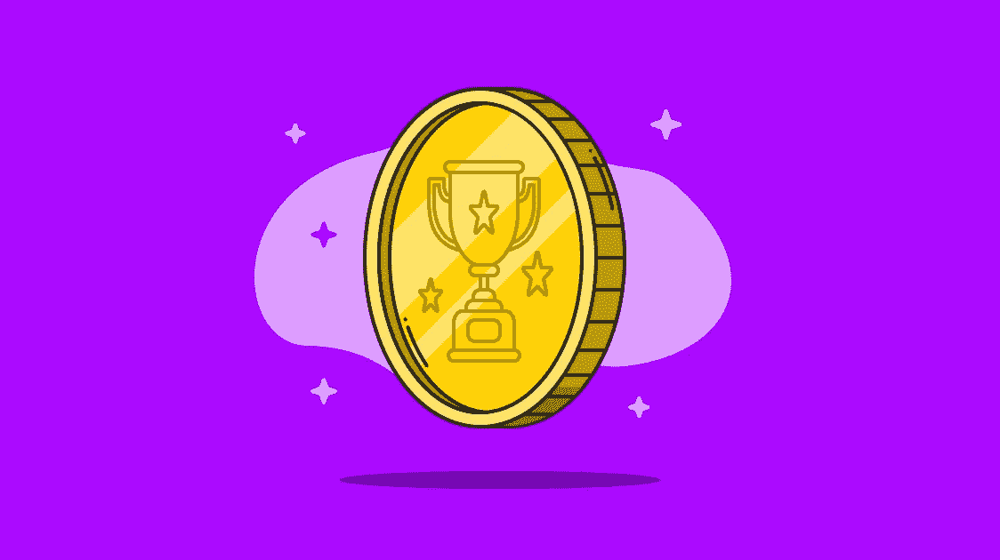
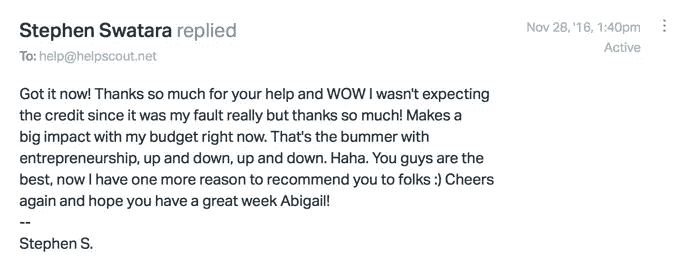

# 客户满意是不是错误的目标？

> 原文：<https://medium.com/swlh/is-customer-satisfaction-the-wrong-goal-d2d8de6863a5>

> 获取客户更重要还是满足你拥有的客户更重要？

在“[10x 规则](https://grantcardone.com/products/the-10x-rule-book)”中，格兰特·卡尔多内激烈地争辩道，获得客户是更重要的目标。他说，客户满意度仍然很重要，但企业将客户满意度置于获得新客户之上是错误的:

> "在担心让顾客开心之前，先把你的主要精力放在吸引注意力和吸引顾客上."
> 
> “关注客户满意度的趋势不利于获得客户。公司变得如此注重当前客户的“满意度”,以至于许多公司未能积极获取和扩大市场份额。"
> 
> “真正让客户满意的品牌不会谈论客户服务；他们专注于客户获取。…没有顾客至上，就没有顾客满意。”
> 
> “市场份额的主导地位往往会压倒一切。销售劣质产品的公司将收购作为他们的首要目标，然后在获得用户后处理他们产品或服务的任何问题。”

对于一些企业来说，这可能是真的。(你可以找到数百篇关于“获取与保留”之争的博文，以及支持任何一方观点的足够证据。)但是，让顾客获取与顾客满意对立起来——或者说更重视一个方面而不是另一个方面——是一个简化的问题。

# 为什么优先获得而不是满足是没有意义的

把获得客户看得比客户满意更重要是短视的，因为它们是一枚硬币的两面。把它框定为“非此即彼”意味着某事或某人——通常是顾客——必须承受痛苦。

## 1.成长型企业两者都需要

要实现业务增长，你不能忽视一个目标——获得客户或客户满意度——而专注于另一个目标。以客户为中心的增长既是一种保留策略，也是一种收购策略。

但是你也不能将客户满意度等同于客户保持率。**这是因为客户满意度并不能代表客户健康。** [“满意”的客户总是跳槽](https://hbr.org/1995/11/why-satisfied-customers-defect)，因为仅仅“满意”是不够的。

因此，在这个意义上，卡尔多内是正确的，CSAT 本身是一个不太理想的目标——你的收购努力可能足以让你继续经营下去，但客户满意是希望增长的企业的目标。正如 Price 的 Patrick Campbell 明智地解释的那样，不满意的客户会流失，而高流失率会给增长带来挑战。

任何人都可以复制你的产品。但是他们不一定能复制你的客户和你在一起的美妙体验。通过提升 CSAT 旗下的指标，如客户努力、净推广者分数等，并像重视客户获取指标一样重视它们，你可以确保被衡量的东西会被完成。

## 2.客户满意度是一种获取工具

不久前，我正在欣赏我父母的新沙发，这是他们从 [Wayfair](https://www.wayfair.com/) 网上订购的。他们得到了一个很好的价格，但后面的面料在运输过程中损坏了，所以 Wayfair 立即提出更换它或再降价几百美元。我的父母接受了额外的折扣，自己修复了损坏，并告诉每个人他们在公司的经历是多么美好。猜猜看，在购买新家具的时候，我最先想到的是谁？

这就是[关系营销](https://www.helpscout.net/blog/relationship-marketing/)——这是一个强大的收购工具，也是[帮助 Scout 以客户为先的方法进行追加销售](https://www.helpscout.net/blog/upsell/)的重要组成部分。我们的目标是通过创造卓越的产品和卓越的客户支持，以及旨在与您的业务一起发展的定价计划，实现共同的成功。这种方法会产生积极的、有机的口碑:

*Email from a happy customer*

**换句话说，顾客幸福就是顾客获得**。选择你自己的比喻:飞轮、上行周期、先有鸡还是先有蛋的场景——当你的公司提供优秀的客户服务时，这将为你赢得更多的客户，你可以向他们提供更优秀的服务，这将为你赢得更多的客户。

正如杰森·弗里德和大卫·海涅迈尔·汉森在《[返工](https://37signals.com/rework)》中所说:一切都是营销。

> “营销是你们公司的每个人全天候都在做的事情。正如你不能不沟通，你也不能不营销。…营销不仅仅是几个单独的事件。它是你所做的一切的总和。”

如果你公司的客户服务是一种竞争优势，是一种口碑营销工具，那么关注客户满意度并不等同于忽视客户获取。

## 3.获得客户比留住客户的成本更高

任何努力争取大量新客户的人，如果不花至少同样多的精力来留住他们已经说服的客户，那将是愚蠢的。这就是为什么“[登陆并扩张](http://chasmgroup.org/blog/land-expand-is-a-business-strategy-not-a-sales-tactic/)”是如此受欢迎的增长策略。

> *以客户为中心的业务建立在保留的基础上。*

根据[哈佛商业评论](https://hbr.org/2014/10/the-value-of-keeping-the-right-customers)，“获得一个新客户比留住一个现有客户贵 5 到 25 倍。”

你的竞争对手现在也在试图获得你的客户。偷它们的成本比你养它们的成本还要高。

## 4.当你专注于收购时，现有客户会受到影响

想想看，当你看到一家企业向新客户提供的优惠条件比你作为一个多年客户所能获得的优惠条件更好时，这是多么令人恼火。

因为你的收入只能来自现有客户或新客户，所以在获得新客户的同时照顾好现有客户总是有意义的。

但当你的销售团队在客户签约的那一刻就让他们离开时，你就做不到这一点。如果收购是你的首要目标，销售会带来失望的客户，而客户支持团队将无法帮助他们成功。谁受苦？客户——抱着很高的期望出售，但出售后却失望了。数学很少能解决问题。

# 客户体验是新的前沿

正如客户服务顾问和演讲者 Micah Solomon 在[客户支持的未来](https://www.helpscout.net/helpu/future-of-customer-support/)中指出的那样，“客户继续期待越来越好的客户服务——在每个行业、每个细分市场、每个价位。”

> “客户希望你提供更好的客户服务，因为他们已经在其他地方获得了更好的客户服务。……当 USAA 熟练地协助提交保险索赔，或者亚马逊轻松实现产品退货，或者苹果商店的天才泰然自若地解决 iPhone 问题时，不可避免的是，您的客户也会期待贵公司提供更友好、更快捷、更直观的服务。”

成长中的企业无法承受将客户保留放在收购之后，因为客户正在学习期望某个基本水平的服务，当这种期望没有得到满足时，他们会找到其他解决方案。到那时，谁能让顾客最开心的竞争就结束了。

因此，客户满意度是错误的目标，但不是因为卡尔多内提到的原因。顾客满意是我们的目标，但并不与获得顾客截然相反——这两个目标可以也应该共存，以创造一个积极向上的螺旋。

*最初发表于*[*【www.helpscout.net】*](https://www.helpscout.net/blog/customer-acquisition-vs-customer-satisfaction/)*。*

## 这篇文章发表在《创业》杂志上，有 258，400 多人聚集在一起阅读 Medium 关于创业的主要报道。

## 在这里订阅接收[我们的头条新闻](http://growthsupply.com/the-startup-newsletter/)。

