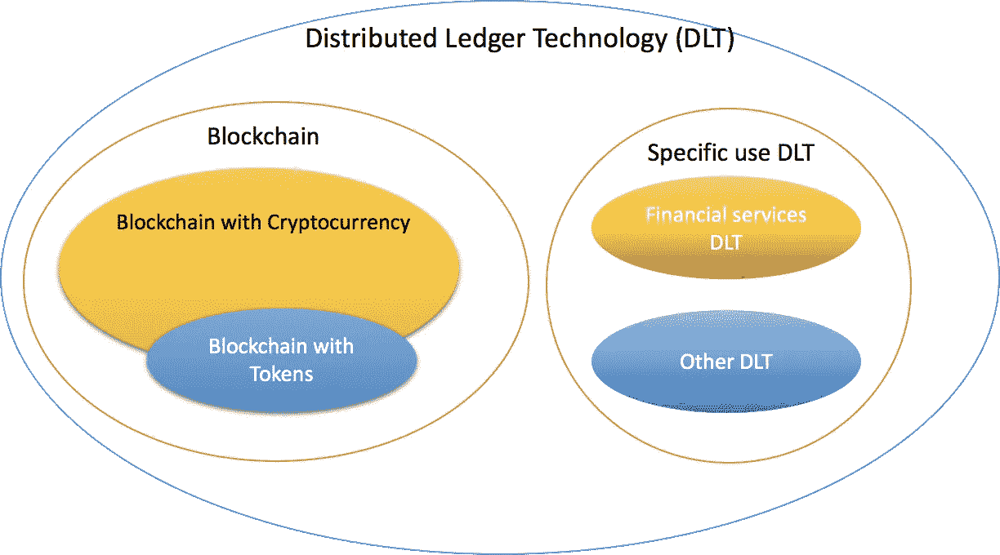
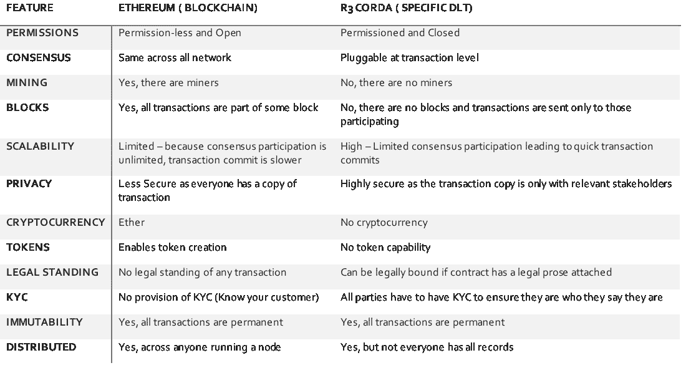

# 分布式账本和区块链一样吗？

> 原文：<https://medium.com/swlh/is-distributed-ledger-same-as-blockchain-4f64bdda5598>

谈到区块链，我们都会听到很多不同的词汇和名称。分布式账本技术或 DLT 美国其中之一。区块链和 DLT 被多次互换使用。

什么是 DLT？DLT 是许多不信任方共享的记录数据库。

为什么 DTL 和区块链可以互换使用？因为“所有区块链人都是 DLT”但是，“不是所有的 DLT 都是区块链。”如果我过于简化，那么我们可以说“区块链是 DLT 的一种特定类型”，类似于宝马是一种特定类型的汽车的类比。然而，并不是所有的 DLT 都是相同的，并且有它们自己的实现细节。

太空看起来有点像:

DLT and Blockchain Relationship

为了更清楚起见，让我们以一个特定的 DLT 和一个区块链为例，看看它们的区别:

Blockchain vs. DLT, specifically Ethereum vs. Corda

总之，区块链和 DLT 都实现了“分布式账本”,并拥有共同的基础原则。每个实现都是独特的，由于应用程序的性质和目的，很难对它们进行比较。最后，这个领域正在兴起，许多术语没有单一的定义。在未来几年，我们将看到定义变得更加清晰。

## 这篇文章发表在 [The Startup](https://medium.com/swlh) 上，这是 Medium 最大的创业刊物，有+387，966 人关注。

## 订阅接收[我们的头条](http://growthsupply.com/the-startup-newsletter/)。

