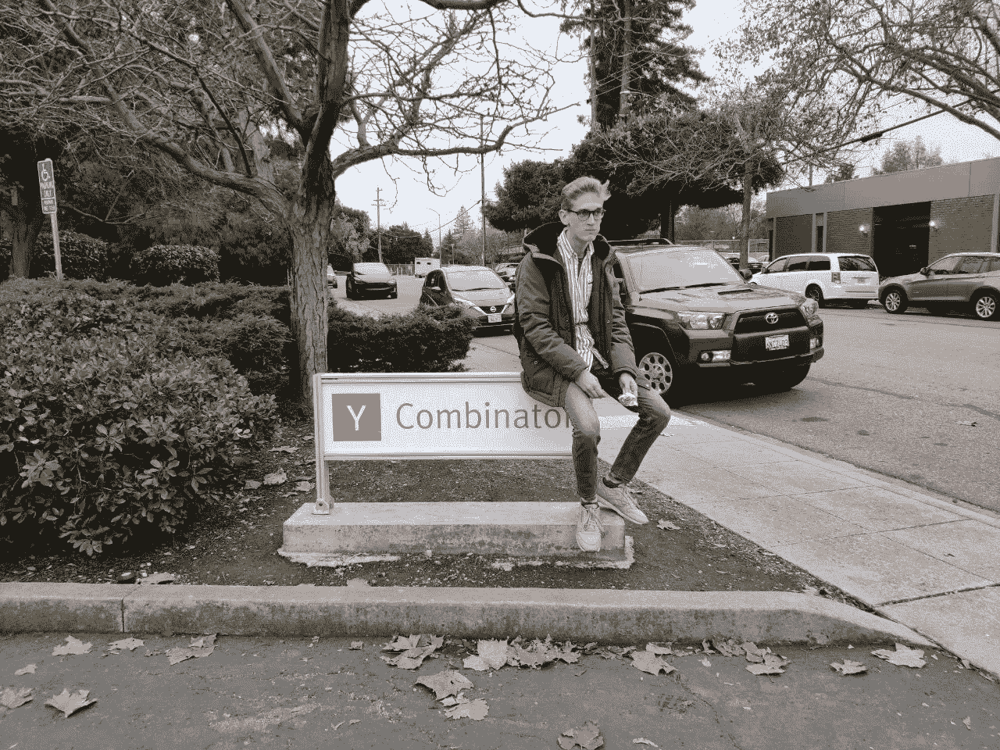
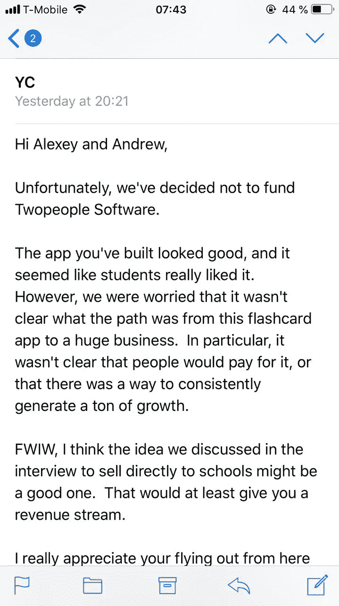
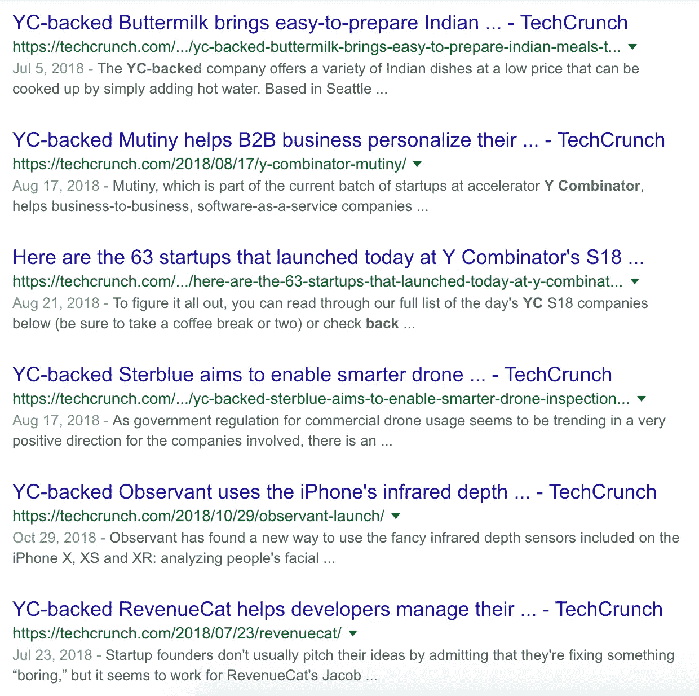
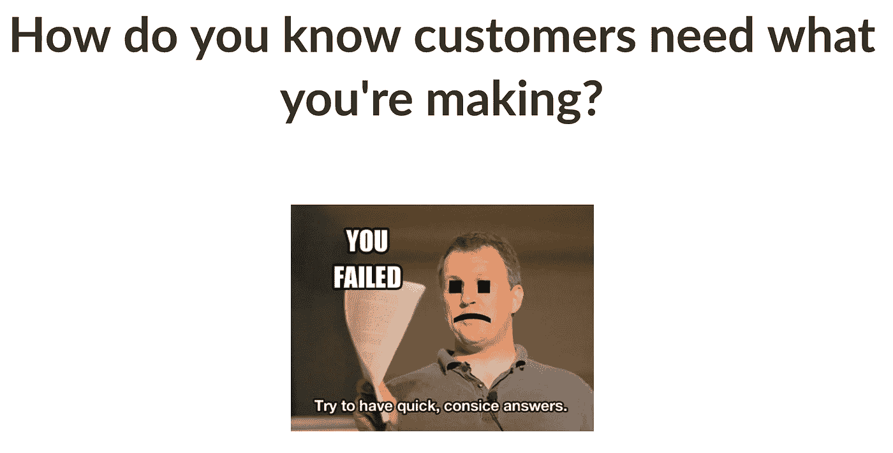

# 去 Y Combinator 面试值得吗？

> 原文：<https://medium.com/swlh/is-going-to-a-y-combinator-interview-worth-it-45e627951070>

简单的回答是肯定的。长的回答也是肯定的。下面，有两个原因在你能在网上找到的所有关于在 YC 成功或失败的帖子中没有提到。

A proof that I nearly became successful for my mum.

我们申请了 Reji T1，它让课堂学生的词汇学习速度比笔记本和抽认卡快 3 倍。我们被拒绝了，但最终这是一次奇妙的经历。更多的是去湾区的旅行和准备本身，而不是面试。

‘Yes’ via phone call, ‘No’ via email. With a tiny bit of feedback. Either way, on the interview day.

面试只有 10 分钟，但你在旧金山湾区的时间和准备会非常有用:

## 1)你会接触到很多有趣的人

YC 起到了预演的作用。如果你成功了，投资者、媒体和其他公司都会对你感兴趣(其他人是这么说的，还有 YC 本身)。如果你没有成功，至少其他公司会对你感兴趣(我们的经验)。如果 YC 把他们的注意力转向你，其他人也会对你更加好奇。

Getting covered by TechCrunch obviously becomes easier if you’re YC-backed.

借此机会，我们会见了美国、英国、德国和奥地利一些了不起的公司的创始人: [Tandem](https://www.tandem.net/) 、[swely](http://swelly.ai)、 [Usergems](https://www.usergems.com/) 、 [Cambly](http://cambly.com) 、 [Chatterbug](http://chatterbug.com) 、 [Gustav](https://www.hellogustav.com/) 、 [Openland](http://openland.com) 、 [pro.space](https://www.myprospace.com/) 、 [Blossom](https://www.blossom.co/) 、[Frida 项目](https://www.thefridaproject.com/)

如果我不处理与 YC 有关的问题，他们会更难接近。实际上，这是沟通的黄金法则:研究某人的工作，用具体的问题接近他们。

重新审视你的产品、业务或收购模式总是好的，尤其是来自已经做过类似事情的有经验的人。永远去争取。

在我们的案例中，我们提高了 10%的 D1 保留率，更多地了解了我们的市场，并利用这些反馈简化了业务模式。

## 2)你会让自己的视野变得敏锐，并消除很多缺点

我们用了大约一个月的时间来非紧张地准备面试。根据大量的指南，我们写下了所有可能的问题，并使用 [iPaulGraham bot](http://ipaulgraham.herokuapp.com/) 来保持答案的简洁。

然而，整个过程中非常有用的一点是，我们发现了很多我们不成熟业务的弱点，我们害怕在早期提出这些弱点。

Gabriel Weinberg 的[牵引](https://www.amazon.com/Traction-Startup-Achieve-Explosive-Customer/dp/1591848369/ref=sr_1_3?s=books&ie=UTF8&qid=1545222607&sr=1-3&keywords=traction)中的一段话完美地描述了 YC 之前的我们:

> “如果你没有收购策略，你会说这是病毒式营销。”

我们之前的应用程序 [Mate](http://matetranslate.com) ，在我们这边没有太多努力的情况下，就获得了高达 60 万的 MAU，所以我们基本上可以只在产品上工作。

语言学习市场竞争激烈，所以 Reji 仅仅把它推向应用程序商店并获得用户并没有取得很好的效果。

在准备期间，我们提出了一个更强有力的收购战略和货币化方案，了解了许多关于市场的新事物。

大多数创始人都会犯在产品上花太多时间的错误。我们也做到了。《YC 访谈》迫使我们走出那个循环，最终思考一些事情，没有这些事情，产品很可能会死亡。

YC 合伙人(将采访你的人)是科技行业最有影响力和最成功的人之一(例如，Gmail 创始人保罗·布赫海特采访过我们)。他们能很快发现弱点，并试图理解你是否有一个好的计划来克服它们。

不管你是否要去 YC，回答典型的 YC 问题可以帮助你更好地了解你正在建立什么，以及你将如何成为一个成功的企业。

[iPaulGraham](http://ipaulgraham.herokuapp.com/) will help you to stay concise.

即使我们都有了，我们也没能在 10 分钟内简明地解释清楚。所以，也要简明扼要，开门见山。

## 采访的简要记录

大多数创始人(至少我们与之交谈过的)表示，面试非常激烈——合伙人会打断你，连珠炮似的提问。做好准备，事情可能会反过来。在我们的情况下，他们保持沉默，等待我们告诉他们一切。

## 关于准备的快速说明

如果你在寻找如何准备面试的好指南，我会向你推荐来自 Yury 的指南，他是 Openland 的创始人:[https://hacker noon . com/the-ultimate-guide-to-y combinator-interview-preparation-8372628154 C3](https://hackernoon.com/the-ultimate-guide-to-ycombinator-interview-preparation-8372628154c3)

当然还有 YC 自己的:【http://old.ycombinator.com/howtoprepare.html】T4

如果你进入了面试阶段，你已经在做一些有趣的事情了。你只需要利用获得的联系、反馈和见解再次迭代。

我经常在推特上谈论我如何启动我目前拥有 80 万月用户的公司，并制作数字产品。给我一个[跟着](https://twitter.com/chernikovalexey)！

## 这篇文章发表在 [The Startup](https://medium.com/swlh) 上，这是 Medium 最大的创业刊物，拥有+401，714 名读者。

## 在这里订阅接收[我们的头条新闻](http://growthsupply.com/the-startup-newsletter/)。

