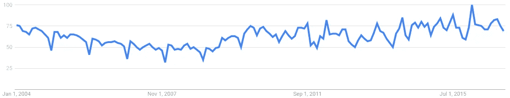
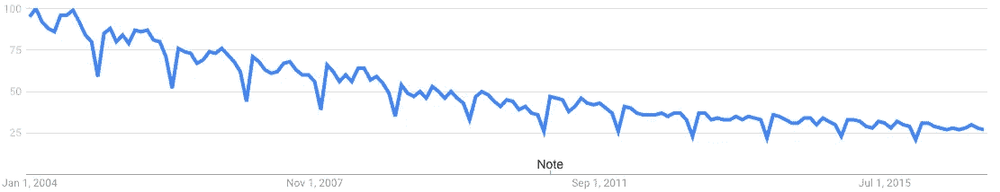
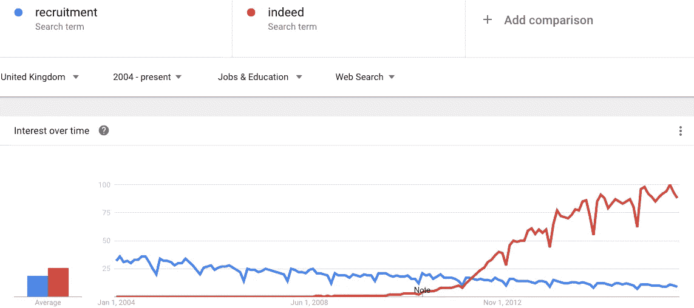
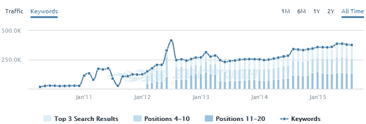

# 确实比招聘行业大？

> 原文：<https://medium.com/swlh/is-indeed-bigger-than-the-recruitment-industry-ddd6416f7ee1>

*免责声明:这篇文章的很多内容都是混合了知识的推测，而不是纯粹的事实。我希望它能创造一些我认为招聘行业需要解决的话题，但我并不声称自己有所有的答案。*

当 2008 年衰退开始时，英国和全球经济都受到了影响。公司很快开始裁员，由此产生的第一个副产品是，招聘行业有大量新的候选人，但却没有职位可以安置他们。

如果你不相信我说的话，那么看看全球用户在谷歌上搜索“招聘”:

你可以看到明显的衰退低谷在哪里。

现在，让我们看看同一个术语，但只关注来自英国的搜索:

为什么英国搜索量持续下降，而全球搜索量却在复苏？我们是否经历了世界其他地方没有经历过的持续衰退？Rec.uk.com 说[英国招聘行业在 2014 年发布了 287 亿英镑的回报](https://www.rec.uk.com/news-and-policy/press-releases/buoyant-recruitment-industry-posts-record-returns)，比前一年增加了 22 亿英镑，所以我不认为我们正在经历一场孤立的经济衰退。如果不是这样，我们在英国到底做了哪些与众不同的事情？

用户搜索习惯变了。我们在谷歌中输入“招聘人员”、“招聘”或“工作”的日子已经一去不复返了，我们现在通过多种数字手段寻找相关的工作。不仅我们的搜索方式发生了变化，我们还发现自己身处一个全球数字品牌的世界，在某些情况下，这些品牌已经变得比他们所在的行业更大。想想胡佛，旺加，从下面的图表来看，确实如此。

从某些方面来说，这对招聘顾问来说是件好事，因为这给了他们一个明显的渠道来获取更多的简历，提高他们填补空缺的机会。然而，你可能会认为，上述情况表明，整个招聘行业正开始隐藏在像 Indeed 这样的品牌的全球主导地位背后。

你可能会问，当你可以使用别人的品牌时，为什么要费心去增加自己品牌的曝光率，你可能有道理。不过话说回来，能租一套房子就买一套房子干嘛？我想这取决于你是否乐意掏腰包！

当前确实比单个品牌更大的趋势有利有弊:

# 好人

*   **通过来自 Indeed 的推荐流量增加了职位列表的可见性。招聘人员有明确的任务来填补空缺职位，我认为他们如何做到这一点并不重要。事实上，每个月都有超过 1 . 8 亿的独立访客，所以这对于招聘者来说是一个明显的载体。**
*   增强招聘人员的品牌曝光度。当求职者点击“的确”上的广告时，他们会被直接发送到招聘网站上的原始招聘信息。这无疑是一种提高品牌知名度的合理方式，但在“不好”一节中，我确实有另一种方式来看待这个问题。

# 坏事

*   **招聘人员正在竭尽全力为他们的网站带来免费流量吗？**如果他们能够支付象征性的费用，并创造出填补某个角色所需的所有流量，那就不一定了。但是如果招聘人员创建了包含相关职位的登陆页面会怎么样呢？满足用户[主动和被动意图](http://www.blindfiveyearold.com/aggregating-intent)的页面。通过尽一切可能让用户转化，招聘人员可以吸引真正的访问者。
*   我知道，的确可以从网站上把工作拉到免费列表中，但如果你真的想要曝光，你就必须付费。
*   **招聘人员正在喂养一个怪物，这个怪物正在间接地夺走他们在谷歌的不动产。我说间接是因为这份工作还是可以找到的，但是通过确实的清单。谷歌热爱品牌。通过大量使用 Indeed 和其他求职网站，招聘行业所做的一切都是在帮助他们主宰有机搜索结果。如果他们有一个长期的有机战略，他们会吃掉所有可能被招聘者利用的无品牌搜索。**
*   还记得我在“好”列表中说过，来自的流量确实对品牌有好处。你也可以从反面来看。如果用户通过 Indeed 访问招聘网站，他们会记得他们是通过 Indeed 还是通过招聘网站转化的吗？如果确实如此，那么对于招聘者的品牌记忆来说，这并不意味着什么。

通过依靠 Indeed 的突出地位并为这一特权付费，招聘公司所做的一切都是将 Indeed 置于聚光灯下，同时将自己隐藏在幕后。不相信我？看看 indeed.co.uk 过去五年的有机覆盖范围:

看看下面来自 Rand Fishkin 的视频，了解为什么品牌在谷歌上的排名更高。

# 前进

预计 Indeed 的广告和营销将会增长，这反过来将最终有利于利用这一点的招聘者。但随着它的成长和变得更具竞争力，成本将会上升，如果招聘人员没有一个长期战略，他们将会是输家。招聘人员应该从 Indeed 吸取教训，问问自己是否在开发自己的品牌方面投入了足够的资金(看看 Indeed 在推广自己的品牌方面到底走了多远)。

这让我想到了另一个亟待解答的问题，为什么谷歌不利用这个有利可图的行业呢？在我与[比尔·斯劳斯基](https://medium.com/u/6aced9c0047f?source=post_page-----ddd6416f7ee1--------------------------------)的一次谈话中，他说在为搜索引擎工作之前，谷歌结构化数据主管阿龙·哈勒维“开发了一个将分类信息聚合在一起的网站，就像实际上做的那样”。

我们已经知道，谷歌正在寻求将“抵押贷款”和“保险”等头部搜索关键词商业化，那么他们为什么不寻求进入利润丰厚的招聘市场呢？对谷歌来说，以和谷歌购物一样的格式提供“赞助的”工作列表很容易，并开始将权力从实体转移到他们自己身上。请看下图中的例子。

*How much do you think this tool has hit MoneySuperMarket’s organic traffic?*

话说回来，确实要在他们的侧边栏中使用谷歌广告。他们是否在谷歌身上花了足够多的钱来阻止这个搜索巨头进入市场？

事实是，该行业正在让一个已经占据主导地位的品牌变得更加强大，这个品牌可以被列为竞争对手。虽然这确实意味着招聘者越来越关注他们的工作，但这是一种短视的观点。从长远来看，推广你自己的公司，而不是依赖像 T4 这样的招聘品牌，将会得到更多的认可。

*原载于* [*安德鲁*](https://twitter.com/andrewakesson) *于*[*www.venndigital.co.uk*](https://www.venndigital.co.uk/blog/is-indeed-bigger-than-the-recruitment-industry-55604/)*。*