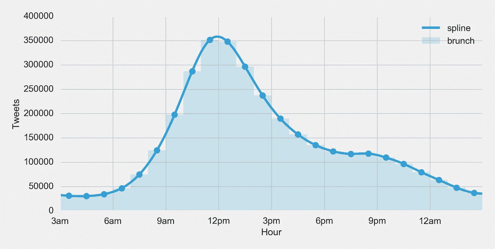

# 是早午餐时间了吗？

> 原文：<https://medium.com/swlh/is-it-brunch-time-ffe3adf485d8>

## 背景

几年前，作为一个玩笑，我创造了 isitbrunchtimeyet.com。从那以后，它主要被用作邀请人们吃早午餐的一种有趣和/或有点被动的方式。当我创建它时，我任意地将早午餐时间设置为上午 10:15 到 11:45。正是这个决定把我们带到了这里——我想做得比武断更好。

## 假设

Twitter 是一个允许用户“获得对你重要的实时更新”的平台。[2]如果我们假设人们通常在做这些事情的时候发推文，那么我们可以假设包含“早午餐”的推文通常发生在那个人正在吃早午餐的时候。因此，如果我们在足够长的时间内收集足够多的推文，并分析它们被推文的时间，我们就可以推断出早午餐的具体时间范围。

## **数据**

我们从使用 Twitter 流 API 开始。这个 API 允许我们订阅搜索词，例如“brunch ”,并实时获取发送到我们程序的与该词匹配的任何 tweet。我们不仅收集了“早午餐”的推文，还收集了包含“早餐”、“午餐”和“晚餐”的推文作为对照(我们将在后面回顾)。我们允许该计划从 2015 年 6 月 1 日运行到 2016 年 5 月 31 日，产生了 1 亿多条推文供分析。Twitter 是一个全球平台，所以我们必须做一些额外的工作来了解一条特定推文发生的时间。在发推特的时候，我们分析了发推特的人的时区和任何附加的地理位置数据(如果有的话)。利用这些数据，我们对每条推文的本地化时间做了一个明智的估计。

因此，我们能够按当地时间细分推文数量:

Tweets containing the term brunch with the hour localized based on inferred timezone of the tweeter

## **解决方案 1:天真的解决方案**

简单地看一下上面的柱状图，你会很快注意到上午 11 点是最受欢迎的发布早午餐微博的时间——这意味着上午 11 点到下午 12 点肯定是早午餐时间，对吗？

这是一个非常合理的结论。然而，我们认为还有改进的余地。首先，这种解决方案缺乏任何真正的保真度。早午餐不太可能在上午 11 点准时开始，在下午 12 点准时结束。第二，如果我们再次查看直方图，您可以看到中午 12 点的活动非常接近上午 11 点。这告诉我们，很多早午餐活动发生在上午 11 点以后，而这个解决方案没有考虑到这一点。

## 解决方案 2:概率密度函数

因为我们正在可视化一个直方图，所以跳到一个分布函数进行进一步分析是合乎逻辑的。由于我们的数据有正偏差，我们将着眼于概率密度函数(PDF)。首先，我们计算对数正态分布[5] PDF(下面的红线)并定位该函数的最大值点(众数)。我们选择对数正态分布而不是正态分布，因为它似乎更符合数据。然后，我们确定一个范围，在这个范围内，所有推文的很大一部分，比如说 1/4 (25%)，都围绕着这个最大值出现:

这个策略让我们的早午餐时间从上午 9:25 到下午 12:24。然而，这种策略有一些缺点。首先，25%的发生率是一个任意值。不会比 30%或 20%或任何其他数字更好。第二，对数正态 PDF 很大程度上取决于我们如何看待 x 轴。在这个例子中，我们从凌晨 3 点开始，我们之所以选择这个时间，是因为它通常是我们的数据集中 tweet 计数最低的时间(否则它会有点双峰)。如果我们从 x 轴开始，比如说 12 点，我们会得到一条不同的曲线。第三，看这张图*感觉*与我们的第一个解决方案有类似的问题，因为它没有真正捕捉到下午早些时候活动的长尾。在我们寻求客观答案的过程中，这些任意的假设都是不可接受的权衡。

## 解决方案 3:样条插值

样条允许我们通过许多不同的点创建一条平滑的曲线。让我们画一条每小时的曲线，并绘制成图表:

如果我们看这条曲线，我们可以看到最大值与我们根据直方图直观假设的早午餐发生的位置非常吻合。让我们给这个最大值取个名字，早午餐点怎么样？早午餐时间可以定义为:一天中早午餐最多的确切时间。根据我们的数据，时间是上午 11:56。

> 早午餐时间——一天中早午餐最多的确切时间

现在，这似乎是一个很好的答案！然而，我们正在寻找一个*时间范围*，而不仅仅是一个时间点。那么我们如何从样条曲线计算出一个范围呢？还记得高中的微积分吗？这是你的教授承诺的微积分的真实使用案例！让我们看看导数:

手头没有微积分书？什么是导数？函数的导数将给出函数在任意给定时间点的变化率(也称为斜率，也称为 y = *m* x + b 中的 *m* )。[4]它帮助我们理解一个函数的加速。让我们找出斜率最高和最低的切线:

在这个最大斜率下，早午餐推文的数量正经历着最高的正变化率:人们正在加快他们关于早午餐的推文速度——最大程度地踩油门。在最小斜率时，早午餐推文的数量正经历着最高的负变化率:人们放慢了他们的推文速度*——使劲踩刹车踏板。*利用这两点，我们得到早午餐时间:上午 10:01 到下午 1:40。

我们最喜欢这种方法有几个原因:

*   它似乎抓住了我们在第一个解决方案中的“直觉”——当你想象它时，它*感觉*是正确的。
*   它使用一条样条线，即使 x 轴平移，该样条线也将保持非常一致。
*   它基于我们非常熟悉的概念——加速和减速

但是我们怎么知道它是否正确呢？让我们将解决方案应用于其他术语，并观察它的表现。

## 比较数据

为了进行比较，我们来看看“早餐”和“午餐”推文的样条曲线:

由于“早餐”和“午餐”在 twitter 上比“早午餐”更受欢迎，让我们根据频率修改这些曲线，这样更容易看出它们之间的区别。然后，让我们也应用上面的解决方案来了解它们之间的比较:

最后，我们有了一些结果:

*   早餐时间:上午 7:50 至 11:55
*   早午餐:上午 10:01 至下午 1:40
*   午餐时间:上午 11:40 至下午 2:25

就这样了——早午餐的正式时间是从上午 10:01 到下午 1:40。有趣的是，早餐的结束和午餐的开始相距不超过 15 分钟。有趣的是，早午餐时间点也在同一时间段。两者都给了这个解决方案至少一点点的肯定。

现在去吃些早午餐吧！

**TL；根据 1 亿多条推文和分析，dr-Brunch 的官方时间是上午 10:01 到下午 1:40。**

所有的分析和图表都是使用 pandas/matplotlib 在 python 中完成的

来源:[https://github.com/bjacobso/brunch](https://github.com/bjacobso/brunch)

[1]深受 isitchristmas.com 和 isitlunchtimeyet.com 的启发

[2][https://about.twitter.com/](https://about.twitter.com/)

[https://en.wikipedia.org/wiki/Spline_interpolation](https://en.wikipedia.org/wiki/Spline_interpolation)

[https://en.wikipedia.org/wiki/Derivative](https://en.wikipedia.org/wiki/Derivative)

[5] [来自 Reddit 的出色反馈](https://www.reddit.com/r/dataisbeautiful/comments/4q4c1n/is_it_brunch_time_analyzing_tweets_to_get_an/d4q7k5g)